<!-- Google tag (gtag.js) -->
<script async src="https://www.googletagmanager.com/gtag/js?id=G-7PRVEBE1EF"></script>
<script>
  window.dataLayer = window.dataLayer || [];
  function gtag(){dataLayer.push(arguments);}
  gtag('js', new Date());

  gtag('config', 'G-7PRVEBE1EF');
</script>

# Getting Ready for Regression Cooking! {#sec-intro}

```{r}
#| include: false

colourize <- function(x, color) {
  if (knitr::is_latex_output()) {
    sprintf("\\textcolor{%s}{%s}", color, x)
  } else if (knitr::is_html_output()) {
    sprintf("<span style='color: %s;'>%s</span>", color,
      x)
  } else x
}
```

It is time to prepare for all the different regression techniques we will check beginning @sec-ols. That said, there is a strong message we want to convey across all this work:

> **Different modelling estimation techniques in regression analysis can be smoothly grasped when we develop a fair probabilistic and inferential intuition on our populations or systems of interest.**

The above statement has a fundamental statistical foundation on how data is generated and can be modelled via different regression approaches. More details on the concepts and ideas associated with this foundation will be delivered in @sec-stats-review. Hence, before reviewing these statistical concepts and ideas, this chapter will elaborate on the three big pillars we previously pointed out in **Audience and Scope**: 

1. The use of an ordered **data science workflow** in @sec-ds-workflow,
2. choosing the proper workflow flavour according to either an **inferential** or **predictive** paradigm as shown in @fig-ds-workflow, and
2. the correct use of an **appropriate regression model** based on the response variable or outcome of interest as shown in the mind map from @sec-regression-mindmap (analogous to a **regression toolbox**).

 via [*Pixabay*](https://pixabay.com/illustrations/flowchart-diagram-sketch-notepad-8860311/).](img/flowchart.png){width="500"}

::: {.Warning}
::::{.Warning-header}
The Rationale Behind the Three Pillars
::::
::::{.Warning-container}
Each data science-related problem that uses regression analysis might have distinctive characteristics considering inferential (statistics!) or predictive (machine learning!) inquiries. Specific problems would implicate using outcomes (or response variables) related to survival times (e.g., the time until one particular equipment of a given brand fails), categories (e.g., a preferred musical genre in the Canadian young population), counts (e.g., how many customers we would expect on a regular Monday morning in the branches of a major national bank), etc. Moreover, under this regression context, our analyses would be expanded to explore and assess how our outcome of interest is related to a further set of variables (the so-called features!). For instance, following up with the categorical outcome of the preferred musical genre in the Canadian young population, we might analyze how particular age groups prefer certain genres over others or even how preferred genres compare each other across different Canadian provinces in this young population. **The sky is the limit here!**\

Therefore, we might be tempted to say that each regression problem should have its own workflow, given that the regression model to use would implicate particular analysis phases. **However, it turns out that is not the case to a certain extent**, and we have a regression workflow in @fig-ds-workflow to support this bold statement as a proof of concept for thirteen different regression models (i.e, thirteen chapters in this book aside from the probability and statistics review). The workflow aims to homogenize our data analyses and make our modelling process more transparent and smoother. We can adequately deliver concluding insights as data storytelling while addressing our initial main inquiries. Of course, when depicting the workflow as a flowchart, there will be decision points that will turn it into **inferential** or **predictive** (the second pillar). Finally, where does the third pillar come into play in this workflow? This pillar is contained in the **data modelling stage**, where the mind map from @fig-regression-mindmap will come in handy.
::::
:::

Moving along, let us establish a convention on the use of admonitions beginning @sec-ml-stats-dictionary in this textbook:

::: {#Definition-sample .definition}
::::{.definition-header}
Definition
::::
::::{.definition-container}
A formal statistical and/or machine learning definition. This admonition aims to untangle the significant amount of jargon and concepts that both fields have. Furthermore, alternative terminology will be brought up when necessary to indicate the same definition across both fields.
::::
:::

::: {#Headsup-sample .Heads-up}
::::{.Heads-up-header}
Heads-up!
::::
::::{.Heads-up-container}
An idea (or ideas!) of key relevance for any given modelling approach, specific workflow stage or data science-related terminology. This admonition also extends to crucial statistical or machine learning topics that the reader would be interested in exploring more in-depth. 
::::
:::

::: {#Tip-sample .Tip}
::::{.Tip-header}
Tip
::::
::::{.Tip-container}
An idea (or ideas!) that might be slightly out of the scope of the topic any specific section is discussing. Still, we will provide significant insights on the matter along with further literature references to look for.
::::
:::

The core idea of the above admonition arrangement is to allow the reader to discern between ideas or concepts that are key to grasp from those whose understanding might not be highly essential (but still interesting to check out in further literature!). Before jumping into our three pillars in sections @sec-ds-workflow and @sec-regression-mindmap, let us elaborate on an additional resource related to setting a **common ground** between **machine learning** and **statistics**.

## The ML-Stats Dictionary {#sec-ml-stats-dictionary}

Machine learning and statistics usually overlap across many subjects, and regression modelling is no exception. Topics we teach in an utterly regression-based course, under a purely statistical framework, also appear in machine learning-based courses such as fundamental supervised learning, but often with different terminology. On this basis, the Master of Data Science (MDS) program at the University of British Columbia (UBC) provides the [MDS Stat-ML dictionary](https://ubc-mds.github.io/resources_pages/terminology/) [@gelbart2017] under the following premises:

> *This document is intended to help students navigate the large amount of jargon, terminology, and acronyms encountered in the MDS program and beyond.*

> *This section covers terms that have different meanings in different contexts, specifically statistics vs. machine learning (ML).*

Indeed, both disciplines have a tremendous amount of jargon and terminology. Furthermore, as previously emphasized in the **Preface**, machine learning and statistics construct a **substantial synergy** reflected in data science. Even with this, people in both fields could encounter miscommunication issues when working together. This should not happen if we build solid bridges between both disciplines. Therefore, the above [**definition callout box**](#Definition-sample) will pave the way to a complimentary resource called the **ML-Stats dictionary** (*ML* stands for *Machine Learning*). This comprehensive **ML-Stats dictionary** is imperative, and our textbook offers a perfect opportunity to build this resource. Primarily, this dictionary will clarify any potential confusion between statistics and machine learning regarding terminology within supervised learning and regression analysis contexts.

::: {#headsup-terminology .Heads-up}
::::{.Heads-up-header}
Heads-up on terminology highlights!
::::
::::{.Heads-up-container}
Following the spirit of the **ML-Stats dictionary**, throughout the book, all `r colourize("statistical", "blue")` terms will be highlighted in `r colourize("blue", "blue")` whereas the `r colourize("machine learning", "magenta")` terms will be highlighted in `r colourize("magenta", "magenta")`. This colour scheme strives to combine this terminology so we can switch from one field to another in an easier way. With practice and time, we should be able to jump back and forth when using these concepts.
::::
:::

Finally, @sec-dictionary will be the section in this book where the reader can find all those `r colourize("statistical", "blue")` and `r colourize("machine learning-related", "magenta")` terms in alphabetical order. Notable terms (either statistical or machine learning-related) will include an admonition identifying which terms (again, either statistical or machine learning-related) are **equivalent** (**or NOT equivalent if that is the case**). Take as an example the statistical term `r colourize("dependent variable", "blue")`:

> In supervised learning, it is the main variable of interest we are trying to **learn** or **predict**, or equivalently, the variable we are trying **explain** in a statistical inference framework.

Then, the above definition will be followed by this admonition:

::: {.Equivalence}
::::{.Equivalence-header}
Equivalent to:
::::
::::{.Equivalence-container}
`r colourize("Response variable", "blue")`, `r colourize("outcome", "magenta")`, `r colourize("output", "magenta")` or `r colourize("target", "magenta")`.
::::
:::

Above, we have identified four equivalent terms for the term `r colourize("dependent variable", "blue")`. Furthermore, according to our already defined colour scheme, these terms can be `r colourize("statistical", "blue")` or `r colourize("machine learning-related", "magenta")`. Finally, note we will start using this colour scheme in @sec-stats-review.

::: {#headsup-use-terminology .Heads-up}
::::{.Heads-up-header}
Heads-up on the use of terminology!
::::
::::{.Heads-up-container}
Throughout this book, we will interchangeably use specific terms when explaining the different regression approaches in each chapter. Whenever confusion arises about using these interchangeable terms, it is highly recommended to consult their definitions and equivalences (or non-equivalences) in @sec-dictionary.
::::
:::

Now, let us proceed to explaining the three pillars on which this textbook is built upon: a **data science workflow**, the right **workflow flavour** (**inferential** or **predictive**), and a **regression toolbox**. 

## The Data Science Workflow {#sec-ds-workflow}

Understanding the data science workflow is essential for mastering regression analysis. This workflow serves as a blueprint that guides us through each stage of our analysis, ensuring that we apply a systematic approach to solving our inquiries in a reproducible way. Each of the three pillars of this textbook—data science workflow, the right workflow flavor (inferential or predictive), and a regression toolbox—are deeply interconnected. Regardless of the regression model we explore, this general workflow provides a consistent framework that helps us navigate our data analysis with clarity and purpose. As shown in @fig-ds-workflow, the data science workflow is composed of the following stages (each of which will be discussed in more detail in subsequent subsections):

1. **Study design:** Define the research question, objectives, and variables of interest to ensure the analysis is purpose-driven and aligned with the problem at hand.
2. **Data collection and wrangling:** Gather and clean data, addressing issues such as missing values, outliers, and inconsistencies to transform it into a usable format.
3. **Exploratory data analysis:** Explore the data through statistical summaries and visualizations to identify patterns, trends, and potential anomalies.
4. **Data modelling:** Apply statistical or machine learning models to uncover relationships between variables or make predictions based on the data.
5. **Estimation:** Calculate model parameters to quantify relationships between variables and assess the accuracy and reliability of the model.
6. **Goodness of fit:** Evaluate the model’s performance using metrics and diagnostic checks to determine how well it explains the data.
6. **Results:** Interpret the model's outputs to derive meaningful insights and provide answers to the original research question.
7. **Storytelling** Communicate the findings through a clear, engaging narrative that is accessible to a non-technical audience.

By adhering to this workflow, we ensure that our regression analyses are not only systematic and thorough but also capable of producing results that are meaningful within the context of the problem we aim to solve.

::: {#Tip-formal-structure .Tip}
::::{.Tip-header}
The Importance of a Formal Structure in Regression Analysis
::::
::::{.Tip-container}
From the earliest stages of learning data analysis, understanding the importance of a structured workflow is crucial. If we do not adhere to a predefined workflow, we risk misinterpreting the data, leading to incorrect conclusions that fail to address the core questions of our analysis. Such missteps can result in outcomes that are not only meaningless but potentially misleading when taken out of the problem’s context. Therefore, it is essential for aspiring data scientists to internalize this workflow from the very beginning of their education. A systematic approach ensures that each stage of the analysis is conducted with precision, ultimately producing reliable and contextually relevant results.
::::
:::

::: {#fig-ds-workflow}
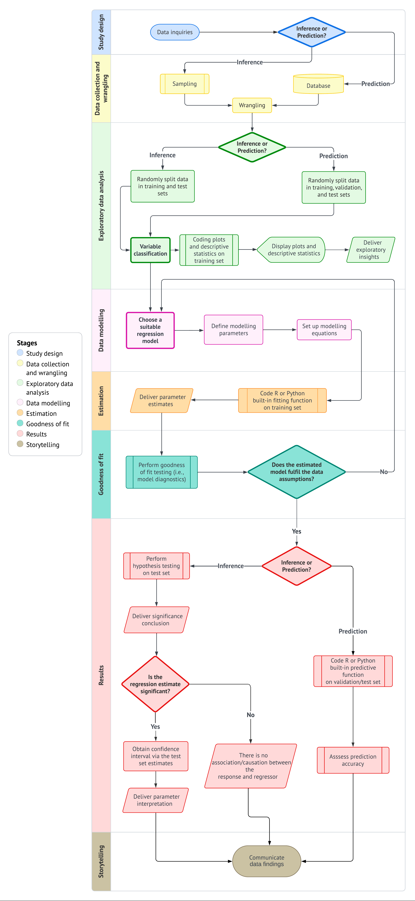{width="1000"} 

Data science workflow for *inferential* and *predictive* inquiries in regression analysis and supervised learning, respectively.
:::

### Study Design {#sec-ds-workflow-study-design}

The first stage of this workflow is centered around defining the **main statistical inquiries** we aim to address throughout the data analysis process. As a data scientist, your primary task is to translate these inquiries from the stakeholders into one of two categories: *inferential* or *predictive*. This classification determines the direction of your analysis and the methods you will use.

::: {#Definition-statistical-inquiries .definition}
::::{.definition-header}
Inferential vs. Predictive Inquiries
::::
::::{.definition-container}
**Inferential:** Focuses on quantifying relationships (e.g., "Does marketing campaign A increase sales?").  
**Predictive:** Aims to forecast future outcomes (e.g., "What will sales be next quarter?").
::::
:::

- **Inferential:** The objective here is to explore and quantify relationships of *association* or *causation* between explanatory variables (regressors) and the response variable within the context of the problem at hand. For example, you may seek to determine whether a specific marketing campaign (regressor) significantly impacts sales revenue (response) and, if so, by how much.

- **Predictive:**  In this case, the focus is on making accurate predictions about the response variable based on future observations of the regressors. Unlike inferential inquiries, where understanding the relationship between variables is key, the primary goal here is to maximize prediction accuracy. This approach is fundamental in machine learning. For instance, you might build a model to predict future sales revenue based on past marketing expenditures, without necessarily needing to understand the underlying relationship between the two.

In both cases, the study design stage involves clearly defining these objectives and determining the appropriate methods to address them. This stage sets the foundation for all subsequent steps in the data science workflow, as illustrated in @fig-ds-workflow-study-design. Once the study design is established, the next stage is data collection and wrangling.

::: {#fig-ds-workflow-study-design}
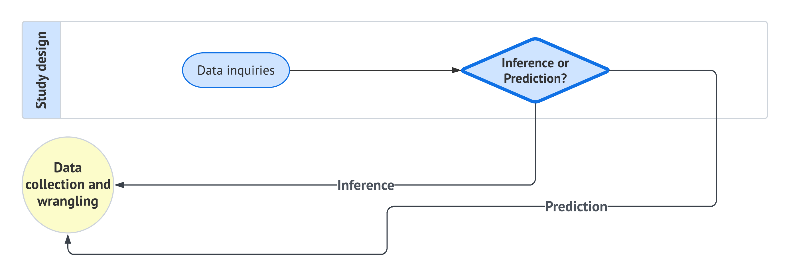{width="670"}

*Study design* stage from the data science workflow in @fig-ds-workflow. This stage is directly followed by *data collection and wrangling*.
:::

### Data Collection and Wrangling {#sec-ds-workflow-data-collection}

Once we have clearly defined our statistical questions, the next crucial step is to collect the data that will form the basis of our analysis. The way we collect this data is vital because it directly affects the accuracy and reliability of our results:

- **For inferential inquiries**, we focus on understanding large groups or systems (populations) that we cannot fully observe. These populations are governed by characteristics (parameters) that we want to estimate. Because we can’t study every individual in the population, we collect a smaller, representative subset called a sample. The method we use to collect this sample—known as **sampling**—is crucial. A proper sampling method ensures that our sample reflects the larger population, allowing us to make accurate generalizations (inferences) about the entire group. After collecting the sample, it's common practice to **randomly split the data into training and test sets**. This split allows us to build and validate our models, ensuring that the findings are robust and not overly tailored to the specific data at hand.

::: {#Headsup-sampling-debrief .Heads-up}
::::{.Heads-up-header}
A Quick Debrief on Sampling!
::::
::::{.Heads-up-container}
Although this book does not cover sampling methods in detail, it's important to know that the way you collect your sample can greatly influence your results. Depending on the problem, you might use different techniques:

- **Simple Random Sampling:** Every individual in the population has an equal chance of being selected.
- **Systematic Sampling:** You select individuals at regular intervals from a list of the population.
- **Stratified Sampling:** You divide the population into subgroups (strata) and take a proportional sample from each subgroup.
- **Clustered Sampling:** You divide the population into clusters and randomly select whole clusters for your sample.
- Etc.

As in the case of Regression Analysis, statistical sampling is a vast field, and we could spend a whole course on it. If you're interested in learning more about these methods, [*Sampling: design and analysis*](https://webcat.library.ubc.ca/vwebv/holdingsInfo?bibId=2206157) by Lohr is a great resource. 
::::
:::

- **For predictive inquiries**, our goal is often to use existing data to make predictions about future events or outcomes. In these cases, we usually work with large datasets (databases) that have already been collected. Instead of focusing on whether the data represents a population (as in inferential inquiries), we focus on cleaning and preparing the data so that it can be used to train models that make accurate predictions. After wrangling the data, it is typically **split into training, validation, and test sets**. 

::: {#Definition-data-splits .definition}
::::{.definition-header}
Training vs. Validation vs. Testing Sets
::::
::::{.definition-container}
- **Training Set:** Used to build the model.
- **Validation Set:** Helps tune parameters.
- **Test Set:** Evaluates the model's performance on unseen data.
::::
:::

As shown in @fig-ds-workflow-data-collection-wrangling, the data collection and wrangling stage is fundamental to the workflow. It directly follows the study design and sets the stage for exploratory data analysis.

::: {#fig-ds-workflow-data-collection-wrangling}
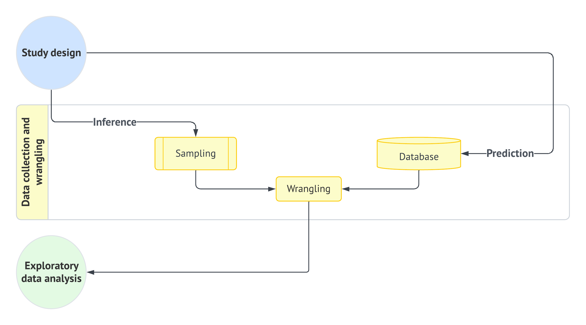{width="670"} 

*Data collection and wrangling* stage from the data science workflow in @fig-ds-workflow. This stage is directly followed by *exploratory data analysis* and preceded by *study design*.
:::

### Exploratory Data Analysis {#sec-ds-workflow-eda}

Before diving into data modeling, it's crucial to develop a deep understanding of the relationships between the variables in your training data. This is where the third stage of the data science workflow—**Exploratory Data Analysis (EDA)**—comes into play. EDA serves as a vital process that allows you to visualize and summarize your data, uncover patterns, detect anomalies, and test key assumptions that will inform your modeling decisions.

1. **Classify Variables:** The first step in EDA is to classify your variables according to their types. This classification is essential because it guides your choice of analysis techniques and models. Specifically, you need to determine whether each variable is discrete or continuous, and whether it has any specific characteristics such as being bounded or unbounded.

- **Response Variable:**
  - Determine if your response variable is *discrete* (e.g., binary, count-based, categorical) or *continuous*.
  - If it is *continuous*, consider whether it is *bounded* (e.g., percentages that range between 0 and 100) or *unbounded* (e.g., a variable like temperature that can take on a wide range of values).

- **Regressors**:
  - For each regressor, identify whether it is *discrete* or *continuous*.
  - If a regressor is discrete, classify it further as binary, count-based, or categorical.
  - If a regressor is continuous, determine whether it is bounded or unbounded.

::: {#Definition-var-types .definition}
::::{.definition-header}
Variable Types
::::
::::{.definition-container}
- **Continuous:** Can take any value within a range (e.g., house size).  
- **Discrete:** Limited to distinct values (e.g., number of bedrooms).  
- **Bounded:** Restricted within limits (e.g., percentages).  
- **Unbounded:** No inherent limits (e.g., temperature).
::::
:::

2. **Visualize Data:** After classifying your variables, the next step is to create visualizations and calculate descriptive statistics using your training data. This involves coding plots that can reveal the underlying distribution of each variable and the relationships between them. 

::: {#Tip-visualization-type .Tip}
::::{.Tip-header}
Match Visualizations to Variable Types
::::
::::{.Tip-container}
Use scatter plots for continuous variables, box plots for categorical comparisons, and correlation matrices for understanding relationships. Choosing the right visualization makes patterns easier to detect.
::::
:::

3. **Calculate Descriptive Statistics:** Alongside these visualizations, it is important to calculate key descriptive statistics such as the mean, median, and standard deviation. These statistics provide a numerical summary of your data, offering insights into central tendency and variability. You might also use a correlation matrix to assess the strength of relationships between continuous variables.

4. **Interpret Results:** Once you have generated these plots and statistics, they should be displayed in a clear and logical manner. The goal here is to interpret the data and draw preliminary conclusions about the relationships between variables. Presenting these findings effectively helps to uncover key insights and prepares you for the modeling stage.

By following this structured approach to EDA, you can ensure that your analysis is grounded in a thorough understanding of the data, providing a solid foundation for building accurate and reliable models. This approach is visually summarized in @fig-ds-workflow-eda, illustrating the sequential steps from variable classification to the delivery of exploratory insights.

::: {#fig-ds-workflow-eda}
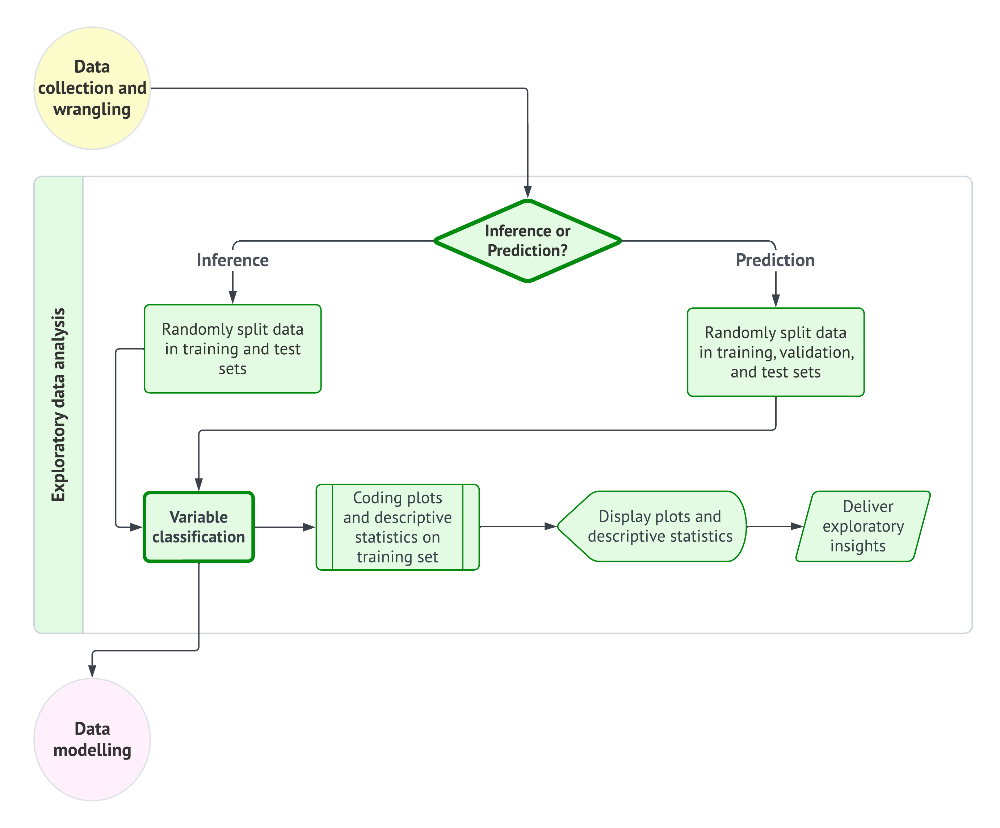{width="670"} 

*Exploratory data analysis* stage from the data science workflow in @fig-ds-workflow. This stage is directly followed by *data modelling* and preceded by *data collection and wrangling*.
:::

### Data Modelling {#sec-ds-workflow-modelling}

After completing the Exploratory Data Analysis (EDA), where we gained valuable insights into the patterns, relationships, and anomalies in the data, we move to the data modeling stage. For regression analysis, this stage involves choosing the right model, defining the necessary parameters, and setting up a modeling equation that captures the relationships in the data. These steps are part of the broader data science workflow, as illustrated in @fig-ds-workflow, ensuring a structured approach from data exploration to modeling.

1. **Choosing a Suitable Regression Model:** The choice of a regression model is influenced by the patterns observed in the EDA and the specific objectives of the analysis. Different regression models may be suitable depending on the nature of the relationships between the predictors (independent variables) and the response (dependent variable).

- **Simple Linear Regression**: Suitable for modeling a linear relationship between a single predictor and the response variable.
- **Multiple Linear Regression**: Used when multiple predictors affect the response variable, allowing for a combined effect.
- **Polynomial Regression**: Applicable when there are non-linear relationships, captured through polynomial terms.
- **Log-Linear Models**: Useful for handling skewed distributions by applying logarithmic transformations.
- **Ridge and Lasso Regression**: Employed to handle multicollinearity and perform feature selection by regularizing coefficients.

::: {#Tip-model-choice .Tip}
::::{.Tip-header}
Start Simple
::::
::::{.Tip-container}
Begin with a simple regression model to establish a baseline. Add complexity gradually, only when simpler models fail to capture the data’s patterns effectively. Including too many predictors or overly complex models can also lead to **overfitting**, where the model performs well on training data but poorly on unseen data.
::::
:::

2. **Defining Modeling Parameters:** After selecting a suitable regression model, the next step is to define the modeling parameters—these are the coefficients that quantify the relationships between the predictor variables and the response variable. This involves identifying relevant predictors based on EDA insights, setting initial parameter values, and considering interaction terms if the effect of one predictor depends on another.

3. **Setting Up the Modeling Equation:** The modeling equation represents the mathematical relationship between the response variable and the predictor variables, incorporating the estimated coefficients. This equation formalizes how the predictors combine to determine the response, accounting for the influence of each predictor and any interaction effects.

By systematically choosing the model, defining parameters, and setting up the modeling equation, we ensure a rigorous approach to data modeling that aligns with the data's characteristics and the study's goals. This structured process, as shown in @fig-ds-workflow-data-modelling, provides a robust framework for building models that are both accurate and interpretable.

::: {#fig-ds-workflow-data-modelling}
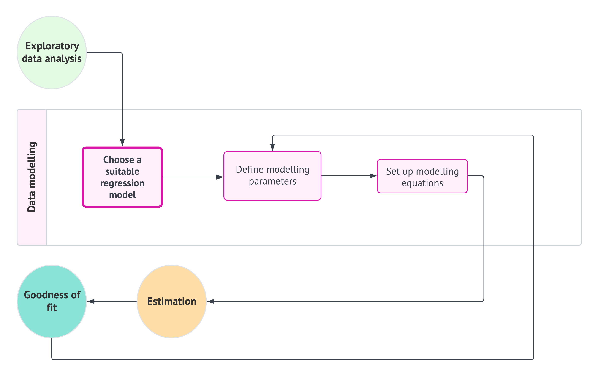{width="670"} 

*Data modelling* stage from the data science workflow in @fig-ds-workflow. This stage is directly preceded by *exploratory data analysis*. On the other hand, it is directly followed by *estimation* but indirectly with *goodness of fit*. If necessary, the *goodness of fit* stage could retake the process to *data modelling*.
:::

### Estimation {#sec-ds-workflow-estimation}

Once the data modeling step is completed, where we have selected the appropriate regression model, defined the parameters, and set up the modeling equation, the next crucial step is **estimation**. Estimation involves using statistical software, such as R or Python, to fit the chosen regression model to our training data and derive the parameter estimates that quantify the relationships between the predictors and the response variable.

1. **Fitting the Model on the Training Set:** In this stage, we use functions available in R or Python to fit the regression model to the training set. The goal is to estimate the coefficients that best describe the relationship between the predictors and the response variable in the data. These functions take the training set as input and apply the specified regression model to the data. The output includes parameter estimates that describe how each predictor variable influences the response variable.

2. **Delivering Parameter Estimates:** Once the model is fitted, the estimates for the coefficients are available. These estimates allow us to interpret the impact of each predictor on the response variable. The intercept represents the expected value of the response when all predictors are set to zero, while each coefficient indicates the change in the response associated with a one-unit change in the corresponding predictor.

By using these estimation techniques, we can derive meaningful insights from the data and quantify the relationships between variables, setting the stage for assessing the model's goodness of fit.

::: {#fig-ds-workflow-estimation}
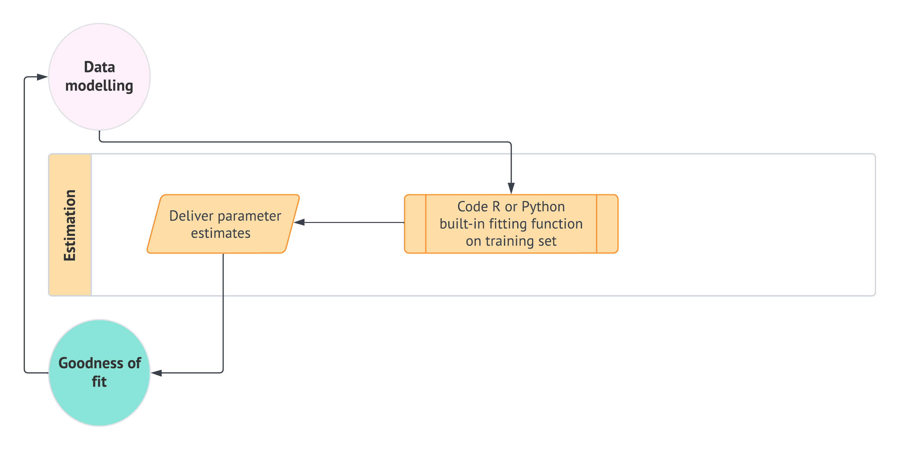{width="670"} 

*Estimation* stage from the data science workflow in @fig-ds-workflow. This stage is directly preceded by *data modelling* and followed by *goodness of fit*. If necessary, the *goodness of fit* stage could retake the process to *data modelling* and then to *estimation*.
:::

### Goodness of Fit {#sec-ds-workflow-goodness-of-it}

After estimating the model parameters, the next critical step in the data science workflow is assessing the **goodness of fit**. 

::: {#Definition-goodness-of-fit .definition}
::::{.definition-header}
Goodness of Fit
::::
::::{.definition-container}
Goodness of fit involves performing model diagnostics to determine how well the estimated model fits the data and whether it satisfies the underlying assumptions of the regression analysis. A well-fitting model not only provides reliable parameter estimates but also ensures that the predictions are meaningful and robust.
::::
:::

1. **Checking Model Assumptions:** After estimating our model, we need to check if it follows some basic rules. These rules help ensure our model's predictions are reliable. We look at assumptions such as linearity, independence of errors, constant variance, and normality of residuals.

::: {#Definition-linearity-assumption .definition}
::::{.definition-header}
Model Assumptions in Regression
::::
::::{.definition-container}
- **Linearity:** Assumes a straight-line relationship between predictors and the response variable, ensuring proportional changes.  
- **Independence of Errors:** Residuals (errors) should not be correlated, ensuring unbiased predictions.  
- **Constant Variance (Homoscedasticity):** Residuals should have consistent spread across all levels of predictors.  
- **Normality of Residuals:** Residuals should follow a normal distribution, important for valid inference and hypothesis testing.
::::
:::

2. **Evaluating Model Fit:** We also check how well our model fits the data using metrics like R-squared, adjusted R-squared, and F-statistic. These metrics help us understand the model's overall effectiveness.

3. **Identifying Outliers and Influential Points:** Sometimes, certain data points can heavily affect our model. Identifying outliers and influential points helps ensure the model’s reliability and robustness.

4. **Taking Action if Needed:** If our checks show problems, we can take action to improve the model, such as transforming variables, adjusting the model, or trying a different model.

::: {#Headsup-model-comparison .Heads-up}
::::{.Heads-up-header}
Comparing Models Beyond Goodness of Fit
::::
::::{.Heads-up-container}
While goodness-of-fit metrics like R-squared and residual diagnostics are essential for evaluating a single model’s performance, comparing multiple models often involves more advanced techniques. Here are some methods to consider as you deepen your understanding:

- **Cross-Validation:** Splitting the dataset into training and validation folds helps evaluate how well your model generalizes to unseen data, reducing the risk of overfitting.

- **Akaike Information Criterion (AIC):** Balances goodness of fit with model complexity by penalizing overly complex models.

- **Bayesian Information Criterion (BIC):** Similar to AIC but applies a stricter penalty for complexity, particularly useful with larger datasets.

- **Likelihood Ratio Test:** Compares nested models to determine if additional complexity is justified.

- **Adjusted R-squared:** Accounts for the number of predictors, providing a more reliable metric for comparing models with varying features.

These techniques can seem intimidating at first, and that’s okay! At this stage, focus on mastering the basics of evaluating your model’s fit. As you gain experience, you’ll have opportunities to explore these tools and integrate them into your workflow.
::::
:::

Goodness of fit testing helps us ensure our model makes sense and works well with our data. By checking that the model follows these basic rules and fits the data, we can trust its predictions. If everything looks good, we can move on to look at the results. This step, shown in @fig-ds-workflow-goodness-of-fit, is crucial to ensure our model is accurate and reliable.

::: {#fig-ds-workflow-goodness-of-fit}
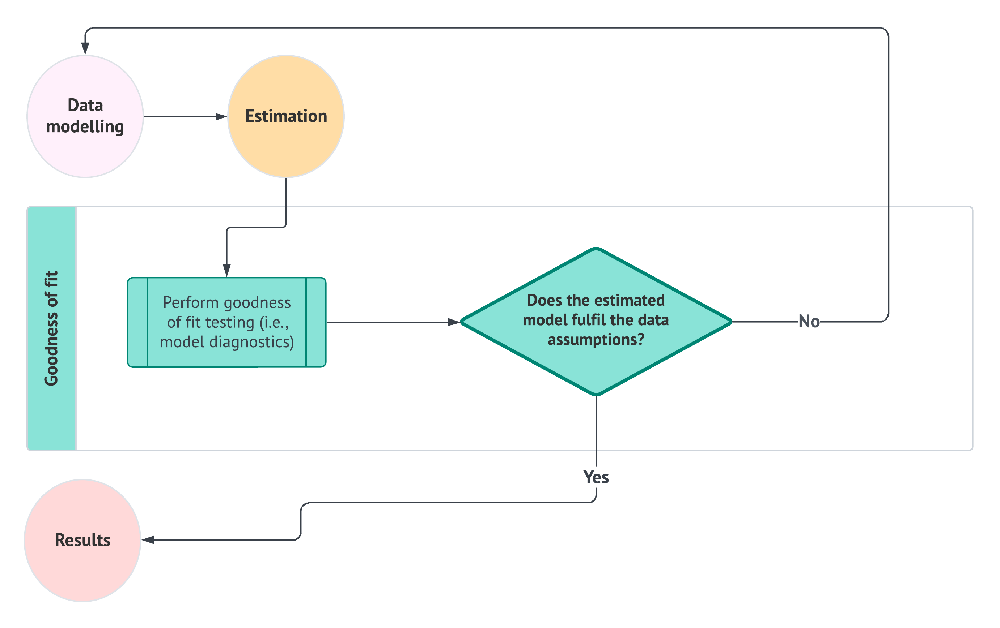{width="670"} 

*Goodness of fit* stage from the data science workflow in @fig-ds-workflow. This stage is directly preceded by *estimation* and followed by *results*. If necessary, the *goodness of fit* stage could retake the process to *data modelling* and then to *estimation*.
:::

### Results {#sec-ds-workflow-results}

After confirming that our model fits the data well, the next step is to interpret the results. This stage helps us understand what our model's outcomes mean in relation to our original goals. Depending on whether our task is predictive or inferential, the approach to interpreting these results will vary slightly.

#### Predictive Inquiries

When the goal is to make predictions about future or unseen data, we follow a straightforward process to see how well our model performs:

1. **Make Predictions Using Python or R:** First, we use our model to make predictions on a new set of data that the model hasn’t seen before, called the test or validation set. This is done by coding in tools like Python or R, which help us apply the model to this new data and generate predictions.

2. **Assess the Predictions Using Different Metrics:** After making predictions, the next step is to evaluate how accurate these predictions are. We use different metrics to measure the accuracy, such as Mean Absolute Error (MAE), Mean Squared Error (MSE), Root Mean Squared Error (RMSE), and R-squared. By following these steps—first making predictions and then assessing them with metrics—we can understand how well our model can predict new outcomes. If the predictions are accurate, we know our model is effective. If not, it indicates that we might need to improve the model or refine the data.

::: {#Definition-metrics .definition}
::::{.definition-header}
Evaluation Metrics
::::
::::{.definition-container}
- **Mean Absolute Error (MAE):** Average absolute difference between predictions and actual values.  
- **Mean Squared Error (MSE):** Average squared difference (penalizes larger errors).  
- **Root Mean Squared Error (RMSE):** Square root of MSE, same units as response.
- **R-squared:** The proportion of the variance in the response variable that is explained by the predictors in the model, indicating how well the model fits the data.
::::
:::

#### Inferential Inquiries

Inferential tasks focus on understanding how different factors are connected. These steps help us see whether one thing affects another and to what extent.

1. **Test Our Ideas with New Data:** We start by testing our ideas or hypotheses with a new set of data. This helps confirm if the patterns we saw before are still present when looking at new information.

2. **Decide if the Relationship is Real:** After testing, we check if the connections we observed are real and meaningful, rather than random or coincidental. This involves deciding whether the relationships are strong enough to be considered significant.

3. **Check How Strong the Connection Is:** We look at how much one factor influences another. This helps us understand whether a change in one thing leads to a noticeable change in another.

4. **Figure Out the Range of the Effect:** If there is a strong connection, we figure out how much the outcome can change when the factor changes. This gives us a sense of the impact.

5. **Estimate the Impact:** With an understanding of the range, we make estimates about how much one factor can affect the outcome, helping us make predictions and decisions.

6. **Conclude About the Relationship:** Finally, if there isn’t a strong connection, we conclude that one factor does not significantly affect the other, indicating that the relationship is not important.

These steps help us make sense of how different factors interact and whether they truly affect each other. By carefully following these steps, we can draw reliable conclusions and use them to inform decisions and strategies. As shown in Figure @fig-ds-workflow-results, these stages are essential for understanding the outcomes of our data analysis and ensuring that our interpretations are based on solid evidence.

::: {#fig-ds-workflow-results}
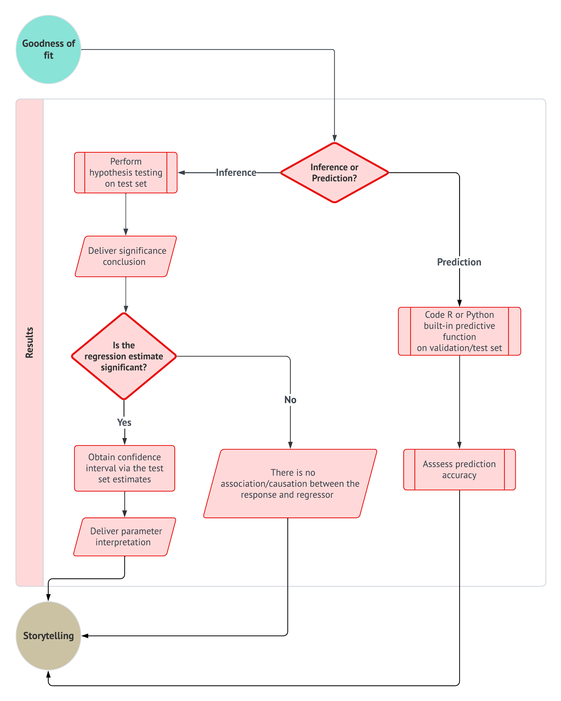{width="670"}

*Results* stage from the data science workflow in @fig-ds-workflow. This stage is directly followed by *storytelling* and preceded by *goodness of fit*.
:::

### Storytelling {#sec-ds-workflow-storytelling}

In the storytelling stage, the focus is on delivering the key insights from the data in a clear and effective way. The goal is to communicate the main findings so that they are easy to understand and relevant to the audience. Start by summarizing the most important insights from the analysis in a few clear sentences, highlighting what the data reveals and why it matters. Make sure to connect these insights back to the original goals of the analysis, showing how they can be used to make decisions or solve problems. Use straightforward language and avoid technical jargon to ensure that everyone, regardless of their background, can grasp the key points. Organize the insights into a logical flow, guiding the audience through the findings and leading to a clear conclusion or recommendation. By focusing on delivering simple, clear, and relevant insights, storytelling turns data into meaningful information that can drive action and inform decision-making. This stage, as shown in Figure @fig-ds-workflow-storytelling, ensures that the data analysis process concludes with impactful communication.

::: {#fig-ds-workflow-storytelling}
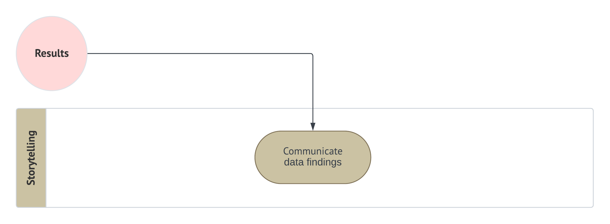{width="670"}

*Storytelling* stage from the data science workflow in @fig-ds-workflow. This stage preceded by *results*.
:::

## Example: Applying the Data Science Workflow to House Price Prediction

To illustrate the entire data science workflow, let's walk through an example of predicting house prices in a specific city. We will apply each step of the workflow to demonstrate how these concepts come together in practice.

Throughout this example, you may encounter new terms or concepts that are unfamiliar if you're just getting started with regression. Don’t worry too much! These concepts will be explained in more detail in later chapters, so for now, focus on the overall process as we move forward.

 via [*Pixabay*](https://pixabay.com/photos/house-architecture-front-yard-1836070/).](img/house.jpg){width="400"} 

### Study Design

**Defining the Objective:** The goal of this analysis is to predict the sale prices of houses based on their features, such as size, number of bedrooms, and location. This is a predictive task because we are interested in making accurate predictions about future house prices based on these characteristics.

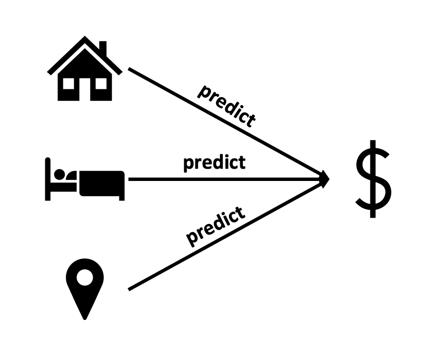{width="400"} 

### Data Collection and Wrangling

**Collecting Data:** We gather data from a real estate database that includes recent house sales. This dataset contains information on various features, such as square footage, number of bedrooms, age of the house, and neighborhood quality.

**Cleaning and Preparing Data:** We clean the data by removing any rows with missing values, standardizing the format of categorical variables (e.g., converting neighborhood names to a consistent format), and ensuring numerical variables like square footage are in the correct units. After cleaning, we split the data into training, validation, and test sets. The training set will be used to build the model, the validation set to tune it, and the test set to evaluate its performance.

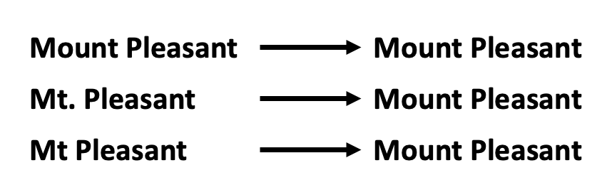{width="400"} 

### Exploratory Data Analysis (EDA)

**Understanding the Data:** We start by classifying the variables:

- **Response Variable:** Sale price (continuous and unbounded).
- **Regressors:** Square footage (continuous), number of bedrooms (discrete, count-based), age of the house (continuous), and neighborhood quality (categorical).

**Visualizing Relationships:** We create visualizations to explore the relationships between the predictors and the sale price. For example, a scatter plot shows a positive relationship between square footage and sale price, indicating that larger houses tend to sell for more. Box plots reveal that houses in certain neighborhoods have higher median prices, suggesting the importance of location.

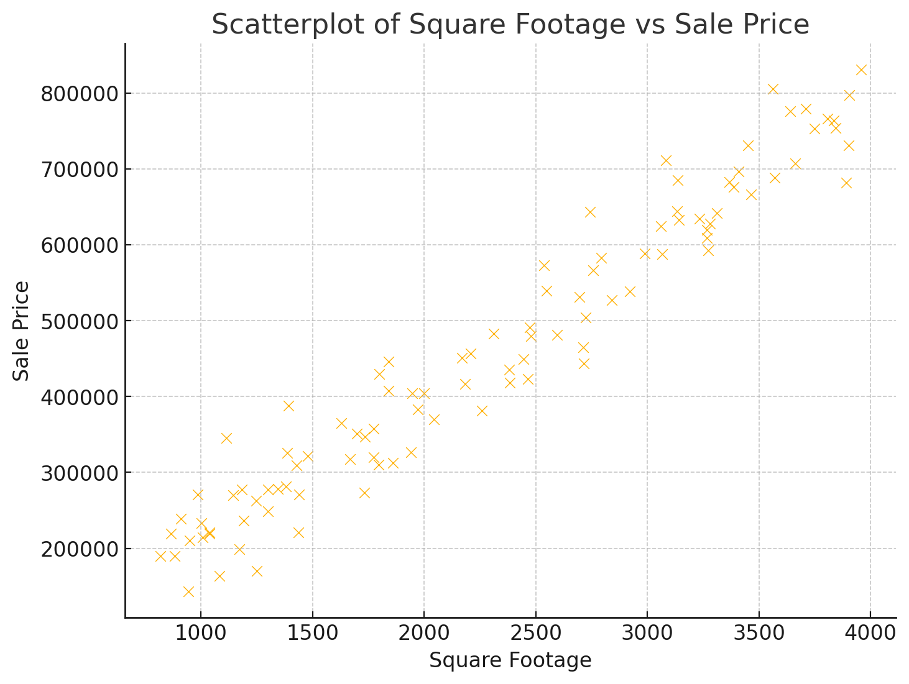{width="400"} 

**Calculating Descriptive Statistics:** We calculate the mean, median, and standard deviation for sale prices and other numerical variables. A correlation matrix helps us see how strongly each predictor is related to the sale price. For example, square footage might have a high positive correlation with price, while the number of bedrooms might have a weaker correlation.

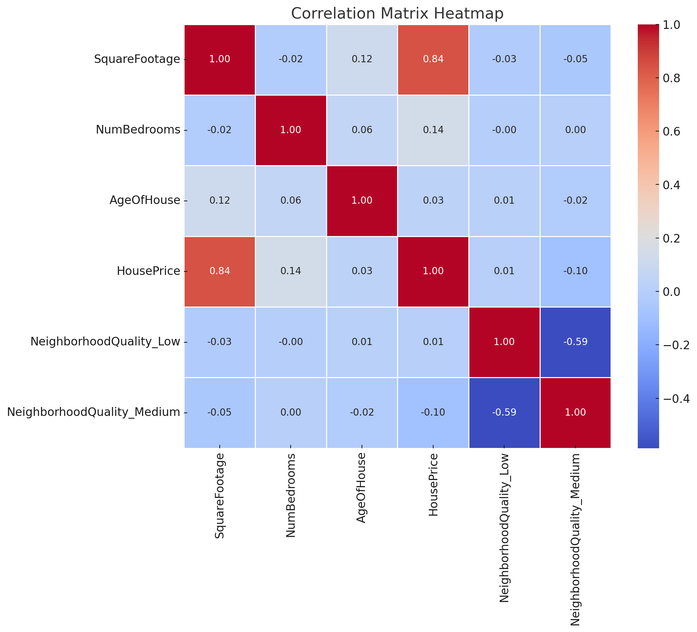{width="400"} 

### Data Modelling

**Choosing a Model:** Based on the EDA findings, we decide to use a multiple linear regression model to predict sale prices, as it can handle multiple predictors and capture their combined effects.

**Defining Parameters:** We include square footage, number of bedrooms, age of the house, and neighborhood quality as predictor variables. We also consider adding interaction terms to capture how these features might jointly influence house prices (e.g., square footage and neighborhood quality).

**Setting Up the Modeling Equation:** Our modeling equation is set up as follows:

$$
\begin{align}
\text{Price} = &\ \beta_0 \\
               & + \beta_1 \times \text{Square Footage} \\
               & + \beta_2 \times \text{Bedrooms} \\
               & + \beta_3 \times \text{Age} \\
               & + \beta_4 \times \text{Neighborhood Quality} \\
               & + \epsilon
\end{align}
$$

Here, $\beta_0$ is the intercept, $\beta_1, \beta_2, \beta_3, \beta_4$ are the coefficients for each predictor, and $\epsilon$ is the error term.

### Estimation

**Fitting the Model:** We use Python or R to fit the regression model to our training data. This process estimates the coefficients, showing us how much each predictor variable affects the sale price.

**Delivering Parameter Estimates:** After fitting the model, we interpret the coefficients. For example, a coefficient of $150 for square footage suggests that each additional square foot increases the sale price by $150, assuming other factors are held constant.

### Goodness of Fit

**Checking Model Assumptions:** We ensure that our model meets key assumptions, such as linearity, independence, constant variance, and normality of residuals. Diagnostic plots help us visualize if these assumptions hold.

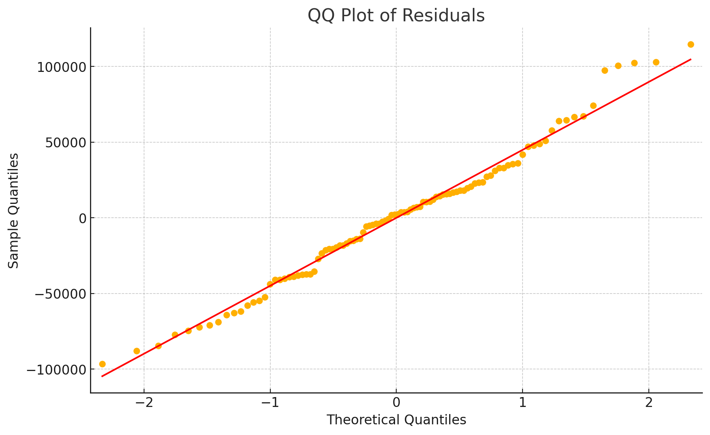{width="400"} 

**Evaluating Model Fit:** We use metrics like R-squared to evaluate how well our model explains the variability in sale prices. An R-squared of 0.85 means that 85% of the variation in prices is explained by our model, indicating a good fit.

**Identifying Outliers:** We look for outliers or influential points that might skew our results, using tools like residual plots and Cook’s distance.

### Results

**Predictive Analysis:** We use the model to make predictions on the test set and assess their accuracy using metrics like MAE, MSE, RMSE, and R-squared. If the predictions are accurate, our model is effective; if not, we might need to revisit the data modeling or cleaning stages.

**Inferential Analysis:** Even though our main goal is predictive, we can still interpret the relationships between features and price. For example, we conclude that larger houses and those in better neighborhoods tend to sell for more, which aligns with our intuition and the data patterns observed.

### Storytelling

**Communicating Insights:** We summarize our findings in a clear and concise way. For example, we highlight that house size and neighborhood quality are strong predictors of sale price, and these insights can help homeowners, buyers, and real estate agents make informed decisions.

**Using Visuals:** We present key findings using charts and graphs that clearly show the relationships and predictions. This visual storytelling helps make the data accessible and understandable to non-technical stakeholders.

**Making Recommendations:** Based on our analysis, we might recommend strategies such as focusing on marketing larger homes in high-quality neighborhoods to maximize sales revenue.

.](img/communicating-insights.jpg){width="400"} 

## Mindmap of Regression Analysis {#sec-regression-mindmap}

Having defined the necessary statistical aspects to execute a proper supervised learning analysis, either *inferential* or *predictive* across its seven sequential phases, we must dig into the different approaches we might encounter in practice as regression models. The nature of our outcome of interest will dictate any given modelling approach to apply, depicted as clouds in @fig-regression-mindmap. Note these regression models can be split into two sets depending on whether the outcome of interest is *continuous* or *discrete*. Therefore, under a probabilistic view, identifying the nature of a given random variable is crucial in regression analysis.

::: {#fig-regression-mindmap}
[](https://mermaid.live/edit#pako:eNqVVd9v2jAQ_lciP4FEOgolDdE0aaVTN2kr1VhfKl6u8REsJT56dugPxP8-J6SCAgHqp-R8933fnc_nhYhJoohEprTMYDbWnsdEtvEXE0ZjFGmvsHnedw3pq1GmufodkLZK55Sbr4_85dswtzFluNqLIhWTbkzAeBPwOU-Rq6hi3etHyrVEuTZ9DMCXeAo6QR9SuxFXrOaQpdLAryXpbwRj_dFTDk5qaVmrbqwDb0lrTMCqOdZRpqQTH5jpuSD1WSXTHeobyDLYYtnwuWOaEVtnrCOZIceoLSS4DX2F9gDyKOe5mkPq_VNZbQYxpKglsG-dk9kiWCzugCFDyypeLj_ulQLW26WMd8b6mq5QR5ip2WHkAb1slKaC_AlvwNJ4O9DXysSMFo_1lJ1uZHhVdkRdYaSK0bfPtFOSkVNuVkzXYGGv-quNZqNEGVsV6EBNXLf5J0JTpqqCHAcfuDtj63LMDfLumf94ypVUxrWdQXlYzCAFRxhXau5IGUP6WKbDOfKJ-LfV_Su9PmR-Kr5HXPrfu8lxKusNamRI1VvleGJeD8jk_9KTFOwxhl3XoxwD55oQF8WuO043IrZP89ZVTG9G7JlhroP8PG3ukfknT-3n2q1Yq1l7nJP2clbRn-B7X42deTGU0jRrnIv7tj9AtESGnIGS7n1bFOFjYafoJoqI3KfECbi6jMVYL50r5JZGrzoWkeUcWyKfSXdS1woSN99ENIHUOOsMtIgW4kVEficMzy4vgiDo94Ner93vXrTEq7OfBxdnl0Ev7AVhOwyCdrBsiTcih3F-1u2e98NOEIT9sNvudDstgVJZ4j-rR7h8i0uShzKgULL8DwFMR-8)

Regression analysis mindmap depicting all modelling techniques to be explored in this book. These techniques are split into two big sets: *continuous* and *discrete* outcomes.
:::

That said, we will go beyond OLS regression and explore further regression techniques. In practice, these techniques have been developed in the statistical literature to address practical cases where the OLS modelling framework and assumptions are not suitable anymore. Thus, throughout this block, we will cover (at least) one new regression model per lecture.

As we can see in the clouds of @fig-regression-mindmap, there are 13 regression models: 8 belonging to discrete outcomes and 5 to continuous outcomes. Each of these models is contained in a chapter of this book, beginning with the most basic regression tool known as ordinary least-squares in @sec-ols. We must clarify that the current statistical literature is not restricted to these 13 regression models. The field of regression analysis is vast, and one might encounter more complex models to target certain specific inquiries. Nonetheless, I consider these models the fundamental regression approaches that any data scientist must be familiar with in everyday practice.

Even though this book comprises 13 chapters, each depicting a different regression model, we have split these chapters into two major subsets: those with *continuous* outcomes and those with *discrete* outcomes. 

