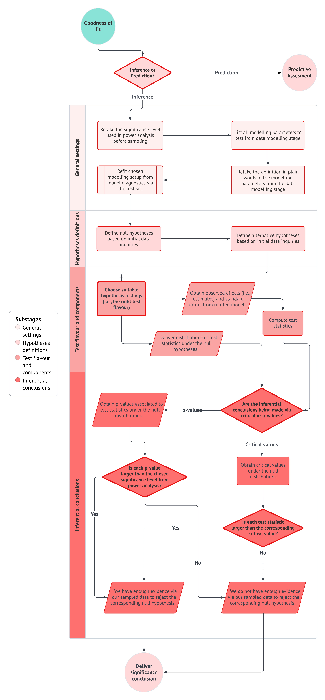
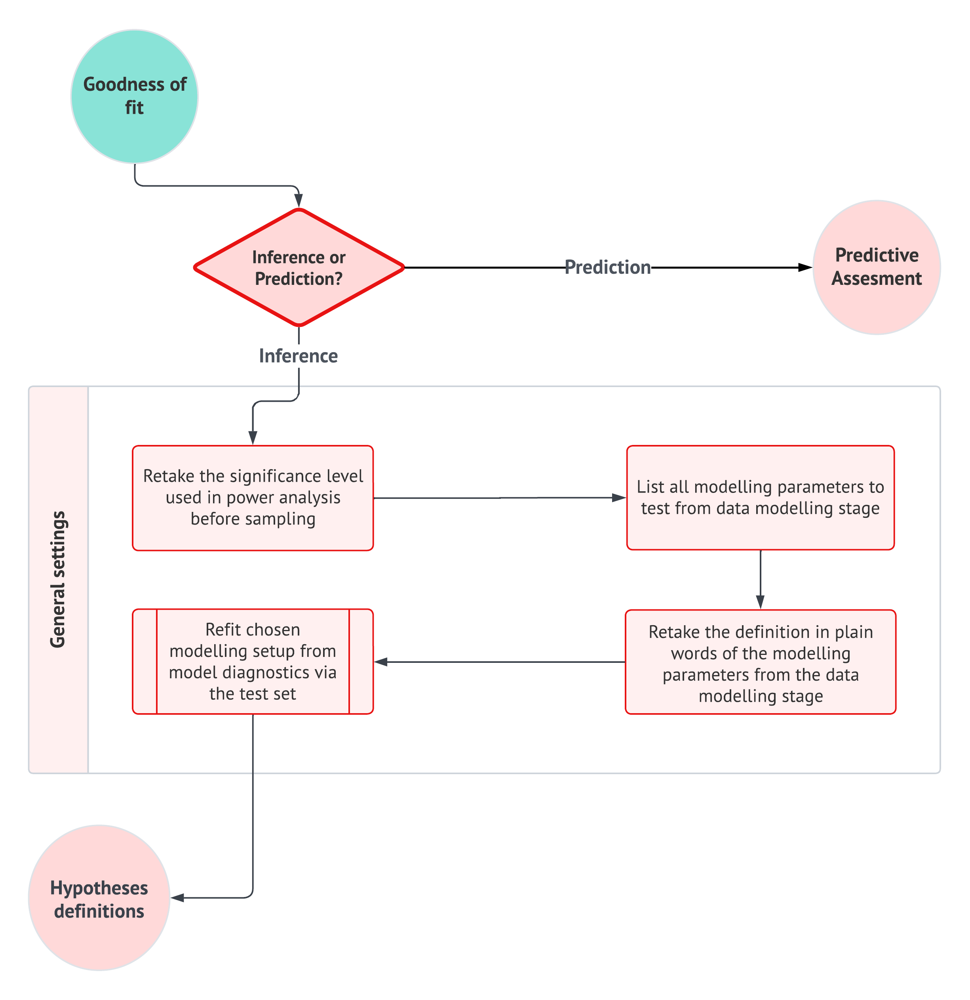
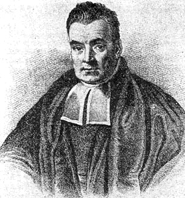
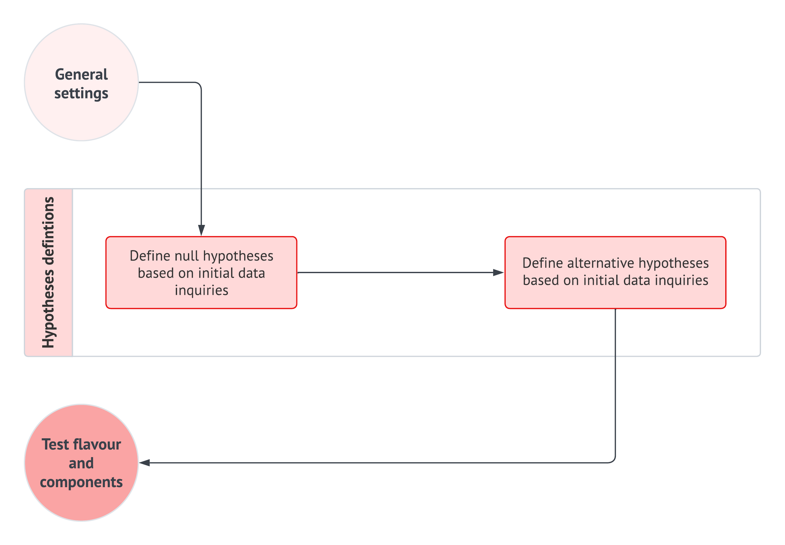
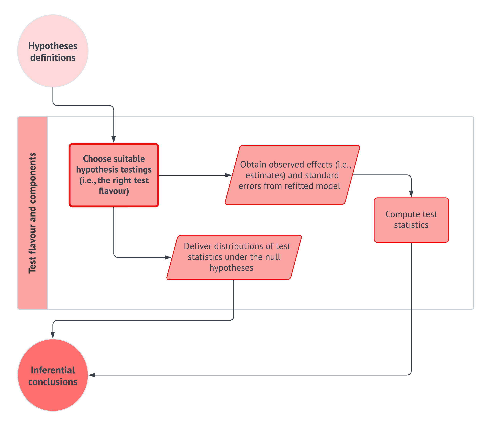
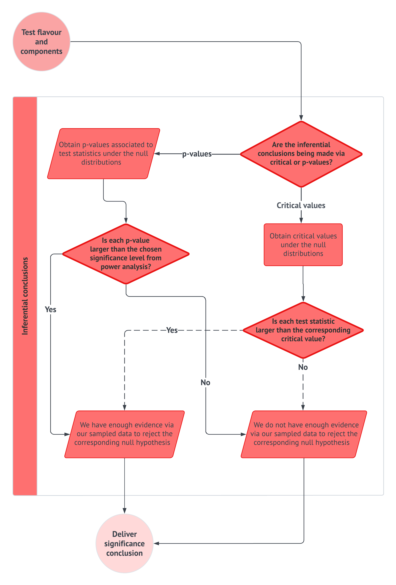

<script async src="https://www.googletagmanager.com/gtag/js?id=G-7PRVEBE1EF"></script>
<script>
  window.dataLayer = window.dataLayer || [];
  function gtag(){dataLayer.push(arguments);}
  gtag('js', new Date());

  gtag('config', 'G-7PRVEBE1EF');
</script>

# Basic Cuisine: A Review on Probability and Frequentist Statistical Inference {#sec-stats-review}

```{r}
#| include: false
library(tidyverse)
library(reticulate)
library(DT)
library(cowplot)

# Setting up Python dependencies
py_require("pandas")
py_require("numpy")
pandas <- import("pandas")
numpy <- import("numpy")
py_install("scipy")
scipy_stats <- import("scipy.stats")
scipy_optimize <- import("scipy.optimize")

options(htmlwidgets.TOJSON_ARGS = list(na = 'string')) 

print_as_dt <- function(x){
  DT::datatable(x,
                rownames = FALSE,
                options = list(
                  dom = 'ltipr', 
                  autoWidth = TRUE,
                  columnDefs = list(
                    list(className = 'dt-left', targets = "_all"),
                    list(width = '200px', targets = "_all")
                    )
                  )
                )
}
```

::: {.Warning}
::::{.Warning-header}
The Importance of this Chapter
::::
::::{.Warning-container}
In @sec-intro, we introduced regression analysis as a **structured data science workflow**: we begin with a question, define a response variable and explanatory variables, choose a probability model, estimate unknown parameters, assess model adequacy, and communicate results to stakeholders. This chapter now slows down and reviews the **probability** and **frequentist inference** ideas that make that workflow possible.

 via [*Pixabay*](https://pixabay.com/vectors/children-teacher-rectangular-figures-7464611/).](img/children-2.png){width="500"}

Rather than treating probability, likelihood, goodness of fit, confidence intervals, and hypothesis tests as isolated formulas, we will use them as ingredients in a coherent recipe. The main running example will continue to be a made-up ice cream business case with two operational queries: a **demand query** about children's flavour preferences and a **time query** about customer waiting times. These two queries let us connect probability models, random sampling, maximum likelihood estimation, the Central Limit Theorem, goodness-of-fit checks, and hypothesis testing.
::::
:::

::: {.LO}
::::{.LO-header}
Learning Objectives
::::
::::{.LO-container}
By the end of this chapter, you will be able to:

- Explain why **probability** is the language used to describe **randomness** in statistical inference and regression analysis.
- Distinguish between a **population** or **system**, a **parameter**, a **random variable**, an **observation**, an **estimator**, and an **estimate**.
- Use notation such as $\Pr(\cdot)$, $p(\cdot)$, $f(\cdot)$, $F(\cdot)$, $\mathbb{E}(\cdot)$, and $\operatorname{Var}(\cdot)$ consistently.
- Connect the support and shape of a response variable to the choice of a **probability model**.
- Explain the frequentist interpretation of probability, parameters, estimators, **confidence intervals**, and **hypothesis tests**.
- Formulate a **likelihood** and identify the **maximum likelihood estimator** in simple probability models.
- Use the **Central Limit Theorem** as an inferential pivot for sample proportions and sample means.
- Explain why estimation is not enough and why fitted probability models require **goodness-of-fit checks**.
- Distinguish **goodness of fit**, **coefficient-level inference**, **model comparison**, and **predictive performance**.
- Apply a coherent and general inferential workflow.
::::
:::

> **Let us start with a relatable story!** 

 via [*Pixabay*](https://pixabay.com/vectors/panda-cute-bear-blue-question-149818/).](img/panda.png){width="400"} 

Imagine that you have just completed a first course in probability and statistics. You remember seeing many important terms: *population parameter*, *random sample*, *test statistic*, *significance level*, *$p$-value*, *confidence interval*, and *power*. You also remember that these terms were often presented together in hypothesis testing problems. Still, it was easy to feel that the formulas were doing the work while the actual statistical story remained hidden.

That mechanical feeling in statistical inference is risky in a regression course. In practice, a data scientist should be able to explain why a sample is informative about a population or system, why an estimate is uncertain, why a fitted model must be checked, and why a statistical conclusion should be phrased with care. This is especially important when the audience includes stakeholders who do not use statistical jargon every day.

Having said all this, the guiding idea for this chapter is the following:

> **In statistical inference, everything always boils down to randomness and how we model, estimate, check, and communicate it.**

::: {.Heads-up}
::::{.Heads-up-header}
Heads-up on why we mean as a non-ideal mechanical analysis!
::::
::::{.Heads-up-container}
The reader might need clarification on why the mechanical way of performing statistical inference is considered **non-ideal**, mainly when the term **cookbook** is used in the book's title. The cookbook concept here actually refers to a homogenized recipe for data modelling, as seen in the workflow from @fig-ds-workflow. However, there is a crucial distinction between this and the non-ideal mechanical way of doing statistical inference.

On the one hand, the non-ideal mechanical way refers to **the use of a tool without understanding the rationale of what this tool stands for**, resulting in vacuous and standard statements that we would not be able to explain any way further, such as this statment in hypothesis testing:

> *With a significance level $\alpha = 0.05$, we reject (or fail to reject, if that is the case) the null hypothesis given that...*

What if a stakeholder of our analysis asks us in plain words what a significance level means? Why are we phrasing our conclusion on the null hypothesis and not directly on the alternative one? As a data scientist, one should be able to explain why the whole inference process yields that statement without misleading the stakeholders' understanding. For sure, this also implicates appropriate communication skills that cater to general audiences rather than just technical ones.

Conversely, the data modelling workflow in @fig-ds-workflow involves stages that necessitate a comprehensive and precise understanding of our analysis. Progressing to the next stage (without a complete grasp of the current one) risks perpetuating false insights, potentially leading to faulty data storytelling of the entire analysis.
::::
:::

The chapter is organized as a story about how an analyst gradually turns **uncertainty** into an **evidence-based conclusion**. We begin in @sec-prob-regression-engine with probability, random variables, and probability distributions because these are the objects that allow us to describe a response before it is observed. Then, in @sec-random-sampling-estimation, we move from the population or system to the random sample, where estimators, estimates, sampling variability, standard errors, and the **Central Limit Theorem (CLT)** become the practical language of uncertainty quantification.

 via [*Pixabay*](https://pixabay.com/vectors/pixel-pixel-cells-pedagogy-3699345/).](img/argument-2.png){width="550"}

Once we have clarified what is random and what is unknown, @sec-mle-regression-engine introduces **maximum likelihood estimation** as the mechanism that connects probability models to fitted models. However, fitting a model is not the end of the story. In @sec-goodness-of-fit, we pause to ask whether the fitted probability model reproduces the main patterns in the observed data well enough for the purpose of the analysis. Finally, @sec-frequentist-inference-workflow keeps the **inferential workflow** from the original chapter, but it extends this chapter's example queries into CLT-based hypothesis testing so that probability, estimation, model checking, and statistical conclusion-making are seen as parts of the same recipe rather than separate course-note topics.

## Why Probability Belongs in a Regression Cookbook {#sec-prob-regression-engine}

In @sec-intro, we framed regression analysis as a way to connect a question, a response variable, explanatory variables, a probability model, and a communication goal. Chapter 2 now steps behind that workflow and asks what must be true conceptually before any regression model can be trusted. The answer is not simply that we need formulas. We need a language to describe what could have happened, what did happen, what remains unknown, and the remaining uncertainty after observing the data.

This is why probability belongs near the beginning of a regression cookbook. A response variable is not merely a column in a data frame. Before it is observed, it is a random quantity with possible values, a support, a distributional shape, and a relationship to unknown parameters. Once observed, it becomes evidence of the population or system that generated it. The bridge between those two views (the pre-data random variable and the post-data observation) is the foundation for **estimation**, **goodness-of-fit assessment**, and **inference**.

 via [*Pixabay*](https://pixabay.com/vectors/pixel-pixel-cells-pedagogy-3699345/).](img/argument.png){width="300"}

@tbl-ch2-ch1-bridge links the @sec-intro's data science workflow language to the probability and inference ingredients reviewed in this chapter. It is not meant to be memorized as a dictionary; rather, it shows that the ideas introduced here are the statistical engine behind the workflow we will use throughout the book.

| **Chapter 1 Idea** | **Chapter 2 Foundation** | **Regression Connection** |
|:------------------:|:------------------------:|:--------------------------:|
| Response variable | Random variable | The outcome is modelled as a **random quantity** before it is observed. |
| Probability model | Probability distribution | The distribution describes the possible values and **uncertainty** in the response. |
| Model parameter | Population or system parameter | Regression coefficients, variances, rates, probabilities, and dispersion parameters are unknown quantities to estimate. |
| Training data | Observed random sample | The fitted model is learned from **observed realizations** of random variables. |
| Model fitting | Estimation and likelihood | Parameter estimates are obtained from data under a chosen probability model. |
| Goodness of fit | Model checking | A fitted model should reproduce important patterns in the observed data. |
| Results | Confidence intervals and hypothesis tests | Inferential conclusions require uncertainty quantification. |
| Storytelling | Communication of uncertainty | Stakeholders need conclusions that reflect **sampling variability** and **model limitations**. |

: Bridge between the Chapter 1 regression workflow and the probability and inference foundations reviewed in Chapter 2. {#tbl-ch2-ch1-bridge .striped .hover}

::: {.Tip}
:::: {.Tip-header}
Tip on further reading on probability and statistical modelling!
::::
:::: {.Tip-container}
This chapter provides the probability and frequentist inference we need to move comfortably through the regression models in the rest of the cookbook. It is not meant to replace a full probability or mathematical statistics course. Readers who want a concise but deeper mathematical treatment of **probability**, **estimation**, and **frequentist inference** can consult @wasserman2004 and @casella2024, especially for topics such as random variables, sampling distributions, likelihood-based estimation, confidence intervals, and hypothesis testing.

 via [*Pixabay*](https://pixabay.com/vectors/creative-raspberry-pi-circuit-7426705/).](img/creative.png){width="300"}

Readers who want **a broader modelling perspective** may also find @gelman2021 useful. That reference is especially aligned with the spirit of this book because it treats statistical modelling as an iterative workflow rather than a one-shot calculation. In that view, we build a probability model, fit it to data, check whether it captures the main patterns in the observed data, revise it when needed, and communicate conclusions with appropriate uncertainty.
::::
:::

### Populations, Systems, and Parameters {#sec-populations-systems-parameters}

Every statistical analysis starts with a **boundary**. Sometimes the boundary is a familiar **population**, such as children in a region, customers of a company, or trees in a forest. Other times the boundary is better described as a **system**, such as a manufacturing process, a queueing process, or an online platform. This distinction matters because our conclusions only make sense relative to the population or system we intended to study.

Once that target is defined, we usually want to learn about features that are not directly observable in full. We may want the average waiting time, a defect probability, a preference probability, a variability measure, or, later in this cookbook, a regression coefficient. These unknown features are **parameters**. A **sample** gives us evidence about these parameters, but the sample is not the target itself. Keeping this distinction clear reminds us that regression analysis is not only about computing fitted values or coefficients; it is about using data to learn, **with uncertainty**, about a broader population or data-generating system.

Let us first consider the more familiar case: a **population**. In many statistical examples, the population is a collection of people, animals, products, plants, locations, or other units. The key point is that the population is not merely "*the data we happened to collect*." Rather, it is the broader collection we would like to draw conclusions from.

::: {#Definition-population .definition}
:::: {.definition-header}
Definition of population
::::

:::: {.definition-container}
A **population** is the whole collection of individuals or items that share the attributes we want to study. In a statistical analysis, the population should be defined as precisely as possible, as it determines the scope of the conclusions we can draw. Examples of populations include:

- *Children between 5 and 10 years old in the American West Coast.*
- *Customers of vinyl records in British Columbia and Alberta.*
- *Avocado trees grown in Michoacán, Mexico.*
- *Adult giant pandas in Sichuan, China.*

 via [*Pixabay*](https://pixabay.com/photos/lego-toys-figurines-crowd-many-1044891/).](img/lego.jpg){width="550"}
::::
:::

The above population definition is especially useful when the units of interest are clearly identifiable. For example, if we study vinyl record customers in British Columbia and Alberta, the units are customers. If we study avocado trees in Michoacán, the units are trees. In these cases, we can imagine a large collection of units, even if we cannot observe every unit in practice. However, not every statistical analysis is naturally framed as a collection of individuals or items. Sometimes we are interested in an ongoing process: customers arriving over time, items being produced by a machine, users interacting with a website, or buses moving through a transit network. In these cases, the word **system** is often more natural than population because the object of study is the behaviour of a process rather than a fixed collection of units.

::: {#Definition-system .definition}
:::: {.definition-header}
Definition of system
::::

:::: {.definition-container}
A **system** is a process, mechanism, or operational setting whose behaviour is governed by unknown features we want to study. The word **system** is useful when the object of study is not naturally a collection of people or items. Examples of systems include:

- *The production process for a given cellular phone model.*
- *The sale process in ice cream carts across a group of cities.*
- *The transit cycle during weekday rush hours in a subway network.*

 via [*Pixabay*](https://pixabay.com/photos/train-transportation-speed-6910973/).](img/transit.jpg){width="550"}
::::
:::

The distinction between a population and a system is not meant to be rigid. In many applications, either language could be useful. For example, an ice cream business may study the customer population who buy from its carts, but it may also study the system through which customers arrive, wait, order, and leave. What matters is that we define the target of analysis clearly enough so that our conclusions have a meaningful scope.

Once we have identified the population or system, the next question is: 

> **What do we want to learn about it?** 

This is where **parameters** enter the analysis. A parameter turns a broad research question into a more precise statistical target. For a waiting-time question, the vague goal of "*understanding delays*" might become the more specific goal of estimating **the average waiting time**. For a product-quality question, the practical concern about reliability might become the statistical target of estimating **the probability that an item is defective**.

::: {#Definition-parameter .definition}
:::: {.definition-header}
Definition of parameter
::::

:::: {.definition-container}
A **parameter** is an unknown characteristic that summarizes some feature of a population or system. Parameters are commonly numerical, such as a mean, variance, probability, rate, or a regression coefficient, although some summaries can be categorical in non-regression settings. Examples include:

- *The average weight of children between 5 and 10 years old in a defined region.*
- *The variability in the height of mature açaí palm trees in a defined forest area.*
- *The probability that a manufactured item is defective.*
- *The average waiting time between two customers at an ice cream cart.*
- *A regression coefficient describing how a response changes with an explanatory variable.*

In this book, scalar parameters will usually be denoted by Greek letters such as $\theta$, $\mu$, $\sigma^2$, $\lambda$, or $\beta_j$. The word **scalar** means that the parameter is a single numerical quantity. For example, $\mu$ may denote one population mean, $\lambda$ may denote one rate parameter, and $\beta_j$ may denote one regression coefficient associated with the $j$th regressor.

 via [*Pixabay*](https://pixabay.com/vectors/pixel-cells-pixel-winner-3702063/).](img/trophy.png){width="550"}

When a model contains several parameters, it is often more convenient to collect them into a vector. A **parameter vector** will usually be denoted by a bold symbol such as $\boldsymbol{\beta}$ or $\boldsymbol{\theta}$. For instance, in a regression model with an intercept and $k$ regressors, we may write

$$
\boldsymbol{\beta} = (\beta_0, \beta_1, \ldots, \beta_k)^\top.
$$

Here, $\boldsymbol{\beta}$ denotes the full vector of regression coefficients, while each $\beta_j$ ($j = 1, \dots, k$) denotes one scalar component of that vector. This notation helps us distinguish between questions about a single coefficient, such as whether $\beta_1 = 0$, and questions about the collection of parameters that defines the fitted regression model as a whole.
::::
:::

The important point is that a parameter is not merely a symbol. It is the mathematical version of the feature we care about. If the population or system defines **where** the analysis lives, the parameter defines **what** we are trying to learn. This is why parameters will appear throughout the cookbook: regression coefficients, error variances, probabilities, rates, dispersion terms, and other model components are all ways of formalizing practical questions.

::: {.Tip}
::::{.Tip-header}
Tip on the Greek alphabet in statistics!
::::
::::{.Tip-container}
In the early stages of learning statistical modelling, including regression analysis, it is common to feel overwhelmed by unfamiliar letters and terminology. Whenever confusion arises in any of the main chapters of this book regarding these letters, we recommend referring to the Greek alphabet found in @sec-greek-alphabet. It is important to note that frequentist statistical inference primarily uses lowercase letters. With consistent practice over time, you will likely memorize most of this alphabet.

 via [*Pixabay*](https://pixabay.com/photos/typewriter-old-retro-office-1899760/).](img/typewriter.jpg){width="500"} 
::::
:::

Note that, in real applications, parameters are usually **unknown**. We rarely observe an entire population, and we rarely have complete access to every possible behaviour of a system. Instead, we work with a sample of customers, a collection of waiting times, a set of observed purchases, or a training data set of houses and sale prices. The sample is therefore our **collected evidence**, but the population or system remains the target.

This distinction sets the stage for the rest of the chapter. Probability will give us language for describing random variation in data. Estimation provides tools for using a sample to approximate unknown parameters. Goodness-of-fit ideas will help us ask whether a chosen probability model is compatible with the observed data. Finally, frequentist inference will help us quantify uncertainty when we move from sample evidence to conclusions about the broader population or system. To make these ideas concrete, we now turn to a running example involving an ice cream company.

### The Ice Cream Case Study {#sec-ice-cream-case}

To keep the statistical ideas grounded, we will follow a small business story throughout the chapter. Imagine that you own a large fleet of 900 ice cream carts operating across parks in Vancouver, Victoria, Edmonton, Calgary, Winnipeg, Ottawa, Toronto, and Montréal. To optimize costs, the carts sell only two cone flavours: **vanilla** and **chocolate**, as in @fig-ice-cream.

At first glance, this may sound like a simple inventory problem. But even this small setting contains most of the statistical ingredients that later appear in regression. We need to define the target population or system, decide what random variable is being observed, choose a probability model, estimate unknown parameters, check whether the model is plausible, and communicate the conclusion in a way that supports a decision. The same logic will later reappear when the response is a house price, a binary outcome, a count, a survival time, or a proportion.

::: {#fig-ice-cream}
{width="390"}

The two flavours of the ice cream cone you sell across all your ice cream carts: *vanilla* and *chocolate*. Image by [*tomekwalecki*](https://pixabay.com/users/tomekwalecki-13027968/) via [*Pixabay*](https://pixabay.com/photos/ice-cream-flavor-chocolate-vanilla-4401300/).
:::

As shown in @tbl-ice-cream-queries, the ice cream business is facing two related but distinct statistical questions. The first is a **demand query**: 

> **Which cone flavour is most preferred by children in the target parks, and by how much?** 

The second is a **time query**: 

> **How long, on average, does the business wait from one customer to the next at its carts during Summer weekends?** 

These two questions may sound like ordinary business questions at first, but they already contain the basic ingredients of statistical inference. Each query requires us to define a target population or system, identify an unknown parameter, collect data, and describe what the data tell us with appropriate uncertainty.

| **Component** | **Demand Query** | **Time Query** |
|:-------------:|:-----------------:|:---------------:|
| **Population or System** | Children between 4 and 11 years old attending parks in the eight cities during Summer weekends. | All customers served by the 900 carts during Summer weekends. |
| **Parameter of Interest** | $\pi = \Pr(D_i = 1)$, where $D_i = 1$ means the child prefers chocolate. | $\mu = \mathbb{E}(T_j)$, where $T_j$ is the waiting time, in minutes, between consecutive customers. |
| **Practical Importance** | Planning flavour-specific inventory before Summer weekends. | Planning stock levels, staffing, and operational capacity. |

: Ice cream case study queries used throughout Chapter 2. {#tbl-ice-cream-queries .striped .hover}

::: {.Heads-up}
:::: {.Heads-up-header}
Heads-up on probability notation in the ice cream case!
::::
:::: {.Heads-up-container}
In @tbl-ice-cream-queries, the demand query uses the notation $\pi = \Pr(D = 1)$. Here, $\pi$ is a statistical parameter denoting the **population proportion** of children in the target population who prefer chocolate. Note that, in statistics, the Greek letter $\pi$ is often used for an unknown probability, especially when that probability represents a population proportion. It is not the mathematical constant $3.141592\ldots$ 

The expression $\Pr(D = 1)$ reads as "*the probability that $D$ equals 1*." In this case, $D$ is a **binary random variable**:

$$
D =
\begin{cases}
1, & \text{if the child prefers chocolate},\\
0, & \text{otherwise}.
\end{cases}
$$

Therefore, $\Pr(D = 1)$ is the probability that a randomly selected child from the target population prefers chocolate. In population language, it is the proportion of children in the target population who prefer chocolate. We will return to the meaning of probability statements such as $\Pr(D = 1)$ in @sec-prob-sample-spaces-events, and we will define random variables more carefully in @sec-random-variables-distributions.

For the time query, $\mu = \mathbb{E}(T)$ means that $\mu$ is the **population average waiting time** between consecutive customers. The random variable $T$ represents the waiting time, in minutes, from one customer to the next at an ice cream cart during Summer weekends. The expected value $\mathbb{E}(T)$ is the long-run average waiting time in the broader customer-arrival system, not just the average waiting time in one observed sample. We will revisit expected values in @sec-expectation-variance, where we will use them to connect probability models with population means and variability.
::::
:::

Let us make the setting more concrete. Suppose the company is preparing for the upcoming Summer season, its most profitable time of year. For the demand query, the business wants to understand the flavour preferences of **children between 4 and 11 years old attending selected parks in these cities during Summer weekends**. This target is a **population** because the units of interest are children in a clearly defined setting. From a planning perspective, this question matters because flavour preferences affect supplier orders and inventory allocation.

The demand query is therefore not merely asking which flavour appears most often in a small data set. It is asking about an unknown feature of a broader population. For example, if chocolate is the most frequently preferred flavour in a sample, the business still has to ask whether it is likely to be the most preferred flavour among children attending those parks during Summer weekends. It may also want to know by how much chocolate leads the second-place flavour, since a very small difference would lead to a different inventory decision than a large one. In statistical terms, this query naturally points to unknown preference probabilities. Thus, the notation $\pi = \Pr(D = 1)$, where $D = 1$ means the child prefers chocolate, in @tbl-ice-cream-queries.

The time query has a different flavour. Here, the operations team wants to estimate **the average waiting time from one customer to the next customer at a cart during Summer weekends**. This average waiting time is useful for planning staffing, restocking schedules, and the amount of inventory each cart should carry throughout the day. Unlike the demand query, the relevant target is not restricted to children between 4 and 11 years old. Waiting times are generated by the broader customer-arrival process across the ice cream carts. Thus, the time query is better understood as a question about an operational **system**: customers arrive, wait, order, leave, and create a sequence of time gaps between arrivals.

 via [*Unsplash*](https://unsplash.com/photos/silver-bell-alarm-clock-dhZtNlvNE8M).](img/clock.jpg){width="500"}

The query distinction is important. The demand query and the time query come from the same business case, but they do not have the same target. The demand query concerns a population of children in selected parks. The time query concerns a customer-arrival system across the carts. Therefore, the nature of the query dictates how we define the population or system, which parameter we care about, what data we collect, and which probability model may later be appropriate. 

Now, to move these questions from business planning to statistical analysis, suppose you (as the company owner) organize a meeting with the eight general managers, one per city. During the meeting, two possible data-collection strategies are discussed:

- For the **demand query**, a marketing firm could run a market study with children in the selected parks before Summer begins. 
- For the **time query**, vendor staff across the carts could record waiting times between consecutive customers during the Summer season. 

From a business perspective, both strategies sound reasonable. Hence, managers quickly realize that the scale of the data collection matters. Consequently, Vancouver's general manager proposes an ambitious plan for the demand query:

> *Since we are already planning to collect consumer data in these cities, let's mimic a census-type study so that we can have the most precise results on flavour preferences.*

At first glance, this sounds appealing. If we could ask every child in the target population about their favourite flavour, we would not need to worry much about sampling variability. However, this plan is not realistic. The target population is large, mobile, and tied to a specific context: children attending selected parks during Summer weekends. Even defining and reaching every child in that population would be difficult. The census-type idea also raises practical concerns about time, cost, coordination, and implementation.

 via [*Pixabay*](https://pixabay.com/vectors/pixel-cells-seminar-conference-3974170/).](img/meeting-2.png){width="500"}

On the other hand, Ottawa's general manager raises a different point when discussing the time query:

> *The operations protocol for recording waiting times across all carts looks cumbersome to implement this Summer. Why don't we select a smaller set of waiting times between customers across the carts so that the process is more efficient and operationally realistic?*

Note that the suggestion above is motivated by operational cost, but it also captures one of the central ideas of statistical inference. We often cannot observe the entire population or system, and we usually do not need to. Instead, we can collect a carefully designed sample and use probability to describe how sample-to-sample variation affects our conclusions. In the time query, a well-collected random sample of waiting times can provide evidence about the average waiting time in the broader customer-arrival system.

The same logic applies to the demand query. Rather than trying to mimic a census, the marketing firm can collect a sample of children from the target parks and use that sample to estimate the preference probabilities for different flavours. The key requirement is not that the sample be enormous or census-like. The key requirement is that the **sampling process** be designed carefully enough so that the resulting data provide credible evidence about the population or system of interest. 

This is the point at which **probability** enters the case study. Once we rely on a sample, our conclusions become subject to sampling variation. Another sample of children might produce slightly different flavour proportions. Another sample of waiting times might produce a slightly different average waiting time. Statistical inference gives us the language and tools to account for that variation rather than pretending it does not exist.

::: {.Heads-up}
:::: {.Heads-up-header}
Heads-up on random sampling with probabilistic foundations!
::::

:::: {.Heads-up-container}
Realistically, there is no cheap and efficient way to conduct a census-type study for either query in @tbl-ice-cream-queries. For the demand query, we cannot ask every child in the target population about their flavour preference. For the time query, recording every waiting time across all carts throughout the entire Summer would be operationally cumbersome. Instead, we rely on random samples. **Random sampling** saves resources, but it also introduces sampling variability. Probability is the language we use to quantify that variability.

 via [*Pixabay*](https://pixabay.com/vectors/pixel-cells-pixel-group-3702061/).](img/sample-piece.png){width="350"}
::::
:::

Finally, moving on to one of the core topics in this chapter, we can also state that probability is viewed as the language to decode random phenomena that occur in any given population or system of interest. In our example, we have two random phenomena:

1. For the **demand query**, a phenomenon can be represented by the preferred ice cream cone flavour of **any randomly selected child between 4 and 11 years old attending the parks of the above eight Canadian cities during the Summer weekends**. 
2. Regarding the **time query**, a phenomenon of this kind can be represented by **any randomly recorded waiting time between two customers during a Summer weekend in any of the above eight Canadian cities across the 900 ice cream carts**.

### Probability, Sample Spaces, and Events {#sec-prob-sample-spaces-events}

The first step to address our ice cream queries is to describe what can happen before we observe the data. For the demand query, a child might prefer chocolate or vanilla. For the time query, the waiting time between customers might be short, moderate, or long. Thus, probability provides a principled way to assign structure to these possibilities without pretending to know the outcome in advance. Now, let us finally define what we mean by probability along with the inherent concept of sample space.

::: {#Definition-probability .definition}
:::: {.definition-header}
Definition of probability
::::
:::: {.definition-container}
Let $A$ be an event in a random phenomenon with sample space $\mathcal{S}$. The probability of event $A$ is denoted by

$$
\Pr(A).
$$

Under a frequentist interpretation, $\Pr(A)$ can be understood as the limiting relative frequency of event $A$ over repeated observations of the same random phenomenon:

$$
\Pr(A) = \lim_{n \to \infty} \frac{\text{Number of times event } A \text{ is observed in } n \text{ repetitions}}{n}.
$$

Note that a probability must satisfy

$$
0 \leq \Pr(A) \leq 1.
$$
::::
:::

::: {#Definition-sample-space .definition}
:::: {.definition-header}
Definition of sample space
::::
:::: {.definition-container}
The sample space $\mathcal{S}$ is the set of all possible outcomes of a random phenomenon. An **event** $A$ is a subset of the sample space, so

$$
A \subseteq \mathcal{S}.
$$ 

Note that the probability of the whole sample space is

$$
\Pr(\mathcal{S}) = 1.
$$
::::
:::

::: {.Heads-up}
:::: {.Heads-up-header}
Heads-up on using $\Pr(\cdot)$ for probability statements!
::::
:::: {.Heads-up-container}
As introduced in @sec-ice-cream-case, this cookbook will use $\Pr(\cdot)$ for probability statements instead of $P(\cdot)$. This is partly a notation choice, but it is a helpful convention in a regression book because the letter $P$ is often used for other objects, including projection matrices in linear algebra.

 via [*Pixabay*](https://pixabay.com/vectors/pixel-cells-emotion-fear-expression-6230192/).](img/curious.png){width="250"}

For example, we will write

$$
\Pr(A)
$$

to denote the probability of an event $A$. This notation helps keep probability statements visually distinct from other mathematical objects that will appear later in the cookbook.
::::
:::

Now, following up with what was discussed in @tbl-ice-cream-queries for the **demand query**, suppose the marketing firm records the flavour preference of a randomly selected child from the target population. To keep the example simple, assume for the moment that the study compares only two flavours: chocolate and vanilla. Then, the child's preference can be encoded as

$$
D =
\begin{cases}
1, & \text{if the child prefers chocolate},\\
0, & \text{if the child prefers vanilla}.
\end{cases}
$${#eq-bernoulli-flavour}

With this coding, the possible values of $D$ are only $0$ and $1$. Therefore, the sample space associated with this recorded preference is

$$
\mathcal{S}_D = \{0, 1\}.
$$

This sample space **does not** tell us how probable each outcome is. It only tells us which outcomes are possible under the way we have defined and coded the variable. The probabilistic question comes next: 

> **Among children in the target population, how probable is it that a randomly selected child prefers chocolate?** 

This is the parameter of interest for the demand query:

$$
\pi = \Pr(D = 1).
$$

Here, $\pi$ is the **population proportion** (i.e., a **parameter of interest**) of children in the target population who prefer chocolate. Equivalently, it is the probability that $D$ takes the value 1 when the child is randomly selected from that population: 

- If $\pi$ is close to $0.5$, chocolate and vanilla are similarly preferred in this children's population. 
- If $\pi$ is much larger than $0.5$, chocolate is substantially more popular in this children's population. 
- If $\pi$ is much smaller than $0.5$, vanilla is substantially more popular in this children's population.

This simple example illustrates the difference between a sample space and a probability model. The sample space $\mathcal{S}_D = \{0,1\}$ tells us the possible values. The probability model assigns probabilities to those values:

$$
\Pr(D = 1) = \pi
\quad \text{and} \quad
\Pr(D = 0) = 1 - \pi.
$$

Thus, once we introduce $\pi$, we are no longer only listing possible outcomes. We are describing how frequently those outcomes are expected to occur in the target population.

A similar idea applies to the **time query**, but the sample space is different. If $T$ denotes the waiting time in minutes between consecutive customers, then $T$ is not naturally restricted to two values. Instead, $T$ can take many nonnegative values:

$$
\mathcal{S}_T = [0, \infty).
$$

Then, following up with @tbl-ice-cream-queries, the **parameter of interest** for the time query is

$$
\mu = \mathbb{E}(T),
$$

which represents the **population average waiting time** in the customer-arrival system. Just as $\pi$ summarizes the population-level probability of chocolate preference, $\mu$ summarizes the long-run average behaviour of the waiting-time process.

### Random Variables and Probability Distributions {#sec-random-variables-distributions}

Once the sample space and population parameters are clear, we need a way to turn uncertain outcomes into mathematical objects. A **random variable** does this by assigning numerical values to possible outcomes. This numerical encoding enables us to compute expected values, variances, probabilities, likelihoods, and, eventually, regression estimates. It is important to indicate that many of the subsequent definitions are inspired by the work of @casella2024 and @soch2023.

::: {#Definition-random-variable .definition}
:::: {.definition-header}
Definition of random variable
::::
:::: {.definition-container}
A **random variable** is a function that assigns a numerical value to each possible outcome of a random phenomenon. Before the phenomenon is observed, the random variable represents uncertainty. After observation, we obtain a realized value. 

 via [*Pixabay*](https://pixabay.com/vectors/pixel-easter-eggs-rabbit-8574765/).](img/magnifying-glass-2.png){width="420"}

In this book, an uppercase letter such as $D$ or $T$ denotes a random variable, whereas a lowercase value such as $d_i$ or $t_j$ denotes the $i$th or $j$th observed realization, respectively.
::::
:::

The demand query and time query show why response type matters. A **binary** preference variable (as in @eq-bernoulli-flavour) has only two possible values. Thus, the so-called **Bernoulli model** is a natural starting point. A waiting-time variable is positive and continuous, so it requires a different probability model as explained further. This is the same reasoning behind the regression mind map in @sec-intro: *the nature of the response variable strongly constrains the models that belong in the candidate toolbox*.

::: {.Heads-up}
:::: {.Heads-up-header}
Heads-up on the Bernoulli model!
::::
:::: {.Heads-up-container}
A **Bernoulli model** is the simplest probability model for a random variable with only two possible outcomes. These outcomes are usually coded as $1$ and $0$, where $1$ represents the event of interest and $0$ represents its **complement**. In general, for this model, we define:

$$
D =
\begin{cases}
1, & \text{if there is a success},\\
0, & \text{otherwise}.
\end{cases}
$${#eq-bernoulli-model}

Thus, $D$ is a **binary random variable**. If $\pi$ denotes the probability of that a randomly selected unit from our population of interest shows a success, then the Bernoulli model states that

$$
\Pr(D = 1) = \pi
\quad \text{and} \quad
\Pr(D = 0) = 1 - \pi,
$$

where the event $D = 0$ (whose probability is $1 - \pi$) is the complement of the event $D = 1$ (whose probability is $\pi$). In plain words, the model assigns probability $\pi$ to the success outcome and probability $1 - \pi$ to the non-success outcome. The name **Bernoulli** simply refers to this two-outcome probability model. Later on in this same section, we will introduce the compact distribution notation for this model.
::::
:::

Before moving into **probability distributions** formally, it is useful to move from a single randomly selected child or a single randomly recorded waiting time to the kind of data collection the company would actually carry out. The marketing firm will not survey only one child, and the operations team will not record only one waiting time. Instead, each query will produce a collection of observations. We do not yet need the full formal definition of a **random sample**; that will come later in @sec-random-sampling-estimation. For now, we only need notation to keep track of the random quantities we intend to observe. That said, we have to note the following:

1. For the **demand query**, let $n_d$ denote the number of children surveyed. 
2. For the **time query**, let $n_t$ denote the number of waiting times recorded. 

The above sample sizes, $n_d$ and $n_t$, are part of the study design: they describe how many observations the company plans to collect for each query. The subscript $d$ reminds us that $n_d$ belongs to the demand query, while the subscript $t$ reminds us that $n_t$ belongs to the time query.

Now, we need to make sure that our random variables are **properly defined**. This step may look simple, but it is one of the most important modelling habits in the whole cookbook. A **probability model** is not attached to a vague idea such as "*demand*" or "*waiting time*" in the abstract. It is attached to a carefully defined random variable whose possible values are clear. Hence, in our ice cream case, the two queries lead to two different random variables: 

1. For the **demand query**, we are interested in the flavour preference of a randomly surveyed child from the target population. 
2. For the **time query**, we are interested in the waiting time between two consecutive customers in the broader customer-arrival system. 

To keep these two queries separate, we will use different letters with their corresponding sample sizes:

$$
\begin{aligned}
D_i
&= \text{the chocolate-preference indicator for the randomly surveyed } i\text{th child} \\
&\qquad \text{between 4 and 11 years old attending the selected parks} \\
&\qquad \text{in Vancouver, Victoria, Edmonton, Calgary, Winnipeg, Ottawa,} \\
&\qquad \text{Toronto, and Montréal during Summer weekends,} \\
& \qquad \qquad \qquad \qquad \qquad \qquad \qquad \qquad \qquad \qquad \qquad \text{for $i = 1, \dots, n_d.$}
\\
T_j
&= \text{the randomly recorded } j\text{th waiting time, in minutes, between} \\
&\qquad \text{two consecutive customers during a Summer weekend across the} \\
& \qquad \qquad \qquad \qquad \qquad \qquad \qquad \qquad \qquad \qquad \qquad \text{for $j = 1, \dots, n_t.$}  \\
\end{aligned}
$$

::: {.Heads-up}
:::: {.Heads-up-header}
Heads-up on sample sizes before random samples!
::::
:::: {.Heads-up-container}
Note that $n_d$ and $n_t$ represent how many observations we plan to collect for the demand and time queries, respectively. At this stage, we are using them only to label the size of each planned data collection effort. The formal concept of a **random sample** will be introduced later in @sec-random-sampling-estimation, where we will discuss the assumptions that allow a collection of observations to support statistical inference.
::::
:::

The above notation $D_i$ means that we are considering the random variable associated with the $i$th child in the **demand sample**. The subscript $i$ ranges from $1$ to $n_d$, where $n_d$ denotes the sample size for the demand query (as we have already indicated). Similarly, $T_j$ denotes the random variable associated with the $j$th recorded waiting time in the time sample. The subscript $j$ ranges from $1$ to $n_t$, where $n_t$ denotes the sample size for the time query (as we have already indicated). Notice that we are using uppercase letters, $D_i$ and $T_j$, because these are random variables before their values are observed. Once the data are collected, the observed values will be denoted $d_i$ and $t_j$. This uppercase-versus-lowercase distinction helps us separate the **random variable** we plan to observe from the numerical value that actually appears in the data set.

::: {.Heads-up}
:::: {.Heads-up-header}
Heads-up on random variables versus observed values!
::::
:::: {.Heads-up-container}
In general, the distinction between $Y$ and $y_i$ is not cosmetic. The symbol $Y$ refers to a random variable **before** observation. The symbol $y_i$ refers to the observed value for unit $i$. For example, before surveying a child, their flavour preference is random and can be denoted by $D_i$. After the survey, the recorded response might be $d_i = 1$, meaning that the child preferred chocolate.
::::
:::

For the demand query, the observed value $d_i$ is determined by how we code the child's answer in our study. Since our current comparison focuses on whether the child prefers chocolate or not, we define:

$$
d_i =
\begin{cases}
1, & \text{if the surveyed child prefers chocolate},\\
0, & \text{otherwise}.
\end{cases}
$${#eq-random-variable-demand}

In @eq-random-variable-demand, the lowercase value $d_i$ is an observed realization of the random variable $D_i$. It can only take the value $1$ if the surveyed child prefers chocolate and $0$ otherwise. In this simplified version of the demand query, "*otherwise*" refers to vanilla, **since we are comparing chocolate against vanilla**. We are basically following the intuition of the **Bernoulli model** from @eq-bernoulli-model were the success is that a surveyed child prefers chocolate.

For the time query, the observed value $t_j$ records a waiting time measured in minutes. Unlike the demand variable, a waiting time is not naturally restricted to two values. It would not make sense to observe a negative waiting time in this setting, so the **lower bound** is $0$ minutes. On the other hand, there is **no fixed theoretical upper bound**. A vendor might wait $0.5$ minutes, $2$ minutes, $20$ minutes, or even longer for the next customer to arrive, especially during a low-traffic period. Thus, the possible observed values for the waiting-time variable satisfy:

$$
t_j \in [0, \infty),
$$

where the symbol $\infty$ indicates that there is no upper bound.

After defining the possible values for $D_i$ and $T_j$, we can classify these two random variables. This classification is extremely important because different types of random variables require different probability models. For instance, a binary preference indicator, a count of arrivals, a positive waiting time, and a continuous house price cannot all be modelled in exactly the same way.

::: {#Definition-discrete-random-variable .definition}
:::: {.definition-header}
Definition of discrete random variable
::::
:::: {.definition-container}
Let $Y$ be a random variable with support $\mathcal{Y}$. If $\mathcal{Y}$ is a finite set or a countably infinite set of possible values, then $Y$ is called a **discrete random variable**. Discrete random variables commonly appear as:

- **binary variables**, whose support contains two possible values;
- **categorical variables**, whose support contains three or more categories, either nominal or ordinal; or
- **count variables**, whose support contains nonnegative integer values.

 via [*Pixabay*](https://pixabay.com/photos/abacus-classroom-count-counter-1866497/).](img/abacus.jpg){width="500"}
::::
:::

The demand variable $D_i$ is discrete because its support contains only two possible values:

$$
\mathcal{D} = \{0, 1\}.
$$

More specifically, $D_i$ is a **binary discrete random variable** because it records whether the child prefers chocolate or not. This is precisely the kind of random variable for which a Bernoulli model is appropriate.

::: {#Definition-continuous-random-variable .definition}
:::: {.definition-header}
Definition of continuous random variable
::::
:::: {.definition-container}
Let $Y$ be a random variable with support $\mathcal{Y}$. If $\mathcal{Y}$ is an uncountably infinite set of possible values, then $Y$ is called a **continuous random variable**. Continuous random variables can have different kinds of support. For example, they may be:

- **completely unbounded**, with possible values from $-\infty$ to $\infty$;
- **positively unbounded**, with possible values from $0$ to $\infty$;
- **negatively unbounded**, with possible values from $-\infty$ to $0$; or
- **bounded**, with possible values between two finite values $a$ and $b$.

 via [*Pixabay*](https://pixabay.com/photos/measure-yardstick-tape-ruler-1509707/).](img/measure.jpg){width="500"}
::::
:::

The time variable $T_j$ is continuous because, at least conceptually, a waiting time can take any nonnegative real value. Its support is

$$
\mathcal{T} = [0, \infty).
$$

Therefore, $T_j$ is a **positively unbounded continuous random variable**. This classification will matter later because probability models for positive continuous quantities differ from probability models for binary outcomes.

We have now translated the two business queries into two properly defined random variables. The demand query leads to a **binary discrete random variable D_i**, whose possible values are $0$ and $1$. The time query leads to a **positively unbounded continuous random variable $T_j$**, whose possible values are nonnegative real numbers.

This translation is more than notation, and we have already provided further in  @tbl-ice-cream-queries. It determines what kinds of probability statements we can make, what parameters are meaningful, and what probability models are reasonable. For the **demand query**, the parameter 

$$
\pi = \Pr(D_i = 1)
$$ 

describes the population probability of chocolate preference. On the other hand, for the **time query**, the parameter 

$$
\mu = \mathbb{E}(T_j)
$$

describes the population average waiting time in the customer-arrival system.

The next step is to describe how probability is assigned across the possible values of a random variable. That is the role of a **probability distribution** as follows:

- For a discrete random variable, such as $D_i$, this distribution assigns probabilities to individual values. 
- For a continuous random variable, such as $T_j$, this distribution assigns probabilities over intervals. 

Hence, once a random variable has been carefully defined and classified, the next modelling question is not merely *what values it can take* but *how probable those values are*. The support of a random variable is the set of its possible values. Then, a **probability distribution** goes one step further: it describes how probability is assigned across that support.

This distinction is crucial in the ice cream case. For the **demand query**, knowing that $D_i$ can take values in $\{0,1\}$ tells us that the response is binary, but it does not yet tell us whether chocolate is rare, common, or overwhelmingly preferred. For the **time query**, knowing that $T_j$ takes values in $[0,\infty)$ tells us that waiting times are nonnegative and continuous, but it does not yet tell us whether short waits are typical, long waits are common, or the distribution is highly right-skewed. Probability distributions give us the mathematical language for answering these questions.

::: {#Definition-probability-distribution .definition}
:::: {.definition-header}
Definition of probability distribution
::::

:::: {.definition-container}
Let $Y$ be a random variable with support $\mathcal{Y}$. A **probability distribution** describes how probability is assigned to the possible values of $Y$:

- If $Y$ is discrete, the distribution assigns probability to individual values in $\mathcal{Y}$. 
- If $Y$ is continuous, the distribution assigns probability to intervals of values in $\mathcal{Y}$.

 via [*Pixabay*](https://pixabay.com/vectors/laptop-games-jigsaw-puzzle-puzzle-7426707/).](img/generative-model.png){width="300"}
::::
:::

This [definition](#Definition-probability-distribution) is intentionally broad. It tells us what a probability distribution does, but it does not yet specify the mathematical object used to describe it: 

- For discrete random variables, the relevant object is a **probability mass function**. 
- For continuous random variables, the relevant object is a **probability density function**.

Later, the **cumulative distribution function** will give us a unified way to describe probabilities for both discrete and continuous random variables.

For the **demand query**, $D_i$ is discrete. Therefore, we can describe its distribution by assigning probabilities to its two possible values, $0$ and $1$. This is exactly what we were doing informally when we wrote

$$
\Pr(D_i = 1) = \pi
\quad \text{and} \quad
\Pr(D_i = 0) = 1 - \pi.
$$

To formalize this idea for any discrete random variable, we use a probability mass function.

::: {#Definition-probability-mass-function .definition}
:::: {.definition-header}
Definition of probability mass function
::::
:::: {.definition-container}
Let $Y$ be a discrete random variable with support $\mathcal{Y}$. The **probability mass function** (PMF) of $Y$ is the function

$$
p_Y(y) = \Pr(Y = y),
$$

which assigns a probability to each possible value $y \in \mathcal{Y}$. Thus, for any possible value $y$, the PMF evaluated at $y$ gives the probability that the random variable $Y$ takes that value. A valid PMF must satisfy

$$
p_Y(y) \geq 0
\quad \text{for all } y \in \mathcal{Y},
$$

and

$$
\sum_{y \in \mathcal{Y}} p_Y(y) = 1.
$${#eq-valid-PMF-1}

For values outside the support, we define

$$
p_Y(y) = 0
\quad \text{for } y \notin \mathcal{Y}.
$$

If the PMF depends on an unknown parameter or parameter vector, we will write this dependence using a semicolon. For example,

$$
p_Y(y;\boldsymbol{\theta})
$$

denotes the PMF of $Y$ evaluated at $y$, under a probability model controlled by the parameter vector $\boldsymbol{\theta}$. The value before the semicolon, $y$, is a possible value of the random variable. The quantity after the semicolon, $\boldsymbol{\theta}$, contains the parameter or parameters that determine the probabilities assigned by the model.
::::
:::

Now that we have a formal definition of a PMF, let us return to the **demand query**. The random variable $D_i$ is discrete and binary, so its distribution can be described by assigning probability to the two possible values in its support,


$$
\mathcal{D} = \{0, 1\}.
$$

However, in statistical modelling we usually do more than assign probabilities one by one. We often choose a **parametric family** of probability distributions. This idea is central to regression modelling because most models in this cookbook begin by choosing a family that is compatible with the type and support of the response variable.

::: {#Definition-parametric-family .definition}
:::: {.definition-header}
Definition of parametric family
::::
:::: {.definition-container}
A **parametric family** is a collection of probability distributions that share the same mathematical form but differ according to the value of one or more unknown parameters. If $Y$ is a random variable and $\boldsymbol{\theta}$ denotes a parameter vector, we can write a parametric family abstractly as

$$
\{p_Y(y; \boldsymbol{\theta}) : \boldsymbol{\theta} \in \Theta\}
$$

for a discrete random variable, or as

$$
\{f_Y(y; \boldsymbol{\theta}) : \boldsymbol{\theta} \in \Theta\}
$$

for a continuous random variable.

Here, $\Theta$ denotes the **parameter space**, which is the set of possible values the parameter vector $\boldsymbol{\theta}$ can take. Each specific value of $\boldsymbol{\theta}$ identifies one member of the family.
::::
:::

In the demand query, the relevant parameter is

$$
\pi = \Pr(D_i = 1),
$$

the population probability $\pi$ that a randomly selected child from the target population prefers chocolate. Once we choose a parametric family for $D_i$, different values of $\pi$ correspond to different members of that family. For example, one possible member is obtained when $\pi = 0.20$, another when $\pi = 0.50$, and another when $\pi = 0.80$. Since $\pi$ can take any value between $0$ and $1$, this family contains infinitely many possible members.

This is why the word **family** is useful. We are not choosing one fixed distribution immediately. We are choosing a modelling template whose exact member depends on the parameter value. In practice, the data will help us estimate which member of the family is most compatible with the observed demand data.

Hence, for the demand query, the key modelling question is therefore:

> **Which parametric family should we use for a binary random variable such as $D_i$?**

This question connects directly to the distributional mind map introduced in @sec-distributional-mind-map. That resource summarizes some of the probability distributions that will appear throughout this cookbook. In practice, the world of probability distributions is much larger than the set we will use here, but the guiding principle is the same: the type and support of the response variable help us decide which families are plausible starting points. 

::: {.Tip}
:::: {.Tip-header}
Tip on data modelling alternatives via different parametric families!
::::
:::: {.Tip-container}
A statistical model is an abstraction of reality. When we choose a parametric family, we are choosing a **mathematical lens** through which to describe the behaviour of a random variable. Different families give us different modelling alternatives, and the choice should be guided by the question being asked, the support of the random variable, the scientific or business context, and the patterns we see in the data.

This choice takes time and experience to master. For example, in our ice cream case, a **binary random variable** such as $D_i$ naturally leads us toward a Bernoulli family, while a **positive waiting time** such as $T_j$ may lead us toward other families for positive continuous variables. Later in the cookbook, the same logic will guide our choice of regression models for binary responses, counts, proportions, positive continuous responses, and other outcome types.

 via [*Pixabay*](https://pixabay.com/vectors/daycare-pixel-holding-hands-7464616/).](img/family.png){width="550"}

Many probability families are also connected to one another. For readers who want to explore the broader landscape of **univariate distribution families**, which are families used to model a single random variable, @leemis provides a relational chart covering 76 probability distributions: 19 discrete and 57 continuous. This chart is not an exhaustive list of all distributions in statistical literature, but it is a useful reminder that the families used in this cookbook are part of a much larger modelling toolbox.
::::
:::

Having said all this, as we already outlined above for the demand query, the natural starting point is the **Bernoulli family** (see @sec-bernoulli-distribution in @sec-distributional-mind-map) because $D_i$ has only two possible values: $0$ and $1$. Once we say that $D_i$ follows a Bernoulli model, we are saying that the probability assigned to these two values is controlled by a single parameter,

$$
\pi = \Pr(D_i = 1).
$$

Now, a notation such as $p_Y(y)$ is convenient because it separates the **function** from the probability statement. Thus, the expression $p_Y(y)$ denotes the PMF evaluated at a possible value $y$, while $\Pr(Y = y)$ emphasizes the event whose probability is being computed. In this cookbook, we will generally use $p_Y(y)$ for PMFs and $\Pr(\cdot)$ for probability statements. For the demand query, the PMF of $D_i$ is

$$
p_D(d_i;\pi) =
\begin{cases}
1 - \pi, & d_i = 0,\\
\pi, & d_i = 1,\\
0, & \text{otherwise}.
\end{cases}
$${#eq-PMF-bernoulli-1}

This PMF in @eq-PMF-bernoulli-1 says that the value $d_i = 1$ receives probability $\pi$, while the value $d_i = 0$ receives probability $1 - \pi$. The final line, $0$ otherwise, reminds us that the Bernoulli model assigns no probability to values outside the support $\mathcal{D} = \{0,1\}$. Thus, values such as $-1$, $0.5$, or $2$ are not possible under this coding.

Equivalently, we can summarize the same distribution as follows:

| **Observed Value** | **Interpretation** | **Probability** |
|:------------------:|:-------------------:|:---------------:|
| $d_i = 0$ | The surveyed child does not prefer chocolate | $1 - \pi$ |
| $d_i = 1$ | The surveyed child prefers chocolate | $\pi$ |

: Probability mass function (PMF) for the demand-query random variable $D_i$. {#tbl-demand-bernoulli-pmf .striped .hover}

For later use in maximum likelihood estimation in @sec-mle-regression-engine , it is helpful to write the same PMF in a compact one-line form:

$$
p_D(d_i;\pi)
=
\pi^{d_i}(1 - \pi)^{1 - d_i},
\qquad d_i \in \{0,1\}.
$${#eq-PMF-bernoulli-2}

This expression in @eq-PMF-bernoulli-2 is just a compact version of @eq-PMF-bernoulli-1. If $d_i = 1$, then

$$
p_D(1;\pi)
=
\pi^1(1 - \pi)^0
=
\pi.
$$

If $d_i = 0$, then

$$
p_D(0;\pi)
=
\pi^0(1 - \pi)^1
=
1 - \pi.
$$

Therefore, the one-line expression automatically selects the correct probability for each possible observed value. This form will be especially useful later because likelihood functions are built by multiplying probability model contributions across observed data points.

Furthermore, we can write the model compactly as

$$
D_i \sim \operatorname{Bernoulli}(\pi).
$$

The notation above reads as "*$D_i$ follows a Bernoulli distribution with parameter $\pi$.*" The parameter $\pi$ controls how likely the value $1$ is. If $\pi = 0.70$, then $70\%$ of the target population is expected to prefer chocolate, while $30\%$ is expected not to prefer chocolate. Therefore, the Bernoulli model is not just a name for a binary variable; it is a probability model that assigns probabilities to the two possible outcomes.

This is our first example of a parametric family in action. The family is **Bernoulli**, the parameter is $\pi$, and each possible value of $\pi$ between $0$ and $1$ gives us a different member of the family. The data from the demand study will later help us estimate which value of $\pi$ is most plausible for the target population.

Now, before moving on to the time query, let us verify that the Bernoulli PMF is a valid probability distribution. According to @eq-valid-PMF-1, a valid PMF must assign nonnegative probabilities and its probabilities must sum to one over the support of the random variable. In the demand query, the support is

$$
\mathcal{D} = \{0,1\}.
$$

Since $0 \leq \pi \leq 1$, both $\pi$ and $1 - \pi$ are nonnegative. It remains to check that the probabilities over the two possible values add up to one.

::: {.proof}
$$
\begin{align*} 
\sum_{d_i = 0}^1 p_D(d_i;\pi)
&=
\sum_{d_i = 0}^1 \pi^{d_i}(1 - \pi)^{1 - d_i}  \\
&=
\underbrace{\pi^0}_{1}(1 - \pi)^1
+
\pi^1\underbrace{(1 - \pi)^0}_{1} \\
&=
(1 - \pi) + \pi \\
&=
1. \qquad \qquad \qquad \qquad \qquad \square
\end{align*}
$$

> **Therefore, the Bernoulli PMF is a proper probability distribution over the support $\mathcal{D} = \{0,1\}$.**
:::

::: {.Heads-up}
:::: {.Heads-up-header}
Heads-up on probability models and generative models!
::::
:::: {.Heads-up-container}
In the [definition of a probability model](#Definition-probability-model), we defined a **probability model** as a mathematical representation of how a random variable behaves under uncertainty in a population or system of interest. In this chapter, we will often use the same idea from a slightly more operational point of view.

For example, when we say that a random variable follows a distribution, such as

$$
D_i \sim \operatorname{Bernoulli}(\pi),
$$

or more generally for a given random variable $Y$ controlled by a parameter vector $\boldsymbol{\theta}$,

$$
Y \sim \mathcal{D}(\boldsymbol{\theta}),
$$

we are not only naming a distribution. We are describing a possible mechanism by which values of the random variable could arise from the population or system under study. This is the sense in which a probability model can also be viewed as a **generative model**.

 via [*Pixabay*](https://pixabay.com/vectors/pixel-pixel-cells-pedagogy-3699345/).](img/argument.png){width="300"}

The word *generative* should not be interpreted too literally. We are not claiming that the real world follows our model exactly. Instead, we are proposing a simplified mathematical story for how the observed data could have been generated. Later, estimation, goodness-of-fit checks, and inference will help us assess whether that story is useful enough for the question at hand.
::::
:::

We can now carry the same modelling logic to the **time query**, but the mathematical object changes because $T_j$ is not discrete. Recall that $T_j$ denotes the $j$th waiting time, in minutes, between two consecutive customers across the ice cream carts during Summer weekends. Unlike $D_i$, the random variable $T_j$ is not restricted to the two values $0$ and $1$. Its support is

$$
\mathcal{T} = [0, \infty),
$$

so the probability model for $T_j$ must describe a positive continuous quantity.

This difference is crucial for future regression models. For a discrete random variable, we can assign probability directly to individual values. For example, it makes sense to write $\Pr(D_i = 1) = \pi$. However, for a continuous random variable, probabilities are assigned to **intervals** rather than individual points. In the time query, the operations team may ask for probabilities such as

$$
\Pr(1 \leq T_j \leq 3),
$$

which is the probability that the waiting time between two consecutive customers is between $1$ and $3$ minutes. This type of probability would help the business understand how often carts may experience short, moderate, or long gaps between customers.

This brings us to the second major way of describing a probability distribution: the probability density function.

::: {#Definition-probability-density-function .definition}
:::: {.definition-header}
Definition of probability density function
::::
:::: {.definition-container}
Let $Y$ be a continuous random variable with support $\mathcal{Y}$. A **probability density function** (PDF) is a function $f_Y(y)$ used to compute probabilities over intervals. Specifically, for two values $a$ and $b$ in the support of $Y$, with $a \leq b$,

$$
\Pr(a \leq Y \leq b)
=
\int_a^b f_Y(y)\,dy.
$$

Thus, for a continuous random variable, the PDF is not itself a probability at a single point. Instead, probabilities are obtained by integrating the PDF over intervals.

A valid PDF must satisfy two conditions:

$$
f_Y(y) \geq 0
\quad \text{for all } y \in \mathcal{Y},
$$

and

$$
\int_{\mathcal{Y}} f_Y(y)\,dy = 1.
$${#eq-valid-PDF-1}

If the PDF depends on an unknown parameter or parameter vector, we will write this dependence using a semicolon. For example,

$$
f_Y(y;\boldsymbol{\theta})
$$

denotes the PDF of $Y$ evaluated at $y$, under a probability model controlled by the parameter vector $\boldsymbol{\theta}$. The value before the semicolon, $y$, is a possible value of the random variable. The quantity after the semicolon, $\boldsymbol{\theta}$, contains the parameter or parameters that determine the shape or behaviour of the density.
::::
:::

::: {.Heads-up}
:::: {.Heads-up-header}
Heads-up on using semicolons in parametrized probability models!
::::
:::: {.Heads-up-container}
In this cookbook, we will use a semicolon to separate possible values of a random variable from the parameter or parameters of a probability model. For example,

$$
p_Y(y;\boldsymbol{\theta})
$$

denotes a PMF evaluated at $y$ under a model with parameter vector $\boldsymbol{\theta}$, while

$$
f_Y(y;\boldsymbol{\theta})
$$

denotes a PDF evaluated at $y$ under a model with parameter vector $\boldsymbol{\theta}$. This convention helps keep our notation disciplined. The value before the semicolon is the possible value of the random variable. Then, the quantity after the semicolon is part of the model specification.

Some books write similar expressions using a vertical bar, such as $p_Y(y \mid \boldsymbol{\theta})$ or $f_Y(y \mid \boldsymbol{\theta})$. In this cookbook, we will mainly reserve the vertical bar for conditional statements, such as a conditional probability:

$$
\Pr(Y \leq y \mid X = x).
$$

This distinction will be especially useful later when we introduce likelihood functions.
::::
:::

Now that we have defined PDFs, let us return to the **time query**. Recall that $T_j$ represents the $j$th waiting time, in minutes, between two consecutive customers at the ice cream carts during Summer weekends. Unlike the demand variable $D_i$, the time variable $T_j$ is continuous and nonnegative. Its support is

$$
\mathcal{T} = [0,\infty),
$$

which means that $T_j$ can take values such as $0.5$, $12.7$, $95.3$, or $100$ minutes, but it cannot take negative values!

In practical terms, $T_j$ measures the time until a specific event of interest occurs: the arrival of the next customer. In statistical literature, a nonnegative time measured until an event occurs is often called a **survival time** or **time-to-event outcome**. The word *survival* may sound unusual in an ice cream context, but the mathematical idea is the same whether the event is a machine failure, a customer arrival, a medical event, or the end of a waiting period.

This leads to a natural modelling question:

> **Which parametric family should we use for a positive waiting-time variable such as $T_j$?**

 via [*Pixabay*](https://pixabay.com/vectors/pixel-cells-emotion-confused-6230199/).](img/question.png){width="230"}

As indicated in @sec-distributional-mind-map, there is more than one reasonable parametric family for modelling nonnegative continuous variables. Some common options include:

- [**Exponential.**](#sec-exponential-distribution) A distribution for positive waiting times that can be parametrized using either:
  + a **rate** parameter $\lambda \in (0,\infty)$, which is often interpreted as the expected number of events per unit of time; or
  + a **scale** parameter $\mu \in (0,\infty)$, which is interpreted as the mean waiting time until the next event.
- [**Weibull.**](#sec-weibull-distribution) A flexible generalization of the Exponential distribution with a **scale** parameter $\beta \in (0,\infty)$ and a **shape** parameter $\gamma \in (0,\infty)$.
- [**Gamma.**](#sec-gamma-distribution) A flexible positive continuous distribution often parametrized using a **shape** parameter $\eta \in (0,\infty)$ and a **scale** parameter $\theta \in (0,\infty)$.
- [**Lognormal.**](#sec-lognormal-distribution) A positive continuous distribution for a random variable whose logarithm follows a Normal distribution, commonly parametrized through a Normal location parameter $\mu \in (-\infty,\infty)$ and a Normal scale parameter $\sigma^2 \in (0,\infty)$.

For the present chapter, our goal is not to compare all possible waiting-time models. Instead, we want a simple probability model that allows us to connect the time query to estimation and inference. Since the operations team wants to estimate a single population average waiting time, the **Exponential distribution under the scale parametrization** is a natural starting point. Under this parametrization, the parameter $\mu$ directly represents the mean waiting time until the next customer arrives.

::: {.Tip}
:::: {.Tip-header}
Tip on survival analysis!
::::
:::: {.Heads-up-container}
The time query gives us a small preview of **survival analysis**, a statistical field concerned with modelling the time until an event of interest occurs. In this chapter, the event is the arrival of the next customer at an ice cream cart. In other contexts, the event might be a machine failure, a customer cancellation, a patient recovery time, or the time until a user clicks on a webpage.

Although the Exponential distribution is a convenient starting point for our time query, it is not the only valid option. Distributions such as the Weibull, Gamma, and Lognormal can provide more flexible models for positive continuous outcomes. For example, they can accommodate different tail behaviours or different ways in which the waiting-time process varies over time. Later, @sec-parametric-survival will revisit these ideas in a regression setting and discuss parametric survival models in more detail.

 via [*Pixabay*](https://pixabay.com/vectors/calendar-deadline-icon-limit-time-7253494/).](img/calendar.png){width="320"}
::::
:::

Since we are using an Exponential distribution with a scale parametrization, the parameter for the time query is

$$
\mu = \mathbb{E}(T_j),
$$

where $\mu \in (0,\infty)$ represents the population average waiting time between two consecutive customers. This matches the practical quantity requested by the operations team: **the average number of minutes a cart waits from one customer arrival to the next**.

Using the generative-model language introduced earlier, we can write this probability model as

$$
T_j \sim \operatorname{Exponential}(\mu),
\qquad j = 1,\ldots,n_t.
$$

This notation says that each waiting-time random variable $T_j$ is modelled as arising from an Exponential distribution with scale parameter $\mu$. In other words, we are using the Exponential distribution as a simplified mathematical story for how waiting times could be generated by the customer-arrival system.

The corresponding PDF is

$$
f_T(t_j;\mu)
=
\frac{1}{\mu}
\exp\left(-\frac{t_j}{\mu}\right),
\qquad t_j \in [0,\infty).
$$ {#eq-exponential-pdf-time}

This PDF depends on the scale parameter $\mu$. Smaller values of $\mu$ correspond to shorter average waiting times, while larger values of $\mu$ correspond to longer average waiting times. The semicolon in $f_T(t_j;\mu)$ follows our notation convention: $t_j$ is the possible observed waiting time, while $\mu$ is the parameter controlling the distribution.

Now, let us verify that @eq-exponential-pdf-time is a valid PDF. According to , a valid PDF must be nonnegative and must integrate to one over the support of the random variable. For the Exponential model under the scale parametrization, the support is

At this point, we should check that @eq-exponential-pdf-time is a valid PDF. According to @eq-valid-PDF-1, a valid PDF must be nonnegative and must integrate to one over the support of the random variable. Hence, let us prove this for @eq-exponential-pdf-time.

::: {.proof}
$$
\begin{align*} 
\int_{t_j = 0}^{t_j = \infty} f_{T} \left(t_j ; \mu \right) \mathrm{d}y &= \int_{t_j = 0}^{t_j = \infty} \frac{1}{\mu} \exp \left( -\frac{t_j}{\mu} \right) \mathrm{d}t_j \\
&= \frac{1}{\mu} \int_{t_j = 0}^{t_j = \infty} \exp \left( -\frac{t_j}\mu \right) \mathrm{d}t_j \\
&= - \frac{\mu}{\mu} \exp \left( -\frac{t_j}{\mu} \right) \Bigg|_{t_j = 0}^{t_j = \infty} \\
&= - \exp \left( -\frac{t_j}{\mu} \right) \Bigg|_{t_j = 0}^{t_j = \infty} \\
&= - \left[ \exp \left( -\infty \right) - \exp \left( 0 \right) \right] \\
&= - \left( 0 - 1 \right) \\
&= 1. \qquad \qquad \qquad \qquad \quad \square
\end{align*}
$$

> **Therefore, the Exponential PDF under the scale parametrization is a proper probability distribution over the support $\mathcal{T} = [0,\infty)$.**
:::

Unlike the demand query, where the PMF of $D_i$ can be summarized in a small table because the support contains only two values, the time query involves a **continuous support**. The waiting-time variable $T_j$ can take any nonnegative real value, so a table listing all possible values is not feasible. A plot is more appropriate because it lets us visualize the shape of the density across a range of possible waiting times. @fig-exponential-family-scale-time shows three members of the Exponential family under the **scale parametrization**. Each curve corresponds to a different value of the mean waiting time $\mu$, measured in minutes. Because each curve is a valid PDF, the **total area under each curve is equal to one**. As $\mu$ increases, the density becomes more spread out, placing more probability over longer waiting times.

```{r}
#| label: fig-exponential-family-scale-time
#| fig-cap: "Some members of the Exponential family under the scale parametrization."
#| warning: false
#| message: false
#| echo: false
#| fig-height: 6.5
#| fig-width: 14
exponential_family_plot_scale <- tibble::tibble(mu = c(0.25, 0.5, 1)) |>
  mutate(f = purrr::map(
    mu, ~ tibble::tibble(
      t = seq(0, 5, length.out = 1000),
      density = dexp(t, rate = 1 / .x)
    )
  )) |>
  unnest(f) |>
  mutate(mu_label = stringr::str_c("mu == ", mu, '~"minutes"')) |>
  ggplot(ggplot2::aes(t, density)) +
  facet_wrap(~mu_label, labeller = ggplot2::label_parsed) +
  geom_line(color = "tomato", linewidth = 1) +
  theme_bw() +
  theme(
    axis.text = ggplot2::element_text(size = 15.5),
    axis.title.x = ggplot2::element_text(size = 20),
    axis.title.y = ggplot2::element_text(size = 20, angle = 0, vjust = 0.5),
    strip.text = ggplot2::element_text(size = 20)
  ) +
  labs(x = expression(t[j]), y = expression(f[T](t[j] * ";" ~ mu) ~ ""))
exponential_family_plot_scale
```

This completes our first pass through random variables and probability distributions. The two ice cream queries now have clearly defined random variables, supports, probability models, and parameters:

| **Component** | **Demand Query** | **Time Query** |
|:-------------:|:-----------------:|:---------------:|
| **Random Variable** | $D_i$ | $T_j$ |
| **Type** | Binary discrete | Positively unbounded continuous |
| **Support** | $\mathcal{D} = \{0,1\}$ | $\mathcal{T} = [0,\infty)$ |
| **Probability Function** | PMF $p_D(d_i;\pi)$ as in @eq-PMF-bernoulli-2 | PDF $f_T(t_j;\mu)$ as in @eq-exponential-pdf-time |
| **Probability Model** | $D_i \sim \operatorname{Bernoulli}(\pi)$ | $T_j \sim \operatorname{Exponential}(\mu)$ |
| **Parameter** | $\pi = \Pr(D_i = 1)$ | $\mu = \mathbb{E}(T_j)$ |
| **Interpretation** | Population probability that a randomly selected child prefers chocolate. | Population average waiting time, in minutes, between consecutive customers. |

: Summary of the random variables and probability models used in the ice cream case study. {#tbl-ice-cream-rv-model-summary .striped .hover}

@tbl-ice-cream-rv-model-summary highlights the main modelling lesson from this section: the **type** and **support** of the random variable guide the probability model we choose. A binary discrete variable such as $D_i$ is naturally described through a PMF, while a positive continuous variable such as $T_j$ is naturally described through a PDF.

::: {.Heads-up}
:::: {.Heads-up-header}
Heads-up on probabilities as parameters!
::::
:::: {.Heads-up-container}
In @tbl-ice-cream-rv-model-summary, for the demand query, the parameter $\pi$ is defined as

$$
\pi = \Pr(D_i = 1).
$$

It means that $\pi$ plays two roles at once. First, it is a **probability**: it tells us the chance that a randomly selected child from the target population prefers chocolate. Second, it is a **parameter**: it is an unknown feature of the population that we want to learn about from data. This double role is common in models for binary outcomes. In a **Bernoulli model**, the main parameter is the probability of the event coded as $1$. In our case, that event is "*the child prefers chocolate*." Therefore, estimating $\pi$ means estimating the population proportion of children who prefer chocolate.

 via [*Pixabay*](https://pixabay.com/vectors/pixel-cells-emotion-fear-expression-6230192/).](img/curious.png){width="250"}

That said, not all parameters are probabilities. In the time query, for example,

$$
\mu = \mathbb{E}(T_j)
$$

is also a parameter, but it represents a population average waiting time measured in minutes, not a probability. 

Later in the cookbook, we will encounter other parameters with different meanings: rates, variances, regression coefficients, shape parameters, dispersion parameters, etc. The common thread is that a parameter is an unknown quantity that controls or summarizes some feature of a probability model, even though its practical interpretation depends on the model.
::::
:::

To wrap up this section, we need to note that a full probability distribution often contains more information than we want to report each time. In practice, we frequently summarize distributions using a few interpretable quantities. For the demand query, we may want the expected chocolate-preference indicator or the variability in children’s preferences. For the time query, we may want the average waiting time and a measure of how much waiting times vary from one customer gap to another. We now turn to **expected value** and **variance**, which will help us connect probability distributions to the parameters and estimators used throughout regression analysis.

### From Probability Distributions to Interpretable Summaries {#sec-expectation-variance}

Before moving further into **estimation** and **inference**, let us consolidate the ice cream case. In @sec-random-variables-distributions, we translated the two business questions into random variables, supports, probability models, and parameters. We also distinguished the mathematical role of PMFs and PDFs. The next step is to ask how these full probability distributions can be summarized in ways that are useful for communication, planning, and eventually statistical inference.

| **Component** | **Demand Query** | **Time Query** |
|:-------------:|:-----------------:|:---------------:|
| **Statement** | We would like to know which ice cream flavour is preferred, comparing **chocolate** versus **vanilla**, and by how much. | We would like to know the average waiting time from one customer to the next customer at an ice cream cart. |
| **Population or System** | Children between 4 and 11 years old attending selected parks in Vancouver, Victoria, Edmonton, Calgary, Winnipeg, Ottawa, Toronto, and Montréal during Summer weekends. | The customer-arrival system across the 900 ice cream carts in Vancouver, Victoria, Edmonton, Calgary, Winnipeg, Ottawa, Toronto, and Montréal during Summer weekends. |
| **Parameter** | Population probability that a randomly selected child prefers chocolate. | Population average waiting time, in minutes, between consecutive customers. |
| **Mathematical Definition of the Parameter** | $\pi = \Pr(D_i = 1)$ | $\mu = \mathbb{E}(T_j)$ |
| **Random Variable** | $D_i$ for $i = 1, \ldots, n_d$ | $T_j$ for $j = 1, \ldots, n_t$ |
| **Random Variable Definition** | Chocolate-preference indicator for the randomly surveyed $i$th child from the demand-query population. | Randomly recorded $j$th waiting time, in minutes, between two consecutive customers in the time-query system. |
| **Random Variable Type** | Binary discrete | Positively unbounded continuous |
| **Support** | $\mathcal{D} = \{0,1\}$ | $\mathcal{T} = [0,\infty)$ |
| **Probability Function** | PMF $p_D(d_i;\pi)$ as in @eq-PMF-bernoulli-2 | PDF $f_T(t_j;\mu)$ as in @eq-exponential-pdf-time |
| **Probability Model** | $D_i \sim \operatorname{Bernoulli}(\pi)$ | $T_j \sim \operatorname{Exponential}(\mu)$ |

: Summary of the random variables, probability models, and parameters used in the ice cream case study. {#tbl-ice-cream-queries-2 .striped .hover}

@tbl-ice-cream-queries-2 gives us the formal setup, but it is still not the kind of summary we would bring directly to a meeting with the general managers. A PMF or PDF gives a **complete mathematical description** of a probability model, but decision-makers often need a more compact message. For the **demand query**, they may want to know the typical value of the chocolate-preference indicator and how much preferences vary across children. For the **time query**, they may want to know the typical waiting time and how much waiting times fluctuate from one customer gap to another.

 via [*Pixabay*](https://pixabay.com/vectors/pixel-cells-lecture-lecturer-3976299/).](img/meeting.png){width="400"}

Having said all this, this section introduces these summaries from the population side first. We will begin with population-level quantities such as **expected value**, **variance**, and **standard deviation**. These quantities describe features of the probability model itself: the long-run centre of a random variable, the amount of spread around that centre, and the corresponding uncertainty scale.

Then, using simulated populations, we will prepare the data setting that will motivate random sampling in @sec-random-sampling-estimation. The simulations are not meant to claim that we know the true population values in a real project. They are a proof of concept: by creating an artificial population whose behaviour we control, we can later compare population-level summaries with the **sample-based counterparts** computed from observed data.

This distinction will be central in the rest of the chapter. A population-level quantity, such as $\mathbb{E}(D_i)$ or $\mathbb{E}(T_j)$, describes the underlying population or system. A sample-based counterpart, such as an ordinary average computed from observed values, is the quantity we can actually calculate once data have been collected. The next section on random sampling will formalize when these sample-based counterparts can be used as estimators of the corresponding population quantities.

::: {.Heads-up}
:::: {.Heads-up-header}
Heads-up on simulated populations in this chapter!
::::
:::: {.Heads-up-container}
In a real ice cream study, the population parameters $\pi$ and $\mu$ would be unknown. We would not know the true proportion of children who prefer chocolate, nor the true average waiting time between consecutive customers. In this chapter, however, we will temporarily simulate large populations with known parameter values. This provides a controlled environment for understanding probability distributions, population summaries, sample summaries, and, later, statistical inference.

 via [*Pixabay*](https://pixabay.com/vectors/children-teacher-rectangular-figures-7464615/).](img/round.png){width="600"}

The key learning goal is not the specific simulated data set. Rather, the goal is to understand the distinction between a population quantity we would like to learn about and a sample-based quantity we can compute from observed data.
::::
:::

#### Simulating the Demand-query Population

Let us start with the **demand query**. We will consider a simulated population of $N_d = 2,000,000$ children whose characteristics follow the population definition in @tbl-ice-cream-queries-2. For this proof of concept, we will assume that the true population probability of preferring chocolate is

$$
\pi = 0.65.
$$

In plain words, $65\%$ of this simulated population prefers chocolate over vanilla. As indicated in @eq-PMF-bernoulli-1, each child can then be viewed as one Bernoulli trial: a value of $1$ indicates that the child prefers chocolate, while a value of $0$ indicates that the child does not prefer chocolate.

Although we defined the demand-query model as

$$
D_i \sim \operatorname{Bernoulli}(\pi),
$$

we will simulate these binary outcomes using a **[Binomial](#sec-binomial-distribution) random number generator** with one trial. This works because a Binomial random variable with size $1$ and success probability $\pi$ is equivalent to a Bernoulli random variable with parameter $\pi$.

Indeed, if

$$
Y \sim \operatorname{Binomial}(n = 1, \pi),
$$

then its PMF simplifies to the Bernoulli PMF:

$$
\begin{align*}
p_Y(y; n = 1, \pi)
&= {1 \choose y}\pi^y(1 - \pi)^{1-y} \\
&= \underbrace{\frac{1!}{y!(1-y)!}}_{1 \text{ for } y \in \{0,1\}}\pi^y(1 - \pi)^{1-y} \\
&= \pi^y(1 - \pi)^{1-y},
\qquad y \in \{0,1\}.
\end{align*}
$${#eq-binomial-to-bernoulli}

::: {.Heads-up}
::::{.Heads-up-header}
Heads-up on pseudo-random number generators!
::::
::::{.Heads-up-container}
The `R` and `Python` outputs in the upcoming simulations may differ even when the same seed is used because the two languages rely on different **pseudo-random number generators**. That difference is not a problem for the lesson here; in both cases, the code is generating a large population from the same Bernoulli-type probability model. 
::::
:::

Having said all this, the code below in either `R` or `Python`, assigns the population size $N_d = 2,000,000$ to `N_d` along with a simulation **seed** to ensure our results are reproducible. The final output of this quick simulation is a data frame with `N_d` rows, where each row represents a child, their favourite flavour in `fav_flavour`, and a `chocolate_indicator`: `1` for a preference of chocolate and `0` otherwise. Note that `Python` additionally uses the [{numpy}](https://pypi.org/project/numpy/) and [{pandas}](https://pypi.org/project/pandas/) libraries.

::: {.panel-tabset}

## **`R` Code**

``` {.r}
set.seed(123)  # Seed for reproducibility

# Population size
N_d <- 2000000

# True population parameter
true_pi <- 0.65

# Simulate binary outcomes: 1 = chocolate, 0 = vanilla
flavour_bin <- rbinom(N_d, size = 1, prob = true_pi)

# Map binary outcomes to flavour names
flavours <- ifelse(flavour_bin == 1, "chocolate", "vanilla")

# Create data frame
children_pop <- data.frame(
  children_ID = 1:N_d,
  fav_flavour = flavours,
  chocolate_indicator = flavour_bin
)

# Showing the first 100 children of the simulated population
head(children_pop, n = 100)
```

## **`Python` Code**

``` {.python}
# Importing libraries
import numpy as np
import pandas as pd

np.random.seed(123)  # Seed for reproducibility

# Population size
N_d = 2000000

# True population parameter
true_pi = 0.65

# Simulate binary outcomes: 1 = chocolate, 0 = vanilla
flavour_bin = np.random.binomial(n = 1, p = true_pi, size = N_d)

# Map binary outcomes to flavour names
flavours = np.where(flavour_bin == 1, "chocolate", "vanilla")

# Create data frame
children_pop = pd.DataFrame({
    "children_ID": np.arange(1, N_d + 1),
    "fav_flavour": flavours,
    "chocolate_indicator": flavour_bin
})

# Showing the first 100 children of the simulated population
print(children_pop.head(100))
```

:::

::: {.panel-tabset}

## **`R` Output**

```{r}
#| label: tbl-children-population-r
#| tbl-cap: "First 100 rows of children population."
#| echo: false
#| message: false

set.seed(123)
N_d <- 2000000
true_pi <- 0.65
flavour_bin <- rbinom(N_d, size = 1, prob = true_pi)
flavours <- ifelse(flavour_bin == 1, "chocolate", "vanilla")

children_pop <- data.frame(
  children_ID = 1:N_d,
  fav_flavour = flavours,
  chocolate_indicator = flavour_bin
)

head(children_pop, n = 100) |>
  print_as_dt()
```

## **`Python` Output**

```{python}
#| label: tbl-children-population-py
#| tbl-cap: "First 100 rows of children population."
#| echo: false
#| message: false

import numpy as np
import pandas as pd

np.random.seed(123)
N_d = 2000000
true_pi = 0.65
flavour_bin = np.random.binomial(n = 1, p = true_pi, size = N_d)
flavours = np.where(flavour_bin == 1, "chocolate", "vanilla")

children_pop = pd.DataFrame({
    "children_ID": np.arange(1, N_d + 1),
    "fav_flavour": flavours,
    "chocolate_indicator": flavour_bin
})
```

```{r}
#| echo: false

children_100 <- reticulate::py$children_pop$head(100L)$to_dict(orient = "list") |>
  reticulate::py_to_r() |>
  as.data.frame(check.names = FALSE)

print_as_dt(children_100)
```

:::

#### Simulating the Time-query Population

For the **time query**, we will simulate a second population consisting of $N_t = 500,000$ customer-to-customer waiting times. These waiting times are measured in **minutes**. As established in @tbl-ice-cream-queries-2, the time-query model uses an Exponential distribution under the scale parametrization:

$$
T_j \sim \operatorname{Exponential}(\mu),
$$

where

$$
\mu = \mathbb{E}(T_j)
$$

is the population average waiting time in minutes. For the simulated population, we will set

$$
\mu = 10.
$$

Thus, the artificial customer-arrival system has a true average waiting time of $10$ minutes between consecutive customers. The code below assigns this population size $N_t = 500,000$ to the variable `N_t`. The final output of this quick simulation is a data frame with `N_t` rows, where each row represents a `waiting_time` in minutes.

::: {.panel-tabset}

## **`R` Code**

``` {.r}
set.seed(123)  # Seed for reproducibility

# Population size
N_t <- 500000

# True population parameter
true_mu <- 10

# In R, the Exponential rate is 1 / scale
waiting_times <- round(rexp(N_t, rate = 1 / true_mu), 2)

# Create data frame
waiting_pop <- data.frame(
  time_ID = 1:N_t,
  waiting_time = waiting_times
)

# Showing the first 100 waiting times of the simulated population
head(waiting_pop, n = 100)
```

## **`Python` Code**

``` {.python}
np.random.seed(123)  # Seed for reproducibility

# Population size
N_t = 500000

# True population parameter
true_mu = 10

# Simulate waiting times under the scale parametrization
waiting_times = np.round(np.random.exponential(scale = true_mu, size = N_t), 2)

# Create data frame
waiting_pop = pd.DataFrame({
    "time_ID": np.arange(1, N_t + 1),
    "waiting_time": waiting_times
})

# Showing the first 100 waiting times of the simulated population
print(waiting_pop.head(100))
```

:::

::: {.panel-tabset}

## **`R` Output**

```{r}
#| label: tbl-time-population-r
#| tbl-cap: "First 100 rows of waiting-time population."
#| echo: false
#| message: false

set.seed(123)
N_t <- 500000
true_mu <- 10
waiting_times <- round(rexp(N_t, rate = 1 / true_mu), 2)

waiting_pop <- data.frame(
  time_ID = 1:N_t,
  waiting_time = waiting_times
)

head(waiting_pop, n = 100) |>
  print_as_dt()
```

## **`Python` Output**

```{python}
#| label: tbl-time-population-py
#| tbl-cap: "First 100 rows of waiting-time population."
#| echo: false
#| message: false

np.random.seed(123)
N_t = 500000
true_mu = 10
waiting_times = np.round(np.random.exponential(scale = true_mu, size = N_t), 2)

waiting_pop = pd.DataFrame({
    "time_ID": np.arange(1, N_t + 1),
    "waiting_time": waiting_times
})
```

```{r}
#| echo: false

waiting_100 <- reticulate::py$waiting_pop$head(100L)$to_dict(orient = "list") |>
  reticulate::py_to_r() |>
  as.data.frame(check.names = FALSE)

print_as_dt(waiting_100)
```

:::

#### From Simulated Populations to Sample Summaries

Now, imagine that data collection and analysis have progressed. You are preparing for a follow-up meeting with the eight general managers, one from each Canadian city. Instead of presenting a bunch of population-level records or raw sample records one by one, we will adopt a disciplined approach to summarize what the data are saying.

 via [*Pixabay*](https://pixabay.com/vectors/pixel-cells-seminar-conference-3974170/).](img/meeting-2.png){width="500"}

For the **demand query**, suppose we collect a sample of $n_d = 500$ children from the above simulated demand population (`children_pop`). For the **time query**, suppose we collect a sample of $n_t = 200$ waiting times from the above simulated time population (`waiting_pop`). Note that the below `R` and `Python` sampling functions perform **simple random sampling with replacement**. The formal assumptions behind this random sampling will be discussed in @sec-random-sampling-estimation, but the notation introduced here will make that transition more concrete.

Let us begin with the children sampling.

::: {.panel-tabset}

## **`R` Code**

``` {.r}
set.seed(678)  # Seed for reproducibility

# Simple random sample of 500 children with replacement
n_d <- 500
children_sample <- children_pop[sample(1:nrow(children_pop), n_d, replace = TRUE), ]

# Showing the first 100 sampled children
head(children_sample, n = 100)
```

## **`Python` Code**

``` {.python}
np.random.seed(678)  # Seed for reproducibility

# Simple random sample of 500 children with replacement
n_d = 500
children_sample = children_pop.sample(n = n_d, replace = True)

# Showing the first 100 sampled children
print(children_sample.head(100))
```

:::

::: {.panel-tabset}

## **`R` Output**

```{r}
#| label: tbl-children-sample-r
#| tbl-cap: "First 100 rows of children sample."
#| echo: false
#| message: false

set.seed(678)
n_d <- 500
children_sample <- children_pop[sample(1:nrow(children_pop), n_d, replace = TRUE), ]

head(children_sample, n = 100) |>
  print_as_dt()
```

## **`Python` Output**

```{python}
#| label: tbl-children-sample-py
#| tbl-cap: "First 100 rows of children sample."
#| echo: false
#| message: false

np.random.seed(678)
n_d = 500
children_sample = children_pop.sample(n = n_d, replace = True)
```

```{r}
#| echo: false

children_sample_100 <- reticulate::py$children_sample$head(100L)$to_dict(orient = "list") |>
  reticulate::py_to_r() |>
  as.data.frame(check.names = FALSE)

print_as_dt(children_sample_100)
```

:::

Then, we proceed with the waiting-time sampling.

::: {.panel-tabset}

## **`R` Code**

``` {.r}
set.seed(345)  # Seed for reproducibility

# Simple random sample of 200 waiting times with replacement
n_t <- 200
waiting_sample <- waiting_pop[sample(1:nrow(waiting_pop), n_t, replace = TRUE), ]

# Showing the first 100 sampled waiting times
head(waiting_sample, n = 100)
```

## **`Python` Code**

``` {.python}
np.random.seed(345)  # Seed for reproducibility

# Simple random sample of 200 waiting times with replacement
n_t = 200
waiting_sample = waiting_pop.sample(n = n_t, replace = True)

# Showing the first 100 sampled waiting times
print(waiting_sample.head(100))
```

:::

::: {.panel-tabset}

## **`R` Output**

```{r}
#| label: tbl-wating-time-r
#| tbl-cap: "First 100 rows of waiting time sample."
#| echo: false
#| message: false

set.seed(345)
n_t <- 200
waiting_sample <- waiting_pop[sample(1:nrow(waiting_pop), n_t, replace = TRUE), ]

head(waiting_sample, n = 100) |>
  print_as_dt()
```

## **`Python` Output**

```{python}
#| label: tbl-wating-time-py
#| tbl-cap: "First 100 rows of waiting time sample."
#| echo: false
#| message: false

np.random.seed(345)
n_t = 200
waiting_sample = waiting_pop.sample(n = n_t, replace = True)
```

```{r}
#| echo: false

waiting_sample_100 <- reticulate::py$waiting_sample$head(100L)$to_dict(orient = "list") |>
  reticulate::py_to_r() |>
  as.data.frame(check.names = FALSE)

print_as_dt(waiting_sample_100)
```

:::

In a meeting with the general managers, it would not be efficient to review all $n_d = 500$ sampled children and all $n_t = 200$ sampled waiting times one row at a time. It would also be unnecessarily abstract to begin the meeting with PMFs, PDFs, and Greek-letter parameters. The statistical task is to preserve the meaning of the probability model while translating it into summaries that are easier to interpret. That is the role of **measures of central tendency** and **measures of uncertainty**. They allow us to move from a full probability distribution to a smaller set of interpretable quantities: typical values, spread, and later sampling variability.

::: {.Heads-up}
:::: {.Heads-up-header}
Heads-up on population and sample-based summaries!
::::

:::: {.Heads-up-container}
It is useful to distinguish **population summaries** from **sample summaries**. A population summary describes the behaviour of the random variable under the probability model. Examples include the expected values $\mathbb{E}(D_i)$ and $\mathbb{E}(T_j)$ or the variances $\operatorname{Var}(D_i)$ and $\operatorname{Var}(T_j)$.

 via [*Pixabay*](https://pixabay.com/vectors/pixel-cells-evaluation-measure-up-3976303/).](img/measurement.png){width="450"}

A sample summary is computed from **observed data**, such as the sample proportion of children who prefer chocolate or the sample average waiting time. In this section, we focus on the population side because it explains what the parameters mean. In the next sections, we will use sample summaries to estimate these population quantities and quantify uncertainty about them.
::::
:::

#### Measures of Central Tendency

This first class of summaries describe typical values. In plain language, we might ask what value is usual, average, or representative. In probability, these ideas are formalized through measures of central tendency.Let us start with its formal definition.

::: {#Definition-measure-central-tendency .definition}
:::: {.definition-header}
Definition of measure of central tendency
::::
:::: {.definition-container}
A **measure of central tendency** is a summary that identifies a central or typical value of a probability distribution. Probabilistically, it describes where a random variable tends to be located when we imagine observing many realizations from the same population or system.

 via [*Pixabay*](https://pixabay.com/vectors/pixel-cells-download-data-transfer-3947910/).](img/pulling.png){width="600"}
::::
:::

There is more than one measure of central tendency. For instance, the mode identifies the most probable value or region, and the median identifies a halfway point in a distribution. For this cookbook, the main measure will be the **expected value**, also called the **mean**. Regression models are often built around expected values: for example, later chapters will use regression to model conditional means such as $\mathbb{E}(Y \mid X = x)$ where $Y$ is the response and $x$ is the observed regressor.

::: {#Definition-expected-value .definition}
:::: {.definition-header}
Definition of expected value
::::
:::: {.definition-container}
Let $Y$ be a random variable with support $\mathcal{Y}$. The **expected value**, or **mean**, of $Y$ is a probability-weighted average of the possible values of the random variable.

If $Y$ is discrete with PMF $p_Y(y)$, then

$$
\mathbb{E}(Y)
=
\sum_{y \in \mathcal{Y}} y\,p_Y(y).
$${#eq-expected-value-discrete}

If $Y$ is continuous with PDF $f_Y(y)$, then

$$
\mathbb{E}(Y)
=
\int_{\mathcal{Y}} y\,f_Y(y)\,dy.
$${#eq-expected-value-continuous}

The expected value is a population-level summary: it describes the centre of the probability distribution, not the average of one particular observed sample.

 via [*Pixabay*](https://pixabay.com/vectors/pixel-cells-pixel-to-learn-goal-3674110/).](img/mean.png){width="600"}
::::
:::

::: {.Tip}
:::: {.Tip-header}
Tip on further measures of central tendency!
::::

:::: {.Tip-container}
The expected value is not the only way to summarize the centre of a probability distribution. Two other common summaries are:

- **Mode:** For a discrete random variable, the mode is the value with the highest probability. For a continuous random variable, it is the value or region where the PDF reaches its maximum.
- **Median:** The median is a value that splits the distribution so that at least half of the probability lies at or below it and at least half lies at or above it.

This cookbook focuses primarily on expected values because they play a central role in regression modelling, estimation, and inference.
::::
:::

Note that the discrete formula in @eq-expected-value-discrete resembles the **ordinary average** (see @eq-ordinary-average), but the weights come from the PMF rather than from equally weighted observed data points. A value that has higher probability contributes more strongly to the expected value. For continuous random variables, the same idea appears through an integral: the PDF weights the possible values across the support.

::: {.Heads-up}
:::: {.Heads-up-header}
Heads-up on the ordinary average!
::::
:::: {.Heads-up-container}
Suppose we observe $n$ realizations $y_1,\ldots,y_n$ of a random variable $Y$. The ordinary sample average is

$$
\bar{y}
=
\frac{1}{n}\sum_{k=1}^n y_k.
$${#eq-ordinary-average}
::::
:::

Now, let us apply this definition to the **demand query**. Recall that

$$
D_i \sim \operatorname{Bernoulli}(\pi),
$$

with PMF

$$
p_D(d_i;\pi)
=
\pi^{d_i}(1 - \pi)^{1-d_i},
\qquad d_i \in \{0,1\}.
$$

Using @eq-expected-value-discrete, we obtain the expected value of the Bernoulli random variable as follows.

::: {.proof}
$$
\begin{align*}
\mathbb{E}(D_i)
&= \sum_{d_i = 0}^1 d_i\,p_D(d_i;\pi) \\
&= \sum_{d_i = 0}^1 d_i\left[\pi^{d_i}(1 - \pi)^{1-d_i}\right] \\
&= \underbrace{0\left[\pi^0(1 - \pi)^1\right]}_{0}
+
1\left[\pi^1(1 - \pi)^0\right] \\
&= 0 + \pi \\
&= \pi. \qquad \qquad \qquad \qquad \qquad \qquad \square
\end{align*}
$$

> **Therefore, for $D_i \sim \operatorname{Bernoulli}(\pi)$, the expected value is $\mathbb{E}(D_i)=\pi$.**
:::

For the ice cream company, the statement $\mathbb{E}(D_i)=\pi$ has a direct interpretation. Since $D_i$ is coded as $1$ when a child prefers chocolate and $0$ otherwise, the mean of this binary variable is the population proportion of children who prefer chocolate. For example, if $\pi = 0.65$, then the population mean of the chocolate-preference indicator is $0.65$.

Note that the expected value is a **population-level summary** because it describes the behaviour of the random variable under the probability model. In the demand query, $\mathbb{E}(D_i)$ describes the population mean of the chocolate-preference indicator. On the other hand, in the time query, $\mathbb{E}(T_j)$ describes the population mean waiting time.

Once data are collected, however, we do not directly observe these population-level summaries. Instead, we compute **sample-based counterparts** from the observed values. These quantities are built from the data and are meant to mirror the corresponding population summaries. For example, the ordinary average of observed binary indicators mirrors $\mathbb{E}(D_i)$, while the ordinary average of observed waiting times mirrors $\mathbb{E}(T_j)$.

This result also explains why an **ordinary average** (as in @eq-ordinary-average) of many observed $0$s and $1$s is meaningful. Suppose we observe $n_d$ children and record their chocolate-preference indicators as

$$
d_1, d_2, \ldots, d_{n_d},
$$

where each $d_i$ is either $0$ or $1$. The ordinary average is

$$
\bar{d}
=
\frac{1}{n_d}
\sum_{i = 1}^{n_d} d_i.
$${#eq-ordinary-average-2}

At first glance, averaging zeros and ones may feel a little unusual because $0.65$ is not itself a possible observed value of $D_i$. No single child can have a chocolate-preference indicator equal to $0.65$; a child either prefers chocolate, coded as $1$, or does not, coded as $0$. However, in @eq-ordinary-average-2, the average $\bar{d}$ does not describe one child. It summarizes the collective pattern across many children.

For example, if $650$ out of $1000$ surveyed children prefer chocolate, then

$$
\bar{d}
=
\frac{650}{1000}
=
0.65.
$$

Thus, the ordinary average of binary indicators is exactly the observed proportion of children who prefer chocolate. This is why the average of many $0$s and $1$s becomes a natural sample-based summary for the population parameter $\pi$. The formal sampling justification will come later in this chapter, but the intuition is already visible: averaging binary indicators converts individual *yes*/*no* outcomes into a proportion that can be compared with the population probability $\Pr(D_i = 1)$.

For the **time query**, recall that we have a continuous random variable. 

$$
T_j \sim \operatorname{Exponential}(\mu),
$$

under the scale parametrization, with PDF

$$
f_T(t_j;\mu)
=
\frac{1}{\mu}\exp\left(-\frac{t_j}{\mu}\right),
\qquad t_j \in [0,\infty).
$$

Here, $\mu$ is meant to represent the population average waiting time in minutes. Let us verify that this interpretation agrees with the expected value formula from @eq-expected-value-continuous.

::: {.proof}
$$
\begin{align*}
\mathbb{E}(T_j)
&= \int_{t_j = 0}^{t_j = \infty} t_j\,f_T(t_j;\mu)\,dt_j \\
&= \int_{t_j = 0}^{t_j = \infty} t_j\,\frac{1}{\mu}\exp\left(-\frac{t_j}{\mu}\right)\,dt_j \\
&= \frac{1}{\mu}\int_{t_j = 0}^{t_j = \infty} t_j\exp\left(-\frac{t_j}{\mu}\right)\,dt_j.
\end{align*}
$${#eq-exponential-mean-time-1}

The integral in @eq-exponential-mean-time-1 can be evaluated using integration by parts. Let

$$
\begin{align*}
u &= t_j & &\Rightarrow & \mathrm{d}u &= \mathrm{d}t_j \\
\mathrm{d}v &= \exp \left( -\frac{t_j}{\mu} \right) \mathrm{d}t_j & &\Rightarrow & v &= -\mu \exp \left( -\frac{t_j}{\mu} \right),
\end{align*}
$$

Then,

$$
\begin{align*}
\mathbb{E}(T_j)
&= \frac{1}{\mu}
\left[
uv\Big|_{t_j = 0}^{t_j = \infty}
-
\int_{t_j = 0}^{t_j = \infty} v\,du
\right] \\
&= \frac{1}{\mu}
\Bigg\{
\left[-\mu t_j\exp\left(-\frac{t_j}{\mu}\right)\right]\Bigg|_{t_j = 0}^{t_j = \infty} + \\
& \qquad \mu\int_{t_j = 0}^{t_j = \infty} \exp\left(-\frac{t_j}{\mu}\right)dt_j
\Bigg\} \\
&= \frac{1}{\mu}
\left\{
0
+
\mu\left[-\mu\exp\left(-\frac{t_j}{\mu}\right)\right]\Bigg|_{t_j = 0}^{t_j = \infty}
\right\} \\
&= \frac{1}{\mu}
\left\{
\mu\left[-\mu(0-1)\right]
\right\} \\
&= \frac{\mu^2}{\mu} \\
&= \mu. \qquad \qquad \qquad \qquad \qquad \qquad \qquad \square
\end{align*}
$${#eq-exponential-mean-time-2}

> **Therefore, for $T_j \sim \operatorname{Exponential}(\mu)$ under the scale parametrization, the expected value is $\mathbb{E}(T_j)=\mu$.**
:::

For the operations team, the statement $\mathbb{E}(T_j)=\mu$ has an equally direct interpretation. Since $T_j$ records the waiting time, in minutes, between two consecutive customers, the expected value of $T_j$ is the population average waiting time in the customer-arrival system. If $\mu = 10$, then the population mean waiting time between consecutive customers is $10$ minutes.

The ordinary average is meaningful here as well, but the interpretation is slightly different from the demand query. Suppose we observe $n_t$ waiting times and record them as

$$
t_1, t_2, \ldots, t_{n_t},
$$

where each $t_j$ is a nonnegative waiting time measured in minutes. The ordinary average is

$$
\bar{t}
=
\frac{1}{n_t}
\sum_{j = 1}^{n_t} t_j.
$${#eq-ordinary-average-3}

Unlike the demand query, where each observed value is only $0$ or $1$, the time query can produce many different nonnegative values. One cart might wait $0.75$ minutes for the next customer, another might wait $4.20$ minutes, and another might wait much longer during a quiet period. The average $\bar{t}$ combines these individual waiting times into one summary of the typical gap between consecutive customers.

For example, if the operations team records $5$ waiting times,

$$
2.5,\ 7.0,\ 4.5,\ 12.0,\ 24.0,
$$

then

$$
\bar{t}
=
\frac{2.5 + 7.0 + 4.5 + 12.0 + 24.0}{5}
=
10.
$$

Thus, the ordinary average from @eq-ordinary-average-3 of observed waiting times is the sample-based counterpart of the population mean $\mu$. The formal sampling justification will come later in this chapter, but the intuition is already familiar: averaging observed waiting times produces a practical summary that can be compared with the population quantity $\mathbb{E}(T_j)$.

#### A Useful Tool for Functions of Random Variables

Expected values are not limited to the random variable itself. Often, we need the expected value of a function of a random variable, such as $Y^2$, $(Y - a)^2$ (where $a$ might be a constant), or $\log(Y)$. This becomes especially useful when we define variance, because variance depends on squared deviations from the mean. The following result is often called the **law of the unconscious statistician (LOTUS)**. The name is playful, but the result is serious: it lets us compute $\mathbb{E}[g(Y)]$ directly from the distribution of $Y$, without first deriving the full probability distribution of the transformed random variable $g(Y)$.

 via [*Pixabay*](https://pixabay.com/vectors/pixel-cells-emotion-pressure-6230208/).](img/surprise.png){width="475"}

::: {.Heads-up}
::::{.Heads-up-header}
Heads-up on the Law of the Unconscious Statistician!
::::
::::{.Heads-up-container}

::::: {#thm-LOTUS-theorem-discrete}
Let $Y$ be a discrete random variable, whose support is $\mathcal{Y}$, and let $g(Y)$ be a function of that random variable. The **LOTUS** states that we can compute the expected value of $g(Y)$ by averaging the transformed values $g(y)$ using the PMF $p_Y(y)$ of the original random variable $Y$:

$$
\mathbb{E}[g(Y)]
=
\sum_{y \in \mathcal{Y}} g(y)\,p_Y(y).
$${#eq-expected-value-discrete-function}

:::::

::::: {#thm-LOTUS-theorem-continuous}
Let $Y$ be a continuous random variable, whose support is $\mathcal{Y}$, and let $g(Y)$ be a function of that random variable. The **LOTUS** states that we can compute the expected value of $g(Y)$ by integrating the transformed values $g(y)$ using the PDF $f_Y(y)$ of the original random variable $Y$:

$$
\mathbb{E}[g(Y)]
=
\int_{\mathcal{Y}} g(y)\,f_Y(y)\,dy.
$${#eq-expected-value-continuous-function}

:::::
::::
:::

@eq-expected-value-discrete-function and @eq-expected-value-continuous-function are the versions of LOTUS we will use throughout the rest of the chapter. For instance, when we derive measures of spread, we will need quantities such as $\mathbb{E}(Y^2)$, and LOTUS lets us obtain them directly from the PMF or PDF of $Y$.

Readers who mainly want the applied workflow can treat these formulas as tools and continue to the next subsection. For readers who want to see why the formulas work, the next optional tip gives the mathematical rationale. Before that proof, however, we need one more probability object: the **cumulative distribution function (CDF)**. The derivation below uses CDFs to describe the distribution of a transformed random variable, so we define the term explicitly before using it.

::: {#Definition-cumulative-distribution-function .definition}
:::: {.definition-header}
Definition of cumulative distribution function
::::
:::: {.definition-container}
Let $Y$ be a random variable. The **CDF** of $Y$ is the function $F_Y(y)$ defined as

$$
F_Y(y) = \Pr(Y \leq y).
$$

The CDF gives the probability that the random variable $Y$ takes a value less than or equal to a chosen cutoff value $y$. In this sense, it accumulates probability from the left up to $y$.

For a discrete random variable with PMF $p_Y(y)$ and support $\mathcal{Y}$, the CDF can be written as

$$
F_Y(y)
=
\sum_{u \in \mathcal{Y}: u \leq y}
p_Y(u).
$${#eq-CDF-discrete}

For a continuous random variable with PDF $f_Y(y)$ and support $\mathcal{Y}$, the CDF can be written as

$$
F_Y(y)
=
\int_{-\infty}^{y} f_Y(u)\,du,
$${#eq-CDF-continuous}

with the understanding that the density is zero outside the support of $Y$.

In these expressions, $y$ is the cutoff value at which the CDF is evaluated, while $u$ is a running variable used inside the summation or integral. This distinction keeps the notation clear: we are accumulating all probability attached to values $u$ that are less than or equal to the cutoff $y$.

In plain words, the PMF or PDF describes how probability is assigned locally, while the CDF describes how probability accumulates up to a given value.
::::
:::

::: {.Tip}
:::: {.Tip-header}
Tip on the proof of the Law of the Unconscious Statistician!
::::
:::: {.Tip-container}
@eq-expected-value-discrete-function and @eq-expected-value-continuous-function may look almost too convenient at first. After all, if $Z = g(Y)$ is itself a random variable, one might expect that we first need to find the probability distribution of $Z$ and then compute $\mathbb{E}(Z)$. LOTUS tells us that this extra step is not necessary. The reason is that the distribution of $Y$ already contains enough information to average any function of $Y$.

:::::: {.proof}
Let us first consider the discrete case from @eq-expected-value-discrete-function in @thm-LOTUS-theorem-discrete. Define a new random variable

$$
Z = g(Y).
$$

By the definition of expected value for a discrete random variable,

$$
\mathbb{E}(Z)
=
\sum_{z \in \mathcal{Z}} z\,p_Z(z),
$${#eq-expected-value-z}

where $\mathcal{Z}$ is the support of $Z$ and $p_Z(z) = \Pr(Z = z)$ is the PMF of $Z$. However, each value $z$ of $Z$ is produced by one or more values of $Y$ through the transformation $z = g(y)$. Therefore, the probability that $Z$ equals a given value $z$ can be recovered by adding the probabilities of all $y$ values that are mapped to $z$:

$$
p_Z(z)
=
\Pr(Z = z)
=
\sum_{\{y \in \mathcal{Y}: g(y) = z\}} p_Y(y).
$${#eq-pmf-z}

Substituting @eq-pmf-z into the expected value of $Z$, in @eq-expected-value-z, gives

$$
\begin{align*}
\mathbb{E}(Z)
&=
\sum_{z \in \mathcal{Z}}
z
\sum_{\{y \in \mathcal{Y}: g(y) = z\}} p_Y(y) \\
&=
\sum_{z \in \mathcal{Z}}
\sum_{\{y \in \mathcal{Y}: g(y) = z\}}
g(y)\,p_Y(y).
\end{align*}
$${#eq-expected-value-z-2}

In @eq-expected-value-z-2, the double summation simply goes through all possible values of $Y$, grouped according to the value of $g(y)$. Therefore, we can rewrite it as a single summation over the support of $Y$:

$$
\mathbb{E}(Z)
=
\sum_{y \in \mathcal{Y}} g(y)\,p_Y(y).
$$

Since $Z = g(Y)$, we obtain

$$
\mathbb{E}[g(Y)]
=
\sum_{y \in \mathcal{Y}} g(y)\,p_Y(y). \quad \square
$$

> **This proves the discrete version of LOTUS.**

::::::

For the continuous case from @eq-expected-value-continuous-function in @thm-LOTUS-theorem-continuous, the same idea is expressed through integration.

:::::: {.proof}
Suppose again that

$$
Z = g(Y).
$$

If $g$ is **invertible** and **differentiable**, the CDF of $Z$ can be written as

$$
\begin{align*}
F_Z(z)
&=
\Pr(Z \leq z) \\
&=
\Pr(g(Y) \leq z) \\
&=
\Pr(Y \leq g^{-1}(z)) \\
&=
F_Y(g^{-1}(z)).
\end{align*}
$${#eq-cdf-z}

Differentiating @eq-cdf-z with respect to $z$ gives the PDF of $Z$:

$$
f_Z(z)
=
f_Y(g^{-1}(z))
\left|
\frac{d}{dz}g^{-1}(z)
\right|.
$${#eq-pdf-z}
Using the expected value definition for $Z$, we have

$$
\mathbb{E}(Z)
=
\int_{\mathcal{Z}} z\,f_Z(z)\,dz.
$${#eq-expected-value-z-3}

Substituting the expression for $f_Z(z)$ from @eq-pdf-z, in @eq-expected-value-z-3, gives

$$
\mathbb{E}(Z)
=
\int_{\mathcal{Z}}
z\,
f_Y(g^{-1}(z))
\left|
\frac{d}{dz}g^{-1}(z)
\right|
dz.
$$
Now, change variables back to $y$, using $z = g(y)$. This yields

$$
\mathbb{E}(Z)
=
\int_{\mathcal{Y}} g(y)\,f_Y(y)\,dy.
$$

Since $Z = g(Y)$, we obtain

$$
\mathbb{E}[g(Y)]
=
\int_{\mathcal{Y}} g(y)\,f_Y(y)\,dy. \quad \square
$$

> **This proves the continuous version of LOTUS.**
::::::

The continuous derivation above uses the simplest case where $g(\cdot)$ is invertible and differentiable. More general versions of LOTUS exist, but this argument gives the main intuition needed for this cookbook: to average a function of a random variable, we can apply the function to the possible values of the original random variable and average those transformed values using the original PMF or PDF.
::::
:::

LOTUS now gives us the tool we need for the next step. The expected value summarizes where a random variable is centred, but it does not describe how tightly or loosely possible values cluster around that centre. To study that spread, we will take expected values of functions such as 

$$g(Y) = [Y - \mathbb{E}(Y)]^2$$ 

or 

$$g(Y) = Y^2.$$

#### Measures of Uncertainty

Central tendency gives us one kind of summary, but it does not tell the whole story. Two populations can have the **same mean** and very **different amounts of spread**. In the ice cream case, two customer-arrival systems may both have an average waiting time of $10$ minutes, while one system has fairly regular waiting times and the other has long stretches of quiet mixed with sudden bursts of customers. The mean alone would miss that distinction.

 via [*Pixabay*](https://pixabay.com/vectors/pixel-cells-pixel-outlook-success-3704053/).](img/explore.png){width="400"}

Therefore, we now move from measures of central tendency to **measures of uncertainty**. In the same way that the expected value summarizes a typical value of a random variable, variance and standard deviation summarize how much variation we should expect around that typical value.

::: {#Definition-measure-uncertainty .definition}
:::: {.definition-header}
Definition of measure of uncertainty
::::

:::: {.definition-container}
A **measure of uncertainty** summarizes the spread or variability of a random variable around its central tendency. Larger values indicate that the random variable tends to vary more across realizations, while smaller values indicate that realizations tend to be more tightly concentrated.

 via [*Pixabay*](https://pixabay.com/vectors/children-teacher-rectangular-figures-7464615/).](img/round.png){width="600"}
::::
:::

For this chapter, the main measure of uncertainty is the **variance**, along with its square root, the **standard deviation**. Variance appears throughout regression analysis because many inferential tools are built from squared deviations, mean squared errors, standard errors, and variance-related quantities. That said, when it comes to exploratory data analysis, @sec-ols will introduce an additional measure of this class called the **interquartile range (IQR)**.

::: {#Definition-variance .definition}
:::: {.definition-header}
Definition of variance
::::
:::: {.definition-container}
Let $Y$ be a discrete or continuous random variable with finite expected value $\mathbb{E}(Y)$. The **variance** of $Y$ is the expected squared deviation from its mean:

$$
\operatorname{Var}(Y)
=
\mathbb{E}\left\{[Y - \mathbb{E}(Y)]^2\right\}.
$${#eq-first-variance}

An equivalent expression is

$$
\operatorname{Var}(Y)
=
\mathbb{E}(Y^2) - [\mathbb{E}(Y)]^2.
$${#eq-second-variance}

The **standard deviation** of $Y$ is

$$
\operatorname{SD}(Y)
=
\sqrt{\operatorname{Var}(Y)}.
$${#eq-sd}

The standard deviation is often easier to interpret than the variance because it is measured in the same units as the random variable.

 via [*Pixabay*](https://pixabay.com/vectors/tablet-games-tetris-building-blocks-7426706/).](img/tablet.png){width="300"}
::::
:::

Some of us might wonder why @eq-first-variance and @eq-second-variance are equivalent. Therefore, we provide the following tip as an optional clarification. Note that the work of @casella2024 inspires all these insights. 
 
::: {.Tip}
:::: {.Tip-header}
Tip on the two expressions for variance!
::::
:::: {.Tip-container}
The two expressions in @eq-first-variance and @eq-second-variance are equivalent. The first expression,

$$
\operatorname{Var}(Y)
=
\mathbb{E}\left\{[Y - \mathbb{E}(Y)]^2\right\},
$$

is usually the best one for interpretation. It says that variance measures the expected squared distance between the random variable $Y$ and its own mean $\mathbb{E}(Y)$. In other words, it describes how far the possible values of $Y$ tend to fall from their centre.

The second expression,

$$
\operatorname{Var}(Y)
=
\mathbb{E}(Y^2)
-
[\mathbb{E}(Y)]^2,
$$

is often more convenient for calculation. It tells us that once we know the **first moment** $\mathbb{E}(Y)$ and the **second moment** $\mathbb{E}(Y^2)$, we can compute the variance directly. This is one reason LOTUS is useful: it gives us a way to compute $\mathbb{E}(Y^2)$ from the PMF or PDF of $Y$.

To see why these two expressions agree, we need one basic property of expected value: **linearity**. 

::::: {#thm-theorem-mean-properties}
Suppose $a$, $b$, and $c$ are constants, and suppose $g_1(Y)$ and $g_2(Y)$ are functions of $Y$ whose expected values exist. Then,

$$
\mathbb{E}\left[a g_1(Y) + b g_2(Y) + c\right]
=
a\mathbb{E}[g_1(Y)] + b\mathbb{E}[g_2(Y)] + c.
$${#eq-expected-value-properties}

:::::

This property, from @eq-expected-value-properties, says that constants can be pulled outside expected values and that the expected value of a sum can be written as the sum of expected values. For the variance derivation, we will use it with terms involving $Y^2$, $Y$, and constants. Let us begin with the proof of @eq-expected-value-properties for the **discrete case**.

:::::: {.proof}
Suppose the random variable $Y$ is discrete with support $\mathcal{Y}$ and PMF $p_Y(y)$. By LOTUS in @eq-expected-value-discrete-function, we have that

$$
\begin{align*}
\mathbb{E}\left[a g_1(Y) + b g_2(Y) + c\right]
&=
\sum_{y \in \mathcal{Y}}
\left[a g_1(y) + b g_2(y) + c\right]p_Y(y) \\
&=
\sum_{y \in \mathcal{Y}}
a g_1(y)p_Y(y)
+
\sum_{y \in \mathcal{Y}}
b g_2(y)p_Y(y)
+ \\
& \qquad \sum_{y \in \mathcal{Y}}
c p_Y(y) \\
&=
a\sum_{y \in \mathcal{Y}} g_1(y)p_Y(y)
+
b\sum_{y \in \mathcal{Y}} g_2(y)p_Y(y)
+ \\
& \qquad c\sum_{y \in \mathcal{Y}} p_Y(y) \\
&=
a\mathbb{E}[g_1(Y)]
+
b\mathbb{E}[g_2(Y)]
+
c. \qquad \quad \quad \square
\end{align*}
$$

The last equality above uses the fact that a valid PMF sums to one:

$$
\sum_{y \in \mathcal{Y}} p_Y(y) = 1.
$$
::::::

:::::: {.proof}
Now, suppose the random variable $Y$ is continuous with support $\mathcal{Y}$ and PDF $f_Y(y)$. By LOTUS in @eq-expected-value-continuous-function,

$$
\begin{align*}
\mathbb{E}\left[a g_1(Y) + b g_2(Y) + c\right]
&=
\int_{\mathcal{Y}}
\left[a g_1(y) + b g_2(y) + c\right]f_Y(y)\,dy \\
&=
\int_{\mathcal{Y}} a g_1(y)f_Y(y)\,dy
+
\int_{\mathcal{Y}} b g_2(y)f_Y(y)\,dy
+ \\
& \qquad
\int_{\mathcal{Y}} c f_Y(y)\,dy \\
&=
a\int_{\mathcal{Y}} g_1(y)f_Y(y)\,dy
+
b\int_{\mathcal{Y}} g_2(y)f_Y(y)\,dy + \\
& \qquad
c\int_{\mathcal{Y}} f_Y(y)\,dy \\
&=
a\mathbb{E}[g_1(Y)]
+
b\mathbb{E}[g_2(Y)]
+
c. \qquad \quad \qquad \quad \square
\end{align*}
$$

The last equality above uses the fact that a valid PDF integrates to one over its support:

$$
\int_{\mathcal{Y}} f_Y(y)\,dy = 1.
$$
::::::

We can now use @eq-expected-value-properties to show that @eq-first-variance and @eq-second-variance are equivalent.

::::: {.proof}
Starting from the definition of variance,

$$
\begin{align*}
\operatorname{Var}(Y)
&=
\mathbb{E}\left\{[Y - \mathbb{E}(Y)]^2\right\} \\
&=
\mathbb{E}\left\{
Y^2 - 2Y\mathbb{E}(Y) + [\mathbb{E}(Y)]^2
\right\}.
\end{align*}
$$

Applying linearity of expected value gives

$$
\begin{align*}
\operatorname{Var}(Y)
&=
\mathbb{E}(Y^2)
-
\mathbb{E}\left[2Y\mathbb{E}(Y)\right]
+
\mathbb{E}\left\{[\mathbb{E}(Y)]^2\right\}.
\end{align*}
$$

The quantity $\mathbb{E}(Y)$ is a constant, so $2\mathbb{E}(Y)$ can be pulled outside the expectation:

$$
\mathbb{E}\left[2Y\mathbb{E}(Y)\right]
=
2\mathbb{E}(Y)\mathbb{E}(Y)
=
2[\mathbb{E}(Y)]^2.
$$

Similarly, $[\mathbb{E}(Y)]^2$ is also a constant, so

$$
\mathbb{E}\left\{[\mathbb{E}(Y)]^2\right\}
=
[\mathbb{E}(Y)]^2.
$$

Putting these pieces together,

$$
\begin{align*}
\operatorname{Var}(Y)
&=
\mathbb{E}(Y^2)
-
2[\mathbb{E}(Y)]^2
+
[\mathbb{E}(Y)]^2 \\
&=
\mathbb{E}(Y^2)
-
[\mathbb{E}(Y)]^2. \qquad \qquad \quad \square
\end{align*}
$$

:::::
::::
:::

Let us now compute the variance of the Bernoulli random variable from the **demand query**. Recall that

$$
D_i \sim \operatorname{Bernoulli}(\pi),
$$

and

$$
\mathbb{E}(D_i)=\pi.
$$

Using @eq-second-variance and LOTUS, we obtain:

::: {.proof}
$$
\begin{align*}
\operatorname{Var}(D_i)
&= \mathbb{E}(D_i^2) - [\mathbb{E}(D_i)]^2 \\
&= \mathbb{E}(D_i^2) - \pi^2 \\
&= \sum_{d_i = 0}^1 d_i^2\,p_D(d_i;\pi) - \pi^2 \\
&= \left\{
\underbrace{0^2\left[\pi^0(1 - \pi)^1\right]}_{0}
+
\underbrace{1^2\left[\pi^1(1 - \pi)^0\right]}_{\pi}
\right\}
-
\pi^2 \\
&= \pi - \pi^2 \\
&= \pi(1 - \pi). \qquad \qquad \qquad \qquad \qquad \qquad \qquad \quad \square
\end{align*}
$$

> **Therefore, for $D_i \sim \operatorname{Bernoulli}(\pi)$,**
>
> $$ \operatorname{Var}(D_i)=\pi(1-\pi).$$

:::

The corresponding standard deviation is

$$
\operatorname{SD}(D_i)
=
\sqrt{\pi(1 - \pi)}.
$$

This expression has an interesting interpretation. For a Bernoulli variable, uncertainty is largest when the two outcomes are equally likely. **If $\pi = 0.5$**, then chocolate and vanilla are balanced, so the outcome is hardest to anticipate. **As $\pi$ moves closer to $0$ or $1$** (as in $\pi = 0.1, 0.9$), one outcome dominates, and the spread of the $0$--$1$ variable becomes smaller. @fig-bernoulli-standard-deviation shows this relationship across the full range $\pi \in [0,1]$. The vertical purple line marks the simulated demand-query value $\pi = 0.65$.

```{r}
#| label: fig-bernoulli-standard-deviation
#| fig-cap: "Behaviour of the theoretical Bernoulli standard deviation over the range of its distributional parameter."
#| warning: false
#| message: false
#| echo: false
#| fig-height: 7
#| fig-width: 14

bernoulli_sd_plot <- ggplot2::ggplot() +
  ggplot2::geom_function(
    color = "dodgerblue4",
    linewidth = 1,
    fun = function(x) sqrt(x * (1 - x))
  ) +
  ggplot2::theme_bw() +
  ggplot2::theme(
    axis.text = ggplot2::element_text(size = 15.5),
    axis.title.x = ggplot2::element_text(size = 20),
    axis.title.y = ggplot2::element_text(size = 20, angle = 0, vjust = 0.5),
    strip.text = ggplot2::element_text(size = 20)
  ) +
  ggplot2::labs(
    x = expression(atop("", pi)),
    y = expression(SD(D[i]) * phantom("."))
  ) +
  ggplot2::geom_vline(xintercept = c(0.1, 0.5, 0.9), colour = "darkorange1", linetype = "longdash") +
  ggplot2::geom_vline(xintercept = 0.65, colour = "darkorchid4", linetype = "solid") +
  ggplot2::scale_x_continuous(breaks = seq(0, 1, 0.1), limits = c(0, 1))

bernoulli_sd_plot
```

Note that, when $\pi = 0.65$ **as in our simulated data**, the standard deviation is

$$
\operatorname{SD}(D_i)
=
\sqrt{0.65(1 - 0.65)}
\approx 0.48.
$$

This is slightly smaller than the maximum possible Bernoulli standard deviation of $0.5$, which occurs at $\pi = 0.5$. For the ice cream company, the value $\pi = 0.65$ indicates a moderate lean toward chocolate, but not a situation where almost every child prefers chocolate. There is still meaningful variability in the demand-query population.

Now, for the **time query**, recall that

$$
T_j \sim \operatorname{Exponential}(\mu),
$$

with PDF

$$
f_T(t_j;\mu)
=
\frac{1}{\mu}\exp\left(-\frac{t_j}{\mu}\right),
\qquad t_j \in [0,\infty),
$$

and expected value

$$
\mathbb{E}(T_j)=\mu.
$$

Using @eq-second-variance, we need $\mathbb{E}(T_j^2)$:

::: {.proof}
$$
\begin{align*}
\operatorname{Var}(T_j)
&= \mathbb{E}(T_j^2) - [\mathbb{E}(T_j)]^2 \\
&= \mathbb{E}(T_j^2) - \mu^2.
\end{align*}
$${#eq-proof-exponential-scale-variance-time-initial}

By LOTUS with $g(T_j)=T_j^2$,

$$
\begin{align*}
\mathbb{E}(T_j^2)
&= \int_{t_j = 0}^{t_j = \infty} t_j^2 f_T(t_j;\mu)\,dt_j \\
&= \int_{t_j = 0}^{t_j = \infty} t_j^2\frac{1}{\mu}\exp\left(-\frac{t_j}{\mu}\right)dt_j \\
&= \frac{1}{\mu}\int_{t_j = 0}^{t_j = \infty} t_j^2\exp\left(-\frac{t_j}{\mu}\right)dt_j.
\end{align*}
$${#eq-proof-exponential-scale-variance-time}

We evaluate the integral in @eq-proof-exponential-scale-variance-time using integration by parts. Let

$$
\begin{align*}
u &= t_j^2
& &\Rightarrow & du &= 2t_j\,dt_j, \\
dv &= \exp\left(-\frac{t_j}{\mu}\right)dt
& &\Rightarrow & v &= -\mu\exp\left(-\frac{t_j}{\mu}\right).
\end{align*}
$$

Then

$$
\begin{align*}
\mathbb{E}(T_j^2)
&= \frac{1}{\mu}
\left[
uv\Big|_{t_j = 0}^{t_j = \infty}
-
\int_{t_j = 0}^{t_j = \infty} v\,du
\right] \\
&= \frac{1}{\mu}
\Bigg\{
\left[-\mu t_j^2\exp\left(-\frac{t_j}{\mu}\right)\right]\Bigg|_{t_j = 0}^{t_j = \infty}
+ \\
& \qquad
2\mu\int_{t_j = 0}^{t_j = \infty} t_j\exp\left(-\frac{t_j}{\mu}\right)dt_j
\Bigg\} \\
&= 2\int_{t_j = 0}^{t_j = \infty} t_j\exp\left(-\frac{t_j}{\mu}\right)dt_j.
\end{align*}
$${#eq-proof-exponential-scale-variance-2-time}

In @eq-proof-exponential-scale-variance-2-time, the remaining integral is the same type of integral used in the proof of $\mathbb{E}(T_j)=\mu$. Applying integration by parts again with $u=t_j$ and $dv=\exp(-t_j/\mu)dt_j$ gives

$$
\begin{align*}
\mathbb{E}(T_j^2)
&= 2\left[
uv\Big|_{t_j=0}^{t_j=\infty}
-
\int_{t_j=0}^{t_j=\infty} v\,du
\right] \\
&= 2\Bigg\{
\left[-\mu t_j\exp\left(-\frac{t_j}{\mu}\right)\right]\Bigg|_{t_j=0}^{t_j=\infty} \\
& \qquad +
\mu\int_{t_j=0}^{t_j=\infty} \exp\left(-\frac{t_j}{\mu}\right)dt_j
\Bigg\} \\
&= 2\left\{
0
+
\mu\left[-\mu\exp\left(-\frac{t_j}{\mu}\right)\right]\Bigg|_{t_j=0}^{t_j=\infty}
\right\} \\
&= 2\mu^2.
\end{align*}
$${#eq-proof-exponential-scale-variance-3-time}

Plugging @eq-proof-exponential-scale-variance-3-time into @eq-proof-exponential-scale-variance-time-initial yields

$$
\begin{align*}
\operatorname{Var}(T_j)
&= 2\mu^2 - \mu^2 \\
&= \mu^2. \qquad \quad \square
\end{align*}
$$

> **Therefore, for $T_j \sim \operatorname{Exponential}(\mu)$ under the scale parametrization,**
> $$\operatorname{Var}(T_j)=\mu^2.$$

:::

The corresponding standard deviation is

$$
\operatorname{SD}(T_j)
=
\sqrt{\mu^2}
=
\mu,
$$

since $\mu > 0$. This tells us that, under the Exponential scale parametrization, the population mean waiting time and the population standard deviation are **numerically equal**. If $\mu=10$, then the average waiting time is $10$ minutes and the standard deviation is also $10$ minutes. @fig-exponential-standard-deviation shows the relationship between the Exponential scale parameter $\mu$ and the standard deviation $\operatorname{SD}(T_j)$. Both axes are measured in minutes.

```{r}
#| label: fig-exponential-standard-deviation
#| fig-cap: "Behaviour of the theoretical Exponential standard deviation, under the scale parametrization, over a truncated range of its distributional parameter."
#| warning: false
#| message: false
#| echo: false
#| fig-height: 7
#| fig-width: 14

exponential_sd_plot <- ggplot2::ggplot() +
  ggplot2::geom_function(
    color = "forestgreen",
    linewidth = 1,
    fun = function(x) x
  ) +
  ggplot2::theme_bw() +
  ggplot2::theme(
    axis.text = ggplot2::element_text(size = 15.5),
    axis.title.x = ggplot2::element_text(size = 20),
    axis.title.y = ggplot2::element_text(size = 20, angle = 0, vjust = 0.5),
    strip.text = ggplot2::element_text(size = 20)
  ) +
  ggplot2::labs(
    x = expression(atop("", mu * " (minutes)")),
    y = expression(SD(T[j]) * " in minutes" * phantom("."))
  ) +
  ggplot2::geom_vline(xintercept = c(5, 45), colour = "darkorange1", linetype = "longdash") +
  ggplot2::geom_vline(xintercept = 10, colour = "darkorchid4", linetype = "solid") +
  ggplot2::scale_x_continuous(breaks = seq(0, 50, 5), limits = c(0, 50)) +
  ggplot2::scale_y_continuous(breaks = seq(0, 50, 5), limits = c(0, 50))

exponential_sd_plot
```

The solid purple line marks our simulated time-query setting, $\mu = 10$. The orange dashed lines show two other possible members of the Exponential family. When $\mu=5$, the waiting-time distribution has a smaller mean and smaller spread. When $\mu=45$, the waiting-time distribution has a much larger mean and much larger spread. For the operations team, this relationship is operationally meaningful: larger average waiting times are accompanied by greater variability in the waiting-time process under this model.

::: {.Heads-up}
:::: {.Heads-up-header}
Heads-up on variance estimation later in the workflow!
::::

:::: {.Heads-up-container}
This section has focused on **population variances and standard deviations** implied by the probability models. In practice, we do not know $\pi$ or $\mu$ in advance, so we also do not know $\operatorname{Var}(D_i)$ or $\operatorname{Var}(T_j)$ exactly. Later, estimation methods will give us **sample-based tools** for estimating parameters and uncertainty quantities from observed data.

For now, the main goal is conceptual: variance and standard deviation describe population-level spread under a probability model, while sample-based versions will be computed from data.

 via [*Pixabay*](https://pixabay.com/vectors/pixel-cells-emotion-fear-expression-6230192/).](img/curious.png){width="250"}
::::
:::

#### Wrap-up on Distributional Summaries

The ice cream case now has **two layers of interpretation**: 

1. The first layer is **distributional**: the demand query uses a Bernoulli PMF for a binary discrete random variable, and the time query uses an Exponential PDF for a positive continuous random variable. 
2. The second layer is **summarizing**: each distribution has an expected value, variance, and standard deviation that translate the probability model into interpretable quantities.

| **Summary** | **Demand Query** | **Time Query** |
|:-----------:|:-----------------:|:---------------:|
| **Model** | $D_i \sim \operatorname{Bernoulli}(\pi)$ | $T_j \sim \operatorname{Exponential}(\mu)$ |
| **Expected Value** | $\mathbb{E}(D_i)=\pi$ | $\mathbb{E}(T_j)=\mu$ |
| **Variance** | $\operatorname{Var}(D_i)=\pi(1-\pi)$ | $\operatorname{Var}(T_j)=\mu^2$ |
| **Standard Deviation** | $\operatorname{SD}(D_i)=\sqrt{\pi(1-\pi)}$ | $\operatorname{SD}(T_j)=\mu$ |
| **Interpretation** | The mean of a binary indicator is the population proportion of chocolate preference; spread is largest when the two outcomes are equally likely. | The mean waiting time and standard deviation are both equal to the scale parameter under this Exponential model. |

: Expected values, variances, and standard deviations for the ice cream case study models. {#tbl-ice-cream-expectation-variance-summary .striped .hover}

The summaries in @tbl-ice-cream-expectation-variance-summary prepare us for the next stage of the chapter. We have discussed population quantities as if the whole population or system were available. In real studies, however, we usually work with samples. The natural next question is how observed data from a sample can be used to estimate the population summaries and parameters introduced here. We now move from population-level probability summaries to the formal idea of random sampling.

## Random Sampling and Estimation {#sec-random-sampling-estimation}

In the previous section, we used simulated populations to make the ice cream case more concrete. For the **demand query**, we created a large population of children whose chocolate-preference indicators were generated from a Bernoulli model. For the **time query**, we created a large population of customer-to-customer waiting times generated from an Exponential model. These simulations were handy because they allowed us to see the population-level quantities behind the story: the population chocolate-preference probability $\pi$ and the population average waiting time $\mu$.

 via [*Pixabay*](https://pixabay.com/vectors/pixel-cells-pixel-college-3702064/).](img/plug.png){width="500"}

In a real analysis, however, an ice cream company company would **not** have direct access to those full populations. The marketing team would not interview every child in the target population, and the operations team would not record every possible customer-to-customer waiting time across all carts and Summer weekends. Instead, they would collect **samples**. This is where the chapter now moves from probability distributions as descriptions of populations or systems to **random sampling** as the mechanism that connects those populations or systems to **observed data**.

This transition is subtle but central. Before data are collected, quantities such as $D_1, D_2, \ldots, D_{n_d}$ and $T_1, T_2, \ldots, T_{n_t}$ are random variables. They represent the observations we might obtain if we carried out the sampling plan. After data are collected, we have realized values such as $d_1, d_2, \ldots, d_{n_d}$ and $t_1, t_2, \ldots, t_{n_t}$. **Statistical inference** lives in the relationship between these two views: the observed data are fixed once collected, but our uncertainty comes from understanding **how those data could have varied under the sampling process**.

In the ice cream story, this repeated-sampling idea is easy to imagine. If the marketing firm surveyed a different group of children, the observed chocolate proportion would probably change. If the operations team recorded waiting times during another comparable set of Summer weekends, the observed average waiting time would probably change as well. **Estimation** is therefore not only about producing one number. It is also about understanding how that number behaves as a result of random sampling.

Having said all this, the next few subsections develop the probabilistic rationale behind this idea. We begin with conditional probability because it helps us explain what changes when we sample **with replacement** versus **without replacement**. From there, we define independence, random samples, estimators, estimates, sampling variability, standard errors, and the Central Limit Theorem (CLT). These concepts will become essential later when we construct **likelihoods** and then use **frequentist inference** to build confidence intervals and hypothesis tests.

### Conditional Probability and Sampling Mechanisms {#sec-conditional-probability-sampling}

Random sampling often requires us to reason about sequences of events. For example, we might ask what happens to the probability of selecting one child after another child has already been selected. The answer depends on the sampling mechanism. If the first child is returned to the population before the next draw, we are sampling **with replacement**. If the first child is not returned before the next draw, we are sampling **without replacement**.

To describe this distinction mathematically, we need conditional probability.

::: {#Definition-conditional-probability .definition}
:::: {.definition-header}
Definition of conditional probability
::::

:::: {.definition-container}
Suppose $A$ and $B$ are two events in the same sample space $\mathcal{S}$, with

$$
\Pr(B) > 0.
$$

The **conditional probability** of $A$ given $B$ is defined as

$$
\Pr(A \mid B)
=
\frac{\Pr(A \cap B)}{\Pr(B)}.
$${#eq-conditional-probability}

The event $B$ is called the **conditioning event**. The expression $\Pr(A \mid B)$ is read as "*the probability of $A$ given $B$*." It describes the probability of $A$ after we have restricted attention to situations where $B$ has occurred.

 via [*Pixabay*](https://pixabay.com/vectors/pixel-cells-pixel-to-learn-3674106/).](img/pieces.png){width="250"}
::::
:::

The vertical bar in $\Pr(A \mid B)$ in @eq-conditional-probability is appropriate here because this is a genuine conditional probability statement involving events. This is different from our semicolon convention for parametrized PMFs and PDFs, such as $p_D(d_i;\pi)$ or $f_T(t_j;\mu)$, where the quantity after the semicolon is a model parameter rather than a conditioning event.

Let us connect this definition to the ice cream demand query using a deliberately small example. Suppose there are only $N_d = 20$ children in a simplified version of the target population. Let $B$ be the event that a particular child, whom we call **child B**, is selected on the first draw. Then

$$
\Pr(B) = \frac{1}{20}.
$$

Now, suppose $A$ is the event that another particular child, whom we call **child A**, is selected on the second draw. If we sample **without replacement**, then child B is not returned to the population before the second draw. Once child B has been selected, only $19$ children remain available. Therefore,

$$
\Pr(A \mid B)
=
\frac{1}{19}.
$$

The conditioning event changes the sample space for the second draw. Before observing $B$, child A had probability $1/20$ of being selected on a single draw. After child B has already been selected and removed, child A has probability $1/19$ of being selected next.


The probability of the two-event sequence can then be written using the multiplication rule that follows directly from @eq-conditional-probability:

$$
\Pr(A \cap B)
=
\Pr(B)\Pr(A \mid B)
=
\frac{1}{20}\times \frac{1}{19}
=
\frac{1}{380}.
$$

This calculation is not just a probability exercise. It tells us something important about sampling: when we sample without replacement, draws are generally dependent because earlier draws change the probabilities for later draws.

::: {.Tip}
:::: {.Tip-header}
Tip on the rationale behind conditional probability!
::::
:::: {.Tip-container}
The definition of conditional probability can be motivated by thinking in terms of relative sizes of events. Suppose the sample space $\mathcal{S}$ has a finite number of equally likely outcomes, and let $|\mathcal{S}|$ denote the number of outcomes in that sample space.

If $B$ has occurred, then the relevant sample space is no longer the full $\mathcal{S}$. It has been reduced to the outcomes inside $B$. Therefore, the probability of $A$ given $B$ should count the outcomes that are both in $A$ and in $B$, relative to the outcomes in $B$:

$$
\Pr(A \mid B)
=
\frac{|A \cap B|}{|B|}.
$$

We can rewrite this expression by dividing numerator and denominator by $|\mathcal{S}|$:

::: {.proof}
$$
\begin{align*}
\Pr(A \mid B)
&=
\frac{|A \cap B|}{|B|} \\
&=
\frac{|A \cap B|/|\mathcal{S}|}{|B|/|\mathcal{S}|} \\
&=
\frac{\Pr(A \cap B)}{\Pr(B)}. \quad \square
\end{align*}
$$
:::

> **This gives the conditional probability formula in @eq-conditional-probability.**
::::
:::

Now, let us repeat the same two-draw story, but with **sampling with replacement**. If child B is returned to the population before the second draw, then the second draw again has all $20$ children available. Therefore,

$$
\Pr(A \mid B)
=
\frac{1}{20}.
$$

Since

$$
\Pr(A) = \frac{1}{20},
$$

we have

$$
\Pr(A \mid B) = \Pr(A).
$$

In plain words, knowing that child B was selected on the first draw does not change the probability of selecting child A on the second draw. This is the intuition behind **independence**.

### Independence and Why It Matters for Likelihoods {#sec-independence-random-sampling}

Independence is one of the main assumptions that makes random sampling **mathematically manageable**. It also prepares the ground for maximum likelihood estimation. Later in @sec-mle-regression-engine, likelihoods for independent observations will be written as products of individual probability contributions. That product form comes from the independence ideas that will be developed here.

 via [*Pixabay*](https://pixabay.com/vectors/pixel-cells-help-assistance-3974184/).](img/fixing.png){width="550"}

::: {#Definition-independence-events .definition}
:::: {.definition-header}
Definition of independence for events
::::
:::: {.definition-container}
Two events $A$ and $B$ are **independent** if knowing that one event occurred does not change the probability of the other event. Equivalently, if $\Pr(B) > 0$, then the @eq-conditional-probability for conditional probability simplifies to

$$
\Pr(A \mid B) = \Pr(A).
$$

Using the multiplication rule, this is equivalent to

$$
\Pr(A \cap B)
=
\Pr(A) \times \Pr(B).
$${#eq-independent-events}
::::
:::

We can verify the product rule in @eq-independent-events directly from conditional probability.

::: {.proof}
If $\Pr(A \mid B) = \Pr(A)$, then by @eq-conditional-probability,

$$
\begin{align*}
\Pr(A \mid B)
&=
\frac{\Pr(A \cap B)}{\Pr(B)}.
\end{align*}
$$

Since independence means $\Pr(A \mid B)=\Pr(A)$, we have

$$
\Pr(A)
=
\frac{\Pr(A \cap B)}{\Pr(B)}.
$$

Multiplying both sides by $\Pr(B)$ gives

$$
\Pr(A) \times \Pr(B)
=
\Pr(A \cap B). \quad \square
$$
:::

Thus, the rule

$$
\Pr(A \cap B)
=
\Pr(A) \times \Pr(B)
$$

is not a separate trick. It is what conditional probability becomes when the conditioning event does not change the probability of the event of interest.

Now, let us return to the small-population ice cream example from this section. Under sampling with replacement,

$$
\Pr(B) = \frac{1}{20},
\qquad
\Pr(A \mid B) = \frac{1}{20},
\qquad
\Pr(A) = \frac{1}{20}.
$$

Thus,

$$
\Pr(A \mid B) = \Pr(A),
$$

and the two events are **independent**. The probability of selecting child B first and child A second is

$$
\begin{align*}
\Pr(A \cap B)
&=
\Pr(B)\times \Pr(A \mid B) \\
&=
\Pr(B) \times \Pr(A) \\
&=
\frac{1}{20}\times \frac{1}{20}
=
\frac{1}{400}.
\end{align*}
$$

This contrasts with the without-replacement calculation, where the corresponding probability was $1/380$. The difference arises because the second draw depends on the first draw when we do not replace the sampled child.

| **Sampling Mechanism** | **Does the first draw change the second-draw probabilities?** | **Example conditional probability** | **Independence?** |
|:----------------------:|:-------------------------------------------------------------:|:-----------------------------------:|:-----------------:|
| Sampling with replacement | No | $\Pr(A \mid B) = 1/20 = \Pr(A)$ | Yes, under the simple equally likely setup. |
| Sampling without replacement | Yes | $\Pr(A \mid B) = 1/19 \neq \Pr(A)$ | No, under the simple equally likely setup. |

: Sampling with and without replacement in the small-population ice cream example. {#tbl-sampling-replacement-independence .striped .hover}

@tbl-sampling-replacement-independence summarizes the main intuition. Sampling with replacement preserves the same probability structure from draw to draw. Sampling without replacement changes the composition of the population after each draw. 

::: {.Heads-up}
:::: {.Heads-up-header}
Heads-up on nearly independent samples!
::::
:::: {.Heads-up-container}
Sampling without replacement does not produce truly independent observations because each draw changes the composition of the population available for later draws. However, **when the population is very large** and **the sample is small relative to that population**, the change caused by removing one unit is **often negligible**.

 via [*Pixabay*](https://pixabay.com/vectors/children-teacher-rectangular-figures-7464615/).](img/round.png){width="600"}

For example, selecting one child from a population of $20$ children noticeably changes the second-draw probabilities. Selecting one child from a population of $2{,}000{,}000$ children changes those probabilities by a much smaller amount. In that large-population setting, sampling without replacement is often approximated as if the observations were nearly independent.

This approximation is useful in practice, but the exact distinction still matters. Independence is a mathematical property of the sampling mechanism, while near-independence is an approximation justified by the scale of the population relative to the sample size.
::::
:::

### Independence for Random Variables {#sec-independence-random-variables}

The event-level definition of independence is useful for intuition, but random sampling involves random variables. In the ice cream case, each random variable represents one observation that could be obtained under the sampling plan.

For the **demand query**, we work with the random variables

$$
D_1, D_2, \ldots, D_{n_d}.
$$

Here, let us recall that $D_i$ is the chocolate-preference indicator for the $i$th randomly surveyed child:

$$
D_i =
\begin{cases}
1, & \text{if the } i\text{th surveyed child prefers chocolate},\\
0, & \text{otherwise}.
\end{cases}
$$

Thus, the collection $D_1, D_2, \ldots, D_{n_d}$ represents the full set of planned binary observations in the demand sample.

For the **time query**, we work with the random variables

$$
T_1, T_2, \ldots, T_{n_t}.
$$

Here, $T_j$ is the waiting time, in minutes, between two consecutive customers for the $j$th randomly recorded customer-to-customer gap. Thus, the collection $T_1, T_2, \ldots, T_{n_t}$ represents the full set of planned positive continuous observations in the time sample.

To build joint probability models for these collections, we need the random-variable version of independence.

::: {#Definition-independence-random-variables .definition}
:::: {.definition-header}
Definition of independence for random variables
::::
:::: {.definition-container}
Random variables $Y_1, Y_2, \ldots, Y_n$ are **mutually independent** if their joint probability distribution factors into the product of their marginal distributions.

The **joint probability distribution**, often shortened to the **joint distribution**, describes the probabilistic behaviour of the full collection of random variables together. For example, it assigns probability or density to the vector of possible values

$$
\mathbf{y} = (y_1, y_2, \ldots, y_n)^{\top}.
$$

A **marginal probability distribution**, often shortened to a **marginal distribution**, describes the probabilistic behaviour of one random variable on its own, without explicitly conditioning on or modelling the others. For example, $p_{Y_i}(y_i)$ is the marginal PMF of the single random variable $Y_i$, while $f_{Y_i}(y_i)$ is the marginal PDF of the single random variable $Y_i$.

Thus, independence says that the joint behaviour of the full collection can be recovered by multiplying the separate one-variable behaviours.

If $Y_1, Y_2, \ldots, Y_n$ are discrete random variables with marginal PMFs $p_{Y_1}(y_1), p_{Y_2}(y_2), \ldots, p_{Y_n}(y_n)$, then independence implies

$$
p_{Y_1,\ldots,Y_n}(y_1,\ldots,y_n)
=
\prod_{i=1}^n p_{Y_i}(y_i).
$${#eq-joint-pmf-independent-random-variables}

If $Y_1, Y_2, \ldots, Y_n$ are continuous random variables with marginal PDFs $f_{Y_1}(y_1), f_{Y_2}(y_2), \ldots, f_{Y_n}(y_n)$, then independence implies

$$
f_{Y_1,\ldots,Y_n}(y_1,\ldots,y_n)
=
\prod_{i=1}^n f_{Y_i}(y_i).
$${#eq-joint-pdf-independent-random-variables}
::::
:::

The formulas in @eq-joint-pmf-independent-random-variables and @eq-joint-pdf-independent-random-variables show why independence is so central to likelihood-based modelling. Without independence, the joint distribution of the full sample may require a more complicated model for dependence. With independence, the joint distribution can be built by multiplying the individual probability contributions.

### Random Samples {#sec-random-samples}

We are now ready to define a **random sample**. The definition combines two ideas: the random variables should be **independent**, and they should be **identically distributed**:

- Independence says that one observation does not probabilistically change another. 
- Identically distributed means that all observations are governed by the same probability model.

::: {#Definition-random-sample .definition}
:::: {.definition-header}
Definition of random sample
::::
:::: {.definition-container}
A **random sample** is a collection of random variables

$$
Y_1, Y_2, \ldots, Y_n
$$

with support $\mathcal{Y}$, that are commonly assumed to be **independent and identically distributed** from the same probability distribution. This assumption is abbreviated as **i.i.d.**

The phrase **identically distributed** means that each random variable in the sample is governed by the same probability model. The phrase **independent** means that the joint probability distribution of the full sample factors into the product of the marginal distributions of the individual observations.

If the common distribution is represented by $F_Y$, we write

$$
Y_1, Y_2, \ldots, Y_n
\overset{\text{i.i.d.}}{\sim}
F_Y.
$$

More explicitly, if the common probability model depends on an unknown parameter vector $\boldsymbol{\theta}$, then each observation is governed by the same parameter vector. The notation $\boldsymbol{\theta}$ may contain one parameter or several parameters, depending on the model. For example, $\boldsymbol{\theta}$ could contain only one probability parameter, such as $\pi$, or it could contain several regression coefficients, such as

$$
\boldsymbol{\beta}
=
(\beta_0,\beta_1,\ldots,\beta_k)^\top.
$$

For a discrete i.i.d. random sample with common PMF $p_Y(y;\boldsymbol{\theta})$, the joint PMF is

$$
p_{Y_1,\ldots,Y_n}(y_1,\ldots,y_n;\boldsymbol{\theta})
=
\prod_{i=1}^n p_Y(y_i;\boldsymbol{\theta}),
\qquad
y_i \in \mathcal{Y}.
$${#eq-joint-pmf-iid-random-variables}

For a continuous i.i.d. random sample with common PDF $f_Y(y;\boldsymbol{\theta})$, the joint PDF is

$$
f_{Y_1,\ldots,Y_n}(y_1,\ldots,y_n;\boldsymbol{\theta})
=
\prod_{i=1}^n f_Y(y_i;\boldsymbol{\theta}),
\qquad
y_i \in \mathcal{Y}.
$${#eq-joint-pdf-iid-random-variables}

The semicolon in @eq-joint-pmf-iid-random-variables and @eq-joint-pdf-iid-random-variables follows the notation convention introduced earlier for parametrized PMFs and PDFs. The values $y_1,\ldots,y_n$ appear before the semicolon because they are possible observed values of the random variables. The parameter vector $\boldsymbol{\theta}$ appears after the semicolon because it is part of the model specification.

Once data are collected, the realized values are written as

$$
y_1, y_2, \ldots, y_n.
$$

The uppercase symbols $Y_1,\ldots,Y_n$ denote the random variables before observation, while the lowercase symbols $y_1,\ldots,y_n$ denote the observed values after data collection.

 via [*Pixabay*](https://pixabay.com/vectors/pixel-cells-lecture-lecture-hall-3976296/).](img/sample.png){width="500"}
::::
:::

The definition above gives us two ideas that will now guide the rest of the chapter. The word **identically** lets us use the same probability model, with the same parameter vector $\boldsymbol{\theta}$, for each observation. The word **independent** lets us multiply the individual probability contributions to obtain the joint probability distribution of the full sample. Note that this product form will return in @sec-mle-regression-engine. That said, once the observed values $y_1,\ldots,y_n$ are fixed, the same product can be viewed as a function of the unknown parameter vector $\boldsymbol{\theta}$. That function is the **likelihood**. For now, however, we keep the probability-model interpretation: *the product gives the joint probability or joint density of the full random sample under an i.i.d. model*.

::: {.Heads-up}
:::: {.Heads-up-header}
Heads-up on the i.i.d. assumption!
::::
:::: {.Heads-up-container}
The i.i.d. assumption is a powerful simplification, not a universal truth. In the ice cream case, flavour preferences and waiting times may vary by city, park, weather, day of the week, time of day, cart location, or vendor staffing.

In general, regression models can help us relax the simplest i.i.d. starting point by including explanatory variables, group-level structure, or other model components. For now, the i.i.d. assumption gives us a clean mathematical foundation for estimation and likelihood construction. It also prepares the conditions under which we can later study sampling variability and introduce the CLT as an approximation for sample-based estimators.
::::
:::

We can now specialize this general random-sample notation to the two ice cream queries.

### Random Samples in the Ice Cream Case {#sec-random-samples-ice-cream}

 via [*Pixabay*](https://pixabay.com/vectors/pixel-cells-teacher-acrobatics-3974168/).](img/sequence.png){width="700"}

For the **demand query**, the sample consists of the binary random variables

$$
D_1, D_2, \ldots, D_{n_d}.
$$

Under the simple i.i.d. **Bernoulli model**,

$$
D_1, D_2, \ldots, D_{n_d}
\overset{\text{i.i.d.}}{\sim}
\operatorname{Bernoulli}(\pi).
$$

The common PMF is

$$
p_D(d_i;\pi)
=
\pi^{d_i}(1-\pi)^{1-d_i},
\qquad d_i \in \{0,1\}.
$$

Therefore, the joint PMF of the demand sample is

$$
\begin{align*}
p_{D_1,\ldots,D_{n_d}}(d_1,\ldots,d_{n_d};\pi)
&=
\prod_{i=1}^{n_d} p_D(d_i;\pi) \\
&=
\prod_{i=1}^{n_d}
\pi^{d_i}(1-\pi)^{1-d_i},
\qquad d_i \in \{0,1\}.
\end{align*}
$${#eq-joint-pmf-iid-demand}

Here, $n_d$ is the sample size for the demand query. The parameter vector has only one element, $\pi$, the population probability that a randomly selected child prefers chocolate. In practice, $\pi$ is unknown, and the observed demand sample provides the evidence we will later use to estimate it.

For the **time query**, the sample consists of the waiting-time random variables

$$
T_1, T_2, \ldots, T_{n_t}.
$$

Under the simple i.i.d. **Exponential model** with scale parameter $\mu$,

$$
T_1, T_2, \ldots, T_{n_t}
\overset{\text{i.i.d.}}{\sim}
\operatorname{Exponential}(\mu).
$$

The common PDF is

$$
f_T(t_j;\mu)
=
\frac{1}{\mu}
\exp\left(-\frac{t_j}{\mu}\right),
\qquad t_j \in [0,\infty).
$$


Therefore, the joint PDF of the time sample is

$$
\begin{align*}
f_{T_1,\ldots,T_{n_t}}(t_1,\ldots,t_{n_t};\mu)
&=
\prod_{j=1}^{n_t} f_T(t_j;\mu) \\
&=
\prod_{j=1}^{n_t}
\frac{1}{\mu}
\exp\left(-\frac{t_j}{\mu}\right),
\qquad t_j \in [0,\infty).
\end{align*}
$${#eq-joint-pdf-iid-time}

Here, $n_t$ is the sample size for the time query. The parameter vector again has one element, $\mu$, the population average waiting time in minutes between consecutive customers. In practice, $\mu$ is unknown, and the observed time sample provides the evidence we will later use to estimate it.

### Estimators and Estimates {#sec-estimators-estimates}

 via [*Pixabay*](https://pixabay.com/vectors/pixel-cells-star-star-hour-reward-3974182/).](img/stars.png){width="550"}

Once a sample has been collected, we need a rule for turning the observed data into information about an **unknown parameter**. That rule is called an **estimator**. The numerical value obtained after applying the rule to the observed data is called an **estimate**. This distinction can feel small at first, but it is essential for frequentist inference (as we will see later on in this chapter). An estimator is a **random variable** because it is computed from random variables. An estimate is a **fixed number** because it is computed after the data have been observed.

::: {#Definition-estimator .definition}
:::: {.definition-header}
Definition of estimator
::::
:::: {.definition-container}
An **estimator** is a rule or function of a random sample used to estimate an unknown parameter. Because an estimator is computed from random variables, it is itself a random variable.

For example, if

$$
D_1,\ldots,D_{n_d}
\overset{\text{i.i.d.}}{\sim}
\operatorname{Bernoulli}(\pi),
$$

then the sample proportion

$$
\hat{\pi}
=
\bar{D}
=
\frac{1}{n_d}
\sum_{i=1}^{n_d} D_i
$$

is an estimator of $\pi$.
::::
:::

::: {#Definition-estimate .definition}
:::: {.definition-header}
Definition of estimate
::::

:::: {.definition-container}
An **estimate** is the numerical value obtained after applying an estimator to the observed data.

For example, if $325$ out of $500$ surveyed children prefer chocolate ice cream, then the observed estimate of $\pi$ is

$$
\hat{\pi}_{\operatorname{obs}}
=
\bar{d}
=
\frac{325}{500}
=
0.65.
$$

Here, $\hat{\pi}_{\operatorname{obs}}$ is the observed estimate.
::::
:::

In the above definitions, we already provided the rationale for the **demand query**. Now, for the **time query**, the sample mean

$$
\hat{\mu} = \bar{T}
=
\frac{1}{n_t}
\sum_{j=1}^{n_t} T_j
$$

is a natural estimator of $\mu$. After data are collected, the observed estimate is

$$
\hat{\mu}_{\operatorname{obs}}
=
\bar{t}
=
\frac{1}{n_t}
\sum_{j=1}^{n_t} t_j.
$$

This connects back to the ordinary averages introduced in @sec-expectation-variance (as in @eq-ordinary-average). The ordinary average of the observed binary indicators is the sample-based counterpart of $\mathbb{E}(D_i)=\pi$, and the ordinary average of the observed waiting times is the sample-based counterpart of $\mathbb{E}(T_j)=\mu$. We now give those counterparts their **formal inferential role**: *they are estimators before data collection and estimates after data collection*.

### Sampling Variability and Standard Errors {#sec-sampling-variability-standard-errors}

If we repeated the same sampling procedure many times, we would not get the same estimate every time. For example, another sample of children could produce a slightly different chocolate-preference proportion. On the other hand, another sample of waiting times could produce a different average waiting time. This variation across repeated samples is called **sampling variability**.

 via [*Pixabay*](https://pixabay.com/vectors/children-teacher-rectangular-figures-7464615/).](img/round.png){width="600"}

Sampling variability is one reason we do not treat sample-based estimates as exact facts about the population or system. A **point estimate** is useful, but it is incomplete without some sense of how much it could have moved under repeated sampling.

::: {#Definition-point-estimate .definition}
:::: {.definition-header}
Definition of point estimate
::::
:::: {.definition-container}
A **point estimate** is a single numerical value used to estimate an unknown population or system parameter. It is obtained by applying an estimator to the observed data.
::::
:::

For example, in the **demand query**, the estimator

$$
\hat{\pi}
=
\bar{D}
=
\frac{1}{n_d}
\sum_{i=1}^{n_d} D_i
$${#eq-demand-estimator}

becomes the point estimate

$$
\hat{\pi}_{\operatorname{obs}}
=
\bar{d}
=
\frac{1}{n_d}
\sum_{i=1}^{n_d} d_i
$$

after the observed values $d_1,\ldots,d_{n_d}$ have been collected.

Similarly, in the **time query**, the estimator

$$
\hat{\mu}
=
\bar{T}
=
\frac{1}{n_t}
\sum_{j=1}^{n_t} T_j
$${#eq-time-estimator}

becomes the point estimate

$$
\hat{\mu}_{\operatorname{obs}}
=
\bar{t}
=
\frac{1}{n_t}
\sum_{j=1}^{n_t} t_j
$$

after the observed waiting times $t_1,\ldots,t_{n_t}$ have been collected.

Note that a point estimate gives **one plausible value** for the unknown parameter, but it does not describe how much the estimate would change if the sampling process were repeated. To quantify that repeated-sampling movement, we need the concept of sampling variability.

::: {#Definition-sampling-variability .definition}
:::: {.definition-header}
Definition of sampling variability
::::
:::: {.definition-container}
**Sampling variability** is the variation in an estimator across repeated random samples from the same population or system under the same sampling design. It reflects the fact that an estimator, such as $\hat{\pi}$ or $\hat{\mu}$, is a random variable before the data are observed.

 via [*Pixabay*](https://pixabay.com/vectors/pixel-cells-evaluation-measure-up-3976303/).](img/measurement.png){width="450"}
::::
:::

Sampling variability is easiest to understand by imagining the same study repeated many times. Each repetition would produce a new random sample. Each random sample would produce a new value of the estimator. For the **demand query**, one survey might give a chocolate-preference estimate of $0.63$, another might give $0.66$, and another might give $0.64$. For the **time query**, one sample of waiting times might give an average of $9.7$ minutes, another might give $10.4$ minutes, and another might give $10.1$ minutes. These repeated values are not arbitrary. They form their own probability distribution: the **sampling distribution** of the estimator.

::: {#Definition-sampling-distribution .definition}
:::: {.definition-header}
Definition of sampling distribution
::::
:::: {.definition-container}
The **sampling distribution** of an estimator is the probability distribution of that estimator across repeated random samples from the same population or system under the same sampling design.

 via [*Pixabay*](https://pixabay.com/vectors/pixel-easter-eggs-rabbit-8574765/).](img/magnifying-glass-2.png){width="420"}

For example, the sampling distribution of $\hat{\pi}$ describes how the sample proportion would vary across repeated demand samples. Similarly, the sampling distribution of $\hat{\mu}$ describes how the sample mean waiting time would vary across repeated time samples.
::::
:::

The sampling distribution is a **conceptual object**. In a real study, we usually collect one sample and compute one observed estimate. We do not actually repeat the entire study thousands of times. However, the sampling distribution tells us what would happen if we could repeat the same sampling procedure again and again under the same conditions. This idea is central to **frequentist inference**. As we will see in @sec-frequentist-inference-workflow, confidence intervals and hypothesis tests are built by reasoning about where an estimator would tend to fall across repeated samples, not only about the one estimate we happened to observe.

Now, a **standard error** summarizes the spread of this sampling distribution on the same scale as the estimator.

::: {#Definition-standard-error .definition}
:::: {.definition-header}
Definition of standard error in estimation
::::
:::: {.definition-container}
The **standard error** of an estimator is the standard deviation of its sampling distribution. It quantifies how much the estimator would vary across repeated random samples.

In general, for an estimator $\hat{\theta}$,

$$
\operatorname{SE}(\hat{\theta})
=
\operatorname{SD}(\hat{\theta}).
$$

In practice, the standard error is usually estimated from the observed data.
::::
:::

Before applying standard errors to the ice cream queries, we need one general variance result. Both estimators in our case study are sample averages. As shown in @eq-demand-estimator, the demand query's estimator

$$
\hat{\pi}
=
\bar{D}
=
\frac{1}{n_d}\sum_{i=1}^{n_d}D_i
$$

is an average of binary random variables, while the time query's estimator (from @eq-time-estimator)

$$
\hat{\mu}
=
\bar{T}
=
\frac{1}{n_t}\sum_{j=1}^{n_t}T_j
$$

is an average of positive continuous random variables. Therefore, we need to understand how the variance of an average behaves under **i.i.d. sampling**.

 via [*Pixabay*](https://pixabay.com/vectors/pixel-cells-emotion-pressure-6230208/).](img/surprise.png){width="475"}

::: {.Heads-up}
::::{.Heads-up-header}
Heads-up on a general variance result!
::::
:::: {.Heads-up-container}
To obtain the variances of the estimators $\hat{\pi}$ and $\hat{\mu}$, we need to rely on the below theorem.

::::: {#thm-variance-sums-averages}
Let $Y_1,\ldots,Y_n$ be random variables with finite variances, and let $a_1,\ldots,a_n$ be constants. If $Y_1,\ldots,Y_n$ are mutually independent, then

$$
\operatorname{Var}\left(
\sum_{i=1}^n a_iY_i
\right)
=
\sum_{i=1}^n a_i^2\operatorname{Var}(Y_i).
$${#eq-variance-linear-combination-independent}

In particular, if

$$
Y_1,\ldots,Y_n
\overset{\text{i.i.d.}}{\sim}
F_Y,
$$

with

$$
\mathbb{E}(Y_i)=\mu_Y
\quad \text{and} \quad
\operatorname{Var}(Y_i)=\sigma_Y^2,
$$

then the sample mean

$$
\bar{Y}
=
\frac{1}{n}
\sum_{i=1}^n Y_i
$$

satisfies

$$
\mathbb{E}(\bar{Y})
=
\mu_Y
$${#eq-mean-sample-mean}

and

$$
\operatorname{Var}(\bar{Y})
=
\frac{\sigma_Y^2}{n}.
$${#eq-variance-sample-mean}
::::
:::
::::

For readers who want to see why the formulas in @thm-variance-sums-averages work, the next optional tip gives the mathematical rationale.

::: {.Tip}
:::: {.Tip-header}
Tip on why averaging reduces variance!
::::
:::: {.Tip-container}
The result in @thm-variance-sums-averages is one of the mathematical reasons averages are so central in statistics. If each observation has variance $\sigma_Y^2$, then the average of $n$ independent observations has variance $\sigma_Y^2/n$. Thus, increasing the sample size reduces the variance of the sample mean.

Let us first verify the expected value of the sample mean.

::: {.proof}
Using linearity of expected value, as in @eq-expected-value-properties, we have that

$$
\begin{align*}
\mathbb{E}(\bar{Y})
&=
\mathbb{E}\left(
\frac{1}{n}
\sum_{i=1}^n Y_i
\right) \\
&=
\frac{1}{n}
\sum_{i=1}^n
\mathbb{E}(Y_i).
\end{align*}
$$

If $Y_1,\ldots,Y_n$ are identically distributed with $\mathbb{E}(Y_i)=\mu_Y$, then

$$
\begin{align*}
\mathbb{E}(\bar{Y})
&=
\frac{1}{n}
\sum_{i=1}^n
\mu_Y \\
&=
\frac{1}{n}
(n\mu_Y) \\
&=
\mu_Y. \qquad \square
\end{align*}
$$

:::

Thus, under identical distribution, the sample mean is centred at the common population mean. Now, let us verify the variance result.

::: {.proof}
We begin with a general linear combination of $Y_1,\ldots,Y_n$ along with constants $a_1,\ldots,a_n$:

$$
\sum_{i=1}^n a_iY_i.
$$

Using the definition of variance as an expected squared deviation from the mean, as in @eq-first-variance,

$$
\begin{align*}
\operatorname{Var}\left(
\sum_{i=1}^n a_iY_i
\right)
&=
\mathbb{E}
\left[
\left\{
\sum_{i=1}^n a_iY_i
-
\mathbb{E}\left(\sum_{i=1}^n a_iY_i\right)
\right\}^2
\right] \\
&=
\mathbb{E}
\left[
\left\{
\sum_{i=1}^n a_i
\left(Y_i-\mathbb{E}(Y_i)\right)
\right\}^2
\right].
\end{align*}
$$

Expanding the square gives

$$
\begin{align*}
\operatorname{Var}\left(
\sum_{i=1}^n a_iY_i
\right)
&=
\mathbb{E}
\Bigg\{
\sum_{i=1}^n
a_i^2
\left[Y_i-\mathbb{E}(Y_i)\right]^2
+ \\
& \qquad
2\sum_{i<k}
a_i a_k
\left[Y_i-\mathbb{E}(Y_i)\right]
\left[Y_k-\mathbb{E}(Y_k)\right]
\Bigg\} \\
&=
\sum_{i=1}^n
a_i^2
\mathbb{E}
\left\{
\left[Y_i-\mathbb{E}(Y_i)\right]^2
\right\}
+ \\
& \qquad
2\sum_{i<k}
a_i a_k
\mathbb{E}
\left\{
\left[Y_i-\mathbb{E}(Y_i)\right]
\left[Y_k-\mathbb{E}(Y_k)\right]
\right\}.
\end{align*}
$$

The first expectation is the variance of $Y_i$:

$$
\mathbb{E}
\left\{
\left[Y_i-\mathbb{E}(Y_i)\right]^2
\right\}
=
\operatorname{Var}(Y_i).
$$

For the cross-product terms, **independence** implies that functions of different random variables are also independent. Therefore, for $i\neq k$,

$$
\mathbb{E}
\left\{
\left[Y_i-\mathbb{E}(Y_i)\right]
\left[Y_k-\mathbb{E}(Y_k)\right]
\right\}
=
\mathbb{E}
\left[
Y_i-\mathbb{E}(Y_i)
\right]
\mathbb{E}
\left[
Y_k-\mathbb{E}(Y_k)
\right].
$$

But each centred expectation is zero:

$$
\mathbb{E}
\left[
Y_i-\mathbb{E}(Y_i)
\right]
=
\mathbb{E}(Y_i)-\mathbb{E}(Y_i)
=
0.
$$

Thus, all cross-product terms vanish, and we obtain

$$
\begin{align*}
\operatorname{Var}\left(
\sum_{i=1}^n a_iY_i
\right)
&= \sum_{i=1}^n
a_i^2
\mathbb{E}
\left\{
\left[Y_i-\mathbb{E}(Y_i)\right]^2
\right\} \\
&=
\sum_{i=1}^n
a_i^2
\operatorname{Var}(Y_i). \qquad \qquad \square
\end{align*}
$$

:::

Finally, let us work through another proof.

::: {.proof}
To obtain the variance of the sample mean, set

$$
a_i = \frac{1}{n}
\quad \text{for all } i=1,\ldots,n.
$$

Then, via @eq-variance-linear-combination-independent, we have

$$
\begin{align*}
\operatorname{Var}(\bar{Y})
&=
\operatorname{Var}\left(
\frac{1}{n}
\sum_{i=1}^n Y_i
\right) \\
&=
\sum_{i=1}^n
\left(\frac{1}{n}\right)^2
\operatorname{Var}(Y_i).
\end{align*}
$$

If $Y_1,\ldots,Y_n$ are identically distributed with $\operatorname{Var}(Y_i)=\sigma_Y^2$, then

$$
\begin{align*}
\operatorname{Var}(\bar{Y})
&=
\sum_{i=1}^n
\frac{1}{n^2}
\sigma_Y^2 \\
&=
\frac{1}{n^2}
(n\sigma_Y^2) \\
&=
\frac{\sigma_Y^2}{n}. \qquad \square
\end{align*}
$$

:::

The result above explains why larger samples tend to produce more stable sample means. The spread of individual observations is measured by $\sigma_Y$, while the spread of the sample mean is measured by

$$
\operatorname{SE}(\bar{Y})
=
\sqrt{\operatorname{Var}(\bar{Y})}
=
\frac{\sigma_Y}{\sqrt{n}}.
$$

This is why standard errors usually decrease at the rate $1/\sqrt{n}$ for sample averages.
::::
:::

 via [*Pixabay*](https://pixabay.com/vectors/pixel-cells-problem-technology-3974187/).](img/plug-2.png){width="400"}

We can now apply @thm-variance-sums-averages to the two ice cream queries. For the **demand query**, the estimator

$$
\hat{\pi}
=
\bar{D}
=
\frac{1}{n_d}\sum_{i=1}^{n_d}D_i
$$

is a sample average of i.i.d. Bernoulli random variables. Under the Bernoulli model,

$$
D_i \sim \operatorname{Bernoulli}(\pi),
$$

with

$$
\mathbb{E}(D_i)=\pi
\quad \text{and} \quad
\operatorname{Var}(D_i)=\pi(1-\pi).
$$

Using @eq-mean-sample-mean, we have that

$$
\mathbb{E}(\hat{\pi})
=
\mathbb{E}(\bar{D})
=
\pi.
$$

Using @eq-variance-sample-mean with $\sigma_D^2=\pi(1-\pi)$ and sample size $n_d$,

$$
\operatorname{Var}(\hat{\pi})
=
\operatorname{Var}(\bar{D})
=
\frac{\pi(1-\pi)}{n_d}.
$$


Therefore, the standard error of $\hat{\pi}$ is

$$
\operatorname{SE}(\hat{\pi})
=
\sqrt{\operatorname{Var}(\hat{\pi})}
=
\sqrt{\frac{\pi(1-\pi)}{n_d}}.
$$

Since $\pi$ is unknown in practice, we estimate this standard error by plugging in the observed estimate $\hat{\pi}_{\operatorname{obs}}$:

$$
\widehat{\operatorname{SE}}(\hat{\pi})
=
\sqrt{
\frac{
\hat{\pi}_{\operatorname{obs}}
\left(1-\hat{\pi}_{\operatorname{obs}}\right)
}{n_d}
}.
$$

For the **time query**, recall that

$$
T_1,\ldots,T_{n_t}
\overset{\text{i.i.d.}}{\sim}
\operatorname{Exponential}(\mu).
$$

Under the Exponential distribution with scale parameter $\mu$,

$$
\mathbb{E}(T_j)=\mu
\quad \text{and} \quad
\operatorname{Var}(T_j)=\mu^2.
$$

The estimator

$$
\hat{\mu}
=
\bar{T}
=
\frac{1}{n_t}\sum_{j=1}^{n_t}T_j
$$

is a sample average of i.i.d. waiting-time random variables. Using @eq-mean-sample-mean,

$$
\mathbb{E}(\hat{\mu})
=
\mathbb{E}(\bar{T})
=
\mu.
$$

Using @eq-variance-sample-mean with $\sigma_T^2=\mu^2$ and sample size $n_t$,

$$
\operatorname{Var}(\hat{\mu})
=
\operatorname{Var}(\bar{T})
=
\frac{\mu^2}{n_t}.
$$

Therefore, the standard error of $\hat{\mu}$ is

$$
\operatorname{SE}(\hat{\mu})
=
\sqrt{\operatorname{Var}(\hat{\mu})}
=
\frac{\mu}{\sqrt{n_t}}.
$$

Since $\mu$ is unknown in practice, we usually estimate the standard error using the sample standard deviation of the observed waiting times:

$$
\widehat{\operatorname{SE}}(\hat{\mu})
=
\frac{s_T}{\sqrt{n_t}},
$$

where $s_T$ is the sample standard deviation computed from the observed waiting times $t_1,\ldots,t_{n_t}$:

$$
s_T
=
\sqrt{
\frac{1}{n_t - 1}
\sum_{j=1}^{n_t}
(t_j - \bar{t})^2
},
$$

with

$$
\bar{t}
=
\frac{1}{n_t}
\sum_{j=1}^{n_t} t_j.
$$

::: {.Heads-up}
:::: {.Heads-up-header}
Heads-up on standard deviation versus standard error!
::::
:::: {.Heads-up-container}
It is important to clarify that a **standard deviation** describes the spread of individual random-variable values. For example, $\operatorname{SD}(T_j)$ describes how much individual waiting times vary. On the other hand, a **standard error** describes the spread of an estimator across repeated samples. For example, $\operatorname{SE}(\hat{\mu})$ describes how much the sample mean waiting time would vary if we repeated the sampling process many times.

 via [*Pixabay*](https://pixabay.com/vectors/pixel-pixel-cells-pedagogy-3699345/).](img/argument-2.png){width="550"}

This distinction will be central for confidence intervals and hypothesis tests. Standard deviations describe variability in the data-generating process. Standard errors describe uncertainty in the estimate.
::::
:::

Before moving to the CLT, let us summarize the main objects introduced so far. The key distinction is between **population-level quantities**, **random sample-based quantities**, and **observed-data quantities**:

1. **Parameters** such as $\pi$ and $\mu$ describe the population or system. 
2. **Estimators** such as $\hat{\pi}$ and $\hat{\mu}$ are random variables because they depend on the random sample. 
3. **Point estimates** such as $\hat{\pi}_{\operatorname{obs}}$ and $\hat{\mu}_{\operatorname{obs}}$ are the numerical values obtained after observing data.

Note that the standard error belongs to the estimator, not to a single observed value. It describes how much the estimator would vary across repeated samples. In practice, because unknown parameters appear inside standard-error formulas, we often estimate the standard error using observed data.

| **Object** | **Demand Query** | **Time Query** |
|:-----------:|:-----------------:|:---------------:|
| **Parameter of interest** | $\pi = \Pr(D_i = 1)$, the population probability that a randomly selected child prefers chocolate ice cream. | $\mu = \mathbb{E}(T_j)$, the population average waiting time, in minutes, between consecutive customers. |
| **Random sample** | $D_1,\ldots,D_{n_d} \overset{\text{i.i.d.}}{\sim} \operatorname{Bernoulli}(\pi)$ | $T_1,\ldots,T_{n_t} \overset{\text{i.i.d.}}{\sim} \operatorname{Exponential}(\mu)$ |
| **Estimator** | $\hat{\pi} = \bar{D} = \frac{1}{n_d}\sum_{i=1}^{n_d}D_i$ | $\hat{\mu} = \bar{T} = \frac{1}{n_t}\sum_{j=1}^{n_t}T_j$ |
| **Observed estimate/point estimate** | $\hat{\pi}_{\operatorname{obs}} = \bar{d} = \frac{1}{n_d}\sum_{i=1}^{n_d}d_i$ | $\hat{\mu}_{\operatorname{obs}} = \bar{t} = \frac{1}{n_t}\sum_{j=1}^{n_t}t_j$ |
| **Sampling distribution** | The probability distribution of $\hat{\pi}$ across repeated demand samples. | The probability distribution of $\hat{\mu}$ across repeated time samples. |
| **Mean of the estimator** | $\mathbb{E}(\hat{\pi}) = \pi$ | $\mathbb{E}(\hat{\mu}) = \mu$ |
| **Variance of the estimator** | $\operatorname{Var}(\hat{\pi}) = \frac{\pi(1-\pi)}{n_d}$ | $\operatorname{Var}(\hat{\mu}) = \frac{\mu^2}{n_t}$ |
| **Standard error** | $\operatorname{SE}(\hat{\pi}) = \sqrt{\frac{\pi(1-\pi)}{n_d}}$ | $\operatorname{SE}(\hat{\mu}) = \frac{\mu}{\sqrt{n_t}}$ |
| **Estimated standard error** | $\widehat{\operatorname{SE}}(\hat{\pi}) = \sqrt{\frac{\hat{\pi}_{\operatorname{obs}}\left(1-\hat{\pi}_{\operatorname{obs}}\right)}{n_d}}$ | $\widehat{\operatorname{SE}}(\hat{\mu}) = \frac{s_T}{\sqrt{n_t}}$ |
| **Interpretation of uncertainty** | Describes how much the chocolate-preference sample proportion would vary across repeated samples. | Describes how much the sample mean waiting time would vary across repeated samples. |

: Summary of parameters, estimators, point estimates, sampling distributions, and standard errors for the two ice cream queries. {#tbl-estimators-estimates-standard-errors .striped .hover}

@tbl-estimators-estimates-standard-errors also prepares the next step. So far, we have described the **centre** and **spread** of the estimators' sampling distributions. For example, $\hat{\pi}$ is centred at $\pi$ and has standard error $\sqrt{\pi(1-\pi)/n_d}$, while $\hat{\mu}$ is centred at $\mu$ and has standard error $\mu/\sqrt{n_t}$. However, to build confidence intervals and hypothesis tests, we need more than the centre and spread. We need an approximation to the **shape** of the sampling distribution. This is where the CLT enters the workflow, as we will check in the next subsection.

### The Central Limit Theorem as an Inferential Pivot {#sec-clt-pivot}

The **(CLT)** is one of the main reasons sample averages are so useful in frequentist inference. It gives us a practical way to approximate the shape of a sampling distribution, even when the original random variable is not Normally distributed. This is exactly what we need at this point in the ice cream case. In @tbl-estimators-estimates-standard-errors, we summarized the centre and spread of the estimators $\hat{\pi}$ and $\hat{\mu}$:

- For the demand query, $\hat{\pi}$ is centred at $\pi$ and has standard error $\sqrt{\pi(1-\pi)/n_d}$. 
- For the time query, $\hat{\mu}$ is centred at $\mu$ and has standard error $\mu/\sqrt{n_t}$.

 via [*Pixabay*](https://pixabay.com/vectors/idea-visualization-line-art-3976295/).](img/idea.png){width="500"}

Note that the CLT adds the next ingredient: 

> **Under suitable conditions, it tells us that the sampling distributions of these estimators can be approximated by Normal distributions when the sample sizes are sufficiently large.**

The idea is especially useful because the original random variables in the two ice cream queries **are not** Normal. The demand variables $D_i$ are binary, taking only the values $0$ and $1$. The waiting-time variables $T_j$ are positive and right-skewed under the Exponential model. Nevertheless, both estimators are sample averages:

$$
\hat{\pi}
=
\bar{D}
=
\frac{1}{n_d}
\sum_{i=1}^{n_d}D_i
$$

and

$$
\hat{\mu}
=
\bar{T}
=
\frac{1}{n_t}
\sum_{j=1}^{n_t}T_j.
$$

The CLT tells us that averages like these often have **approximately Normal sampling distributions after standardization**.

::: {.Heads-up}
::::{.Heads-up-header}
Heads-up on the Central Limit Theorem!
::::
::::{.Heads-up-container}
We will now formally state the CLT.

::::: {#thm-CLT}
Let $Y_1,\ldots,Y_n$ be i.i.d. random variables with finite mean

$$
\mathbb{E}(Y_i)=\mu_Y
$$

and finite variance

$$
\operatorname{Var}(Y_i)=\sigma_Y^2.
$$

Also, let

$$
\bar{Y}
=
\frac{1}{n}
\sum_{i=1}^n Y_i.
$$

As the sample size $n \to \infty$, the standardized sample mean converges in distribution to a standard Normal random variable:

$$
\frac{\bar{Y}-\mu_Y}{\sigma_Y/\sqrt{n}}
\xrightarrow{d}
\operatorname{Normal}(0,1).
$${#eq-clt-known-sigma}

Equivalently, for large sample size $n$, the sampling distribution of $\bar{Y}$ is well approximated by a Normal distribution with mean $\mu_Y$ and variance $\sigma_Y^2/n$:

$$
\bar{Y}
\ \dot{\sim}\
\operatorname{Normal}
\left(
\mu_Y,
\frac{\sigma_Y^2}{n}
\right).
$${#eq-clt-sampling-distribution}

When $\sigma_Y$ is unknown and estimated using the sample standard deviation $s_Y$, we often use the large-sample approximation

$$
\frac{\bar{Y}-\mu_Y}{s_Y/\sqrt{n}}
\ \dot{\sim}\
\operatorname{Normal}(0,1).
$${#eq-clt-estimated-se}
:::::
::::
:::

The first form of the CLT in @eq-clt-known-sigma uses a standardized version of the sample mean. The numerator,

$$
\bar{Y}-\mu_Y,
$$

measures how far the sample mean is from its population mean. The denominator,

$$
\frac{\sigma_Y}{\sqrt{n}},
$$

is the standard error of the sample mean. Thus, the CLT says that a centred and scaled sample mean behaves more and more like a standard Normal random variable as the sample size grows.

The second form in @eq-clt-sampling-distribution says the same thing **in a more applied way**. Instead of standardizing the sample mean, it describes the approximate shape of the sampling distribution of $\bar{Y}$ itself. This connects directly to our earlier discussion: the sampling distribution has centre $\mu_Y$, variance $\sigma_Y^2/n$, and an approximately Normal shape for sufficiently large $n$.

::: {.Heads-up}
:::: {.Heads-up-header}
Heads-up on the Central Limit Theorem notation!
::::
:::: {.Heads-up-container}
Note that the symbol

$$
\xrightarrow{d}
$$

means **converges in distribution**. In the CLT, it tells us that the distribution of the standardized sample mean gets closer and closer to a standard Normal distribution as the sample size grows.

 via [*Pixabay*](https://pixabay.com/vectors/pixel-pixel-cells-pedagogy-3699345/).](img/argument.png){width="300"}

Now, the symbol

$$
\dot{\sim}
$$

is used here as a practical modelling shorthand for "*is approximately distributed as*." Thus,

$$
\bar{Y}
\ \dot{\sim}\
\operatorname{Normal}
\left(
\mu_Y,
\frac{\sigma_Y^2}{n}
\right)
$$

means that, for a **sufficiently large** sample size, we approximate the sampling distribution of $\bar{Y}$ using a Normal distribution with mean $\mu_Y$ and variance $\sigma_Y^2/n$.

The first notation is the formal **asymptotic statement** (i.e., a statement about what happens as the sample size grows without bound). The second notation is the practical large-sample approximation we use when building confidence intervals and hypothesis tests.
::::
:::

The above phrase **sufficiently large** deserves some care. The CLT is an approximation, not a magic switch that turns on at one universal sample size. How large $n$ needs to be depends on the shape of the original distribution and on the estimator being used. If the original random variable is already fairly symmetric and not too heavy-tailed, the the Normal approximation may work well with a moderate sample size. On the other hand, if the original random variable is highly skewed or has extreme values, a larger sample size may be needed before the sampling distribution of the sample mean looks approximately Normal. In the ice cream case, this distinction matters. The **demand query** averages binary variables, while the **time query** averages right-skewed Exponential waiting times. The CLT can help with both, but the quality of the approximation should still be considered with context, diagnostics, and sample size in mind.

The CLT also gives us a useful **pivot** for inference (as we will see later on in @sec-frequentist-inference-workflow). A pivot is a transformed statistic whose sampling distribution is known or approximately known and does not depend on unknown parameters. Pivots are useful because they allow us to build confidence intervals and hypothesis tests. For sample averages, the CLT suggests that if

$$
\bar{Y}
\ \dot{\sim}\
\operatorname{Normal}
\left(
\mu_Y,
\frac{\sigma_Y^2}{n}
\right),
$$

then subtracting the centre and dividing by the standard error gives

$$
Z
=
\frac{\bar{Y}-\mu_Y}{\sigma_Y/\sqrt{n}}
\ \dot{\sim}\
\operatorname{Normal}(0,1).
$$

This transformation puts the estimator on a common standard Normal scale. Once an estimator is on that scale, we can use Normal probabilities to build approximate confidence intervals and hypothesis tests.

For the **demand query**, the estimator

$$
\hat{\pi}
=
\bar{D}
$$

is the sample mean of i.i.d. Bernoulli random variables. Since

$$
\mathbb{E}(\hat{\pi})=\pi
\quad \text{and} \quad
\operatorname{SE}(\hat{\pi})
=
\sqrt{\frac{\pi(1-\pi)}{n_d}},
$$

the CLT gives the formal asymptotic statement

$$
\frac{
\hat{\pi}-\pi
}{
\sqrt{\pi(1-\pi)/n_d}
}
\xrightarrow{d}
\operatorname{Normal}(0,1)
$$

as $n_d \to \infty$.

For large $n_d$, we therefore use the approximation

$$
\hat{\pi}
\ \dot{\sim}\
\operatorname{Normal}
\left(
\pi,
\frac{\pi(1-\pi)}{n_d}
\right).
$$

In practice, the unknown $\pi$ in the standard error is usually replaced by the observed point estimate $\hat{\pi}_{\operatorname{obs}}$:

$$
\widehat{\operatorname{SE}}(\hat{\pi})
=
\sqrt{
\frac{
\hat{\pi}_{\operatorname{obs}}
\left(1-\hat{\pi}_{\operatorname{obs}}\right)
}{n_d}
}.
$$

For the **time query**, the estimator

$$
\hat{\mu}
=
\bar{T}
$$

is the sample mean of i.i.d. Exponential waiting-time random variables. Since

$$
\mathbb{E}(\hat{\mu})=\mu
\quad \text{and} \quad
\operatorname{SE}(\hat{\mu})
=
\frac{\mu}{\sqrt{n_t}},
$$

the CLT gives the formal asymptotic statement

$$
\frac{
\hat{\mu}-\mu
}{
\mu/\sqrt{n_t}
}
\xrightarrow{d}
\operatorname{Normal}(0,1)
$$

as $n_t \to \infty$.

For large $n_t$, we therefore use the approximation

$$
\hat{\mu}
\ \dot{\sim}\
\operatorname{Normal}
\left(
\mu,
\frac{\mu^2}{n_t}
\right).
$$

In practice, the unknown standard error is usually estimated from the observed waiting times:

$$
\widehat{\operatorname{SE}}(\hat{\mu})
=
\frac{s_T}{\sqrt{n_t}}.
$$

This leads to the large-sample approximation

$$
\frac{
\hat{\mu}-\mu
}{
s_T/\sqrt{n_t}
}
\ \dot{\sim}\
\operatorname{Normal}(0,1).
$$

To make the CLT more tangible, @fig-clt-demo-time simulates repeated samples from the **Exponential waiting-time model**. Each panel shows the distribution of many sample means computed using a different sample size ($n_t = 5, 30, 50$). As we have already discussed, the individual waiting times are right-skewed, but the **distribution of the sample means** in @fig-clt-demo-time becomes more symmetric and more concentrated as the sample size increases.

```{r}
#| label: fig-clt-demo-time
#| fig-cap: "Central Limit Theorem (CLT) demonstration using sample means of simulated waiting times. Even when individual waiting times are right-skewed, the distribution of sample means becomes more symmetric and more concentrated as the sample size increases."
#| echo: false
#| warning: false
#| message: false
#| fig-height: 8
#| fig-width: 14
set.seed(123)

clt_sim_time <- tibble(
  sample_size = rep(c(5, 30, 50), each = 3000),
  sample_mean = c(
    replicate(3000, mean(rexp(5, rate = 1 / 10))),
    replicate(3000, mean(rexp(30, rate = 1 / 10))),
    replicate(3000, mean(rexp(50, rate = 1 / 10)))
  )
) |>
  mutate(
    sample_size_label = case_when(
      sample_size == 5 ~ "n[t] == 5~'waiting times'",
      sample_size == 30 ~ "n[t] == 30~'waiting times'",
      sample_size == 50 ~ "n[t] == 50~'waiting times'"
    ),
    sample_size_label = factor(
      sample_size_label,
      levels = c(
        "n[t] == 5~'waiting times'",
        "n[t] == 30~'waiting times'",
        "n[t] == 50~'waiting times'"
      )
    )
  )

ggplot(
  clt_sim_time,
  aes(x = sample_mean)
) +
  geom_histogram(
    bins = 35,
    fill = "navyblue", color = "white"
  ) +
  facet_wrap(
    ~sample_size_label,
    nrow = 1,
    labeller = label_parsed
  ) +
  theme_bw() +
  theme(
    axis.text = element_text(size = 15.5),
    axis.title.x = element_text(size = 20),
    axis.title.y = element_text(size = 20, angle = 0, vjust = 0.5),
    strip.text = element_text(size = 20),
    strip.background = element_rect(fill = "grey90", colour = "grey50"),
    panel.grid.minor = element_blank()
  ) +
  labs(
    x = "\n Sample mean waiting time (minutes)",
    y = expression("Absolute \nfrequency" * phantom("."))
  ) +
  coord_cartesian(ylim = c(0, 800))
```

@fig-clt-demo-time illustrates two CLT-related patterns. First, **as the sample size increases**, the sampling distribution of the sample mean becomes more bell-shaped, even though the individual waiting times come from a right-skewed Exponential distribution. Second, the sampling distribution becomes **more concentrated around the population mean $\mu = 10$** minutes. This concentration is consistent with the standard error formula

$$
\operatorname{SE}(\hat{\mu})
=
\frac{\mu}{\sqrt{n_t}},
$$

which decreases as $n_t$ increases.

::: {.Tip}
:::: {.Tip-header}
Tip on further reading for CLT-based inference!
::::
:::: {.Tip-container}
For a rigorous treatment of sampling distributions, pivots, and asymptotic inference, see @casella2024 and @wasserman2004.
::::
:::

Before moving on, let us summarize how the CLT enters the two ice cream queries in @tbl-clt-ice-cream-summary. The main role of the CLT is to give us an approximate shape for the sampling distribution of a sample-average estimator. Once we know the estimator's centre, standard error, and approximate Normal shape, we can build standardized quantities that will later support confidence intervals and hypothesis tests.

| **Object** | **Demand Query** | **Time Query** |
|:-----------:|:-----------------:|:---------------:|
| **Estimator** | $\hat{\pi} = \bar{D}$ | $\hat{\mu} = \bar{T}$ |
| **Estimator type** | Sample average of binary indicators. | Sample average of positive waiting times. |
| **Original random variable** | $D_i \sim \operatorname{Bernoulli}(\pi)$ | $T_j \sim \operatorname{Exponential}(\mu)$ |
| **Shape of original random variable** | Discrete and binary, with possible values $0$ and $1$. | Continuous, positive, and right-skewed. |
| **Mean of estimator** | $\mathbb{E}(\hat{\pi}) = \pi$ | $\mathbb{E}(\hat{\mu}) = \mu$ |
| **Standard error** | $\operatorname{SE}(\hat{\pi}) = \sqrt{\frac{\pi(1-\pi)}{n_d}}$ | $\operatorname{SE}(\hat{\mu}) = \frac{\mu}{\sqrt{n_t}}$ |
| **CLT approximation for the estimator** | $\hat{\pi} \ \dot{\sim}\ \operatorname{Normal}\left(\pi, \frac{\pi(1-\pi)}{n_d}\right)$ | $\hat{\mu} \ \dot{\sim}\ \operatorname{Normal}\left(\mu, \frac{\mu^2}{n_t}\right)$ |
| **Standardized CLT statistic** | $\frac{\hat{\pi}-\pi}{\sqrt{\pi(1-\pi)/n_d}} \xrightarrow{d} \operatorname{Normal}(0,1)$ | $\frac{\hat{\mu}-\mu}{\mu/\sqrt{n_t}} \xrightarrow{d} \operatorname{Normal}(0,1)$ |
| **Estimated standard error in practice** | $\widehat{\operatorname{SE}}(\hat{\pi}) = \sqrt{\frac{\hat{\pi}_{\operatorname{obs}}\left(1-\hat{\pi}_{\operatorname{obs}}\right)}{n_d}}$ | $\widehat{\operatorname{SE}}(\hat{\mu}) = \frac{s_T}{\sqrt{n_t}}$ |
| **Inferential role** | Supports large-sample inference about the population chocolate-preference probability $\pi$. | Supports large-sample inference about the population average waiting time $\mu$. |

: Summary of the Central Limit Theorem approximation for the two ice cream estimators. {#tbl-clt-ice-cream-summary .striped .hover}

This subsection completes the bridge from random sampling to approximate frequentist inference. We began with estimators and point estimates, introduced sampling distributions and standard errors, and then used the CLT to approximate the shape of sampling distributions for sample averages. The table above shows the same logic in both ice cream queries: identify the estimator, describe its sampling distribution, standardize it, and use the Normal approximation as an inferential tool.

 via [*Pixabay*](https://pixabay.com/vectors/pixel-cells-emotion-confused-6230199/).](img/question.png){width="230"}

The next step is to use these ideas for estimation more explicitly. In particular, the product-form joint distributions in @eq-joint-pmf-iid-demand and @eq-joint-pdf-iid-time will become likelihood functions once we view them as functions of the unknown parameters after observing the data.

## Maximum Likelihood Estimation {#sec-mle-regression-engine}

So far, this chapter has moved from probability models to random sampling. We defined parameters such as $\pi$ and $\mu$, described random samples such as $D_1,\ldots,D_{n_d}$ and $T_1,\ldots,T_{n_t}$, introduced estimators and observed estimates, and used standard errors and the CLT to describe repeated-sampling behaviour. We are now ready for one of the most important estimation ideas in the whole cookbook: **maximum likelihood estimation (MLE)**.

 via [*Pixabay*](https://pixabay.com/vectors/children-teacher-rectangular-figures-7464610/).](img/children.png){width="550"}

The central question is simple but powerful: once we have chosen a **probability model** and **observed data**, which parameter value makes those observed data most compatible with the model? 

- For the **demand query**, why does the sample proportion $\hat{\pi}_{\operatorname{obs}}=\bar{d}$ make sense as an estimate of the population chocolate-preference probability $\pi$? 
- For the **time query**, why does the sample mean $\hat{\mu}_{\operatorname{obs}}=\bar{t}$ make sense as an estimate of the population average waiting time $\mu$? 

> **MLE gives a mathematical rationale for these familiar sample averages!**


::: {.Heads-up}
::::{.Heads-up-header}
Heads-up on why maximum likelihood estimation is crucial in this cookbook!
::::
::::{.Heads-up-container}
These MLE matters go far beyond the ice cream case. In Ordinary Least-squares (OLS), we will later see that regression coefficients can be estimated using a closed-form solution, and under a classical Normal-error setup, OLS can also be connected to MLE. That said, many regression models in this cookbook **do not have an OLS-style closed-form solution**. Binary Logistic regression, Poisson regression, Gamma regression, Beta regression, Multinomial Logistic regression, Ordinal Logistic regression, survival regression, and Zero-inflated models are all naturally connected to likelihood-based estimation. In those chapters, MLE will be one of the main engines that turn a probability model into fitted parameter estimates.

 via [*Pixabay*](https://pixabay.com/vectors/pixel-cells-teaching-to-learn-wiki-3976301/).](img/board.png){width="500"}

The examples in this section are intentionally simple. Each ice cream query has one unknown parameter, so we are doing **univariate MLE**. Later regression models will often involve **multivariate MLE**, where the parameter vector may contain several regression coefficients, scale parameters, dispersion parameters, or mixture components. We start with the univariate case because the logic is easier to see, and the same logic will scale up to richer regression models.
::::
:::

### Why Sample Means Appeared as Estimators {#sec-mle-why-sample-means}

In @sec-sampling-variability-standard-errors, we used

$$
\hat{\pi}
=
\bar{D}
=
\frac{1}{n_d}\sum_{i=1}^{n_d}D_i
$$

as an estimator of $\pi$, and

$$
\hat{\mu}
=
\bar{T}
=
\frac{1}{n_t}\sum_{j=1}^{n_t}T_j
$$

as an estimator of $\mu$. These choices are intuitive because both parameters are means: $\pi=\mathbb{E}(D_i)$ for the **Bernoulli demand model**, and $\mu=\mathbb{E}(T_j)$ for the **Exponential waiting-time model** under the scale parametrization.

Nevertheless, intuition is not the whole story. We also want a statistical principle that explains why these sample averages arise from the probability models themselves. MLE provides that principle. It shows that, under the Bernoulli model for the demand query, the value of $\pi$ that maximizes the likelihood is the observed sample proportion. It also shows that, under the Exponential model with scale parameter $\mu$, the value of $\mu$ that maximizes the likelihood is the observed sample mean waiting time. **This is why MLE is not a detached theoretical detour**. It is the mechanism that connects the probability model, the random sample, and the parameter estimate. The sample average is not being used merely because it is familiar. In these two models, the sample average is exactly the value selected by maximum likelihood.

The CLT from @sec-clt-pivot remains part of the larger story. MLE gives us a way to produce estimates. The CLT and related large-sample results help us understand how estimators behave under repeated sampling. In the next major section, @sec-frequentist-inference-workflow, that repeated-sampling behaviour will support confidence intervals and hypothesis tests. Thus, the chapter is building a sequence as in @fig-mle-inference-pathway. This sequence also reminds us that estimation is not the final destination. Once MLE gives us fitted parameter values, we still need to ask whether the fitted model describes the observed data well enough for the purpose of the analysis. That goodness-of-fit step comes before the full frequentist inference workflow because confidence intervals and hypothesis tests are most meaningful when the underlying model is a reasonable working approximation.

::: {#fig-mle-inference-pathway}
```{mermaid}
flowchart TD
  A["<b>Probability model</b><br/><em>Choose a distributional story</em>"]
  B["<b>Random sample</b><br/><em>Collect observations from the population or system</em>"]
  C["<b>Likelihood</b><br/><em>View the joint PMF/PDF as a function of parameters</em>"]
  D["<b>Estimate</b><br/><em>Find the parameter value most compatible with the observed data</em>"]
  E["<b>Goodness of fit</b><br/><em>Check whether the fitted model is adequate</em>"]
  F["<b>Sampling distribution</b><br/><em>Study how the estimator varies across repeated samples</em>"]
  G["<b>Frequentist inference</b><br/><em>Build confidence intervals and hypothesis tests</em>"]
  A --> B
  B --> C
  C --> D
  D --> E
  E --> F
  F --> G
```

Conceptual pathway from *probability modelling* to *frequentist inference*. After likelihood-based estimation, goodness-of-fit checks help assess whether the fitted model is adequate before using sampling distributions to support formal inference. 
:::

### Probability versus Likelihood {#sec-probability-versus-likelihood}

At first, we might find MLE difficult to grasp because the words **probability** and **likelihood** sound similar in everyday language. In statistics, however, they play different roles. We need to be careful with this distinction throughout the rest of the cookbook:

- **Probability** starts with a fixed probability model and a fixed parameter value, then asks how probability is assigned to possible data values. 
- **Likelihood** starts after data have been observed. The observed data are fixed, and the parameter value is allowed to vary. The likelihood function compares parameter values according to how compatible they are with the observed data under the chosen probability model.

::: {.Heads-up}
:::: {.Heads-up-header}
Heads-up on probability versus likelihood!
::::
:::: {.Heads-up-container}
In statistics, **probability** and **likelihood** are not interchangeable. A probability statement treats the parameter as fixed and the data as random. For example, under a Bernoulli model with parameter $\pi$, the PMF

$$
p_D(d;\pi)
=
\pi^d(1-\pi)^{1-d},
\qquad d \in \{0,1\},
$$

assigns probabilities to possible values of the random variable $D$.

 via [*Pixabay*](https://pixabay.com/vectors/pixel-cells-protocol-exchange-3947913/).](img/test.png){width="420"}

A likelihood statement treats the observed data as fixed and views the same mathematical expression as a function of the unknown parameter. For example, after observing $d$, the likelihood

$$
\mathcal{L}(\pi;d)
=
\pi^d(1-\pi)^{1-d}
$$

compares possible values of $\pi$ according to how compatible they are with the observed value $d$ under the Bernoulli model.

A probability is bounded between $0$ and $1$. A likelihood value is not, in general, a probability and does not have to be bounded by $1$, especially when it is built from probability densities.

Note that the key point is not that the formula changes. Often, the formula is mathematically the same. What changes is the **role** of the objects inside the formula. In a probability model, the parameter is treated as fixed and the possible outcomes vary. On the other hand, in a likelihood function, the observed outcomes are fixed and the parameter varies.
::::
:::

We can make the distinction between probability and likelihood concrete using the **demand query**. Earlier in the chapter, we introduced a **Bernoulli model** for a single child's chocolate-preference indicator:

$$
D_i =
\begin{cases}
1, & \text{if the } i\text{th surveyed child prefers chocolate},\\
0, & \text{otherwise}.
\end{cases}
$$

Under the Bernoulli model,

$$
D_i \sim \operatorname{Bernoulli}(\pi),
$$

where $\pi = \Pr(D_i = 1)$ is the probability that a randomly selected child from the target population prefers chocolate.

Now suppose we survey $n$ children independently under the same Bernoulli model. Then we have

$$
D_1,\ldots,D_n
\overset{\text{i.i.d.}}{\sim}
\operatorname{Bernoulli}(\pi).
$$

Each $D_i$ records one binary preference. If we add these binary indicators, we obtain the total number of children in the sample who prefer chocolate:

$$
\begin{align*}
Y &= \text{number of children who prefer chocolate out of } n \text{ surveyed children} \\
& = \sum_{i=1}^{n} D_i.
\end{align*}
$$

Because each $D_i$ is either $0$ or $1$, the sum $Y$ counts the number of successes, where "*success*" means "*prefers chocolate*." Therefore, the possible values of $Y$ are

$$
y \in \{0,1,\ldots,n\}.
$$

The **Binomial distribution** is precisely the probability model for this total count when the $n$ Bernoulli trials are independent and share the same success probability $\pi$:

$$
Y
=
\sum_{i=1}^{n} D_i
\sim
\operatorname{Binomial}(n,\pi).
$$

Its PMF is

$$
p_Y(y;\pi)
=
{n \choose y}
\pi^y(1-\pi)^{n-y},
\qquad y \in \{0,1,\ldots,n\}.
$${#eq-binomial-pmf-mle}

In @eq-binomial-pmf-mle, $n$ is treated as fixed by the study design, $y$ is the possible number of chocolate preferences, and $\pi$ is the probability of chocolate preference. Then, the term

$$
{n \choose y}
=
\frac{n!}{y!(n-y)!}
$$

counts how many different arrangements of the $n$ surveyed children could produce exactly $y$ chocolate preferences. For any one particular arrangement with $y$ chocolate preferences and $n-y$ non-chocolate preferences, independence gives the probability

$$
\pi^y(1-\pi)^{n-y}.
$$

Multiplying by ${n \choose y}$ accounts for all arrangements that lead to the same total count $Y=y$. Hence, this Binomial setup is therefore another way to summarize the same Bernoulli sampling structure used in the demand query.

::: {.Heads-up}
:::: {.Heads-up-header}
Heads-up on the two roles of $n$!
::::
:::: {.Heads-up-container}
In a Binomial random variable, $n$ denotes the number of Bernoulli trials summarized into one count. In a random-sampling setup, $n$ often denotes the sample size. These can coincide, but they play different conceptual roles.

 via [*Pixabay*](https://pixabay.com/vectors/pixel-cells-emotion-bored-6230197/).](img/question-2.png){width="300"}

For the **demand query**, if we summarize $n_d$ Bernoulli observations $D_1,\ldots,D_{n_d}$ into the total number of chocolate preferences,

$$
Y = \sum_{i=1}^{n_d}D_i,
$$

then

$$
Y \sim \operatorname{Binomial}(n_d,\pi).
$$

Thus, the Binomial count is another way of summarizing the same Bernoulli sample.
::::
:::

To check **probability thinking** first, suppose $n=10$ and we compare several fixed values of $\pi$. For each fixed $\pi$, the Binomial PMF assigns probabilities to all possible counts $y=0,1,\ldots,10$. Each panel in @fig-binomial-PMFs shows a different Binomial probability model. The highlighted bar corresponds to the probability assigned to observing $y=7$ successes under that particular value of $\pi$.

```{r}
#| label: fig-binomial-PMFs
#| fig-cap: "Probability mass functions (PMFs) of six Binomial distributions with the same number of trials and different probabilities of success. The highlighted bar shows the probability assigned to observing 7 successes out of 10 trials under each fixed value of $\\pi$."
#| warning: false
#| echo: false
#| fig-height: 18
#| fig-width: 14

binomial_pmf_values <- tidyr::crossing(
  pi = c(0.3, 0.4, 0.5, 0.6, 0.7, 0.8),
  y = 0:10
) |>
  mutate(
    probability = dbinom(y, size = 10, prob = pi),
    highlighted = if_else(y == 7, "Observed count: 7", "Other counts"),
    pi_label = paste0("pi == ", pi)
  )

ggplot(
  binomial_pmf_values,
  aes(x = factor(y), y = probability, fill = highlighted)
) +
  geom_col(colour = "white") +
  geom_text(
    aes(label = round(probability, 3)),
    vjust = -0.25,
    size = 4.8
  ) +
  facet_wrap(
    ~ pi_label,
    ncol = 2,
    labeller = label_parsed
  ) +
  scale_fill_manual(
    values = c("Observed count: 7" = "firebrick", "Other counts" = "#0072B2"),
    guide = guide_legend(keywidth = unit(1.8, "cm"), keyheight = unit(0.8, "cm")
  )) +
  coord_cartesian(ylim = c(0, 0.35)) +
  theme_bw() +
  theme(
    axis.text = element_text(size = 15.5),
    axis.title.x = element_text(size = 19),
    axis.title.y = element_text(size = 19, angle = 0, vjust = 0.5),
    strip.text = element_text(size = 18),
    legend.position = "bottom",
    legend.title = element_blank(),
    legend.text = element_text(
      size = 19,
      margin = margin(r = 35)
      ),
    panel.grid.minor = element_blank(),
    legend.spacing.x = unit(2.2, "cm"),
    legend.box.spacing = unit(2.5, "cm")
  ) +
  labs(
    x = "\n Number of chocolate preferences out of 10 children",
    y = expression(paste(p[Y], "(y; n, ", pi, ")") * phantom("."))
  )
```

Now suppose the observed count is fixed at

$$
y_{\operatorname{obs}} = 7
$$

out of

$$
n = 10
$$

children. The likelihood function treats this observed count as fixed and varies $\pi$:

$$
\mathcal{L}(\pi;y_{\operatorname{obs}}=7,n=10)
=
{10 \choose 7}
\pi^7(1-\pi)^3.
$$

The likelihood curve in @fig-binomial-likelihood-y-7-10 shows the value of this function across possible values of $\pi$. The value near $\pi=0.7$ is largest because a success probability around $0.7$ is most compatible with observing $7$ successes out of $10$ trials under the Binomial model.

```{r}
#| label: fig-binomial-likelihood-y-7-10
#| fig-cap: "Binomial likelihood function for the probability of chocolate preference given 7 observed chocolate preferences out of 10 surveyed children."
#| warning: false
#| echo: false
#| fig-height: 7
#| fig-width: 14

plot_binomial_likelihood_pi <- ggplot(data = data.frame(x = c(0, 1)), aes(x)) +
  stat_function(fun = dbinom, args = list(x = 7, size = 10), colour = "navyblue") +
  labs(
    x = expression(atop("", pi)),
    y = expression(atop(paste("L(", pi, "; ", y[obs], " = 7, n = 10)"), ""))
  ) +
  theme_bw() +
  theme(
    axis.text = element_text(size = 15.5),
    axis.title.x = element_text(size = 20),
    axis.title.y = element_text(size = 20, vjust = 0.5),
    strip.text = element_text(size = 20)
  ) +
  geom_segment(aes(x = 0.3, y = 0, xend = 0.3, yend = dbinom(x = 7, size = 10, prob = 0.3)), 
                   color = "firebrick", linetype  ="dashed") +
  geom_segment(aes(x = 0.4, y = 0, xend = 0.4, yend = dbinom(x = 7, size = 10, prob = 0.4)), 
                   color = "firebrick", linetype  ="dashed") +
  geom_segment(aes(x = 0.5, y = 0, xend = 0.5, yend = dbinom(x = 7, size = 10, prob = 0.5)), 
                   color = "firebrick", linetype  ="dashed") +
  geom_segment(aes(x = 0.6, y = 0, xend = 0.6, yend = dbinom(x = 7, size = 10, prob = 0.6)), 
                   color = "firebrick", linetype  ="dashed") +
  geom_segment(aes(x = 0.7, y = 0, xend = 0.7, yend = dbinom(x = 7, size = 10, prob = 0.7)), 
                   color = "firebrick", linetype  ="solid", linewidth = 1.2) +
  geom_segment(aes(x = 0.8, y = 0, xend = 0.8, yend = dbinom(x = 7, size = 10, prob = 0.8)), 
                   color = "firebrick", linetype  ="dashed") +
  coord_cartesian(ylim = c(0, 0.3)) +
  scale_x_continuous(breaks = seq(0, 1, by = 0.1))

plot_binomial_likelihood_pi
```

This example gives the central intuition of MLE. We do not say that $\pi=0.7$ is more **probable** than other values of $\pi$ in this frequentist setup. Instead, we say that $\pi=0.7$ gives the **largest likelihood value** for the observed data under the Binomial model. In other words, among the candidate values shown, $\pi=0.7$ is the value most compatible with the observation $y_{\operatorname{obs}}=7$ out of $10$.

### Likelihood and Log-likelihood Functions {#sec-likelihood-log-likelihood}

In @sec-probability-versus-likelihood, the Binomial example used one observed count. In the rest of this section, and in most regression models, we work with observed samples. The product-form joint PMFs and PDFs from @sec-random-samples and @sec-random-samples-ice-cream now become essential.

::: {#Definition-likelihood-function .definition}
:::: {.definition-header}
Definition of likelihood function
::::
:::: {.definition-container}
Suppose $Y_1,\ldots,Y_n$ are modelled as an i.i.d. random sample from a probability model with parameter vector

$$
\boldsymbol{\theta}
=
(\theta_1,\theta_2,\ldots,\theta_k)^\top
\in \Theta.
$$

After observing data

$$
\mathbf{y}
=
(y_1,\ldots,y_n)^\top,
$$

the **likelihood function** is the joint PMF or joint PDF of the observed data, viewed as a function of $\boldsymbol{\theta}$.

For a discrete i.i.d. model with common PMF $p_Y(y;\boldsymbol{\theta})$, the likelihood function is:

$$
\mathcal{L}(\boldsymbol{\theta};\mathbf{y})
=
\prod_{i=1}^n p_Y(y_i;\boldsymbol{\theta}).
$${#eq-likelihood-discrete-general}

For a continuous i.i.d. model with common PDF $f_Y(y;\boldsymbol{\theta})$, the likelihood function is:

$$
\mathcal{L}(\boldsymbol{\theta};\mathbf{y})
=
\prod_{i=1}^n f_Y(y_i;\boldsymbol{\theta}).
$${#eq-likelihood-continuous-general}

The observed data $\mathbf{y}$ appear after the semicolon because they are fixed once collected. The parameter vector $\boldsymbol{\theta}$ is the input of the likelihood function because MLE compares candidate parameter values.
::::
:::

Notice how this definition reuses the product forms introduced earlier, as shown in @eq-likelihood-discrete-general and @eq-likelihood-continuous-general. Before data collection, the joint PMF or PDF describes the probability model for the random sample. After data collection, the same mathematical expression is evaluated at the observed values and viewed as a function of the unknown parameter vector. This shift in viewpoint is the essence of likelihood.

Now, for **parameter estimation purposes**, directly maximizing a likelihood function can be algebraically and computationally inconvenient because likelihoods for independent samples involve products. We therefore usually work with the logarithm of the likelihood.

::: {#Definition-log-likelihood-function .definition}
:::: {.definition-header}
Definition of log-likelihood function
::::
:::: {.definition-container}
Suppose $Y_1,\ldots,Y_n$ are modelled as an i.i.d. random sample from a probability model with parameter vector

$$
\boldsymbol{\theta}
=
(\theta_1,\theta_2,\ldots,\theta_k)^\top
\in \Theta.
$$

After observing data

$$
\mathbf{y}
=
(y_1,\ldots,y_n)^\top,
$$

Then, the **log-likelihood function** is the natural logarithm of the likelihood function. We denote it by the lowercase script-like symbol $\ell(\cdot)$:

$$
\ell(\boldsymbol{\theta};\mathbf{y})
=
\log\left[
\mathcal{L}(\boldsymbol{\theta};\mathbf{y})
\right].
$${#eq-log-likelihood-general}

Here, $\ell(\cdot)$ is not a new probability model. It is simply the likelihood function viewed on the logarithmic scale.

For a discrete i.i.d. model,

$$
\ell(\boldsymbol{\theta};\mathbf{y})
=
\sum_{i=1}^n
\log p_Y(y_i;\boldsymbol{\theta}),
$$

and for a continuous i.i.d. model,

$$
\ell(\boldsymbol{\theta};\mathbf{y})
=
\sum_{i=1}^n
\log f_Y(y_i;\boldsymbol{\theta}).
$$
::::
:::

The log-likelihood is useful for three reasons:

1. The logarithm it turns products into sums, which are easier to differentiate. 
2. Maximizing the log-likelihood gives the same maximizer as maximizing the likelihood because the logarithm is a strictly increasing transformation.
3. Log-likelihoods are more stable computationally because products of many small probability or density values can be extremely close to zero.

::: {.Heads-up}
:::: {.Heads-up-header}
Heads-up on $\log(\cdot)$ notation!
::::
:::: {.Heads-up-container}
Unless stated otherwise, $\log(\cdot)$ denotes the natural logarithm, whose base is

$$
e \approx 2.7182818284\ldots
$$

This is the default logarithm used in likelihood theory and in most statistical software.
::::
:::

::: {#Definition-MLE .definition}
:::: {.definition-header}
Definition of maximum likelihood estimation
::::
:::: {.definition-container}
Let $\mathcal{L}(\boldsymbol{\theta};\mathbf{y})$ be the likelihood function for observed data $\mathbf{y}$ under a probability model with parameter vector $\boldsymbol{\theta} \in \Theta$. The **maximum likelihood estimate** is the parameter value that maximizes the likelihood function:

$$
\hat{\boldsymbol{\theta}}_{\operatorname{MLE,obs}}
=
\underset{\boldsymbol{\theta}\in\Theta}{\operatorname{arg\,max}}
\ 
\mathcal{L}(\boldsymbol{\theta};\mathbf{y}).
$$

Equivalently, because $\log(\cdot)$ is strictly increasing, we usually maximize the log-likelihood function:

$$
\hat{\boldsymbol{\theta}}_{\operatorname{MLE,obs}}
=
\underset{\boldsymbol{\theta}\in\Theta}{\operatorname{arg\,max}}
\ 
\ell(\boldsymbol{\theta};\mathbf{y}).
$$

 via [*Pixabay*](https://pixabay.com/vectors/pixel-cells-emotion-fear-expression-6230192/).](img/curious.png){width="250"}

In **supervised learning**, this idea is closely related to model training through loss minimization. Instead of saying that the model finds parameter values that maximize the log-likelihood,

$$
\hat{\boldsymbol{\theta}}_{\operatorname{MLE,obs}}
=
\underset{\boldsymbol{\theta}\in\Theta}{\operatorname{arg\,max}}
\ 
\ell(\boldsymbol{\theta};\mathbf{y}),
$$

we can equivalently say that it finds parameter values that minimize the **negative log-likelihood**:

$$
\hat{\boldsymbol{\theta}}_{\operatorname{MLE,obs}}
=
\underset{\boldsymbol{\theta}\in\Theta}{\operatorname{arg\,min}}
\ 
\left[-\ell(\boldsymbol{\theta};\mathbf{y})\right].
$$

Thus, the **negative log-likelihood** can be interpreted as a loss function: smaller values indicate that the fitted model is more compatible with the observed data under the chosen probability model. This connection helps explain why MLE appears so often behind the scenes in regression and machine learning software.
::::
:::

The notation $\hat{\boldsymbol{\theta}}_{\operatorname{MLE,obs}}$ emphasizes that this is an estimate obtained from observed data. If we replace the observed lowercase values with uppercase random variables, the same rule defines the corresponding maximum likelihood estimator. This distinction matches the **estimator-versus-estimate** convention introduced earlier in @sec-estimators-estimates.

### Analytical Maximum Likelihood Estimates {#sec-analytical-mle-ice-cream}

In some simple models, we can obtain the maximum likelihood estimate(s) by hand. The standard calculus workflow is shown in @fig-analytical-mle-workflow. Note that the derivative of the log-likelihood is often called the **score function**. In univariate MLE, the score is a first derivative with respect to the single unknown parameter. In multivariate MLE, the score becomes a vector of partial derivatives with respect to the components of the parameter vector $\boldsymbol{\theta}$.

::: {#fig-analytical-mle-workflow}
```{mermaid}
flowchart TD
  A["<b>1. Write the likelihood</b><br/><em>Start from the joint PMF or PDF of the observed sample</em>"]
  B["<b>2. Take the logarithm</b><br/><em>Convert the likelihood into the log-likelihood</em>"]
  C["<b>3. Differentiate</b><br/><em>Compute the derivative with respect to the parameter(s)</em>"]
  D["<b>4. Solve the score equation</b><br/><em>Set the derivative equal to zero and solve</em>"]
  E["<b>5. Check for a maximum</b><br/><em>Use the second derivative criterion or another optimization check</em>"]
  A --> B --> C --> D --> E
```

Calculus-based workflow for obtaining analytical maximum likelihood estimates.
:::

 via [*Pixabay*](https://pixabay.com/vectors/pixel-cells-seminar-conference-3974170/).](img/meeting-2.png){width="500"}

::: {.Tip}
:::: {.Tip-header}
Tip on why we maximize the log-likelihood!
::::
:::: {.Tip-container}
Maximizing the log-likelihood is equivalent to maximizing the likelihood because the logarithm is strictly increasing. That is, if one parameter value gives a larger likelihood than another, it also gives a larger log-likelihood.

Working with the log-likelihood is usually easier because products become sums. For example,

$$
\log\left[
\prod_{i=1}^n p_Y(y_i;\boldsymbol{\theta})
\right]
=
\sum_{i=1}^n
\log p_Y(y_i;\boldsymbol{\theta}).
$$

This conversion is especially important in **regression models**, where likelihoods can involve many observations and several unknown parameters. Software typically maximizes a log-likelihood or minimizes a negative log-likelihood rather than working directly with the likelihood.
::::
:::

#### Demand Query: Bernoulli Likelihood

For the **demand query**, our observed data are

$$
d_1,\ldots,d_{n_d},
$$

where

$$
d_i =
\begin{cases}
1, & \text{if the } i\text{th surveyed child prefers chocolate},\\
0, & \text{otherwise}.
\end{cases}
$$

The probability model is

$$
D_1,\ldots,D_{n_d}
\overset{\text{i.i.d.}}{\sim}
\operatorname{Bernoulli}(\pi),
$$

with PMF

$$
p_D(d_i;\pi)
=
\pi^{d_i}(1-\pi)^{1-d_i},
\qquad d_i \in \{0,1\}.
$$

Using the product form for an i.i.d. sample, the likelihood function is

$$
\begin{align*}
\mathcal{L}(\pi;d_1,\ldots,d_{n_d})
&=
\prod_{i=1}^{n_d}
p_D(d_i;\pi) \\
&=
\prod_{i=1}^{n_d}
\pi^{d_i}(1-\pi)^{1-d_i}.
\end{align*}
$$

We can simplify the product by collecting the powers of $\pi$ and $1-\pi$:

$$
\mathcal{L}(\pi;d_1,\ldots,d_{n_d})
=
\pi^{\sum_{i=1}^{n_d}d_i}
(1-\pi)^{n_d-\sum_{i=1}^{n_d}d_i}.
$${#eq-likelihood-demand}

The log-likelihood is

$$
\begin{align*}
\ell(\pi;d_1,\ldots,d_{n_d})
&=
\log\left[
\mathcal{L}(\pi;d_1,\ldots,d_{n_d})
\right] \\
&=
\left(
\sum_{i=1}^{n_d}d_i
\right)
\log(\pi)
+
\left(
n_d-\sum_{i=1}^{n_d}d_i
\right)
\log(1-\pi).
\end{align*}
$${#eq-demand-log-likelihood}

The score function is the derivative of the log-likelihood with respect to $\pi$:

$$
\frac{\partial}{\partial \pi}
\ell(\pi;d_1,\ldots,d_{n_d})
=
\frac{\sum_{i=1}^{n_d}d_i}{\pi}
-
\frac{n_d-\sum_{i=1}^{n_d}d_i}{1-\pi}.
$$

To find the critical point, set the score equal to zero:

$$
\frac{\sum_{i=1}^{n_d}d_i}{\pi}
-
\frac{n_d-\sum_{i=1}^{n_d}d_i}{1-\pi}
=
0.
$$

Solving for $\pi$ gives

$$
\begin{align*}
\frac{\sum_{i=1}^{n_d}d_i}{\pi}
&=
\frac{n_d-\sum_{i=1}^{n_d}d_i}{1-\pi} \\
(1-\pi)\sum_{i=1}^{n_d}d_i
&=
\pi\left(
n_d-\sum_{i=1}^{n_d}d_i
\right) \\
\sum_{i=1}^{n_d}d_i
-
\pi\sum_{i=1}^{n_d}d_i
&=
\pi n_d
-
\pi\sum_{i=1}^{n_d}d_i \\
\sum_{i=1}^{n_d}d_i
&=
\pi n_d.
\end{align*}
$$

Therefore, the maximum likelihood estimate is

$$
\hat{\pi}_{\operatorname{MLE,obs}}
=
\frac{1}{n_d}
\sum_{i=1}^{n_d}d_i
=
\bar{d}
=
\hat{\pi}_{\operatorname{obs}}.
$${#eq-mle-demand}

Now we verify that this critical point is a maximum. The second derivative of the log-likelihood is

$$
\frac{\partial^2}{\partial \pi^2}
\ell(\pi;d_1,\ldots,d_{n_d})
=
-
\frac{\sum_{i=1}^{n_d}d_i}{\pi^2}
-
\frac{n_d-\sum_{i=1}^{n_d}d_i}{(1-\pi)^2}.
$${#eq-second-derivative-log-likelihood-demand}

For any interior value $0<\pi<1$ in @eq-second-derivative-log-likelihood-demand, this second derivative is negative whenever the sample contains at least one chocolate preference and at least one non-chocolate preference. Thus, the log-likelihood is concave in the relevant region, and the critical point in @eq-mle-demand is a maximum.

::: {.Heads-up}
:::: {.Heads-up-header}
Heads-up on boundary cases for Bernoulli maximum likelihood estimation!
::::

:::: {.Heads-up-container}
The derivation above assumes an interior maximum with $0<\hat{\pi}_{\operatorname{obs}}<1$. If all observed children prefer chocolate, then $\hat{\pi}_{\operatorname{obs}}=1$ and the maximum occurs at the boundary $\pi=1$. If none of the observed children prefer chocolate, then $\hat{\pi}_{\operatorname{obs}}=0$ and the maximum occurs at the boundary $\pi=0$.

 via [*Pixabay*](https://pixabay.com/vectors/pixel-cells-emotion-bored-6230197/).](img/question-2.png){width="300"}

In most applied datasets with both outcomes represented, the interior derivation gives the usual sample-proportion estimate.
::::
:::

To obtain the corresponding maximum likelihood estimator, we replace in @eq-mle-demand the observed lowercase values by the random variables:

$$
\hat{\pi}_{\operatorname{MLE}}
=
\frac{1}{n_d}
\sum_{i=1}^{n_d}D_i
=
\bar{D}
=
\hat{\pi}.
$${#eq-mle-demand-estimator}

Thus, under the Bernoulli model, the MLE rationale leads exactly to the sample proportion estimator introduced earlier.

#### Time Query: Exponential Likelihood

For the time query, our observed data are

$$
t_1,\ldots,t_{n_t},
$$

where each $t_j$ is a waiting time in minutes between two consecutive customers. The model is

$$
T_1,\ldots,T_{n_t}
\overset{\text{i.i.d.}}{\sim}
\operatorname{Exponential}(\mu),
$$

where $\mu>0$ is the scale parameter and also the population average waiting time. The PDF is

$$
f_T(t_j;\mu)
=
\frac{1}{\mu}
\exp\left(-\frac{t_j}{\mu}\right),
\qquad t_j \in [0,\infty).
$$

Using the product form for an i.i.d. sample, the likelihood function is

$$
\begin{align*}
\mathcal{L}(\mu;t_1,\ldots,t_{n_t})
&=
\prod_{j=1}^{n_t}
f_T(t_j;\mu) \\
&=
\prod_{j=1}^{n_t}
\frac{1}{\mu}
\exp\left(-\frac{t_j}{\mu}\right).
\end{align*}
$$

We can simplify this product as

$$
\mathcal{L}(\mu;t_1,\ldots,t_{n_t})
=
\frac{1}{\mu^{n_t}}
\exp\left(
-\frac{1}{\mu}
\sum_{j=1}^{n_t}t_j
\right).
$${#eq-likelihood-time}

The log-likelihood is

$$
\begin{align*}
\ell(\mu;t_1,\ldots,t_{n_t})
&=
\log\left[
\mathcal{L}(\mu;t_1,\ldots,t_{n_t})
\right] \\
&=
-n_t\log(\mu)
-
\frac{1}{\mu}
\sum_{j=1}^{n_t}t_j.
\end{align*}
$${#eq-time-log-likelihood}

The score function is

$$
\frac{\partial}{\partial \mu}
\ell(\mu;t_1,\ldots,t_{n_t})
=
-\frac{n_t}{\mu}
+
\frac{\sum_{j=1}^{n_t}t_j}{\mu^2}.
$$

To find the critical point, set the score equal to zero:

$$
-\frac{n_t}{\mu}
+
\frac{\sum_{j=1}^{n_t}t_j}{\mu^2}
=
0.
$$

Solving for $\mu$ gives

$$
\begin{align*}
-\frac{n_t}{\mu}
+
\frac{\sum_{j=1}^{n_t}t_j}{\mu^2}
&=
0 \\
-n_t\mu
+
\sum_{j=1}^{n_t}t_j
&=
0 \\
n_t\mu
&=
\sum_{j=1}^{n_t}t_j.
\end{align*}
$$

Therefore, the maximum likelihood estimate is

$$
\hat{\mu}_{\operatorname{MLE,obs}}
=
\frac{1}{n_t}
\sum_{j=1}^{n_t}t_j
=
\bar{t}
=
\hat{\mu}_{\operatorname{obs}}.
$${#eq-mle-time}


Now we verify that this critical point is a maximum. The second derivative of the log-likelihood is

$$
\frac{\partial^2}{\partial \mu^2}
\ell(\mu;t_1,\ldots,t_{n_t})
=
\frac{n_t}{\mu^2}
-
\frac{2\sum_{j=1}^{n_t}t_j}{\mu^3}.
$${#eq-second-derivative-log-likelihood-time}

Evaluating @eq-second-derivative-log-likelihood-time at $\hat{\mu}_{\operatorname{MLE,obs}}=\bar{t}$, and using $\sum_{j=1}^{n_t}t_j=n_t\hat{\mu}_{\operatorname{MLE,obs}}$, gives


$$
\begin{align*}
\frac{\partial^2}{\partial \mu^2}
\ell(\mu;t_1,\ldots,t_{n_t})
\Bigg|_{\mu=\hat{\mu}_{\operatorname{MLE,obs}}}
&=
\frac{n_t}{\hat{\mu}_{\operatorname{MLE,obs}}^2}
-
\frac{2n_t\hat{\mu}_{\operatorname{MLE,obs}}}
{\hat{\mu}_{\operatorname{MLE,obs}}^3} \\
&=
\frac{n_t}{\hat{\mu}_{\operatorname{MLE,obs}}^2}
-
\frac{2n_t}{\hat{\mu}_{\operatorname{MLE,obs}}^2} \\
&=
-
\frac{n_t}{\hat{\mu}_{\operatorname{MLE,obs}}^2}
<
0.
\end{align*}
$$

Thus, the critical point is a maximum.

To obtain the corresponding maximum likelihood estimator, we replace in @eq-mle-time the observed lowercase values by the random variables:

$$
\hat{\mu}_{\operatorname{MLE}}
=
\frac{1}{n_t}
\sum_{j=1}^{n_t}T_j
=
\bar{T}
=
\hat{\mu}.
$${#eq-mle-time-estimator}

Thus, under the Exponential model with scale parameter $\mu$, the MLE rationale leads exactly to the sample mean estimator introduced earlier.

### Computing the Analytical Estimates in `R` and `Python` {#sec-computing-analytical-mle}

For the demand and time queries, the derivations above show that the observed MLEs for the two ice cream queries are ordinary sample averages. We can therefore compute them using the sample data objects introduced earlier: `children_sample` for the demand query and `waiting_sample` for the time query.

::: {.Heads-up}
:::: {.Heads-up-header}
Heads-up on simulated samples in `R` and `Python`!
::::
:::: {.Heads-up-container}
The numerical values produced by the `R` and `Python` chunks slightly differ if the samples were generated separately in each language. Even with analogous seeds, `R` and `Python` use different pseudo-random number generators and sampling implementations. This does not change the statistical principle. In both languages, the analytical MLE for the Bernoulli parameter is the observed sample proportion, and the analytical MLE for the Exponential scale parameter is the observed sample mean waiting time.

 via [*Pixabay*](https://pixabay.com/vectors/pixel-cells-emotion-confused-6230199/).](img/question.png){width="230"}
::::
:::

For the **demand query**, the observed MLE is the proportion of sampled children whose favourite flavour is chocolate:

$$
\hat{\pi}_{\operatorname{MLE,obs}}
=
\bar{d}.
$$

::: {.panel-tabset}

## **`R`**

```{r}
#| echo: true
#| message: false

pi_hat_MLE_obs <- round(mean(children_sample$fav_flavour == "chocolate"), 2)
pi_hat_MLE_obs
```

## **`Python`**

```{python}
#| echo: true
#| message: false

pi_hat_MLE_obs = round((children_sample["fav_flavour"] == "chocolate").mean(), 2)
print(pi_hat_MLE_obs)
```

:::

For the **time query**, the observed MLE is the sample mean of the observed waiting times:

$$
\hat{\mu}_{\operatorname{MLE,obs}}
=
\bar{t}.
$$

::: {.panel-tabset}

## **`R`**

```{r}
#| echo: true
#| message: false

mu_hat_MLE_obs <- round(mean(waiting_sample$waiting_time), 2)
mu_hat_MLE_obs
```

## **`Python`**

```{python}
#| echo: true
#| message: false

mu_hat_MLE_obs = round(waiting_sample["waiting_time"].mean(), 2)
print(mu_hat_MLE_obs)
```

:::

Because these populations were simulated earlier in the chapter, we are in a special teaching situation: **we know the population values that generated the data**. For the demand query, the simulated population was generated with

$$
\pi = 0.65.
$$

For the time query, the simulated waiting times were generated from an Exponential model with scale parameter

$$
\mu = 10.
$$

In a real project, these values would be unknown. Here, they let us check how close the **observed MLEs** are to the **simulation truths**. This is important pedagogically because it connects the abstract idea of estimation to something visible: an estimate is not expected to match the true parameter exactly in every sample, but good estimators should tend to get close when the sampling design and model are appropriate. That said, this comparison should be interpreted carefully. The estimate is based on one random sample, so it will usually not equal the true parameter exactly. If we took another random sample from the same simulated population, the observed MLE would change. That movement is precisely the sampling variability discussed in @sec-sampling-variability-standard-errors. The CLT discussion in @sec-clt-pivot then helps explain why, for sufficiently large samples, estimators such as $\hat{\pi}$ and $\hat{\mu}$ tend to have stable and approximately Normal sampling distributions.

Therefore, MLE gives us the **point estimates**, while the sampling distribution and CLT help us reason about their **uncertainty**. In this simulated setting, we can compare the estimates to the known generating values; in real applications, we instead use standard errors, goodness-of-fit checks, confidence intervals, and hypothesis tests to assess the quality and uncertainty of the fitted model.

Having said all this, the below tables (in `R` and `Python`) compares the **observed MLEs** with the **simulation truths**. The column` absolute_error` measures the distance between each estimate and the corresponding true parameter value used to generate the simulated population. Smaller values indicate that the observed estimate is closer to the simulation truth.

::: {.panel-tabset}

## **`R`**

```{r}
#| echo: true
#| message: false

mle_accuracy_summary <- tibble(
  query = c("Demand query", "Time query"),
  parameter = c("pi", "mu"),
  true_value = c(true_pi, true_mu),
  mle_estimate = c(pi_hat_MLE_obs, mu_hat_MLE_obs),
  absolute_error = abs(mle_estimate - true_value)
)

mle_accuracy_summary
```

## **`Python`**

```{python}
#| echo: true
#| message: false

mle_accuracy_summary = pd.DataFrame({
    "query": ["Demand query", "Time query"],
    "parameter": ["pi", "mu"],
    "true_value": [true_pi, true_mu],
    "mle_estimate": [pi_hat_MLE_obs, mu_hat_MLE_obs]
})

mle_accuracy_summary["absolute_error"] = (
    mle_accuracy_summary["mle_estimate"] -
    mle_accuracy_summary["true_value"]
).abs()

mle_accuracy_summary
```

:::

### Invariance and Estimated Distributional Summaries {#sec-mle-invariance}

MLE estimates can also be used to estimate functions of parameters. This is useful here because the variance and standard deviation of the Bernoulli and Exponential models are functions of their parameters.

::: {.Tip}
:::: {.Tip-header}
Tip on the MLE Invariance Property!
::::

:::: {.Tip-container}
The **invariance property of MLE** says that if $\hat{\boldsymbol{\theta}}_{\operatorname{MLE,obs}}$ is a maximum likelihood estimate of $\boldsymbol{\theta}$, then a corresponding estimate of a function $g(\boldsymbol{\theta})$ is obtained by applying the same function to the MLE:

$$
\widehat{g(\boldsymbol{\theta})}_{\operatorname{MLE,obs}}
=
g\left(
\hat{\boldsymbol{\theta}}_{\operatorname{MLE,obs}}
\right).
$$

This property is one reason MLE is convenient in practice. Once we have estimated the model parameters, we can estimate model-based summaries such as variances, standard deviations, rates, odds, expected values, or fitted means by transforming the estimated parameters.

When a transformation is not one-to-one, some technical care may be needed in formal treatments. For the simple transformations used here, the plug-in estimates give the standard MLE-based summaries.
::::
:::

For the **demand query**,

$$
\operatorname{Var}(D_i)
=
\pi(1-\pi).
$$

By the invariance property, the MLE-based estimate of this variance is

$$
\widehat{\operatorname{Var}}_{\operatorname{MLE,obs}}(D_i)
=
\hat{\pi}_{\operatorname{MLE,obs}}
\left(
1-\hat{\pi}_{\operatorname{MLE,obs}}
\right).
$${#eq-mle-variance-demand}

The corresponding MLE-based estimate of the standard deviation is

$$
\widehat{\operatorname{SD}}_{\operatorname{MLE,obs}}(D_i)
=
\sqrt{
\hat{\pi}_{\operatorname{MLE,obs}}
\left(
1-\hat{\pi}_{\operatorname{MLE,obs}}
\right)
}.
$${#eq-mle-sd-demand}

Using the observed `children_sample`, these can be computed as follows.

::: {.panel-tabset}

## **`R`**

```{r}
#| echo: true
#| message: false
var_D_hat_MLE_obs <- round(pi_hat_MLE_obs * (1 - pi_hat_MLE_obs), 2)
sd_D_hat_MLE_obs <- round(sqrt(var_D_hat_MLE_obs), 2)

var_D_hat_MLE_obs
sd_D_hat_MLE_obs
```

## **`Python`**

```{python}
#| echo: true
#| message: false
var_D_hat_MLE_obs = round(pi_hat_MLE_obs * (1 - pi_hat_MLE_obs), 2)
sd_D_hat_MLE_obs = round(np.sqrt(var_D_hat_MLE_obs), 2)

print(var_D_hat_MLE_obs)
print(sd_D_hat_MLE_obs)
```

:::

For the **time query** under the Exponential scale parametrization,

$$
\mathbb{E}(T_j)=\mu
\quad \text{and} \quad
\operatorname{Var}(T_j)=\mu^2.
$$

By the invariance property, the MLE-based estimate of the variance is

$$
\widehat{\operatorname{Var}}_{\operatorname{MLE,obs}}(T_j)
=
\hat{\mu}_{\operatorname{MLE,obs}}^2.
$${#eq-mle-variance-time}

The corresponding MLE-based estimate of the standard deviation is

$$
\widehat{\operatorname{SD}}_{\operatorname{MLE,obs}}(T_j)
=
\hat{\mu}_{\operatorname{MLE,obs}}.
$${#eq-mle-sd-time}

Using the observed `waiting_sample`, these can be computed as follows.

::: {.panel-tabset}

## **`R`**

```{r}
#| echo: true
#| message: false

var_T_hat_MLE_obs <- round(mu_hat_MLE_obs^2, 2)
sd_T_hat_MLE_obs <- round(mu_hat_MLE_obs, 2)

var_T_hat_MLE_obs
sd_T_hat_MLE_obs
```

## **`Python`**

```{python}
#| echo: true
#| message: false

var_T_hat_MLE_obs = round(mu_hat_MLE_obs ** 2, 2)
sd_T_hat_MLE_obs = round(mu_hat_MLE_obs, 2)

print(var_T_hat_MLE_obs)
print(sd_T_hat_MLE_obs)
```

:::

::: {.Heads-up}
:::: {.Heads-up-header}
Heads-up on model-based spread versus sample spread!
::::
:::: {.Heads-up-container}
The MLE-based estimate $\hat{\mu}_{\operatorname{MLE,obs}}^2$ in @eq-mle-variance-time estimates the Exponential model variance implied by the fitted scale parameter. The sample variance of the observed waiting times is a different descriptive quantity computed directly from the data.

 via [*Pixabay*](https://pixabay.com/vectors/pixel-cells-emotion-pressure-6230208/).](img/surprise.png){width="475"}

These quantities are related, but they do not play identical roles. The model-based estimate asks what the Exponential model implies after fitting $\mu$. The sample variance summarizes the spread in the observed waiting times without forcing that spread to equal the Exponential variance formula.
::::
:::

### Storytelling the Analytical Maximum Likelihood Estimation Results {#sec-mle-storytelling-ice-cream}

We are now ready to resolve the point-estimation part of the two ice cream queries from @tbl-ice-cream-queries. The goal here is not to give a technical proof to the general managers. The goal is to explain what the sample, model, and MLE estimate mean in practical terms.

 via [*Pixabay*](https://pixabay.com/vectors/pixel-cells-thread-needle-diy-sew-6230155/).](img/thread.png){width="350"}

#### Demand query

> To understand relative demand for chocolate versus vanilla among children aged 4 to 11 attending selected parks in Vancouver, Victoria, Edmonton, Calgary, Winnipeg, Ottawa, Toronto, and Montréal during Summer weekends, we modelled each surveyed child's preference as a binary outcome. A value of $1$ means the child prefers chocolate, and a value of $0$ means otherwise.
>
> Using the Bernoulli model, the unknown parameter $\pi$ represents the population probability that a randomly selected child from this target population prefers chocolate. Maximum likelihood estimation then asks which value of $\pi$ makes the observed sample of children’s flavour preferences most compatible with this Bernoulli model.
>
> Based on the observed sample in `children_sample`, the MLE of $\pi$ is the observed sample proportion of children who prefer chocolate. In `R`, this estimate is `r pi_hat_MLE_obs` (in `Python`, it is `r py$pi_hat_MLE_obs`). Interpreted plainly, the sample suggests that approximately `r pi_hat_MLE_obs * 100`% of the surveyed children prefer chocolate according to the `R` calculation (or approximately `r py$pi_hat_MLE_obs * 100`% according to the `Python` calculation).
>
> This estimate is a point estimate. It gives one data-based summary of the population chocolate-preference probability. It does not, by itself, describe all uncertainty in the estimate or check whether the Bernoulli model captures important differences by city, age, park, weather, or time of day. Those questions motivate the later inferential and regression modelling tools in this cookbook.

#### Time query

> For the time query, we studied the waiting time, in minutes, between consecutive customers across the ice cream carts during Summer weekends. We modelled these waiting times using an Exponential distribution with scale parameter $\mu$, where $\mu$ represents the population average waiting time between customers.
>
> Maximum likelihood estimation asks which value of $\mu$ makes the observed waiting times in the sample most compatible with the Exponential model. Under this model, the MLE of $\mu$ is the observed sample mean waiting time.
>
> Based on the observed sample in `waiting_sample`, the MLE of $\mu$ is `r mu_hat_MLE_obs` minutes in `R` (or `r py$mu_hat_MLE_obs` minutes in `Python`). In practical terms, this means the sampled data suggest an average gap of about `r mu_hat_MLE_obs` minutes between consecutive customers according to the `R` calculation (or about `r py$mu_hat_MLE_obs` minutes according to the `Python` calculation).
>
> This estimate is useful for planning staffing, stocking, and service capacity. However, it still comes from a simplified model. If customer arrivals vary strongly by city, weather, time of day, cart location, or promotion schedule, then a richer regression or survival model may be needed to explain those patterns more directly.

### Numerical Optimization for Maximum Likelihood Estimation {#sec-num-optimization}

The analytical derivations from @sec-analytical-mle-ice-cream are valuable because they show the mechanics of MLE clearly. However, most regression models in this cookbook will not lead to closed-form MLEs. Once a model contains several regression coefficients, nonlinear link functions, dispersion parameters, mixture components, or censoring mechanisms, solving the score equations by hand is usually **not feasible**. Therefore, in those cases, statistical software uses **numerical optimization**. An optimization algorithm searches over possible parameter values and tries to find the values that maximize the log-likelihood or, equivalently, minimize the negative log-likelihood.

 via [*Pixabay*](https://pixabay.com/vectors/pixel-cells-techbot-teach-o-bot-3947912/).](img/bot.png){width="550"}

::: {.Heads-up}
::::{.Heads-up-header}
Heads up on numerical optimization and maximum likelihood estimation!
::::
:::: {.Heads-up-container}
A numerical optimization method is a mathematical algorithm designed to find the maximum or minimum values of a function, subject to specific constraints or within a certain range. In statistics, these optimization methods are essential for obtaining parameter estimates. This is often achieved by maximizing likelihood functions, minimizing error terms, or finding the best fit for data.  In MLE, the objective function to optimize is usually the log-likelihood,


$$
\ell(\boldsymbol{\theta};\mathbf{y}),
$$

or the negative log-likelihood,

$$
-\ell(\boldsymbol{\theta};\mathbf{y}).
$$

Maximizing $\ell(\boldsymbol{\theta};\mathbf{y})$ is equivalent to minimizing $-\ell(\boldsymbol{\theta};\mathbf{y})$. It is important to note that working on a logarithmic scale ensures computational stability and helps avoid issues like **numerical underflow**, since we typically deal with very small likelihood values. The logarithmic scale transforms these small values into more manageable negative numbers.
::::
:::

Several optimization methods are commonly used in statistical modelling. Some use only function values, while others use derivatives or approximations to derivatives. Examples include Brent’s method for one-dimensional optimization, Newton-Raphson methods, Fisher scoring, and quasi-Newton methods such as Broyden–Fletcher–Goldfarb–Shanno (BFGS) or Limited-memory BFGS (L-BFGS). Specifically, you can find further references in the following:

- **Gradient Descent:** This method iteratively moves in the direction of the steepest descent, guided by the gradient. Its origin traces back to @cauchy1847. 
- **Newton-Raphson Method:** This approach utilizes both the gradient and the second derivative (known as the Hessian) to accelerate the convergence of the algorithm. It goes back to @newton1736 and @raphson1697.
- **Brent’s Method:** A derivative-free technique that is ideal for scalar functions defined on a bounded interval. It is particularly useful for univariate MLE cases. You can find more information in @brent1973.
- **BFGS Method:** This is a quasi-Newton method employed for multivariable optimization that uses the gradient and Hessian matrix [@fletcher1987]. As a side note, there is an alternative version of this method called **L-BFGS**, which is less computationally intensive compared to BFGS [@liu1989].

The details differ across all the above methods, but the statistical goal is the same: *find parameter values that make the observed data most compatible with the selected probability model*.

::: {.Heads-up}
:::: {.Heads-up-header}
Heads-up on optimizers inside regression software!
::::

:::: {.Heads-up-container}
When we fit many regression models using functions such as `glm()` in `R` or model-fitting routines in `statsmodels` [@statsmodels] in `Python`, we are often using **numerical optimization behind the scenes**. The software evaluates a likelihood-based objective and searches for parameter estimates. This is one reason MLE is so important for the rest of the cookbook. The formulas may become more complex, but the estimation logic remains the same.

 via [*Pixabay*](https://pixabay.com/vectors/pixel-cells-help-assistance-3974184/).](img/fixing.png){width="550"}
::::
:::

We can use the two ice cream queries as a proof of concept to demonstrate how numerical optimization works in MLE. We already know the **analytical MLEs** from @sec-analytical-mle-ice-cream, so numerical optimization should return the same estimates up to rounding and numerical tolerance.

For the **demand query**, we derived the log-likelihood in @eq-demand-log-likelihood:

$$
\ell(\pi;d_1,\ldots,d_{n_d})
=
\left(
\sum_{i=1}^{n_d}d_i
\right)
\log(\pi)
+
\left(
n_d-\sum_{i=1}^{n_d}d_i
\right)
\log(1-\pi).
$$

Numerical optimization is usually written as a **minimization** problem. Therefore, instead of maximizing the log-likelihood, we minimize the **negative log-likelihood**:

$$
\begin{align*}
-\ell(\pi;d_1,\ldots,d_{n_d})
&=
-\left[
\left(
\sum_{i=1}^{n_d}d_i
\right)
\log(\pi)
+
\left(
n_d-\sum_{i=1}^{n_d}d_i
\right)
\log(1-\pi)
\right].
\end{align*}
$${#eq-neg-log-likelihood-demand}


The code below computes the same negative log-likelihood using the observation-level Bernoulli contributions. For one observed child,

$$
p_D(d_i;\pi)
=
\pi^{d_i}(1-\pi)^{1-d_i}.
$$

Taking logs and summing over all sampled children gives

$$
\ell(\pi;d_1,\ldots,d_{n_d})
=
\sum_{i=1}^{n_d}
\log
\left[
\pi^{d_i}(1-\pi)^{1-d_i}
\right].
$$

Thus, the negative log-likelihood can also be written as

$$
-\ell(\pi;d_1,\ldots,d_{n_d})
=
-
\sum_{i=1}^{n_d}
\log
\left[
\pi^{d_i}(1-\pi)^{1-d_i}
\right].
$$

This is exactly what the code evaluates. In `R`, the expression `dbinom(y, size = 1, prob = pi, log = TRUE)` returns the log PMF contribution

$$
\log p_D(d_i;\pi)
$$

for each observed binary value. Summing these contributions gives the log-likelihood, and placing a minus sign in front gives the negative log-likelihood. The `Python` code does the same thing using `binom.logpmf(y, n = 1, p = pi)` from [{scipy}](https://scipy.org/).

The optimizer then searches over valid values of $\pi$ between 0 and 1 and finds the value that minimizes the negative log-likelihood. This is equivalent to finding the value that maximizes the log-likelihood.

::: {.panel-tabset}

## **`R`**

```{r}
#| echo: true
#| message: false
children_sample <- children_sample |>
  mutate(
    fav_flavour = factor(
      fav_flavour,
      levels = c("vanilla", "chocolate")
    ),
    flavour_binary = as.integer(fav_flavour) - 1
  )

neg_log_lik_bernoulli <- function(pi, y) {
  if (pi <= 0 || pi >= 1) {
    return(Inf)
  }
  
  # dbinom(..., log = TRUE) computes log p_D(d_i; pi)
  # sum(...) gives the log-likelihood
  # the minus sign turns it into the negative log-likelihood
  -sum(dbinom(y, size = 1, prob = pi, log = TRUE))
}

mle_optimizer_pi <- optim(
  par = 0.5,
  fn = neg_log_lik_bernoulli,
  y = children_sample$flavour_binary,
  method = "Brent",
  lower = 0.0001,
  upper = 0.9999
)

numerical_pi_hat_MLE_obs <- round(mle_optimizer_pi$par, 2)
numerical_pi_hat_MLE_obs
```

## **`Python`**

```{python}
#| echo: true
#| message: false

from scipy.optimize import minimize_scalar
from scipy.stats import binom

children_sample["fav_flavour"] = pd.Categorical(
    children_sample["fav_flavour"],
    categories = ["vanilla", "chocolate"],
    ordered = True
)

children_sample["flavour_binary"] = children_sample["fav_flavour"].cat.codes

def neg_log_lik_bernoulli(pi, y):
    if pi <= 0 or pi >= 1:
        return np.inf
    
    # binom.logpmf(...) computes log p_D(d_i; pi)
    # np.sum(...) gives the log-likelihood
    # the minus sign turns it into the negative log-likelihood
    return -np.sum(binom.logpmf(y, n = 1, p = pi))

mle_optimizer_pi = minimize_scalar(
    neg_log_lik_bernoulli,
    bounds = (0.0001, 0.9999),
    method = "bounded",
    args = (children_sample["flavour_binary"],)
)

numerical_pi_hat_MLE_obs = round(mle_optimizer_pi.x, 2)
print(numerical_pi_hat_MLE_obs)
```

:::

For the **time query**, we previously derived the Exponential log-likelihood in @eq-time-log-likelihood:

$$
\begin{align*}
\ell(\mu;t_1,\ldots,t_{n_t})
&=
\log\left[
\mathcal{L}(\mu;t_1,\ldots,t_{n_t})
\right] \\
&=
-n_t\log(\mu)
-
\frac{1}{\mu}
\sum_{j=1}^{n_t}t_j.
\end{align*}
$$

As with the demand query, numerical optimization is usually written as a minimization problem. Therefore, instead of maximizing the log-likelihood, we minimize the **negative log-likelihood**:

$$
\begin{align*}
-\ell(\mu;t_1,\ldots,t_{n_t})
&=
-\left[
-n_t\log(\mu)
-
\frac{1}{\mu}
\sum_{j=1}^{n_t}t_j
\right] \\
&=
n_t\log(\mu)
+
\frac{1}{\mu}
\sum_{j=1}^{n_t}t_j.
\end{align*}
$${#eq-neg-log-likelihood-time}

The code below evaluates this same negative log-likelihood using observation-level Exponential density contributions. For one observed waiting time,

$$
f_T(t_j;\mu)
=
\frac{1}{\mu}
\exp\left(-\frac{t_j}{\mu}\right),
\qquad t_j \in [0,\infty).
$$

Taking logs gives

$$
\log f_T(t_j;\mu)
=
-\log(\mu)
-
\frac{t_j}{\mu}.
$$

Summing these log-density contributions over all observed waiting times gives

$$
\begin{align*}
\sum_{j=1}^{n_t}
\log f_T(t_j;\mu)
&=
\sum_{j=1}^{n_t}
\left[
-\log(\mu)
-
\frac{t_j}{\mu}
\right] \\
&=
-n_t\log(\mu)
-
\frac{1}{\mu}
\sum_{j=1}^{n_t}t_j \\
&=
\ell(\mu;t_1,\ldots,t_{n_t}).
\end{align*}
$$

Thus, the observation-level negative log-likelihood used by the code is

$$
-\ell(\mu;t_1,\ldots,t_{n_t})
=
-
\sum_{j=1}^{n_t}
\log f_T(t_j;\mu).
$$

In `R`, `dexp(y, rate = 1 / mu, log = TRUE)` returns the log-density contribution $\log f_T(t_j;\mu)$ for each observed waiting time. Summing these contributions gives the log-likelihood, and placing a minus sign in front gives the negative log-likelihood. In `Python`, `expon.logpdf(y, scale = mu)` does the same thing.

The optimizer then searches over positive values of $\mu$ and finds the value that minimizes the negative log-likelihood. This is equivalent to finding the value that maximizes the log-likelihood.

::: {.panel-tabset}

## **`R`**

```{r}
#| echo: true
#| message: false

neg_log_lik_exponential <- function(mu, y) {
  if (mu <= 0) {
    return(Inf)
  }
  
  # dexp(..., log = TRUE) computes log f_T(t_j; mu)
  # sum(...) gives the log-likelihood
  # the minus sign turns it into the negative log-likelihood
  -sum(dexp(y, rate = 1 / mu, log = TRUE))
}

mle_optimizer_mu <- optim(
  par = 5,
  fn = neg_log_lik_exponential,
  y = waiting_sample$waiting_time,
  method = "Brent",
  lower = 0.0001,
  upper = 1000
)

numerical_mu_hat_MLE_obs <- round(mle_optimizer_mu$par, 2)
numerical_mu_hat_MLE_obs
```

## **`Python`**

```{python}
#| echo: true
#| message: false

from scipy.stats import expon

def neg_log_lik_exponential(mu, y):
    if mu <= 0:
        return np.inf

    # expon.logpdf(...) computes log f_T(t_j; mu)
    # np.sum(...) gives the log-likelihood
    # the minus sign turns it into the negative log-likelihood
    return -np.sum(expon.logpdf(y, scale = mu))

mle_optimizer_mu = minimize_scalar(
    neg_log_lik_exponential,
    bounds = (0.0001, 1000),
    method = "bounded",
    args = (waiting_sample["waiting_time"],)
)

numerical_mu_hat_MLE_obs = round(mle_optimizer_mu.x, 2)
print(numerical_mu_hat_MLE_obs)
```

:::

The numerical estimates should agree with the analytical estimates, up to rounding and numerical tolerance. We can verify this agreement directly in the observed samples. The following table compares the analytical MLEs obtained from the closed-form formulas with the numerical MLEs obtained by optimization. The column `absolute_difference` compares the closed-form estimate with the estimate obtained by numerical optimization. In this example, the differences should be **very small**, often exactly zero after rounding. This confirms that the optimizer is targeting the same MLE we derived analytically.

::: {.panel-tabset}

## **`R`**

```{r}
#| echo: true
#| message: false

mle_method_comparison <- tibble(
  query = c("Demand query", "Time query"),
  parameter = c("pi", "mu"),
  analytical_mle = c(pi_hat_MLE_obs, mu_hat_MLE_obs),
  numerical_mle = c(numerical_pi_hat_MLE_obs, numerical_mu_hat_MLE_obs),
  absolute_difference = abs(numerical_mle - analytical_mle)
)

mle_method_comparison
```

## **`Python`**

```{python}
#| echo: true
#| message: false

mle_method_comparison = pd.DataFrame({
    "query": ["Demand query", "Time query"],
    "parameter": ["pi", "mu"],
    "analytical_mle": [pi_hat_MLE_obs, mu_hat_MLE_obs],
    "numerical_mle": [numerical_pi_hat_MLE_obs, numerical_mu_hat_MLE_obs]
})

mle_method_comparison["absolute_difference"] = (
    mle_method_comparison["numerical_mle"] -
    mle_method_comparison["analytical_mle"]
).abs()

mle_method_comparison
```

:::

Before moving on, let us summarize the connection between the analytical and numerical MLE approaches for the two ice cream queries.

| **Component** | **Demand Query** | **Time Query** |
|:--------------:|:-----------------:|:---------------:|
| **Probability model** | $D_i \sim \operatorname{Bernoulli}(\pi)$ | $T_j \sim \operatorname{Exponential}(\mu)$ |
| **Parameter** | $\pi$, the population probability that a randomly selected child prefers chocolate. | $\mu$, the population average waiting time, in minutes, between consecutive customers. |
| **Observed sample** | $d_1,\ldots,d_{n_d}$ | $t_1,\ldots,t_{n_t}$ |
| **Likelihood target** | Find the value of $\pi$ that maximizes $\mathcal{L}(\pi;d_1,\ldots,d_{n_d})$ as in @eq-likelihood-demand. | Find the value of $\mu$ that maximizes $\mathcal{L}(\mu;t_1,\ldots,t_{n_t})$ as in @eq-likelihood-time. |
| **Analytical MLE** | $\hat{\pi}_{\operatorname{MLE,obs}} = \bar{d}$ | $\hat{\mu}_{\operatorname{MLE,obs}} = \bar{t}$ |
| **Negative log-likelihood minimized in code** | $-\ell(\pi;d_1,\ldots,d_{n_d})$ as in @eq-neg-log-likelihood-demand. | $-\ell(\mu;t_1,\ldots,t_{n_t})$ as in @eq-neg-log-likelihood-time. |
| **Parameter constraint** | $0 < \pi < 1$ | $\mu > 0$ |
| **Numerical optimizer's goal** | Search over valid values of $\pi$ and find the value that minimizes the negative log-likelihood. | Search over positive values of $\mu$ and find the value that minimizes the negative log-likelihood. |
| **Expected agreement** | The numerical estimate should match $\bar{d}$ up to rounding and numerical tolerance. | The numerical estimate should match $\bar{t}$ up to rounding and numerical tolerance. |

: Summary of the analytical and numerical MLE approaches for the two ice cream queries. {#tbl-analytical-numerical-mle-summary .striped .hover}

@tbl-analytical-numerical-mle-summary highlights the main lesson. In the **analytical approach**, we used calculus to derive the parameter value that maximizes the log-likelihood. In the **numerical approach**, we gave the computer the negative log-likelihood and asked it to search for the value that minimizes it. These two approaches target the same estimate:

$$
\underset{\theta}{\operatorname{arg\,max}}\ \ell(\theta;\mathbf{y})
\quad
\Longleftrightarrow
\quad
\underset{\theta}{\operatorname{arg\,min}}\ [-\ell(\theta;\mathbf{y})].
$$

For the simple **Bernoulli** and **Exponential models** in this chapter, the analytical solutions are available and easy to interpret. For many regression models later in the cookbook, the likelihood will involve multiple parameters and a more complex functional form. In those cases, the analytical route is usually unavailable, and numerical optimization becomes the practical way to obtain maximum likelihood estimates.

### Why MLE is Essential for the Rest of the Cookbook {#sec-mle-later-regression-bridge}

The ice cream example used one-parameter probability models, but the same likelihood logic will reappear throughout the rest of the cookbook. The main difference is that later models will usually involve a **parameter vector** rather than a single scalar parameter. For example, a Binary Logistic regression model with $k$ regressors contains $k + 1$ regression coefficients

$$
\boldsymbol{\beta}
=
(\beta_0,\beta_1,\ldots,\beta_k)^\top,
$$

and the likelihood compares possible values of the whole vector $\boldsymbol{\beta}$ according to how compatible they are with the observed data under the chosen model.

This is why the MLE section is foundational. Once students understand how the Bernoulli and Exponential examples work, they can recognize the same structure in later regression chapters: choose a probability model for the outcome, express its parameters through regressors when needed, construct a likelihood or likelihood-like objective, and estimate the unknown parameters. Sometimes the objective is a full likelihood, sometimes it is a partial likelihood, and sometimes OLS gives a special closed-form route. But the modelling habit is the same: connect a probability model to data through an estimation criterion.

| **Chapter** | **Model family** | **Probability ingredient** | **Role of MLE or likelihood-based estimation** |
|:------------:|:-----------------:|:---------------------------:|:-----------------------------------------------:|
| @sec-ols | OLS regression | Normal PDF for the response around a conditional mean, under the classical Normal-error formulation. | OLS has its own least-squares derivation, but it can also be connected to maximizing a Normal likelihood for the conditional mean. |
| @sec-gamma | Gamma regression | Gamma PDF for positive, right-skewed continuous responses. | Estimates regression parameters for the conditional mean of a positive continuous response, usually through a generalized-linear-model-based likelihood. |
| @sec-beta | Beta regression | Beta PDF for continuous proportions in $(0,1)$. | Estimates parameters governing the conditional mean and precision of bounded continuous outcomes. |
| @sec-parametric-survival | Parametric Survival regression | Time-to-event PDF, CDF, survival function, and hazard function, depending on the chosen survival family. | Estimates parameters of event-time distributions such as Exponential, Weibull, or Lognormal models, often while accounting for censoring. |
| @sec-semiparametric-survival | Semiparametric Survival regression | Cox proportional hazards structure and partial likelihood. | Uses likelihood-based reasoning through a partial likelihood to estimate regression effects without fully specifying the baseline hazard. |
| @sec-binary-logistic | Binary Logistic regression | Bernoulli PMF for binary responses. | Estimates regression coefficients that determine event probabilities through the logit link. |
| @sec-classical-poisson | Classical Poisson regression | Poisson PMF for equidispersed count responses. | Estimates regression coefficients for count outcomes through a log-linked mean. |
| @sec-negative-binomial | Negative Binomial regression | Negative Binomial PMF for overdispersed count responses. | Estimates regression coefficients and dispersion-related parameters when count variability exceeds the Poisson mean-variance structure. |
| @sec-zero-inflated-poisson | Zero-inflated Poisson regression | Mixture likelihood combining a structural-zero process and a Poisson count process. | Estimates parameters for both the zero-generating component and the count-generating component. |
| @sec-generalized-poisson | Generalized Poisson regression | Generalized Poisson PMF for counts with flexible dispersion. | Estimates regression and dispersion parameters for count data that may be overdispersed or underdispersed. |
| @sec-multinomial-logistic | Multinomial Logistic regression | Multinomial PMF for nominal categorical outcomes. | Estimates regression coefficients that determine category probabilities relative to a baseline category. |
| @sec-ordinal-logistic | Ordinal Logistic regression | Likelihood for ordered categorical outcomes, often built from cumulative probabilities. | Estimates regression coefficients and threshold parameters for ordinal responses. |

: Likelihood ingredients that connect maximum likelihood estimation (MLE) to later regression model families. {#tbl-mle-later-models .striped .hover}

::: {.Heads-up}
:::: {.Heads-up-header}
Heads-up on estimation versus model checking!
::::
:::: {.Heads-up-container}

MLE finds parameter estimates that **maximize the likelihood** under the **chosen probability model**. It does not prove that the chosen model is appropriate.

 via [*Pixabay*](https://pixabay.com/vectors/pixel-cells-pixel-school-enrollment-3702056/).](img/team.png){width="500"}

After fitting a model, we still need to ask whether the model captures the main patterns in the observed data well enough for the purpose of the analysis. This is why the next part of the chapter turns to goodness-of-fit and model checking before we move into the **full frequentist inference workflow**.
::::
:::

This section has shown why the sample proportion and sample mean used earlier are not just convenient summaries. Under the Bernoulli and Exponential models, they arise as maximum likelihood estimates. The same likelihood logic will support many of the regression models in later chapters, even when the estimates must be obtained numerically rather than analytically.

We are now ready to complete the modelling loop. MLE gives us fitted parameter values, and the CLT-based ideas from @sec-clt-pivot help us understand why large-sample uncertainty summaries will be useful for inference. But before reporting confidence intervals and hypothesis tests, we should first ask whether the fitted probability model is adequate for the question at hand. That is the role of the next section on **goodness of fit**.

## Goodness of Fit: Does the Fitted Probability Model Look Adequate? {#sec-goodness-of-fit}

MLE gives us fitted parameter values. For the ice cream case, it gave us an estimated chocolate-preference probability for the demand query and an estimated average waiting time for the time query. However, estimation alone does not tell us whether the probability model is a good working description of the observed data. This is where **goodness of fit** enters the workflow. In @sec-ds-workflow-goodness-of-fit, goodness of fit was introduced as the stage after estimation and before results. The idea was that a fitted model should pass through a kind of **quality-control stage** before we rely on it for interpretation, prediction, confidence intervals, or hypothesis tests. In this section, we now give that workflow stage its probability foundation.

 via [*Pixabay*](https://pixabay.com/vectors/pixel-cells-pixel-presentation-3704067/).](img/label.png){width="330"}

The key question **is not** whether the model is literally true. Statistical models are simplified representations of populations and systems. The key question is whether the fitted model captures the **main patterns** in the observed data well enough for the purpose of the analysis.

::: {#Definition-goodness-of-fit .definition}
:::: {.definition-header}
Definition of goodness of fit
::::
:::: {.definition-container}
**Goodness of fit** refers to the process of assessing whether a fitted probability model is compatible with the main patterns in the observed data. A goodness-of-fit assessment does not prove that the model is true. Instead, it asks whether the fitted model is adequate enough for the inferential or predictive purpose of the analysis.
::::
:::

Goodness of fit acts as a bridge between **estimation** and **inference**. Once parameters have been estimated, we should still ask whether the fitted probability model is plausible enough to support the conclusions we plan to report. If the fitted model is visibly inconsistent with the observed data, then standard errors, confidence intervals, and hypothesis tests based on that model may be misleading. For the ice cream case, this means asking two concrete questions:

1. For the **demand query**, does a Bernoulli model with fitted probability $\hat{\pi}_{\operatorname{MLE,obs}}$ (as in @eq-mle-demand) give a reasonable summary of chocolate versus vanilla preferences?
2. For the **time query**, does an Exponential model with fitted scale $\hat{\mu}_{\operatorname{MLE,obs}}$ (as in @eq-mle-demand) give a reasonable summary of the observed waiting-time distribution?

::: {.Heads-up}
:::: {.Heads-up-header}
Heads-up on adequacy, not truth!
::::
:::: {.Heads-up-container}
A satisfactory goodness-of-fit check does not prove that a probability model is true. It only suggests that the model is not obviously inconsistent with the observed data according to the checks we used.

 via [*Pixabay*](https://pixabay.com/vectors/pixel-cells-emotion-pressure-6230208/).](img/surprise.png){width="475"}

This distinction is crucial throughout the cookbook. Regression models are **modelling stories**, not exact copies of reality. Goodness-of-fit checks help us decide whether the story is useful and transparent enough for the question at hand.
::::
:::

### From Fitted Parameters to Fitted Distributions {#sec-fitted-parameters-to-distributions}

A fitted parameter estimate becomes useful for model checking once we translate it back into the fitted probability distribution. For the **demand query**, the fitted Bernoulli model is

$$
D_i \sim \operatorname{Bernoulli}
\left(
\hat{\pi}_{\operatorname{MLE,obs}}
\right).
$$

This fitted model assigns probability $\hat{\pi}_{\operatorname{MLE,obs}}$ to chocolate and probability $1-\hat{\pi}_{\operatorname{MLE,obs}}$ to vanilla.

For the **time query**, the fitted Exponential model is

$$
T_j \sim \operatorname{Exponential}
\left(
\hat{\mu}_{\operatorname{MLE,obs}}
\right),
$$

where $\hat{\mu}_{\operatorname{MLE,obs}}$ is the fitted scale parameter. This model implies that the fitted mean and fitted standard deviation are both equal to $\hat{\mu}_{\operatorname{MLE,obs}}$:

$$
\widehat{\mathbb{E}}(T_j)
=
\hat{\mu}_{\operatorname{MLE,obs}}
\quad \text{and} \quad
\widehat{\operatorname{SD}}(T_j)
=
\hat{\mu}_{\operatorname{MLE,obs}}.
$$

These fitted distributions give us something to compare against the data. Goodness of fit asks whether the observed sample behaves like a plausible sample from the fitted distribution.

| **Step** | **Demand Query** | **Time Query** |
|:---------:|:-----------------:|:---------------:|
| **Probability model** | $D_i \sim \operatorname{Bernoulli}(\pi)$ | $T_j \sim \operatorname{Exponential}(\mu)$ |
| **MLE from the observed sample** | $\hat{\pi}_{\operatorname{MLE,obs}} = \bar{d}$ | $\hat{\mu}_{\operatorname{MLE,obs}} = \bar{t}$ |
| **Fitted distribution** | $D_i \sim \operatorname{Bernoulli}(\hat{\pi}_{\operatorname{MLE,obs}})$ | $T_j \sim \operatorname{Exponential}(\hat{\mu}_{\operatorname{MLE,obs}})$ |
| **Model-implied pattern** | The chocolate proportion should be stable within comparable groups. | Waiting times should be positive, right-skewed, and have mean roughly equal to standard deviation. |
| **Goodness-of-fit question** | Does the fitted Bernoulli probability give an adequate summary of the binary preference data? | Does the fitted Exponential distribution describe the shape and spread of the waiting-time data well enough? |

: Translating maximum likelihood estimates into fitted distributions for goodness-of-fit assessment. {#tbl-fitted-distributions-ice-cream .striped .hover}

### Three Layers of Goodness-of-fit Assessment {#sec-gof-layers}

Goodness-of-fit checks can be **graphical**, **numerical**, or **formal**. In applied work, these layers usually complement one another. A single number can be convenient, but plots often reveal where a model fails. A **formal hypothesis test** can be useful, but it should be interpreted in light of sample size, study design, and the practical purpose of the analysis.

| **Layer** | **Examples** | **Main Role** |
|:----------:|:-------------:|:--------------:|
| **Graphical checks** | Histograms with fitted curves, QQ-plots, residual plots, observed-versus-expected plots, calibration plots. | Reveal shape mismatch, outliers, skewness, tail behaviour, systematic structure, and lack of calibration. |
| **Numerical summaries** | Observed-versus-expected counts, residual deviance, Pearson statistics, dispersion ratios, summary-statistic comparisons. | Provide compact summaries of model-data mismatch. |
| **Formal tests** | Chi-square goodness-of-fit tests, likelihood-ratio tests, residual-based tests, distributional tests. | Quantify evidence against a model or a simpler structure under a reference distribution. |

: Three complementary layers of goodness-of-fit assessment. {#tbl-gof-layers .striped .hover}

 via [*Pixabay*](https://pixabay.com/vectors/pixel-cells-pixel-digital-3704070/).](img/pinned-notes.png){width="500"}

In this section, we keep the checks simple and connected to the ice cream case. The goal is not to give a full diagnostics toolkit for every model. Instead, the goal is to establish the habit: **after fitting a probability model, compare what the model expects with what the data show**.

### Goodness of Fit for the Demand Query {#sec-gof-demand-query}

For the **demand query**, each sampled child contributes a binary response. The fitted **Bernoulli model** assigns probability $\hat{\pi}_{\operatorname{MLE,obs}}$ to chocolate and probability $1 - \hat{\pi}_{\operatorname{MLE,obs}}$ to vanilla.

A natural first step is to compare the observed counts with the fitted expected counts using the sample size $n_d$. Since $\hat{\pi}_{\operatorname{MLE,obs}}$ is the sample proportion as shown in @eq-mle-demand, the fitted expected number of chocolate preferences is

$$
n_d \times \hat{\pi}_{\operatorname{MLE,obs}}.
$$

The fitted expected number of vanilla preferences is

$$
n_d \times
\left(
1 - \hat{\pi}_{\operatorname{MLE,obs}}
\right).
$$

::: {.panel-tabset}

## **`R`**

```{r}
#| echo: true
#| message: false

demand_gof_summary <- children_sample |>
  mutate(
    flavour_binary = if_else(fav_flavour == "chocolate", 1, 0)
  ) |>
  summarize(
    n = n(),
    observed_chocolate = sum(flavour_binary),
    observed_vanilla = n - observed_chocolate,
    fitted_pi = pi_hat_MLE_obs,
    expected_chocolate = n * fitted_pi,
    expected_vanilla = n * (1 - fitted_pi)
  )

demand_gof_summary
```

## **`Python`**

```{python}
#| echo: true
#| message: false

children_sample["flavour_binary"] = (
    children_sample["fav_flavour"] == "chocolate"
).astype(int)

demand_gof_summary = pd.DataFrame({
    "n": [len(children_sample)],
    "observed_chocolate": [children_sample["flavour_binary"].sum()],
    "observed_vanilla": [
        len(children_sample) - children_sample["flavour_binary"].sum()
    ],
    "fitted_pi": [pi_hat_MLE_obs],
    "expected_chocolate": [len(children_sample) * pi_hat_MLE_obs],
    "expected_vanilla": [len(children_sample) * (1 - pi_hat_MLE_obs)]
})

demand_gof_summary
```

:::

This comparison makes the fitted Bernoulli model concrete: **it shows what the model predicts in terms of counts**. However, it also reveals an important limitation. Because $\hat{\pi}_{\operatorname{MLE,obs}}$ is the sample proportion, the fitted expected number of chocolate preferences matches the observed number of chocolate preferences before rounding:

$$
\begin{align*}
n_d \times \hat{\pi}_{\operatorname{MLE,obs}}
&=
n_d \times \frac{\text{number of chocolate preferences}}{n_d} \\
&=
\text{number of chocolate preferences}.
\end{align*}
$$

The same is true for vanilla preferences. Therefore, this **observed-versus-expected** comparison is mainly a transparent summary of the fitted model, **not a strong goodness-of-fit check**. @fig-demand-observed-expected visualizes the same comparison.

```{r}
#| label: fig-demand-observed-expected
#| fig-cap: "Observed and fitted expected flavour counts for the demand query. Because the Bernoulli probability is estimated by the sample proportion, the fitted expected counts match the observed counts by construction, up to rounding."
#| echo: false
#| message: false
#| warning: false
#| fig.height: 8
#| fig.width: 14

demand_observed_expected <- tibble(
  flavour = c("Chocolate", "Vanilla"),
  observed = c(
    demand_gof_summary$observed_chocolate,
    demand_gof_summary$observed_vanilla
  ),
  expected = c(
    demand_gof_summary$expected_chocolate,
    demand_gof_summary$expected_vanilla
  )
) |>
  pivot_longer(
    cols = c(observed, expected),
    names_to = "quantity",
    values_to = "count"
  ) |>
  mutate(
    quantity = case_when(
      quantity == "observed" ~ "Observed count",
      quantity == "expected" ~ "Fitted expected count"
    ),
    quantity = factor(
      quantity,
      levels = c("Observed count", "Fitted expected count")
    ),
    flavour = factor(
      flavour,
      levels = c("Chocolate", "Vanilla")
    ),
    bar_type = factor(
      paste(flavour, quantity, sep = " — "),
      levels = c(
        "Chocolate — Observed count",
        "Chocolate — Fitted expected count",
        "Vanilla — Observed count",
        "Vanilla — Fitted expected count"
      )
    )
  )

ggplot(
  demand_observed_expected,
  aes(x = flavour, y = count, fill = bar_type)
) +
  geom_col(
    position = position_dodge(width = 0.75),
    width = 0.65,
    colour = "grey25",
    linewidth = 0.25
  ) +
  scale_fill_manual(
    values = c(
      "Chocolate — Observed count" = "#5C3317",
      "Chocolate — Fitted expected count" = "#A67B5B",
      "Vanilla — Observed count" = "#E8C547",
      "Vanilla — Fitted expected count" = "#F6EBC1"
    )
  ) +
  labs(
    x = "\nFavourite flavour",
    y = "Count\n",
    fill = "Quantity"
  ) +
  theme_bw() +
  theme(
    axis.text = element_text(size = 15.5),
    axis.title.x = element_text(size = 20),
    axis.title.y = element_text(size = 20, vjust = 0.5),
    legend.position = "right",
    legend.title = element_text(face = "bold", size = 16),
    legend.text = element_text(size = 16),
    panel.grid.minor = element_blank()
  )
```

This is where the connection to a classical **chi-squared goodness-of-fit test** becomes useful. We often compare **observed category counts** to **expected counts** under a proposed probability model. For a binary response, a Pearson-style discrepancy has the form

$$
X^2
=
\frac{
\left(
O_{\text{chocolate}} - E_{\text{chocolate}}
\right)^2
}{
E_{\text{chocolate}}
}
+
\frac{
\left(
O_{\text{vanilla}} - E_{\text{vanilla}}
\right)^2
}{
E_{\text{vanilla}}
}.
$${#eq-chi-squared-statistic}

In @eq-chi-squared-statistic, $O$ denotes an observed count and $E$ denotes an expected count under the model being checked. This statistic $X^2$ is small when the observed counts are close to the expected counts, and larger when the observed counts differ more strongly from what the model predicts. However, for the **fitted one-parameter Bernoulli model** in this example, this calculation does not give us a useful test. The reason is that the probability $\pi$ was estimated from the same two counts we are trying to check. With **two categories** and **one estimated parameter**, there is no remaining flexibility left for a standalone goodness-of-fit test. The model has already used the sample proportion to match the overall chocolate-versus-vanilla split.

::: {.Heads-up}
:::: {.Heads-up-header}
Heads-up on fitted Bernoulli goodness of fit!
::::
:::: {.Heads-up-container}
For a single Bernoulli sample with no explanatory variables, a goodness-of-fit check based only on the two observed counts is very limited. Once we estimate $\pi$ using the sample proportion, the fitted model matches the overall number of chocolate and vanilla preferences by construction.

 via [*Pixabay*](https://pixabay.com/vectors/pixel-cells-pixel-feedback-to-learn-3699331/).](img/thumbs-up-down.png){width="500"}

A chi-squared goodness-of-fit test would make more sense if the probability were specified in advance, such as checking the data against $\pi = 0.50$, or if we had additional structure such as city, age group, or survey day.
::::
:::

For a **richer demand analysis**, we would want additional information beyond the overall binary response. For example, if the sample recorded city, age group, or day of survey, we could examine whether the chocolate-preference probability appears stable across comparable groups. If the overall sample proportion is $0.65$, but one city has a chocolate-preference proportion near $0.30$ and another near $0.90$, then a single Bernoulli probability may be hiding important heterogeneity. That kind of pattern would motivate a regression model, such as Binary Logistic regression in @sec-binary-logistic, where the event probability can depend on explanatory variables. In this current chapter, the main lesson is more modest: the fitted Bernoulli model gives a clear summary of the overall demand pattern, but a meaningful goodness-of-fit assessment requires either an external reference probability or additional structure in the data.

### Goodness of Fit for the Time Query {#sec-gof-time-query}

For the **time query**, the fitted Exponential model has more visible distributional implications. Waiting times should be positive and right-skewed. The fitted mean and fitted standard deviation should also be approximately equal because, under the Exponential model,

$$
\mathbb{E}(T_j) = \mu
\quad \text{and} \quad
\operatorname{SD}(T_j) = \mu.
$$

Since $\hat{\mu}_{\operatorname{MLE,obs}}=\bar{t}$, as in @eq-mle-time, the fitted Exponential distribution would match the sample mean by construction. However, it does not automatically match the sample standard deviation, the shape of the histogram, or the tail behaviour. These features make the time query a more informative setting for goodness-of-fit checks. Note that the column `sd_to_mean_ratio` is a **compact diagnostic** for the Exponential model. Values near $1$ are consistent with the Exponential mean-standard-deviation relationship. Values far above or below $1$ would suggest that the Exponential model may not be capturing the spread of the observed waiting times well.


::: {.panel-tabset}

## **`R`**

```{r}
#| echo: true
#| message: false

time_gof_summary <- waiting_sample |>
  summarize(
    n = n(),
    sample_mean = mean(waiting_time),
    sample_sd = sd(waiting_time),
    fitted_mu = mu_hat_MLE_obs,
    sd_to_mean_ratio = sample_sd / sample_mean
  ) |>
  mutate(
    across(
      c(sample_mean, sample_sd, fitted_mu, sd_to_mean_ratio),
      ~ round(.x, 2)
    )
  )

time_gof_summary
```

## **`Python`**

```{python}
#| echo: true
#| message: false

time_gof_summary = pd.DataFrame({
    "n": [len(waiting_sample)],
    "sample_mean": [waiting_sample["waiting_time"].mean()],
    "sample_sd": [waiting_sample["waiting_time"].std(ddof = 1)],
    "fitted_mu": [mu_hat_MLE_obs]
})

time_gof_summary["sd_to_mean_ratio"] = (
    time_gof_summary["sample_sd"] /
    time_gof_summary["sample_mean"]
)

time_gof_summary = time_gof_summary.round({
    "sample_mean": 2,
    "sample_sd": 2,
    "fitted_mu": 2,
    "sd_to_mean_ratio": 2
})

time_gof_summary
```

:::

In @fig-time-exponential-gof, a graphical check compares the histogram of the observed waiting times with the **fitted Exponential density**. The histogram summarizes the waiting times in the sample by grouping them into bins and scaling the vertical axis as a density, rather than as raw counts. This scaling makes it possible to compare the histogram to a **probability density curve** on the same plot. The smooth red curve is the fitted Exponential density. It is obtained by taking the Exponential model introduced earlier and plugging in the observed maximum likelihood estimate $\hat{\mu}_{\operatorname{MLE,obs}}$ (as in @eq-mle-time) for the **mean waiting time**. In other words, the curve is the density of an Exponential distribution with rate

$$

\frac{1}{\hat{\mu}_{\operatorname{MLE,obs}}}.

$$

Therefore, the figure compares two objects: the empirical shape of the sampled waiting times, shown by the histogram, and the shape expected under the fitted Exponential model, shown by the red density curve.

This is a **visual goodness-of-fit check**, so it should be read as a diagnostic comparison rather than as a formal test. We are asking whether the fitted Exponential curve captures the main pattern in the observed waiting times: many short waits, fewer long waits, and a right-skewed distribution. Since we generated the time population from an Exponential model for simulation purposes, we expect the fitted curve and histogram to look reasonably consistent apart from **ordinary sampling variability**. In a real application, stronger departures might appear as too many very short waits, a heavier tail than expected, multiple peaks, or a distribution that looks more symmetric than an Exponential distribution allows.

```{r}
#| label: fig-time-exponential-gof
#| fig-cap: "Goodness-of-fit check for the time query. The histogram shows the observed waiting times, while the curve shows the fitted Exponential density using the MLE of the scale parameter."
#| echo: false
#| message: false
#| warning: false
#| fig.height: 8
#| fig.width: 14

waiting_density_grid <- tibble(
  waiting_time = seq(
    0,
    max(waiting_sample$waiting_time),
    length.out = 300
  ),
  fitted_density = dexp(
    waiting_time,
    rate = 1 / mu_hat_MLE_obs
  )
)

ggplot(waiting_sample, aes(x = waiting_time)) +
  geom_histogram(
    aes(y = after_stat(density)),
    bins = 30,
    boundary = 0,
    fill = "#E69F00",
    colour = "white",
    linewidth = 0.25
  ) +
  geom_line(
    data = waiting_density_grid,
    aes(x = waiting_time, y = fitted_density),
    colour = "firebrick",
    linewidth = 1.35
  ) +
  labs(
    x = "\nWaiting time between customers (minutes)",
    y = "Density\n"
  ) +
  theme_bw() +
  theme(
    axis.text = element_text(size = 15.5),
    axis.title.x = element_text(size = 20),
    axis.title.y = element_text(size = 20, vjust = 0.5),
    panel.grid.minor = element_blank()
  )
```

Another useful graphical check compares the **empirical cumulative distribution function (ECDF)** with the **fitted Exponential CDF** as in @fig-time-ecdf-gof. The ECDF shows, for each time value $t$, the observed proportion of sampled waiting times less than or equal to $t$. The fitted CDF shows what the Exponential model predicts for that same cumulative probability after estimating the mean waiting time from the observed sample.

The density and CDF checks in @fig-time-exponential-gof and @fig-time-ecdf-gof, respectively, are complementary. The histogram in @fig-time-exponential-gof focuses on the shape of the distribution, while the ECDF in @fig-time-ecdf-gof focuses on cumulative probability. If both checks indicate substantial systematic disagreement graphically, our Exponential model may be too simple for the waiting-time process. Possible next steps could include adding explanatory variables, considering a different positive continuous distribution, or modelling different operating periods separately.

::: {.Tip}
:::: {.Tip-header}
Tip on formal goodness-of-fit tests for continuous models!
::::
:::: {.Tip-container}
The checks in @fig-time-exponential-gof and @fig-time-ecdf-gof are graphical diagnostics, but the same idea can also be formalized with goodness-of-fit tests. For a **continuous probability model**, common choices include the Kolmogorov-Smirnov, Cramér-von Mises, and Anderson-Darling tests. These tests compare the **empirical distribution of the observed data** with the **cumulative distribution implied by a proposed probability model**.

 via [*Pixabay*](https://pixabay.com/vectors/pixel-cells-evaluation-measure-up-3976303/).](img/measurement.png){width="450"}

There is one important subtlety in our **time query**. We are not comparing the sample to a fully specified Exponential distribution with a known value of $\mu$. Instead, we first estimate $\mu$ from the same observed data and then check the fitted Exponential model. This changes the reference distribution of many classical goodness-of-fit test statistics. As a result, standard textbook critical values for the Kolmogorov--Smirnov test should not be used directly when model parameters have been estimated from the data.

For Exponential models with an estimated mean, specialized adjustments are available. **Lilliefors-type tests** modify the Kolmogorov-Smirnov approach for cases where the Exponential mean is unknown and estimated from the sample [@lilliefors1969]. More broadly, empirical-distribution-function tests such as Anderson-Darling and Cramér-von Mises are widely used for continuous goodness-of-fit assessment, with the Anderson-Darling statistic giving extra weight to discrepancies in the tails [@stephens1974; @dagostino1986]. These formal tests are useful, but they should complement rather than replace graphical diagnostics.
::::
:::

```{r}
#| label: fig-time-ecdf-gof
#| fig-cap: "Observed empirical cumulative distribution function (ECDF) and fitted Exponential cumulative distribution function (CDF) for the time query. Large systematic gaps would suggest lack of fit."
#| echo: false
#| message: false
#| warning: false
#| fig.height: 8
#| fig.width: 14

cdf_colours <- c(
  "Observed empirical CDF" = "#6B3E26",
  "Fitted Exponential CDF" = "#D99A2B"
)
waiting_cdf_grid <- tibble(
  waiting_time = seq(
    0,
    max(waiting_sample$waiting_time),
    length.out = 300
  ),
  fitted_cdf = pexp(
    waiting_time,
    rate = 1 / mu_hat_MLE_obs
  )
)
ggplot(waiting_sample, aes(x = waiting_time)) +
  stat_ecdf(
    aes(colour = "Observed empirical CDF"),
    linewidth = 1
  ) +
  geom_line(
    data = waiting_cdf_grid,
    aes(
      y = fitted_cdf,
      colour = "Fitted Exponential CDF"
    ),
    linewidth = 1.2,
    linetype = "dashed"
  ) +
  scale_colour_manual(
    values = cdf_colours,
    name = "CDF"
  ) +
  theme_bw() +
  theme(
    axis.text = element_text(size = 15.5),
    axis.title.x = element_text(size = 20),
    axis.title.y = element_text(size = 20),
    legend.position = "right",
    legend.title = element_text(face = "bold", size = 16),
    legend.text = element_text(size = 16),
    legend.key.width = unit(2.2, "cm"),
    legend.box.margin = margin(0, 12, 0, 12),
    legend.margin = margin(6, 12, 6, 12),
    panel.grid.minor = element_blank()
  ) +
  labs(
    x = "\n Waiting time between customers (minutes)",
    y = "Cumulative probability\n"
  )
```

### Goodness of Fit Depends on the Model Family {#sec-gof-model-family}

**Different probability models** imply **different expectations** about the data they are meant to describe. A Bernoulli model is built for binary outcomes and event probabilities. A Poisson model is built for counts and carries assumptions about the relationship between the mean and variance. A Normal model represents variation around a mean using a symmetric distribution. A survival model represents event-time behaviour while accounting for censoring. Goodness-of-fit checks should therefore be tailored to the model family. 

 via [*Pixabay*](https://pixabay.com/vectors/pixel-cells-emotion-bored-6230197/).](img/question-2.png){width="300"}

@tbl-gof-later-models previews a recurring theme. In each later chapter, fitting the model is only one part of the workflow from @fig-ds-workflow. We also need to check whether the fitted model behaves in a way that is consistent with the response type, distributional assumptions, and scientific or practical question.

| **Chapter** | **Model family** | **Probability ingredient** | **Main goodness-of-fit concern** |
|:------------:|:-----------------:|:---------------------------:|:---------------------------------:|
| @sec-ols | OLS regression | Normal PDF for the response around a conditional mean, under the classical Normal-error formulation. | Residual structure, nonlinearity, non-constant variance, influential observations, and Normal-error adequacy when using classical inference. |
| @sec-gamma | Gamma regression | Gamma PDF for positive, right-skewed continuous responses. | Whether the response is positive, the right tail is plausible, and the mean-variance relationship is adequate. |
| @sec-beta | Beta regression | Beta PDF for continuous proportions in $(0,1)$. | Boundary values at $0$ or $1$, poor shape fit, precision structure, and calibration across fitted values. |
| @sec-parametric-survival | Parametric survival regression | Time-to-event PDF, CDF, survival function, and hazard function. | Distributional shape, tail behaviour, censoring patterns, and whether the chosen event-time family is plausible. |
| @sec-semiparametric-survival | Semiparametric survival regression | Cox proportional hazards structure and partial likelihood. | Proportional hazards, influential observations, functional form of covariate effects, and censoring assumptions. |
| @sec-binary-logistic | Binary logistic regression | Bernoulli PMF for ungrouped binary responses. | Calibration of predicted probabilities, separation, influential observations, and systematic misclassification patterns. |
| @sec-classical-poisson | Classical Poisson regression | Poisson PMF for count responses. | Overdispersion, underdispersion, excess zeros, and whether the log-linked mean captures systematic count patterns. |
| @sec-negative-binomial | Negative Binomial regression | Negative Binomial PMF for overdispersed count responses. | Whether the dispersion structure is adequate and whether remaining zero inflation or tail mismatch persists. |
| @sec-zero-inflated-poisson | Zero-inflated Poisson regression | Mixture likelihood combining a structural-zero process and a Poisson count process. | Whether zeros are adequately separated into structural and sampling zeros, and whether the count component still shows dispersion issues. |
| @sec-generalized-poisson | Generalized Poisson regression | Generalized Poisson PMF for counts with flexible dispersion. | Whether the flexible dispersion structure captures overdispersion or underdispersion without masking other misspecification. |
| @sec-multinomial-logistic | Multinomial logistic regression | Multinomial PMF for nominal categorical outcomes. | Calibration of category probabilities, sparse categories, influential observations, and systematic category-level errors. |
| @sec-ordinal-logistic | Ordinal logistic regression | Likelihood for ordered categorical outcomes, often built from cumulative probabilities. | Whether the ordering is meaningful, whether proportional-odds-type assumptions are suitable, and whether category probabilities are calibrated. |

: Goodness-of-fit concerns across later regression model families in the cookbook. {#tbl-gof-later-models .striped .hover}

### Goodness of Fit versus Prediction {#sec-gof-versus-prediction}

**Goodness of fit** and **predictive performance** are related, but they are **not identical**. Goodness of fit asks whether the fitted model captures important patterns in the data used to fit or assess the model. Predictive performance asks whether the model performs well on new or unseen data.

 via [*Pixabay*](https://pixabay.com/vectors/laptop-games-jigsaw-puzzle-puzzle-7426707/).](img/generative-model.png){width="300"}

::: {.Heads-up}
:::: {.Heads-up-header}
Heads-up on goodness of fit versus predictive performance!
::::

:::: {.Heads-up-container}
A model can fit the training data closely but predict poorly if it overfits. Conversely, a simple model may miss some details of the observed data but still provide stable and useful predictions. For **inferential work**, goodness of fit is especially important because model-based standard errors, confidence intervals, and hypothesis tests depend on the modelling assumptions being reasonable for the purpose at hand.
::::
:::

The main point of @tbl-gof-model-checking-questions is that a fitted model can pass one kind of assessment while still raising concerns under another. A **parameter estimate** can be computable even when the model family is not a good description of the data. A **hypothesis test** can be mechanically valid under its assumptions even when those assumptions deserve scrutiny. A **model** can also predict reasonably well while still being too simplified for the inferential question at hand. Goodness of fit therefore plays a **diagnostic role**: it helps us decide whether the fitted probability model is adequate enough to support the conclusions we want to draw.

| **Question** | **Main Concern** | **Typical Tools** |
|:-------------:|:-----------------:|:------------------:|
| Can we **estimate** the **parameter**? | Estimation | Estimators, likelihood, numerical optimization. |
| How variable is the **estimator** across **repeated samples**? | Sampling variability | Sampling distributions, standard errors, and CLT-based approximations. |
| Does the **fitted model** describe the **observed data** reasonably well? | Goodness of fit | Observed-versus-expected checks, histograms with fitted curves, ECDF comparisons, residual plots, deviance, and dispersion summaries. |
| Is there evidence against a **null value** or simpler structure? | Frequentist inference | Hypothesis tests, $p$-values, likelihood-ratio tests, and confidence intervals. |
| Does the model perform well on **unseen data**? | Generalization | Test error, cross-validation, predictive calibration, and out-of-sample diagnostics. |

: Distinguishing estimation, sampling variability, goodness of fit, inference, and prediction. {#tbl-gof-model-checking-questions .striped .hover}

In the data science workflow, **goodness of fit** is the gate between **estimation** and **results**. In the probability-and-inference workflow of this chapter, it is the gate between fitted models and formal inference. This placement is extremely crucial. If the fitted model is not adequate, then a confidence interval may be precise but misleading, and a hypothesis test may be mathematically valid under assumptions that are not reasonable for the observed data.

### Wrapping Up Goodness of Fit {#sec-gof-wrap-up}

The ice cream queries show the basic logic. For the **demand query**, the fitted **Bernoulli model** gives a transparent summary of the overall chocolate-preference proportion, but stronger checks would require additional structure such as groups or regressors. For the **time query**, the fitted Exponential model can be compared against observed waiting-time summaries, histograms, and cumulative distribution patterns.

The broader lesson is that goodness of fit is not a decorative final check. It is a workflow decision point. If the fitted model looks adequate for the analysis goal, we can proceed to inference with more confidence. If the fitted model shows important mismatch, we should return to the modelling stage, revise the probability model, add relevant structure, or reconsider the inferential claims we are willing to make.

::: {.Tip}
:::: {.Tip-header}
Tip on what to do when goodness of fit is poor!
::::

:::: {.Tip-container}
A poor goodness-of-fit check does not mean the data modelling has failed. It means the fitted model has taught us something useful about the data.

 via [*Pixabay*](https://pixabay.com/vectors/pixel-cells-emotion-confused-6230199/).](img/aha.png){width="300"}

Possible next steps include revising the distributional family, adding explanatory variables, transforming variables, modelling groups separately, using a different link function, adding a dispersion component, or changing the inferential target. This is exactly why the data science workflow in @sec-ds-workflow-goodness-of-fit allows the analysis to loop back to data modelling and estimation.
::::
:::

We are now ready to move into the full frequentist inference workflow. MLE has given us fitted parameter values, and the CLT-based ideas from @sec-clt-pivot help explain why large-sample uncertainty summaries can be useful. Goodness of fit reminds us to pause before reporting confidence intervals and hypothesis tests: first, we should ask whether the fitted probability model is adequate for the question at hand.

## Frequentist Statistical Inference Through an Inferential Workflow {#sec-frequentist-inference-workflow}

We have now built the main ingredients needed for **frequentist inference**. Earlier in this chapter, we introduced **probability models** for the ice cream demand and time queries, described random sampling, studied sampling variability, introduced CLT-based approximations, obtained point estimates through MLE, and checked whether the fitted probability models looked adequate enough for the purpose of the analysis. These steps were not separate fragments. Together, they prepare us for the **results** stage (as shown in @fig-ds-workflow-results-2) of the data science workflow from @sec-ds-workflow-results.

::: {#fig-ds-workflow-results-2}
{width="1000"}

*Results* stage from the data science workflow in @fig-ds-workflow. This stage is directly followed by *storytelling* and preceded by *goodness of fit*.
:::

From our data science workflow in @fig-ds-workflow, the **results** stage is where the analysis begins to move from fitted models to evidence-based conclusions. However, this stage should not be interpreted as a place where we simply print a coefficient table, report a $p$-value, and declare that the analysis is complete. In an inferential analysis, results need to be organized around a specific question. We need to know what parameter is being studied, what benchmark or target matters, how variable the estimate would be across repeated samples, and what kinds of conclusions are justified under the modelling and sampling assumptions.

 via [*Pixabay*](https://pixabay.com/vectors/pixel-cells-emotion-proud-6230200/).](img/king.png){width="400"}

This point is crucial because the previous sections already answered the first version of the ice cream queries. For the **demand query**, we estimated the population probability that a randomly selected child prefers chocolate. For the **time query**, we estimated the population average waiting time between consecutive customers. Those were **estimation inquiries**. They asked:

> **What is the value of the unknown quantity?** 

Frequentist inference takes the next step by asking whether the sample provides evidence for a claim about the parameter and by quantifying **uncertainty** around the **estimate**.

In @sec-intro, the results stage follows **goodness of fit**. That ordering is necessary because if a fitted probability model is visibly inconsistent with the observed data, then standard errors, confidence intervals, and hypothesis tests based on that model can become misleading. The data science workflow reminds us that inference should be built on a fitted model that has at least passed reasonable model-checking scrutiny for the purpose of the analysis. Goodness of fit does not prove that the model is true, but it gives us a reason to proceed cautiously into formal inference.

::: {#fig-classical-hypothesis-testing-workflow}
{width="1500"}

A classical hypothesis-testing workflow structured in four substages: *general settings*, *hypotheses definitions*, *test flavour and components*, and *inferential conclusions*.
:::

The workflow in @fig-classical-hypothesis-testing-workflow gives us a more detailed view of the inferential route inside the results stage of the data science workflow. The workflow begins with **general settings**, where we reconnect the test to the study design, model, parameter, and significance level. It then moves to **hypotheses definitions**, where the stakeholder inquiry is translated into a null and alternative hypothesis. After that, the **test flavour and components** stage specifies the test statistic, standard error, and null distribution. Finally, the **inferential conclusions** stage turns the numerical result into a careful statement about evidence. This section follows this structure, but it also adds confidence intervals.

Note that hypothesis tests and confidence intervals are connected, but they do not play identical roles. A hypothesis test answers a benchmark question such as:

> **Is the parameter larger than this value?** 

or

> **Is the parameter below this target?** 

On the the other hand, a confidence interval answers an uncertainty question such as:

> **What range of parameter values is still plausible, given the observed estimate and sampling variability?**

In the ice cream case, we will need both hypothesis tests and confidence intervals, but we should first separate the stakeholder questions from their statistical translations.

From a stakeholder perspective, the new questions are fairly natural. The **demand team** does not only want to know the estimated chocolate-preference probability; they want to know whether the data provide evidence that chocolate is preferred by a majority of children. Similarly, the **operations team** does not only want to know the estimated average waiting time; they want to know whether the data provide evidence that the average waiting time is below a service target.

 via [*Pixabay*](https://pixabay.com/vectors/pixel-cells-help-assistance-3974184/).](img/fixing.png){width="550"}

At the same time, both teams need **uncertainty summaries**. A point estimate is useful, but it does not show how much the estimate could vary from sample to sample. A confidence interval helps translate sampling variability into a range of plausible parameter values. This is especially critical for **decision-making**: *a point estimate slightly above or below a benchmark may tell a very different story depending on how wide the uncertainty interval is*. Therefore, we can organize these stakeholder-facing questions into the more statistical inquiries in @tbl-ice-cream-inferential-inquiries.

| **Query** | **Point estimate already obtained** | **One-sided hypothesis-test inquiry** | **Two-sided confidence-interval inquiry** |
|:----------:|:------------------------------------:|:--------------------------------------:|:------------------------------------------:|
| **Demand query** | Estimate the chocolate-preference probability $\pi$ using $\hat{\pi}_{\operatorname{MLE,obs}}$. | Does the sample provide evidence that $\pi > 0.50$? | What range of plausible values summarizes uncertainty around $\hat{\pi}_{\operatorname{MLE,obs}}$ (see @eq-mle-demand)? |
| **Time query** | Estimate the population average waiting time $\mu$ using $\hat{\mu}_{\operatorname{MLE,obs}}$. | Does the sample provide evidence that $\mu < 12$ minutes? | What range of plausible values summarizes uncertainty around $\hat{\mu}_{\operatorname{MLE,obs}}$ (see @eq-mle-time)? |

: New inferential inquiries for the ice cream demand and time queries. {#tbl-ice-cream-inferential-inquiries .striped .hover}

The organization in @tbl-ice-cream-inferential-inquiries is deliberate:

- The hypothesis-test inquiries are **one-sided** because the stakeholder questions have directions. The demand team wants evidence that chocolate is preferred by more than half of children, not merely evidence that the chocolate-preference probability differs from one half in either direction. The operations team wants evidence that the mean waiting time is below the service target, not merely evidence that it differs from the target.
- The confidence-interval inquiries are **two-sided** because they summarize uncertainty around point estimates in both directions. A $95\%$ two-sided confidence interval for $\pi$ helps us understand how much uncertainty surrounds the estimated chocolate-preference probability. A $95\%$ two-sided confidence interval for $\mu$ helps us understand how much uncertainty surrounds the estimated average waiting time. These intervals should be interpreted alongside the one-sided tests, not as replacements for them.

### General Settings {#sec-hypothesis-workflow-general-settings}

 via [*Pixabay*](https://pixabay.com/vectors/pixel-cells-blended-learning-6230153/).](img/blender.png){width="400"}

The **general settings** stage, shown in @fig-hypothesis-workflow-general-settings, prevents hypothesis testing from becoming a mechanical calculation detached from the data science inquiry. Before writing down hypotheses, we should be able to answer several basic questions:

> **What population or system is being studied?** 

> **Which parameter answers the question?** 

> **What estimator was used? What model or sampling approximation justifies the uncertainty calculation?** 

> **Was the fitted model checked for adequacy?** 

> **What significance level will be used for the test?**

::: {#fig-hypothesis-workflow-general-settings}
{width="1000"}

*General settings* substage from the classical hypothesis-testing workflow in @fig-classical-hypothesis-testing-workflow. This substage is directly followed by *hypotheses definitions*.
:::

For the ice cream case, the population and system were established earlier. The **demand query** concerns children in the target population and their flavour preferences. The **time query** concerns the operating system that generates waiting times between consecutive customers. The parameters are also familiar:

$$
\pi
=
\Pr(D_i = 1),
$$

where $D_i = 1$ means that the $i$th sampled child prefers chocolate, and

$$
\mu
=
\mathbb{E}(T_j),
$$

where $T_j$ is a waiting time in minutes between consecutive customers.

The point estimates were obtained by MLE:

$$
\hat{\pi}_{\operatorname{MLE,obs}}
=
\bar{d},
\qquad
\hat{\mu}_{\operatorname{MLE,obs}}
=
\bar{t}.
$$

The inference in this section is **frequentist**. Under this view, $\pi$ and $\mu$ are fixed but unknown quantities. The randomness comes from the sampling process, which means that the estimates, standard errors, test statistics, and confidence intervals would change if we repeated the sampling process. This viewpoint matches the sequence we have been building throughout the chapter. We first defined random variables and probability models, then described random sampling, then studied how estimators vary across repeated samples. In that repeated-sampling framework, a confidence interval is not interpreted as assigning probability to the parameter itself. Instead, the **confidence level** describes the long-run performance of the interval-building procedure across repeated samples.

::: {#Definition-frequentist-statistics .definition}
:::: {.definition-header}
Definition of frequentist statistics
::::
:::: {.definition-container}
**Frequentist statistics** treats unknown parameters as fixed but unknown quantities. Randomness comes from the data-generating process, the sampling process, or the experimental assignment mechanism. Under this view, probabilities describe the long-run behaviour of random quantities under **repeated use of the same procedure**. For example, a standard error describes how much an estimator would vary across repeated random samples, and a confidence level describes the long-run coverage behaviour of an interval procedure.

 via [*Pixabay*](https://pixabay.com/vectors/pixel-cells-emotion-confused-6230199/).](img/question.png){width="230"}
::::
:::

The definition above gives the frequentist interpretation we will use throughout this section. It is worth pausing, however, because many of us have also seen Bayesian language in data science settings, and the two frameworks can sound similar at first. Both use probability models and likelihoods, but they assign different roles to parameters, data, and probability. The following tip provides a brief contrast to make the frequentist workflow below easier to interpret.

::: {.Tip}
:::: {.Tip-header}
Tip on frequentist and Bayesian inference!
::::
:::: {.Tip-container}
Frequentist and Bayesian inference both use probability models, but they organize uncertainty differently. In the **frequentist** framework used in this cookbook, an unknown parameter such as $\pi$ or $\mu$ is treated as fixed but unknown. The data are random because they could have been different under repeated sampling. This is why frequentist inference focuses on sampling distributions, standard errors, confidence intervals with long-run coverage, and $p$-values computed under a null hypothesis.

{width="300"}

In a **Bayesian** framework, uncertainty about an unknown parameter is represented directly using probability distributions. Here, let $\theta$ denote a generic unknown parameter, such as $\pi$ in the demand query or $\mu$ in the time query. Let $\mathbf{y}$ denote the observed data vector, such as the observed flavour-preference sample or the observed waiting-time sample. We begin with a **prior distribution** $p(\theta)$, which represents uncertainty about $\theta$ before observing the current data. We then combine this prior with the **likelihood** $p(\mathbf{y}\mid\theta)$, which summarizes how compatible the observed data are with different possible values of $\theta$ under the model. The result is the **posterior distribution** $p(\theta\mid\mathbf{y})$, which summarizes uncertainty about $\theta$ after observing the data. The update from prior to posterior is based on **Bayes' rule**. The basic structure is

$$
\text{posterior}
\propto
\text{likelihood}
\times
\text{prior},
$$

or more explicitly,

$$
p(\theta \mid \mathbf{y})
\propto
p(\mathbf{y} \mid \theta)p(\theta).
$$

This chapter focuses on the frequentist route because it prepares the standard-error, confidence-interval, and hypothesis-testing tools used throughout many classical regression models. For a friendly and applied introduction to the Bayesian route, see the *Bayes Rules!* textbook by @johnson2022
::::
:::

Under a frequentist approach, this is where the CLT work from @sec-clt-pivot becomes essential. Earlier, we used the CLT to approximate the sampling distributions of estimators such as $\hat{\pi}$ and $\hat{\mu}$. Now, those approximations become the engine behind hypothesis tests and confidence intervals. The CLT lets us compare an observed estimate with a benchmark by measuring the gap in standard-error units:

- For the **demand query**, the CLT gives an approximate Normal sampling distribution for the sample proportion. 
- For the **time query**, the CLT gives an approximate Normal sampling distribution for the sample mean. 

This does not mean that the original data are Normal. The demand data are binary, and the waiting-time data are positive and right-skewed. The CLT is about the sampling distribution of the estimator, not the distribution of the individual observations.

Having said all this, the general settings for this subsection are summarized in @tbl-inference-general-settings.

| **Component** | **Demand Query** | **Time Query** |
|:--------------:|:-----------------:|:---------------:|
| **Population or system** | Children in the target population for the flavour-preference study. | Customer waiting-time system for the ice cream carts. |
| **Random variable** | $D_i$, where $D_i=1$ if the $i$th child prefers chocolate and $D_i=0$ otherwise. | $T_j$, the waiting time in minutes between consecutive customers. |
| **Parameter** | $\pi=\Pr(D_i=1)$ | $\mu=\mathbb{E}(T_j)$ |
| **Point estimate** | $\hat{\pi}_{\operatorname{MLE,obs}}=\bar{d}$ | $\hat{\mu}_{\operatorname{MLE,obs}}=\bar{t}$ |
| **Inferential approximation** | CLT approximation for a sample proportion. | CLT approximation for a sample mean. |
| **Significance level for tests** | $\alpha=0.05$ | $\alpha=0.05$ |
| **Confidence level for intervals** | $95\%$ | $95\%$ |

: General settings for the two ice cream inferential inquiries. {#tbl-inference-general-settings .striped .hover}

A **statistical hypothesis** is the formal way to turn an inquiry into a statement about parameters. The definition below is written generally because later regression chapters will often involve several parameters at once. For now, the ice cream examples involve one parameter at a time.

::: {#Definition-hypothesis .definition}
:::: {.definition-header}
Definition of statistical hypothesis
::::
:::: {.definition-container}
A **statistical hypothesis** is a statement about an unknown population or system parameter. Suppose a probability model contains a parameter vector

$$
\boldsymbol{\theta}
=
(\theta_1,\theta_2,\ldots,\theta_k)^{\top},
$$

with parameter space $\Theta$. A statistical hypothesis restricts the possible values of $\boldsymbol{\theta}$ to a subset of that parameter space:

$$
H \text{: }
\boldsymbol{\theta}
\in
\Theta^*,
\qquad
\Theta^* \subseteq \Theta.
$$

In applied work, this mathematical statement should also have a plain-language interpretation connected to the data science inquiry.
::::
:::

Once we have the general idea of a statistical hypothesis, we can distinguish the two hypotheses used in a classical hypothesis test. The **null hypothesis** provides the reference claim, while the **alternative hypothesis** describes the kind of departure from that reference claim that we want the test to detect. At this stage of the workflow, we only need the general definitions. The ice cream-specific hypotheses will be written in the next subsection, where we translate the stakeholder inquiries into parameter statements.

 via [*Pixabay*](https://pixabay.com/vectors/pixel-pixel-cells-pedagogy-3699345/).](img/argument.png){width="300"}

::: {#Definition-null-hypothesis .definition}
:::: {.definition-header}
Definition of null hypothesis
::::
:::: {.definition-container}
The **null hypothesis**, denoted by $H_0$, is the reference statement about a population or system parameter. It often represents a status quo, benchmark value, absence of effect, or simpler model. Mathematically, if the parameter vector is $\boldsymbol{\theta}\in\Theta$, the null hypothesis can be written as

$$
H_0 \text{: }
\boldsymbol{\theta}
\in
\Theta_0,
\qquad
\Theta_0 \subseteq \Theta.
$$

In practice, the null hypothesis should be translated into plain language so that the statistical test remains connected to the original inquiry.
::::
:::

The null hypothesis is **not necessarily** the claim we believe is true. It is the claim we use as the reference condition for the test. This distinction is necessary because the $p$-value, the critical value, and the null distribution are all computed under this reference condition.

::: {#Definition-alternative-hypothesis .definition}
:::: {.definition-header}
Definition of alternative hypothesis
::::
:::: {.definition-container}
The **alternative hypothesis**, denoted by $H_1$ or $H_a$, is the competing statement about the parameter. It describes the kind of departure from the null hypothesis that the test is designed to detect. If the null hypothesis restricts the parameter to $\Theta_0$, the alternative hypothesis often restricts it to another part of the parameter space:

$$
H_1 \text{: }
\boldsymbol{\theta}
\in
\Theta_1,
\qquad
\Theta_1 \subseteq \Theta.
$$

For **one-sided tests**, $\Theta_1$ specifies a direction, such as values greater than a benchmark or values less than a target. On the other hand, for **two-sided tests**, $\Theta_1$ specifies departures from the null value in either direction, such as values that are either smaller or larger than the benchmark.

Note that the alternative hypothesis determines what counts as "*more extreme*" evidence: 

- For a **right-tailed test**, large positive values of the test statistic support the alternative hypothesis. 
- For a **left-tailed test**, large negative values support the alternative hypothesis.
- For a **two-sided test**, values far from the null value in either direction support the alternative hypothesis.
::::
:::

Now, a **hypothesis test** is then the procedure that uses data to evaluate evidence against a reference hypothesis. Note that a frequentist test does not compute the probability that the null hypothesis is true. Instead, it asks whether the observed data are unusual when the null hypothesis is used as the reference condition. This is why hypothesis testing needs a clear workflow. Before we compute anything, we first decide what claim will serve as the reference point, what kind of departure would matter, and how much evidence we will require before rejecting the reference claim. Without these choices, a test statistic or $p$-value is just a number without an inferential role.

::: {#Definition-hypothesis-testing .definition}
:::: {.definition-header}
Definition of hypothesis testing
::::
:::: {.definition-container}
**Hypothesis testing** is a frequentist decision procedure that uses sample data to assess evidence against a null hypothesis. 

A hypothesis test compares the observed data with what would be expected under the null hypothesis. The outcome is not a statement that the null hypothesis is true or false with certainty. Instead, it is a conclusion about whether the observed evidence is strong enough, according to the chosen significance level and test procedure, to reject the null hypothesis.
::::
:::

Because a hypothesis test makes **a decision from a random sample**, the decision can be wrong. This is not a flaw in the workflow; it is a consequence of using sample data to reason about an unknown population or system parameter. Frequentist testing makes these possible errors explicit: 

- A **Type I error** happens when the test rejects the null hypothesis even though the null hypothesis is true. 
- A **Type II error** happens when the test fails to reject the null hypothesis even though the alternative hypothesis is true in a scientifically or practically relevant way.

 via [*Pixabay*](https://pixabay.com/vectors/pixel-cells-pixel-nerd-3699334/).](img/feature.png){width="350"}

::: {#Definition-type-I-error .definition}
:::: {.definition-header}
Definition of Type I error
::::
:::: {.definition-container}
A **Type I error** occurs when a test **rejects** the null hypothesis $H_0$ even though $H_0$ is true. In plain language, this is a **false positive**: the test concludes that there is enough evidence against the null hypothesis, but the null hypothesis is actually true.
::::
:::

::: {#Definition-type-II-error .definition}
:::: {.definition-header}
Definition of Type II error
::::
:::: {.definition-container}
A **Type II error** occurs when a test **fails to reject** the null hypothesis $H_0$ even though $H_0$ is false in a scientifically or practically relevant way. In plain language, this is a **false negative**: the test does not detect a departure from the null hypothesis, even though such a departure is actually present.
::::
:::

@tbl-errors makes clear that Type I and Type II errors are about the relationship between the test decision and the unknown truth about $H_0$. Since we only observe a random sample, we cannot know from a single study which cell of the table we are actually in. Instead, frequentist testing studies the long-run behaviour of the testing procedure.

|       | **$H_0$ is true** | **$H_0$ is false** |
|:-----:|:-----:|:-----:|
| **Reject $H_0$** | Type I error (*False positive*) | Correct |
| **Fail to reject $H_0$** | Correct | Type II error (*False negative*) |

: Types of inferential conclusions in frequentist hypothesis testing. {#tbl-errors .striped .hover}

Once a hypothesis test has been framed, the next question is how strict the decision rule should be. In practice, we need to decide how much evidence is enough before we are willing to reject the null hypothesis, namely $H_0$. This is where the **significance level** enters, it focuses on the first column of @tbl-errors. It controls how often the testing procedure would reject $H_0$ when $H_0$ is true. This is why the significance level is chosen before the test result is inspected. Moreover, it is important to stress that the significance level must not be chosen after seeing whether the inferential result is convenient.

::: {#Definition-significance-level .definition}
:::: {.definition-header}
Definition of significance level
::::
:::: {.definition-container}
The **significance level**, denoted by $\alpha$, is the long-run probability of rejecting the null hypothesis ($H_0$) when the null hypothesis is true:

$$
\alpha
=
\Pr(\text{Reject } H_0 \mid H_0 \text{ is true}).
$$

In plain language, $\alpha$ is the test procedure's tolerated **Type I error rate**. A smaller $\alpha$ makes it harder to reject $H_0$ and reduces the long-run probability of a Type I error, at the cost of making the test less sensitive to some alternatives.
::::
:::

For the ice cream case, choosing a significance level also has a practical interpretation. In the **demand query**, for example, rejecting 

$$
H_0 \text{: } \pi=0.50
$$ 

could influence inventory decisions by encouraging the company to stock more chocolate. In the **time query**, for instance, rejecting 

$$
H_0 \text{: } \mu=12
$$

could support the claim that the service target is being met on average. In both cases, rejecting too easily could lead to an overconfident business decision. Choosing $\alpha$ is therefore not just a mathematical convention; it reflects how cautious we want the testing procedure to be.


Making $\alpha$ smaller reduces the chance of rejecting **a true null hypothesis**, but it also makes the test more conservative. A more conservative test may miss departures from the null that are practically meaningful. This trade-off is one of the reasons hypothesis testing should be connected back to the original data science question rather than treated as a purely automatic calculation. This leads naturally to **power**. While the significance level describes the behaviour of the test when the null hypothesis is true, power describes the behaviour of the test when a particular alternative hypothesis is true. In other words, power asks whether the study has a good chance of detecting **a signal of a given size** if that signal is really present:

- For the **demand query**, a power question might be: *how many children would we need to survey to have a high probability of detecting that $\pi=0.60$ rather than $\pi=0.50$?* 
- For the **time query**, a power question might be: *how many waiting times would we need to observe to have a high probability of detecting that $\mu=11$ minutes rather than the service target $\mu=12$ minutes?* 

The above questions are not answered by the observed $p$-value after the fact. They belong to the study-design side of the workflow.

::: {#Definition-power .definition}
:::: {.definition-header}
Definition of power
::::
:::: {.definition-container}
The **power** (also known as the **true positive rate**) of a hypothesis test is the probability of rejecting the null hypothesis ($H_0$) when a particular alternative is true:

$$
\operatorname{Power}
=
\Pr(\text{Reject } H_0 \mid H_1 \text{ is true in a specified way}).
$$

If $\beta$ denotes the probability of a Type II error for a specified alternative, then

$$
\operatorname{Power}
=
1-\beta.
$$

Power depends on the sample size, significance level, variability, test direction, and effect size that the study aims to detect.

 via [*Pixabay*](https://pixabay.com/vectors/pixel-cells-download-data-transfer-3947910/).](img/pulling.png){width="600"}
::::
:::

Note that power focuses on the second column of @tbl-errors. It asks how often the test would correctly reject $H_0$ when a specified alternative is true. Since Type II error is the failure to reject in that situation, power is the complement of the Type II error probability. Furthermore, power is not a single universal property of a test. It depends on the alternative hypothesis we care about. A test might have high power to detect a large departure from the null but low power to detect a smaller departure. This is why power calculations require an **effect size**: we need to specify how large a difference would matter in the scientific, operational, or business context. In the ice cream case, this distinction is important for stakeholder communication. For example, a tiny increase above one-half in chocolate preference might be statistically detectable with a very large sample, but not large enough to justify major inventory changes. Conversely, a practically important difference might fail to reach statistical significance if the sample is too small or too variable. Power analysis helps connect these statistical and practical concerns before data collection.

In the ice cream case, power belongs to the **planning** side of the workflow. Before collecting flavour-preference or waiting-time data, the team would ideally decide what kind of signal would be practically meaningful, how much Type I error risk is acceptable, and how likely the study should be to detect that signal if it is really present. Only after those choices are made should the team determine the required sample size.

::: {.Tip}
:::: {.Tip-header}
Tip on choosing power before collecting data!
::::
:::: {.Tip-container}
Power is usually chosen **before** data collection as part of study planning. A common target is

$$
\operatorname{Power}=0.80,
$$

which means that the test is designed to reject $H_0$ in about $80\%$ of repeated studies when a specified practically meaningful alternative is true:

- For the ice cream **demand query**, this would mean choosing a meaningful departure from $\pi=0.50$, such as $\pi=0.60$, before deciding how many children to survey. 
- For the **time query**, it could mean choosing a meaningful departure from the 12-minute target, such as $\mu=11$ minutes, before deciding how many waiting times to observe.

The key point is that power is not something we choose after seeing the observed $p$-value. It is part of the design logic that helps determine whether the study is capable of answering the inferential inquiry.

 via [*Pixabay*](https://pixabay.com/vectors/pixel-cells-emotion-fear-expression-6230192/).](img/curious.png){width="250"}
::::
:::

Once a target power has been chosen, **power analysis** turns the planning question into a sample-size question. It asks how much data are needed for the test to have the desired probability of detecting the specified effect. In this chapter, we will not carry out a full power analysis for the ice cream case. Our goal is to understand how CLT-based hypothesis tests and confidence intervals work once the data have already been collected. Still, power analysis belongs in the general settings stage because it reminds us that inference is shaped by design choices made before the test is computed. A well-executed test cannot fully compensate for a study design that was too small or too noisy to answer the original question.

::: {#Definition-power-analysis .definition}
:::: {.definition-header}
Definition of power analysis
::::
:::: {.definition-container}

**Power analysis** is a planning tool used before data collection to determine how large a sample should be for a hypothesis test to have a desired probability of detecting a practically meaningful effect. A power analysis typically requires a significance level, a target power, a test flavour, and an effect size. It belongs in the planning side of the workflow because it helps decide whether the study design is capable of answering the inferential inquiry before the data are collected.

 via [*Pixabay*](https://pixabay.com/vectors/daycare-pixel-holding-hands-7464616/).](img/juggling.png){width="300"}
::::
:::

Finally, with all these general settings in place, we can now move from abstract hypothesis-testing language to the ice cream case. The next subsection translates the stakeholder inquiries into **concrete null and alternative hypotheses** for the demand and time queries.

### Hypotheses Definitions {#sec-hypothesis-workflow-hypotheses-definitions}

 via [*Pixabay*](https://pixabay.com/vectors/pixel-cells-protocol-exchange-3947913/).](img/test.png){width="420"}

The **hypotheses definitions** stage, shown in @fig-hypothesis-workflow-hypotheses-definitions, is where we translate the stakeholder inquiries into statistical statements about **parameters**. The general language of $H_0$ and $H_1$ is now in place. Therefore, we can focus on the ice cream case itself: 

> **What claim should be treated as the reference condition, and what kind of departure would answer the stakeholder's question?**

This translation step is more important than it might look. A stakeholder will usually ask a question in plain language, such as 

> *Do children prefer chocolate?* 

or 

> *Are wait times below our target?* 

A statistical hypothesis test requires a sharper version of that question. We need a parameter, a benchmark value, and a direction of evidence. Without this sharpening, the test statistic and $p$-value will not have a clear interpretation.

::: {#fig-hypothesis-workflow-hypotheses-definitions}
{width="1000"}

*Hypotheses definitions* substage from the classical hypothesis-testing workflow in @fig-classical-hypothesis-testing-workflow. This substage is directly preceded by *general settings* and followed by *test flavour and components*.
:::

As indicated in @tbl-ice-cream-inferential-inquiries, or the **demand query**, the stakeholder is not asking whether the chocolate-preference probability is merely different from one half. The business question has a direction: the company wants evidence that chocolate is preferred by **more than half** of the target population. This makes the alternative hypothesis right-sided:

$$
H_0 \text{: } \pi = 0.50
\qquad
\text{versus}
\qquad
H_1 \text{: } \pi > 0.50.
$$

For the **time query**, the stakeholder is not asking whether the mean waiting time merely differs from the service target. The operational question also has a direction: the team wants evidence that the average waiting time is **below** the 12-minute target. This makes the alternative hypothesis left-sided:

$$
H_0 \text{: } \mu = 12
\qquad
\text{versus}
\qquad
H_1 \text{: } \mu < 12.
$$

In both cases, the null hypothesis is written with equality because it provides the precise reference value used to construct the null distribution. The alternative hypothesis then determines which tail of the null distribution will be used to compute the $p$-value. This is why the direction in $H_1$ is not just cosmetic; it changes the inferential calculation.

::: {.Heads-up}
:::: {.Heads-up-header}
Heads-up on why $H_0$ is not written as the full complement of $H_1$!
::::
:::: {.Heads-up-container}
At first glance, it might seem that the null hypothesis, $H_0$, should be the exact complement of the alternative hypothesis, $H_1$. For example, if

$$
H_1 \text{: } \pi > 0.50,
$$

then one might expect the null hypothesis to be

$$
H_0 \text{: } \pi \leq 0.50.
$$

However, in many classical hypothesis tests, we write the null hypothesis using the **boundary value**:

$$
H_0 \text{: } \pi = 0.50.
$$

This boundary value provides the **sharp reference point** used to construct the null distribution. For the **demand query**, the test asks whether the observed sample proportion is unusually large compared with what we would expect if $\pi=0.50$. If the sample is unusual relative to this boundary value, it will also be unusual relative to smaller values of $\pi$ for a right-tailed test.

 via [*Pixabay*](https://pixabay.com/vectors/pixel-cells-emotion-bored-6230197/).](img/question-2.png){width="300"}

Similarly, for the **time query**, we write

$$
H_0 \text{: } \mu = 12
$$

rather than

$$
H_0 \text{: } \mu \geq 12.
$$

The value $\mu=12$ is the boundary between meeting and not meeting the service target. It gives us the reference distribution for judging whether the observed average waiting time is unusually small. Thus, the equality null is a practical and mathematical way to test evidence at the boundary between the null-side and alternative-side claims.

::::
:::

| **Query** | **Stakeholder inquiry** | **Parameter** | **Hypotheses** | **Test direction** |
|:----------:|:------------------------:|:--------------:|:---------------:|:-------------------:|
| **Demand query** | Is chocolate preferred by more than half of children in the target population? | $\pi = \Pr(D_i=1)$ | $\begin{gather} H_0\text{: }\pi=0.50 \\ \text{versus} \\ H_1\text{: }\pi>0.50 \end{gather}$ | Right-tailed |
| **Time query** | Is the average waiting time below the 12-minute service target? | $\mu=\mathbb{E}(T_j)$ | $\begin{gather} H_0\text{: }\mu=12 \\ \text{versus} \\ H_1\text{: }\mu<12 \end{gather}$ | Left-tailed |

: Translating stakeholder inquiries into one-sided hypothesis tests for the ice cream case. {#tbl-ice-cream-hypotheses .striped .hover}

@tbl-ice-cream-hypotheses also makes clear why both tests are one-sided. For the demand query, evidence in favour of the alternative means observing an estimated chocolate-preference probability sufficiently above $0.50$. For the time query, evidence in favour of the alternative means observing an estimated average waiting time sufficiently below 12 minutes. These directions determine which tail of the null distribution will be used when we compute the corresponding $p$-values.

Now, the confidence-interval inquiries (from @tbl-ice-cream-ci-inquiries) are organized separately because they are not directional tests. A confidence interval is used to quantify **uncertainty around a point estimate**. For the **demand query**, we will build a two-sided interval for $\pi$ around $\hat{\pi}_{\operatorname{MLE,obs}}$. For the **time query**, we will build a two-sided interval for $\mu$ around $\hat{\mu}_{\operatorname{MLE,obs}}$. This separation avoids a common source of confusion:

- The **one-sided tests** answer decision-oriented questions about whether the data provide evidence in a specific direction. 
- The **two-sided confidence intervals** answer estimation-oriented questions about how much uncertainty surrounds the point estimates. Both are useful, but they are not the same inferential object.

| **Query** | **Point estimate** | **Confidence-interval target** | **Interpretive role** |
|:----------:|:-------------------:|:-------------------------------:|:----------------------:|
| **Demand query** | $\hat{\pi}_{\operatorname{MLE,obs}}$ (as in @eq-mle-demand) | A two-sided interval for $\pi$. | Quantifies uncertainty around the estimated chocolate-preference probability. |
| **Time query** | $\hat{\mu}_{\operatorname{MLE,obs}}$ (see @eq-mle-time) | A two-sided interval for $\mu$. | Quantifies uncertainty around the estimated average waiting time. |

: Two-sided confidence-interval inquiries for the ice cream case. {#tbl-ice-cream-ci-inquiries .striped .hover}

The next step is to choose the **test flavour** and identify the **components needed to carry out these tests**. Because this is Chapter 2, we will use the CLT-based Normal approximations developed in @sec-clt-pivot. Later regression chapters will use the same workflow with model-specific test statistics and standard errors.

### Test Flavour and Components {#sec-hypothesis-workflow-test-flavour-components}

The **test flavour and components** stage, from @fig-hypothesis-workflow-test-flavour-components, specifies how the hypotheses will be tested. For the ice cream case, both tests use CLT-based Normal approximations. This choice follows directly from @sec-clt-pivot, where we studied how sample proportions and sample means can have approximately Normal sampling distributions even when the original observations are not Normal.

 via [*Pixabay*](https://pixabay.com/vectors/pixel-cells-pixel-college-3702064/).](img/plug.png){width="500"}

That said, note that the demand observations are binary, and the waiting-time observations are positive and right-skewed. We are not pretending that individual observations are Normal. Instead, we are using the CLT to approximate the sampling distribution of the estimator. In other words, the Normal curve below will describe the behaviour of a standardized estimator across repeated samples, not the shape of the raw data.

::: {#fig-hypothesis-workflow-test-flavour-components}
{width="1000"}

*Test flavour and components* substage from the classical hypothesis-testing workflow in @fig-classical-hypothesis-testing-workflow. This substage is directly preceded by *hypotheses definitions* and followed by *inferential conclusions*.
:::

The generic CLT-based test statistic has the form

$$
\text{test statistic}
=
\frac{
\text{observed estimate} - \text{null value}
}{
\text{standard error}
}.
$$

The numerator is the **observed effect**: how far the observed estimate is from the null value. Then, the denominator is the **standard error**: the scale of sampling variability. Dividing by the standard error expresses the observed effect in **standard-error units**. This is what allows us to place the result on a reference distribution such as the standard Normal distribution.

::: {#Definition-observed-effect .definition}
:::: {.definition-header}
Definition of observed effect
::::
:::: {.definition-container}
An **observed effect** is the difference between an observed estimate and the value of the parameter specified by the null hypothesis. For a scalar parameter $\theta$, an observed effect often has the form

$$
\hat{\theta}_{\operatorname{obs}} - \theta_0,
$$

where $\hat{\theta}_{\operatorname{obs}}$ is the estimate computed from the observed sample and $\theta_0$ is the null value.
::::
:::

The observed effect alone is not enough to judge evidence. For example, a difference of $0.03$ may be large in a very precise study and small in a noisy study. This is why the standard error is central. It tells us the repeated-sampling scale on which the observed effect should be evaluated.

::: {#Definition-standard-error-inference .definition}
:::: {.definition-header}
Definition of standard error in inference
::::
:::: {.definition-container}
A **standard error** measures the repeated-sampling variability of an estimator. In hypothesis testing, the standard error is used to judge whether the **observed effect** is large or small relative to the variability expected under the sampling process.

For CLT-based tests, the standard error is the scaling quantity that converts an observed effect into a standardized test statistic.
::::
:::

Once the test statistic has been standardized, we compare it with its **null distribution**. The null distribution acts like a reference map. It tells us where **test statistics** would tend to fall if the null hypothesis were the correct reference condition. Values near the centre are ordinary under $H_0$. Values far into the tail specified by $H_1$ are unusual under $H_0$.

::: {#Definition-null-distribution .definition}
:::: {.definition-header}
Definition of null distribution
::::
:::: {.definition-container}
The **null distribution** is the **probability distribution** of a **test statistic** computed under the assumption that the **null hypothesis** is true. It tells us what values of the test statistic would be ordinary or unusual if the null hypothesis were the correct reference condition.
::::
:::

 via [*Pixabay*](https://pixabay.com/vectors/tablet-games-tetris-building-blocks-7426706/).](img/tablet.png){width="300"}

::: {#Definition-test-statistic .definition}
:::: {.definition-header}
Definition of test statistic
::::
:::: {.definition-container}
A **test statistic** is a numerical summary of the observed sample used to measure how far the observed evidence is from the reference behaviour implied by the null hypothesis.

A common CLT-based test statistic has the form

$$
\text{Test statistic}
=
\frac{
\text{observed estimate} - \text{null value}
}{
\text{standard error}
}.
$$

When the CLT approximation is appropriate, this statistic is often compared to a standard Normal distribution under the null hypothesis.
::::
:::

For the **demand query**, the null value is $\pi_0=0.50$. Since we are testing a claim about the **population chocolate-preference probability**, the CLT suggests standardizing the difference between the **observed sample proportion** $\hat{\pi}_{\operatorname{MLE,obs}}$ and the reference value $\pi_0$ by its standard error. Under the null hypothesis, the reference value is

$$
\pi_0 = 0.50.
$$

Because the demand response is modelled as Bernoulli,

$$
D_i \sim \operatorname{Bernoulli}(\pi),
$$

we have

$$
\mathbb{E}(D_i)=\pi
\qquad
\text{and}
\qquad
\operatorname{Var}(D_i)=\pi(1-\pi).
$$

Since

$$
\hat{\pi}
=
\frac{1}{n_d}
\sum_{i=1}^{n_d}D_i,
$$

the null-implied standard error of the sample proportion is

$$
\sqrt{
\frac{
\pi_0(1-\pi_0)
}{n_d}
}.
$$

This gives the CLT-based test statistic

$$
Z_{\pi}
=
\frac{
\hat{\pi}-\pi_0
}{
\sqrt{\pi_0(1-\pi_0)/n_d}
}
\ \dot{\sim}\
\operatorname{Normal}(0,1)
\quad
\text{under } H_0.
$${#eq-demand-clt-test-statistic}

::: {.Heads-up}
:::: {.Heads-up-header}
Heads-up on why we use the null standard error for the demand test!
::::
:::: {.Heads-up-container}
For the demand query, the standard error in the hypothesis test is already **model-based under the null hypothesis**. Since the Bernoulli variance is

$$
\operatorname{Var}(D_i)=\pi(1-\pi),
$$

the null hypothesis

$$
H_0 \text{: }\pi=\pi_0
$$

directly implies the null standard error

$$
\sqrt{
\frac{
\pi_0(1-\pi_0)
}{n_d}
}.
$$

This is why the one-proportion CLT-based test uses $\pi_0$ in the denominator, not the observed estimate $\hat{\pi}_{\operatorname{MLE,obs}}$. The test is asking what kinds of sample proportions would be expected if the null value were true.

Later, when we build a confidence interval for $\pi$, the goal changes. We are no longer testing a specific null value. Instead, we are quantifying uncertainty around the observed estimate, so the confidence interval uses the plug-in standard error based on $\hat{\pi}_{\operatorname{MLE,obs}}$.
::::
:::

For the **time query**, the null value is $\mu_0=12$ minutes. Since we are testing a claim about the **population mean waiting time**, the CLT suggests standardizing the difference between the **observed sample mean** $\hat{\mu}_{\operatorname{MLE,obs}}$ and the reference value $\mu_0$ by its standard error.

Under the null hypothesis, the reference value is

$$
\mu_0 = 12.
$$

In a general mean-based test, the standard error of the sample mean is estimated using the sample standard deviation $s_T$:

$$
\frac{s_T}{\sqrt{n_t}}.
$$

This gives the CLT-based test statistic

$$
Z_{\mu}
=
\frac{
\hat{\mu}-\mu_0
}{
s_T/\sqrt{n_t}
}
\ \dot{\sim}\
\operatorname{Normal}(0,1)
\quad
\text{under } H_0.
$${#eq-time-clt-test-statistic}

::: {.Heads-up}
:::: {.Heads-up-header}
Heads-up on the Exponential model and the standard error!
::::
:::: {.Heads-up-container}
The time query has a special characteristic because we previously modelled the waiting times using an Exponential distribution with scale parameter $\mu$. Under that model,

$$
\mathbb{E}(T_j)=\mu
\qquad
\text{and}
\qquad
\operatorname{SD}(T_j)=\mu.
$$

Therefore, if the Exponential model is taken literally under the null hypothesis $\mu_0=12$, the model-implied standard error of the sample mean would be

$$
\frac{\mu_0}{\sqrt{n_t}}
=
\frac{12}{\sqrt{n_t}}.
$$

In this section, we instead use the more general CLT-based plug-in standard error

$$
\frac{s_T}{\sqrt{n_t}},
$$

where $s_T$ is the sample standard deviation of the observed waiting times. This choice keeps the test aligned with the general mean-inference workflow: **estimate the sampling variability of the sample mean from the observed data**.

For the simulated ice cream data, both approaches are connected. If the Exponential model fits well and the sample size is reasonably large, $s_T$ should be close to the fitted mean scale $\hat{\mu}_{\operatorname{MLE,obs}}$, and the two standard errors should be similar. Large disagreement between $s_T$ and $\hat{\mu}_{\operatorname{MLE,obs}}$ would itself be a useful warning sign for goodness of fit.
::::
:::

In both @eq-demand-clt-test-statistic and @eq-time-clt-test-statistic, the notation $\dot{\sim}$ is the same practical approximation notation used in @sec-clt-pivot. It reminds us that these are CLT-based approximations rather than exact finite-sample distributions. Finally, @tbl-ice-cream-test-components shows why the two tests have the same general structure but different directions. The demand query looks for unusually large values of $Z_{\pi}$, while the time query looks for unusually small values of $Z_{\mu}$. This direction will determine the shaded tail in the null-distribution plots.

| **Component** | **Demand Query** | **Time Query** |
|:--------------:|:-----------------:|:---------------:|
| **Null value** | $\pi_0=0.50$ | $\mu_0=12$ minutes |
| **Observed estimate** | $\hat{\pi}_{\operatorname{MLE,obs}}$ | $\hat{\mu}_{\operatorname{MLE,obs}}$ |
| **Observed effect** | $\hat{\pi}_{\operatorname{MLE,obs}}-\pi_0$ | $\hat{\mu}_{\operatorname{MLE,obs}}-\mu_0$ |
| **Standard error used in the test** | $\sqrt{\pi_0(1-\pi_0)/n_d}$ | $s_T/\sqrt{n_t}$ |
| **CLT-based null distribution** | Approximately standard Normal for $Z_{\pi}$ under $H_0$ (as in @eq-demand-clt-test-statistic). | Approximately standard Normal for $Z_{\mu}$ under $H_0$ (as in @eq-time-clt-test-statistic). |
| **Alternative direction** | Right-tailed: $H_1\text{: }\pi>0.50$. | Left-tailed: $H_1\text{: }\mu<12$. |

: Test components for the two one-sided ice cream hypothesis tests. {#tbl-ice-cream-test-components .striped .hover}

### Inferential Conclusions {#sec-inferential-conclusions}

 via [*Pixabay*](https://pixabay.com/vectors/pixel-cells-pixel-digital-3704070/).](img/pinned-notes.png){width="500"}

Let us proceed with the next stage in our inferential workflow, as shown in @fig-hypothesis-workflow-inferential-conclusions. Once we have a **test statistic** and its **null distribution**, we can compute a $p$-value. This concept is often confusing because the $p$-value **is not** a probability about whether the null hypothesis is true. It is a probability about the test statistic, computed under the null hypothesis.

::: {#fig-hypothesis-workflow-inferential-conclusions}
{width="1000"}

*Inferential conclusions* substage from the classical hypothesis-testing workflow in @fig-classical-hypothesis-testing-workflow. This substage is directly preceded by *test flavour and components* and followed by the corresponding delivery of a significance conclusion within the *results* stage of the data science workflow, as shown in @fig-ds-workflow-results-2.
:::

::: {#Definition-p-value .definition}
:::: {.definition-header}
Definition of $p$-value
::::
:::: {.definition-container}
A **$p$-value** is the probability, computed under the null hypothesis, of observing a test statistic as extreme as or more extreme than the one obtained from the observed sample, in the direction specified by the alternative hypothesis. The $p$-value is not the probability that the null hypothesis is true. It is a probability about the test statistic under the null hypothesis.
::::
:::

A useful way to read a $p$-value is to imagine a **repeated-sampling world** where the **null distribution**, $H_0$, is used as the reference condition. In that world, each repeated sample would produce a new test statistic. The null distribution describes where those test statistics would tend to fall. The $p$-value asks how often that null-world process would produce a statistic as extreme as the one we observed. Note that the phrase "*as extreme as*" depends on the **alternative hypothesis**. For the **demand query**, the alternative is $H_1\text{: }\pi>0.50$, so large positive values of the test statistic support the alternative. Therefore, the $p$-value is a right-tail probability:

$$
p\text{-value}
=
\Pr(Z_{\pi} \geq z_{\operatorname{obs_{\pi}}})
\quad
\text{under } H_0.
$$

For the **time query**, the alternative is $H_1\text{: }\mu<12$, so large negative values of the test statistic support the alternative. Therefore, the $p$-value is a left-tail probability:

$$
p\text{-value}
=
\Pr(Z_{\mu} \leq z_{\operatorname{obs_{\mu}}})
\quad
\text{under } H_0.
$$

::: {.Heads-up}
:::: {.Heads-up-header}
Heads-up on what a $p$-value is not!
::::
:::: {.Heads-up-container}
A $p$-value **is not** the probability that $H_0$ is true. It is also not the probability that the result was caused by chance. In this frequentist workflow, $H_0$ is used as the reference condition. Hence, the $p$-value asks **how unusual** the observed test statistic would be if that reference condition were true.

 via [*Pixabay*](https://pixabay.com/vectors/pixel-cells-emotion-pressure-6230208/).](img/surprise.png){width="475"}
::::
:::

The $p$-value decision rule is consistent across test directions:

$$
\text{Reject } H_0
\quad
\text{if}
\quad
p\text{-value}\leq \alpha.
$$

If the $p$-value is larger than the significance level $\alpha$, we fail to reject $H_0$:

$$
\text{Fail to reject } H_0
\quad
\text{if}
\quad
p\text{-value}>\alpha.
$$

The phrase "*fail to reject*" is intentionally cautious. It means that the observed sample **did not provide enough evidence to reject the null hypothesis under the chosen test**. It does not mean that the null hypothesis has been proven true!

Now, an equivalent decision can be made using **critical values**. In the critical-value approach, the significance level $\alpha$ is used to define a rejection region in the tail of the null distribution.

::: {#Definition-critical-value .definition}
:::: {.definition-header}
Definition of critical value
::::
:::: {.definition-container}
A **critical value** is a cutoff from the null distribution used to decide whether the observed test statistic falls in the rejection region. For a test with significance level $\alpha$, the critical value is chosen so that the rejection region has probability $\alpha$ under the null hypothesis.
::::
:::

The same inferential decision logic can be expressed in two equivalent ways:

1. The **$p$-value rule** compares the observed tail probability with the significance level $\alpha$. 2. The **critical-value rule** compares the observed test statistic with a cutoff from the null distribution. 

These two approaches lead to the same reject-or-fail-to-reject decision when they are based on the same null distribution, alternative hypothesis, and significance level. @tbl-pvalue-critical-rules summarizes the decision rules for common Normal-approximation tests. The important detail is that the rejection region depends on the direction of the alternative hypothesis. A right-tailed test looks for unusually large positive values of $z_{\operatorname{obs}}$, a left-tailed test looks for unusually small negative values, and a two-sided test looks for values far from zero in either direction.

| **Test direction** | **Alternative hypothesis** | **$p$-value rule** | **Critical-value rule** |
|:-------------------:|:---------------------------:|:-------------------:|:------------------------:|
| **Right-tailed** | $\theta > \theta_0$ | Reject $H_0$ if $p\text{-value}\leq \alpha$. | Reject $H_0$ if $z_{\operatorname{obs}} \geq z_{1-\alpha}$. |
| **Left-tailed** | $\theta < \theta_0$ | Reject $H_0$ if $p\text{-value}\leq \alpha$. | Reject $H_0$ if $z_{\operatorname{obs}} \leq z_{\alpha}$. |
| **Two-sided** | $\theta \neq \theta_0$ | Reject $H_0$ if $p\text{-value}\leq \alpha$. | Reject $H_0$ if $|z_{\operatorname{obs}}| \geq z_{1-\alpha/2}$. |

: Decision rules for common Normal-approximation tests. Here, $\theta$ denotes a generic parameter, $\theta_0$ denotes the null value, $z_{\operatorname{obs}}$ denotes the observed value of the standardized test statistic, and $z_q$ denotes the $q$th quantile of the standard Normal distribution. {#tbl-pvalue-critical-rules .striped .hover}

For the ice cream case, we will use the first two rows of @tbl-pvalue-critical-rules. The **demand query** is right-tailed because the alternative is $H_1 \text{: }\pi>0.50$. On the other hand, the **time query** is left-tailed because the alternative is $H_1 \text{: }\mu<12$. The two-sided row will become useful when we discuss confidence intervals and, later in the cookbook, two-sided tests for regression coefficients.

The next two subsections compute the ice cream hypothesis tests. The numerical computations are shown in both `R` and `Python` because the simulated observed samples differ across languages in this chapter (see @sec-expectation-variance).

#### Demand Query: Testing Whether Chocolate Preference Exceeds One Half

For the **demand query**, the one-sided inferential inquiry is:

> **Does the sample provide evidence that the population chocolate-preference probability is larger than one half?**

The hypotheses are

$$
H_0\text{: }\pi = 0.50
$$

versus

$$
H_1\text{: }\pi > 0.50.
$$

Under $H_0$, the CLT-based test statistic is

$$
Z_{\pi}
=
\frac{
\hat{\pi}_{\operatorname{MLE,obs}}-0.50
}{
\sqrt{0.50(1-0.50)/n_d}
}.
$$

The numerator is the observed difference between the estimated chocolate-preference probability and one half. The denominator is the null standard error of the sample proportion. We use the null standard error here because the test asks what kinds of sample proportions would be expected if $\pi_0=0.50$ were true.

The following code, via @lst-clt-based-demand-r and @lst-clt-based-demand-py, computes the **test statistic** and **one-sided $p$-value** using the **observed demand sample**. The calculation uses the unrounded sample proportion, even if rounded values are displayed elsewhere for presentation.

::: {.panel-tabset}

## **`R`**

```{r}
#| lst-label: lst-clt-based-demand-r
#| lst-cap: "Code to perform the Central Limit Theorem (CLT)-based hypothesis for the demand query."
#| echo: true
#| message: false

alpha <- 0.05

demand_null_pi <- 0.50

demand_inference <- children_sample |>
  summarize(
    n_d = n(),
    chocolate_count = sum(fav_flavour == "chocolate"),
    pi_hat_obs = mean(fav_flavour == "chocolate"),
    se_null = sqrt(demand_null_pi * (1 - demand_null_pi) / n_d),
    z_obs = (pi_hat_obs - demand_null_pi) / se_null,
    p_value = 1 - pnorm(z_obs),
    critical_value = qnorm(1 - alpha),
    reject_h0 = p_value <= alpha
  ) |>
  mutate(
    across(
      c(pi_hat_obs, se_null, z_obs, p_value, critical_value),
      ~ round(.x, 4)
    )
  )

demand_inference
```

## **`Python`**

```{python}
#| lst-label: lst-clt-based-demand-py
#| lst-cap: "Code to perform the Central Limit Theorem (CLT)-based hypothesis for the demand query."
#| echo: true
#| message: false

from scipy.stats import norm

alpha = 0.05

demand_null_pi = 0.50

n_d = len(children_sample)
chocolate_count = (children_sample["fav_flavour"] == "chocolate").sum()
pi_hat_obs = (children_sample["fav_flavour"] == "chocolate").mean()
se_null = np.sqrt(demand_null_pi * (1 - demand_null_pi) / n_d)
z_obs = (pi_hat_obs - demand_null_pi) / se_null
p_value = 1 - norm.cdf(z_obs)
critical_value = norm.ppf(1 - alpha)

demand_inference = pd.DataFrame({
    "n_d": [n_d],
    "chocolate_count": [chocolate_count],
    "pi_hat_obs": [pi_hat_obs],
    "se_null": [se_null],
    "z_obs": [z_obs],
    "p_value": [p_value],
    "critical_value": [critical_value],
    "reject_h0": [p_value <= alpha]
})

demand_inference = demand_inference.round({
    "pi_hat_obs": 4,
    "se_null": 4,
    "z_obs": 4,
    "p_value": 4,
    "critical_value": 4
})

demand_inference
```

:::

The above code output provides the numerical details of the test. The plot in @fig-demand-null-distribution shows the same information, for the **`R`-based observed sample**, but graphically. The centre of the curve at $0$, on the horizontal axis, corresponds to **values of the test statistic** that are ordinary under $H_0$. The right tail corresponds to values that support the alternative $H_1:\pi>0.50$. The dashed vertical line marks the **observed test statistic**, the dotted vertical line marks the **critical value**, and the **shaded area (practically non-visible)** represents the $p$-value.

```{r}
#| label: fig-demand-null-distribution
#| fig-cap: "Null distribution for the demand-query test. The shaded right tail represents the p-value for the one-sided alternative that the chocolate-preference probability is larger than one half. Inferential results correspond to the R-based observed."
#| echo: false
#| message: false
#| warning: false
#| fig.height: 8
#| fig.width: 14

demand_z_obs <- (mean(children_sample$fav_flavour == "chocolate") - demand_null_pi) /
  sqrt(demand_null_pi * (1 - demand_null_pi) / nrow(children_sample))
demand_critical_value <- qnorm(1 - alpha)
normal_grid_demand <- tibble(
  z = seq(-4, 10, length.out = 800),
  density = dnorm(z)
) |>
  mutate(
    tail_region = z >= demand_z_obs
  )

ggplot(normal_grid_demand, aes(x = z, y = density)) +
  geom_area(
    data = normal_grid_demand |> filter(tail_region),
    aes(y = density),
    fill = "#D55E00",
    alpha = 0.35
  ) +
  geom_line(
    colour = "#0072B2",
    linewidth = 1.1
  ) +
  geom_vline(
    xintercept = 0,
    colour = "#0072B2",
    linewidth = 1
  ) +
  geom_vline(
    xintercept = demand_z_obs,
    colour = "#D55E00",
    linewidth = 1,
    linetype = "dashed"
  ) +
  geom_vline(
    xintercept = demand_critical_value,
    colour = "#009E73",
    linewidth = 1,
    linetype = "dotted"
  ) +
  annotate(
    "text",
    x = demand_z_obs,
    y = 0.31,
    label = "Observed\ntest statistic",
    colour = "#D55E00",
    hjust = -0.05,
    size = 6.5
  ) +
  annotate(
    "text",
    x = demand_critical_value,
    y = 0.22,
    label = "Critical\nvalue",
    colour = "#009E73",
    hjust = -0.05,
    size = 6.5
  ) +
  coord_cartesian(
    xlim = c(-4, 10),
    ylim = c(0, 0.43)
  ) +
  theme_bw() +
  theme(
    axis.text = element_text(size = 15.5),
    axis.title.x = element_text(size = 20),
    axis.title.y = element_text(
      size = 20,
      vjust = 0.5,
      margin = margin(r = 12)
    ),
    panel.grid.minor = element_blank()
  ) +
  labs(
    x = expression(z),
    y = "Density"
  )
```

As indicated in @tbl-pvalue-critical-rules, if the $p$-value is less than or equal to $\alpha=0.05$, we reject $H_0$ and conclude that the sample provides evidence that the chocolate-preference probability is larger than one half. On the other hand, if the $p$-value is greater than $\alpha=0.05$, we fail to reject $H_0$. In that case, we say that the sample does not provide enough evidence, under this test, to conclude that chocolate is preferred by more than half of children in the target population.

For this demand query, the technical interpretation should be tied directly to the **null distribution** in @fig-demand-null-distribution. The observed test statistic $z_{\operatorname{obs_{\pi}}}$ measures how many null standard errors the observed sample proportion $\hat{\pi}_{\operatorname{MLE,obs}}$ is above the benchmark value $\pi_0=0.50$. The right-tail $p$-value then measures how often, under the reference condition $H_0:\pi=0.50$, we would observe a standardized sample proportion at least as large as the one obtained from the sample. Thus, a small right-tail $p$-value **(and less than $\alpha = 0.05$, such as in this query)** means that the observed chocolate-preference proportion is unusually large relative to what the null hypothesis would lead us to expect. Since we reject $H_0$ at $\alpha=0.05$, the evidence supports the directional claim that $\pi>0.50$ under the Bernoulli sampling model and CLT approximation. 

#### Time Query: Testing Whether Average Waiting Time Is Below the Service Target 

For the **time query**, the one-sided inferential inquiry is:

> **Does the sample provide evidence that the population average waiting time is below the service target of 12 minutes?**

The hypotheses are

$$
H_0\text{: }\mu = 12
$$

versus

$$
H_1\text{: }\mu < 12.
$$

Under $H_0$, the CLT-based test statistic is

$$
Z_{\mu}
=
\frac{
\hat{\mu}_{\operatorname{MLE,obs}}-12
}{
s_T/\sqrt{n_t}
},
$$

where $s_T$ is the sample standard deviation of the observed waiting times. In this test, smaller values of the sample mean support the alternative hypothesis. Therefore, the relevant tail area is on the left side of the null distribution.

The following code, via @lst-clt-based-time-r and @lst-clt-based-time-py, computes the **test statistic** and **one-sided $p$-value** using the **observed waiting-time sample**.

::: {.panel-tabset}

## **`R`**

```{r}
#| lst-label: lst-clt-based-time-r
#| lst-cap: "Code to perform the Central Limit Theorem (CLT)-based hypothesis for the time query."
#| echo: true
#| message: false

time_null_mu <- 12

time_inference <- waiting_sample |>
  summarize(
    n_t = n(),
    mu_hat_obs = mean(waiting_time),
    sample_sd = sd(waiting_time),
    se_est = sample_sd / sqrt(n_t),
    z_obs = (mu_hat_obs - time_null_mu) / se_est,
    p_value = pnorm(z_obs),
    critical_value = qnorm(alpha),
    reject_h0 = p_value <= alpha
  ) |>
  mutate(
    across(
      c(mu_hat_obs, sample_sd, se_est, z_obs, p_value, critical_value),
      ~ round(.x, 4)
    )
  )

time_inference
```

## **`Python`**

```{python}
#| lst-label: lst-clt-based-time-py
#| lst-cap: "Code to perform the Central Limit Theorem (CLT)-based hypothesis for the time query."
#| echo: true
#| message: false

time_null_mu = 12

n_t = len(waiting_sample)
mu_hat_obs = waiting_sample["waiting_time"].mean()
sample_sd = waiting_sample["waiting_time"].std(ddof = 1)
se_est = sample_sd / np.sqrt(n_t)
z_obs = (mu_hat_obs - time_null_mu) / se_est
p_value = norm.cdf(z_obs)
critical_value = norm.ppf(alpha)

time_inference = pd.DataFrame({
    "n_t": [n_t],
    "mu_hat_obs": [mu_hat_obs],
    "sample_sd": [sample_sd],
    "se_est": [se_est],
    "z_obs": [z_obs],
    "p_value": [p_value],
    "critical_value": [critical_value],
    "reject_h0": [p_value <= alpha]
})

time_inference = time_inference.round({
    "mu_hat_obs": 4,
    "sample_sd": 4,
    "se_est": 4,
    "z_obs": 4,
    "p_value": 4,
    "critical_value": 4
})

time_inference
```

:::

The above code output reports the observed statistic and the left-tail $p$-value. The plot in @fig-time-null-distribution shows the corresponding null distribution for the **`R`-based observed sample**. The centre of the curve at $0$, on the horizontal axis, corresponds to **values of the test statistic** that are ordinary under $H_0$. Here, the shaded tail is on the left because values far below the target support the alternative $H_1\text{: }\mu<12$. The dashed vertical line marks the **observed test statistic**, the dotted vertical line marks the **critical value**, and the **shaded area** represents the $p$-value.

```{r}
#| label: fig-time-null-distribution
#| fig-cap: "Null distribution for the time-query test. The shaded left tail represents the p-value for the one-sided alternative that the average waiting time is below 12 minutes. Inferential results correspond to the R-based observed sample."
#| echo: false
#| message: false
#| warning: false
#| fig.height: 8
#| fig.width: 14

time_z_obs <- (
  mean(waiting_sample$waiting_time) - time_null_mu
) / (
  sd(waiting_sample$waiting_time) / sqrt(nrow(waiting_sample))
)
time_critical_value <- qnorm(alpha)
normal_grid_time <- tibble(
  z = seq(-10, 4, length.out = 800),
  density = dnorm(z)
) |>
  mutate(
    tail_region = z <= time_z_obs
  )
ggplot(normal_grid_time, aes(x = z, y = density)) +
  geom_area(
    data = normal_grid_time |> filter(tail_region),
    aes(y = density),
    fill = "#D55E00",
    alpha = 0.35
  ) +
  geom_line(
    colour = "#0072B2",
    linewidth = 1.1
  ) +
  geom_vline(
    xintercept = 0,
    colour = "#0072B2",
    linewidth = 1
  ) +
  geom_vline(
    xintercept = time_z_obs,
    colour = "#D55E00",
    linewidth = 1,
    linetype = "dashed"
  ) +
  geom_vline(
    xintercept = time_critical_value,
    colour = "#009E73",
    linewidth = 1,
    linetype = "dotted"
  ) +
  annotate(
    "text",
    x = time_z_obs,
    y = 0.31,
    label = "Observed\ntest statistic",
    colour = "#D55E00",
    hjust = 1.05,
    size = 6.5
  ) +
  annotate(
    "text",
    x = time_critical_value,
    y = 0.22,
    label = "Critical\nvalue",
    colour = "#009E73",
    hjust = 1.05,
    size = 6.5
  ) +
  coord_cartesian(
    xlim = c(-10, 4),
    ylim = c(0, 0.43)
  ) +
  theme_bw() +
  theme(
    axis.text = element_text(size = 15.5),
    axis.title.x = element_text(size = 20),
    axis.title.y = element_text(
      size = 20,
      vjust = 0.5,
      margin = margin(r = 12)
    ),
    panel.grid.minor = element_blank()
  ) +
  labs(
    x = expression(z),
    y = "Density"
  )
```

As indicated in @tbl-pvalue-critical-rules, if the $p$-value is less than or equal to $\alpha=0.05$, we reject $H_0$ and conclude that the sample provides evidence that the population average waiting time is below the 12-minute service target. On the other hand, if the $p$-value is greater than $\alpha=0.05$, we fail to reject $H_0$. In that case, we say that the sample does not provide enough evidence, under this test, to conclude that the average waiting time is below 12 minutes.

For this time query, the technical interpretation should be tied directly to the **null distribution** in @fig-time-null-distribution. The observed test statistic $z_{\operatorname{obs_{\mu}}}$ measures how many estimated standard errors the observed sample mean $\hat{\mu}_{\operatorname{MLE,obs}}$ is below the benchmark value $\mu_0=12$ minutes. The left-tail $p$-value then measures how often, under the reference condition $H_0:\mu=12$, we would observe a standardized sample mean at least as small as the one obtained from the sample.

Thus, a small left-tail $p$-value **(and less than $\alpha = 0.05$, such as in this query)** means that the observed average waiting time is unusually small relative to what the null hypothesis would lead us to expect. Since we reject $H_0$ at $\alpha=0.05$, the evidence supports the directional claim that $\mu<12$ minutes under the CLT approximation and the mean-inference workflow used here.

#### Confidence Intervals as Uncertainty Quantification

The previous hypothesis tests answered **two directional benchmark questions**. The demand test asked whether $\pi$ is larger than $0.50$, and the time test asked whether $\mu$ is below 12 minutes. Confidence intervals answer a different kind of question: 

> **How much uncertainty surrounds the point estimates?**

This distinction is important for communication. A hypothesis test can say whether a directional claim is supported at a chosen significance level, but it does not show the full range of plausible parameter values. A confidence interval gives stakeholders a more nuanced view. It helps them see whether the **estimate** is far from the benchmark or close to it, and **whether the uncertainty is small or large enough to affect decisions**.

::: {#Definition-confidence-interval .definition}
:::: {.definition-header}
Definition of confidence interval
::::
:::: {.definition-container}
A **confidence interval** is an interval computed from sample data using a procedure designed to capture the unknown parameter a specified proportion of the time across repeated random samples. For example, a 95% confidence interval procedure is one that, under its assumptions, would produce intervals containing the true parameter in about 95% of repeated samples. For a single observed interval, we do not say that there is a 95% probability that the fixed frequentist parameter lies inside the interval. Instead, we say that the interval was produced by a procedure with 95% long-run coverage.

 via [*Pixabay*](https://pixabay.com/vectors/pixel-etherpad-group-work-3683373/).](img/interval.png){width="500"}
::::
:::

For the **demand query**, the CLT-based 95% confidence interval for $\pi$ is

$$
\hat{\pi}_{\operatorname{MLE,obs}}
\pm
z_{0.975}
\sqrt{
\frac{
\hat{\pi}_{\operatorname{MLE,obs}}
\left(
1-\hat{\pi}_{\operatorname{MLE,obs}}
\right)
}{n_d}
},
$$

$z_q$ denotes the $q$th quantile of the standard Normal distribution. This interval uses the **estimated standard error** because the goal is uncertainty quantification around the estimate, **not testing a specific null value**. That is why the standard error here uses $\hat{\pi}_{\operatorname{MLE,obs}}$ rather than $\pi_0=0.50$.

For the **time query**, the CLT-based 95% confidence interval for $\mu$ is

$$
\hat{\mu}_{\operatorname{MLE,obs}}
\pm
z_{0.975}
\frac{s_T}{\sqrt{n_t}},
$$

where $z_q$ denotes the $q$th quantile of the standard Normal distribution.

Note that both intervals are two-sided because they measure uncertainty above and below the observed estimates. The following code computes both intervals from the observed samples.

::: {.panel-tabset}

## **`R`**

```{r}
#| echo: true
#| message: false

confidence_level <- 0.95
z_star <- qnorm(1 - (1 - confidence_level) / 2)

demand_ci <- children_sample |>
  summarize(
    query = "Demand query",
    parameter = "pi",
    estimate = mean(fav_flavour == "chocolate"),
    standard_error = sqrt(estimate * (1 - estimate) / n()),
    lower = estimate - z_star * standard_error,
    upper = estimate + z_star * standard_error
  )

time_ci <- waiting_sample |>
  summarize(
    query = "Time query",
    parameter = "mu",
    estimate = mean(waiting_time),
    standard_error = sd(waiting_time) / sqrt(n()),
    lower = estimate - z_star * standard_error,
    upper = estimate + z_star * standard_error
  )

ice_cream_confidence_intervals <- bind_rows(
  demand_ci,
  time_ci
) |>
  mutate(
    confidence_level = confidence_level,
    across(
      c(estimate, standard_error, lower, upper),
      ~ round(.x, 4)
    )
  ) |>
  select(
    query,
    parameter,
    confidence_level,
    estimate,
    standard_error,
    lower,
    upper
  )

ice_cream_confidence_intervals
```

## **`Python`**

```{python}
#| echo: true
#| message: false

confidence_level = 0.95
z_star = norm.ppf(1 - (1 - confidence_level) / 2)

pi_estimate = (children_sample["fav_flavour"] == "chocolate").mean()
pi_standard_error = np.sqrt(pi_estimate * (1 - pi_estimate) / len(children_sample))

mu_estimate = waiting_sample["waiting_time"].mean()
mu_standard_error = waiting_sample["waiting_time"].std(ddof = 1) / np.sqrt(len(waiting_sample))

ice_cream_confidence_intervals = pd.DataFrame({
    "query": ["Demand query", "Time query"],
    "parameter": ["pi", "mu"],
    "confidence_level": [confidence_level, confidence_level],
    "estimate": [pi_estimate, mu_estimate],
    "standard_error": [pi_standard_error, mu_standard_error],
    "lower": [
        pi_estimate - z_star * pi_standard_error,
        mu_estimate - z_star * mu_standard_error
    ],
    "upper": [
        pi_estimate + z_star * pi_standard_error,
        mu_estimate + z_star * mu_standard_error
    ]
})

ice_cream_confidence_intervals = ice_cream_confidence_intervals.round({
    "estimate": 4,
    "standard_error": 4,
    "lower": 4,
    "upper": 4
})

ice_cream_confidence_intervals
```

:::

