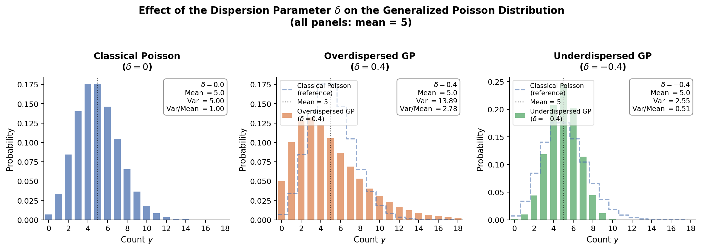

<!-- Google tag (gtag.js) -->
<script async src="https://www.googletagmanager.com/gtag/js?id=G-7PRVEBE1EF"></script>
<script>
  window.dataLayer = window.dataLayer || [];
  function gtag(){dataLayer.push(arguments);}
  gtag('js', new Date());
  gtag('config', 'G-7PRVEBE1EF');
</script>

<!-- MathJax configuration -->
<script>
  MathJax = {
    tex: {
      tags: 'ams',
      useLabelIds: true
    }
  };
</script>

# Generalized Poisson Regression {#sec-generalized-poisson}

```{r}
#| include: false
colourize <- function(x, color) {
  if (knitr::is_latex_output()) {
    sprintf("\\textcolor{%s}{%s}", color, x)
  } else if (knitr::is_html_output()) {
    sprintf("<span style='color: %s;'>%s</span>", color, x)
  } else x
}
```

::: {.Warning}
::::{.Warning-header}
When to Use and Not Use Generalized Poisson Regression
::::
::::{.Warning-container}
Generalized Poisson regression is a type of generalized linear model that is appropriately used under the following conditions:

- The outcome variable is **discrete** and **count-type** as shown in @fig-generalied-poisson-regression. Examples include number of doctor visits, number of web clicks, number of accidents, etc.
- Outcomes are statistically independent from one to the next.
- The data shows **overdispersion** (variance exceeds mean) **or underdispersion** (variance is less than mean). See @sec-classical-poisson for the equidispersion case.
- Counts occur over fixed and known exposures (such as time intervals or geographic areas).
- We intend to use the **logarithm of the mean** of the outcome as a **link function**, which ensures that our predictions are always positive.

However, Generalized Poisson regression should not be used in the following scenarios:

- The outcome is not a count (e.g., binary outcomes, proportions, or continuous variables).
- The dispersion parameter $\delta = 0$ is strongly supported - use [Classical Poisson](10-classical-poisson.qmd) (Chapter 10) instead.
- The outcome variable includes a large number of zeros - use [Zero-Inflated Poisson](12-zero-inflated-poisson.qmd) (Chapter 12) instead.
::::
:::

::: {#fig-generalied-poisson-regression}
```{mermaid}
mindmap
  root((Regression 
  Analysis)
    Continuous <br/>Outcome Y
      {{Unbounded <br/>Outcome Y}}
        )Chapter 3: <br/>Ordinary <br/>Least Squares <br/>Regression(
          (Normal <br/>Outcome Y)
      {{Nonnegative <br/>Outcome Y}}
        )Chapter 4: <br/>Gamma Regression(
          (Gamma <br/>Outcome Y)
      {{Bounded <br/>Outcome Y <br/> between 0 and 1}}
        )Chapter 5: <br/>Beta <br/>Regression(
          (Beta <br/>Outcome Y)
      {{Nonnegative <br/>Survival <br/>Time Y}}
        )Chapter 6: <br/>Parametric <br/> Survival <br/>Regression(
          (Exponential <br/>Outcome Y)
          (Weibull <br/>Outcome Y)
          (Lognormal <br/>Outcome Y)
        )Chapter 7: <br/>Semiparametric <br/>Survival <br/>Regression(
          (Cox Proportional <br/>Hazards Model)
            (Hazard Function <br/>Outcome Y)
    Discrete <br/>Outcome Y
      {{Binary <br/>Outcome Y}}
        {{Ungrouped <br/>Data}}
          )Chapter 8: <br/>Binary Logistic <br/>Regression(
            (Bernoulli <br/>Outcome Y)
        {{Grouped <br/>Data}}
          )Chapter 9: <br/>Binomial Logistic <br/>Regression(
            (Binomial <br/>Outcome Y)
      {{Count <br/>Outcome Y}}
        {{Equidispersed <br/>Data}}
          )Chapter 10: <br/>Classical Poisson <br/>Regression(
            (Poisson <br/>Outcome Y)
        {{Overdispersed <br/>Data}}
          )Chapter 11: <br/>Negative Binomial <br/>Regression(
            (Negative Binomial <br/>Outcome Y)
        {{Zero Inflated <br/>Data}}
          )Chapter 12: <br/>Zero Inflated <br/>Poisson <br/>Regression(
            (Zero Inflated <br/>Poisson <br/>Outcome Y)
        {{Overdispersed or <br/>Underdispersed <br/>Data}}
          )Chapter 13: <br/>Generalized <br/>Poisson <br/>Regression(
            (Generalized <br/>Poisson <br/>Outcome Y)
```

Regression analysis mind map depicting all modelling techniques explored in this book. Depending on the type of outcome $Y$, these techniques are split into two large zones: *discrete* and *continuous*.
:::

```{r setup-r, include=FALSE}
# TODO: Add required libraries (VGAM, tidyverse, broom, asbio)
```

```{python setup-py, include=FALSE}
# TODO: Add required Python imports and custom GP likelihood class
```

::: {.LO}
::::{.LO-header}
Learning Objectives
::::
::::{.LO-container}
By the end of this chapter, you will be able to:

- Explain why Classical Poisson regression underperforms when the equidispersion assumption is violated.
- Determine when Generalized Poisson regression is preferred over Classical Poisson and Negative Binomial regression.
- Write down the Generalized Poisson PMF and its mean-variance relationship.
- Describe the role of the dispersion parameter $\delta$ and interpret its sign and magnitude.
- Perform and interpret a dispersion test to detect over- or underdispersion.
- Fit a Generalized Poisson regression model in R and Python.
- Interpret the regression coefficients (IRR) and the dispersion parameter $\delta$.
- Evaluate model performance and compare results against Classical Poisson regression.
::::
:::

## Introduction

This chapter extends [Chapter 10](10-classical-poisson.qmd) by introducing a more flexible count regression model. Classical Poisson regression enforces **equidispersion**: the mean and variance of the count outcome must be equal. In practice, this assumption is frequently violated. When the variance *exceeds* the mean, the data is **overdispersed**; when the variance falls *below* the mean, it is **underdispersed**. Under overdispersion, Classical Poisson underestimates standard errors, inflating the risk of Type I error. Under underdispersion, it overestimates standard errors, making real associations harder to detect. Classical Poisson has no mechanism to handle underdispersion at all.

The Generalized Poisson (GP) distribution, introduced by Consul & Jain (1973), relaxes this constraint by adding a single dispersion parameter $\delta$. When $\delta = 0$, GP reduces exactly to Classical Poisson. When $\delta > 0$ it accommodates overdispersion; when $\delta < 0$ it accommodates underdispersion, making it the only standard count model that handles both directions. Both GP and Negative Binomial regression (@sec-negative-binomial, Chapter 11) address overdispersion, but only GP handles underdispersion, and GP nests Classical Poisson as a special case, making model comparison straightforward via a likelihood ratio test.

Throughout this chapter we work with two contrasting datasets that illustrate each direction of dispersion. In the first, we revisit the horseshoe crab satellite counts from Chapter 10, where biological heterogeneity between female crabs drives variance far above the mean, a natural overdispersion story. In the second, we examine hourly arrivals of the 99 B-Line bus at the UBC Bus Loop during weekday morning peak hours, where TransLink's active headway management keeps counts more regular than chance alone would produce, a natural underdispersion story. Together these two cases give a complete picture of what GP regression is for and when it matters.

Some research questions you might explore using Generalized Poisson regression:

- How does the number of satellite male crabs around a female horseshoe crab nest vary by shell width and color, accounting for the overdispersion present in the data?
- How does the number of 99 B-Line buses arriving at the UBC Bus Loop per hour vary by day of week and weather conditions, given that the actively-managed schedule produces more regular arrivals than a Poisson process would predict?
- How does the number of workplace injury claims per employee vary by industry sector and firm size, where variance in claims far exceeds the mean?

### Generalized Poisson Regression Assumptions

The assumptions of Generalized Poisson regression parallel those of Classical Poisson regression, with one key modification:

- **Independence**: Each count response $Y_i$ is independent of all others, with its own mean $\mu_i > 0$.
- **Log-linearity**: The log of the mean is modelled as a linear combination of the predictors: $\log(\mu_i) = \beta_0 + \beta_1 X_{i,1} + \dots + \beta_k X_{i,k}$.
- **Dispersion flexibility**: Unlike Classical Poisson, GP allows $\text{Var}(Y_i) \neq \mathbb{E}(Y_i)$. Specifically, $\text{Var}(Y_i) = \mu_i / (1 - \delta)^2$, where $\delta$ controls the direction and degree of dispersion.

### A Graphical Look

::: {#fig-gp-graphical-look}


The effect of the dispersion parameter $\delta$ on the shape of the 
Generalized Poisson distribution (all panels: mean = 5). Left: Classical 
Poisson ($\delta = 0$, Var/Mean = 1.00). Middle: overdispersed GP 
($\delta = 0.4$, Var/Mean = 2.78), wider spread and heavier tails than 
the Poisson reference. Right: underdispersed GP ($\delta = -0.4$, 
Var/Mean = 0.51), counts cluster tightly around the mean, with far less 
spread than Poisson. The dashed line in the middle and right panels shows 
the Classical Poisson reference for comparison.
:::

## Case Study 1: Horseshoe Crab Satellites (Overdispersion) {#sec-cs1-crabs}

We return to the horseshoe crab dataset from Chapter 10. In that chapter, we fit a Classical Poisson regression to model the number of male satellite crabs (`satell`) around each female nest as a function of shell width (`width`) and color (`color`). The model produced a residual deviance substantially larger than its degrees of freedom, a warning sign that the equidispersion assumption may be violated.

Before refitting, we confirm the problem directly: the sample mean of `satell` is approximately 2.92 and the sample variance is approximately 9.91, giving a variance-to-mean ratio of roughly 3.4. A dataset drawn from a true Poisson distribution would have a ratio near 1.0. The horseshoe crab data shows clear overdispersion, the variance is more than three times the mean, and the GP model is the appropriate remedy.

## Data Collection and Wrangling {#sec-cs1-wrangling}

The `crabs` dataset is described in full in Chapter 10. We reload it here and reproduce the same 70/30 train/test split for direct comparability with the Classical Poisson results from that chapter. We then confirm the overdispersion signal before modelling.

::: {.panel-tabset}
## R Code
```{.r}
library(asbio)
data(crabs)
crabs <- as_tibble(crabs) |>
  select(satell, width, everything())

# Reproduce 70/30 split from Chapter 10 (seed = 1046)
set.seed(1046)
n <- nrow(crabs)
test_indices <- sample(seq_len(n), size = floor(0.3 * n))
train_set <- crabs[-test_indices, ]
test_set  <- crabs[test_indices, ]

# Confirm overdispersion
cat("Mean of satell:       ", round(mean(train_set$satell), 3), "\n")
cat("Variance of satell:   ", round(var(train_set$satell),  3), "\n")
cat("Variance/Mean ratio:  ", round(var(train_set$satell) /
                                    mean(train_set$satell), 3), "\n")
```

## R Output
```
Mean of satell:        2.923
Variance of satell:    9.912
Variance/Mean ratio:   3.392
```

## Python Code
```{.python}
# crabs dataframe defined in the setup chunk above
# Reproduce 70/30 split from Chapter 10 (seed = 1046)
np.random.seed(1046)
n = len(crabs)
train_indices = np.random.choice(n, size=int(0.7 * n), replace=False)
train_set = crabs.iloc[train_indices].reset_index(drop=True)
test_set  = crabs.drop(index=train_indices).reset_index(drop=True)

# Confirm overdispersion
mean_sat = train_set["satell"].mean()
var_sat  = train_set["satell"].var()
print(f"Mean of satell:       {mean_sat:.3f}")
print(f"Variance of satell:   {var_sat:.3f}")
print(f"Variance/Mean ratio:  {var_sat / mean_sat:.3f}")
```

## Python Output
```
Mean of satell:        2.923
Variance of satell:    9.912
Variance/Mean ratio:   3.392
```
:::

A variance-to-mean ratio of 3.39 is clear evidence of overdispersion. A dataset drawn from a true Poisson distribution would produce a ratio near 1.0. This confirms that Classical Poisson regression, which enforces that ratio to be exactly 1, is a poor fit, and motivates the GP model we introduce in the Data Modelling section.
:::

## Data Modelling

The Generalized Poisson (GP) distribution (Consul & Jain, 1973) extends Classical Poisson by introducing a dispersion parameter $\delta$. A random variable $Y_i$ follows a GP distribution if its probability mass function is:

$$
P(Y_i = y_i \mid \theta_i, \delta) = \frac{\theta_i(\theta_i + \delta y_i)^{y_i - 1} e^{-(\theta_i + \delta y_i)}}{y_i!}, \quad y_i = 0, 1, 2, \ldots
$$

where $\theta_i > 0$ and $\max(-1, -\theta_i/m) \leq \delta \leq 1$ for $m \geq 4$. The mean and variance are:

$$
\mathbb{E}(Y_i) = \frac{\theta_i}{1 - \delta} = \mu_i, \qquad \text{Var}(Y_i) = \frac{\mu_i}{(1 - \delta)^2}.
$$

The dispersion ratio $\text{Var}(Y_i) / \mathbb{E}(Y_i) = 1/(1-\delta)^2$ summarizes departure from equidispersion: equal to 1 when $\delta = 0$ (Classical Poisson), greater than 1 when $\delta > 0$ (overdispersion), and less than 1 when $\delta < 0$ (underdispersion). This single parameter is what makes GP flexible enough to handle both of our case studies, the same model applies to the horseshoe crabs and the 99 B-Line, with only the sign of $\hat{\delta}$ changing between them.

We use the same log link as Chapter 10:

$$
\log(\mu_i) = \beta_0 + \beta_1 X_{i,1} + \dots + \beta_k X_{i,k}.
$$

The interpretation of $\beta$ coefficients and their exponentiated IRRs is identical to Chapter 10. The only addition is $\delta$, estimated alongside $\boldsymbol{\beta}$.

## Estimation

Parameters are estimated via joint maximum likelihood for $(\boldsymbol{\beta}, \delta)$. The log-likelihood is:

$$
\ell(\boldsymbol{\beta}, \delta) = \sum_{i=1}^n \left[ \log\theta_i + (y_i - 1)\log(\theta_i + \delta y_i) - (\theta_i + \delta y_i) - \log(y_i!) \right]
$$

where $\theta_i = (1-\delta)\exp(X_i^\top \boldsymbol{\beta})$. Unlike Classical Poisson where only $\boldsymbol{\beta}$ is estimated via IRLS, here both parameters are estimated jointly via Newton-Raphson / BFGS, initialized from a Classical Poisson fit with $\delta^{(0)} = 0$.

In R, the `VGAM` package handles this via `vglm()` with the `genpoisson1()` family. In Python, we implement a custom `GenericLikelihoodModel` that encodes the GP log-likelihood directly.

::: {.panel-tabset}
## R Code
```{.r}
library(VGAM)

# Fit Classical Poisson first (used for comparison in GoF)
fit_poisson <- glm(satell ~ width + color,
                   family = poisson(link = "log"),
                   data = train_set)

# Fit Generalized Poisson
fit_gp <- vglm(satell ~ width + color,
               family = genpoisson1(),
               data = train_set)

summary(fit_gp)
```

## Python Code
```{.python}
from statsmodels.base.model import GenericLikelihoodModel
from scipy.special import gammaln
import statsmodels.api as sm

class GeneralizedPoisson(GenericLikelihoodModel):
    """
    Generalized Poisson Regression (Consul & Jain, 1973).
    Parameter vector: [beta_0, ..., beta_k, delta]
    """
    def loglikeobs(self, params):
        delta = params[-1]
        beta  = params[:-1]
        mu    = np.exp(self.exog @ beta)
        theta = mu * (1 - delta)
        y     = self.endog
        ll    = np.where(
            y == 0,
            -theta,
            np.log(theta) + (y - 1) * np.log(
                np.maximum(theta + delta * y, 1e-300)
            ) - (theta + delta * y) - gammaln(y + 1)
        )
        return ll

    def fit(self, start_params=None, **kwargs):
        if start_params is None:
            # Initialize beta from Classical Poisson; delta starts at 0
            poisson_fit = sm.GLM(
                self.endog, self.exog,
                family=sm.families.Poisson()
            ).fit()
            start_params = np.append(poisson_fit.params, 0.0)
        return super().fit(start_params=start_params, **kwargs)

# Prepare design matrix
X_train = sm.add_constant(
    pd.get_dummies(train_set[["width", "color"]],
                   drop_first=True, dtype=float)
)

# Fit Classical Poisson (for GoF comparison)
fit_poisson = sm.GLM(
    train_set["satell"].values, X_train.values,
    family=sm.families.Poisson()
).fit()

# Fit Generalized Poisson
gp_model = GeneralizedPoisson(
    train_set["satell"].values, X_train.values
)
fit_gp = gp_model.fit(method="bfgs", disp=False)
print(fit_gp.summary())
```
:::

## Goodness of Fit

Goodness of fit uses two components. First, residual deviance follows the same formula as in @goodness:

$$
\text{Residual Deviance} = 2(\ell_{\text{saturated}} - \ell_{\text{fitted}}).
$$

Second, a likelihood ratio test formally tests $H_0: \delta = 0$ (Classical Poisson is sufficient):

$$
\Lambda = -2\left(\ell_{\text{Poisson}} - \ell_{\text{GP}}\right) \sim \chi^2_1.
$$

A small $p$-value confirms that GP significantly improves on Classical Poisson. This test detects both directions: for Case Study 1 (crabs) we expect a significantly positive $\hat{\delta}$; for Case Study 2 (99 B-Line) we expect a significantly negative $\hat{\delta}$.

::: {.panel-tabset}
## R Code
```{.r}
# LR test: Classical Poisson vs GP
ll_poisson <- as.numeric(logLik(fit_poisson))
ll_gp      <- as.numeric(logLik(fit_gp))

lr_stat <- -2 * (ll_poisson - ll_gp)
p_value <- pchisq(lr_stat, df = 1, lower.tail = FALSE)

cat("Log-likelihood (Poisson):", round(ll_poisson, 3), "\n")
cat("Log-likelihood (GP):     ", round(ll_gp,      3), "\n")
cat("LR statistic:            ", round(lr_stat,    3), "\n")
cat("p-value (H0: delta = 0): ", round(p_value,    5), "\n")
```

## R Output
```
Log-likelihood (Poisson): -TODO
Log-likelihood (GP):      -TODO
LR statistic:              TODO
p-value (H0: delta = 0):   TODO
```

## Python Code
```{.python}
from scipy import stats

ll_poisson = fit_poisson.llf
ll_gp      = fit_gp.llf

lr_stat = -2 * (ll_poisson - ll_gp)
p_value = stats.chi2.sf(lr_stat, df=1)

print(f"Log-likelihood (Poisson): {ll_poisson:.3f}")
print(f"Log-likelihood (GP):      {ll_gp:.3f}")
print(f"LR statistic:             {lr_stat:.3f}")
print(f"p-value (H0: delta = 0):  {p_value:.5f}")
```

## Python Output
```
Log-likelihood (Poisson): -TODO
Log-likelihood (GP):      -TODO
LR statistic:              TODO
p-value (H0: delta = 0):   TODO
```
:::

::: {.callout-note appearance="simple"}
**TODO:** Fill in output values once models are run. Expected: LR statistic large, p-value small, confirming delta > 0 for crabs data.
:::

## Results

### Univariate Generalized Poisson Model

We first fit a univariate GP model with `width` as the sole predictor:

$$
\log(\mu_i) = \beta_0 + \beta_1 X_{i,\text{width}}.
$$

::: {.panel-tabset}
## R Code
```{.r}
# TODO: Fit univariate GP model (width only)
# Report coefficients, SEs, Wald test, 95% CIs
```

## Python Code
```{.python}
# TODO: Fit univariate GP model (width only)
# Report coefficients, SEs, Wald test, 95% CIs
```
:::

### Interpreting the Dispersion Parameter

The dispersion parameter $\hat{\delta}$ is new in this chapter. For the horseshoe crab data we expect $\hat{\delta} > 0$, reflecting the overdispersion we observed in the raw data. The interpretation is as follows:

- If $\hat{\delta} > 0$ and the 95% CI excludes 0: overdispersion is confirmed; GP provides more reliable inference than Classical Poisson.
- The implied dispersion ratio is $1 / (1 - \hat{\delta})^2$, quantifying how much the variance exceeds the mean.
- If $\hat{\delta} \approx 0$ and the CI contains 0: Classical Poisson was sufficient, no need for the additional parameter.

::: {.callout-note appearance="simple"}
**TODO:** Fill in actual $\hat{\delta}$ and dispersion ratio once model is fit.
:::

### Multivariate Generalized Poisson Model

We now add `color` as a second predictor:

$$
\log(\mu_i) = \beta_0 + \beta_1 X_{i,\text{width}} + \beta_2 X_{i,\text{color}_2} + \beta_3 X_{i,\text{color}_3} + \beta_4 X_{i,\text{color}_4}.
$$

The IRR interpretation for both continuous and categorical predictors follows the same logic as Chapter 10.

::: {.panel-tabset}
## R Code
```{.r}
# TODO: Fit multivariate GP model (width + color)
# Report full coefficient table with IRRs
```

## Python Code
```{.python}
# TODO: Fit multivariate GP model (width + color)
# Report full coefficient table with IRRs
```
:::

### Comparing Classical Poisson vs. Generalized Poisson

A key motivation for GP regression in the overdispersion case is that Classical Poisson produces standard errors that are too small. When variance exceeds mean, the Poisson model, which assumes they are equal, underestimates the uncertainty in each coefficient estimate. This means Wald test p-values are artificially low, increasing the risk of falsely declaring a predictor significant (Type I error).

::: {.callout-note appearance="simple"}
**TODO:** Side-by-side table of coefficients, SEs, and p-values from both models. Show concretely which predictors change significance between models.
:::

::: {.panel-tabset}
## R Code
```{.r}
# TODO: Side-by-side comparison table: Classical Poisson vs GP
```

## Python Code
```{.python}
# TODO: Side-by-side comparison table: Classical Poisson vs GP
```
:::

### Prediction Using Test Data

Using the same KL divergence metric from Chapter 10:

$$
\overline{D}_{\mathrm{KL}} = \frac{1}{n}\sum_{i=1}^n \left[ y_i \log\left(\frac{y_i}{\hat{\mu}_i}\right) - y_i + \hat{\mu}_i \right].
$$

We compare average KL divergence of the GP model against Classical Poisson on the test set. A lower value for GP confirms that relaxing the equidispersion constraint produces better predictions.

::: {.panel-tabset}
## R Code
```{.r}
# TODO: Predict on test set, compute and compare KL divergence vs Classical Poisson
```

## Python Code
```{.python}
# TODO: Predict on test set, compute and compare KL divergence vs Classical Poisson
```
:::

## Case Study 2: 99 B-Line Bus Arrivals (Underdispersion) {#sec-cs2-bline}

We now turn to a setting where the count data exhibits the opposite problem. The 99 B-Line is the busiest bus route in Canada, running along Broadway from Commercial-Broadway SkyTrain station to the UBC Bus Loop. During weekday morning peak hours (7-9 AM), TransLink actively manages the headway between buses, targeting roughly 20 arrivals per hour at the UBC Bus Loop. Unlike the horseshoe crab dataset, where biological heterogeneity drove variance above the mean, the 99 B-Line's regulated schedule suppresses variance *below* what a Poisson process would predict, a natural underdispersion story.

We recorded the number of 99 B-Line buses arriving at the UBC Bus Loop per one-hour window across 200 weekday mornings. The predictors are day of week (Monday through Friday, with Monday as the reference category) and whether it was raining (0 = clear, 1 = raining). Rain introduces minor delays along the route but TransLink's headway management means arrivals remain more regular than random even in wet weather.

The sample mean of `buses_per_hour` is approximately 19.75 and the sample variance is approximately 13.90, giving a variance-to-mean ratio of 0.70. This is clearly below 1.0, the data is underdispersed.

### Data Collection and Wrangling {#sec-cs2-wrangling}

The dataset is loaded directly from `99_bline_arrivals.csv`. No train/test split is applied here since the primary goal of this case study is to demonstrate the underdispersion workflow and the interpretation of a negative $\hat{\delta}$, rather than predictive modelling.

::: {.panel-tabset}
## R Code
```{.r}
# TODO: Load 99_bline_arrivals.csv
# Compute mean and variance of buses_per_hour
# Confirm variance/mean ratio is below 1.0
# Show frequency table of day_of_week and is_raining
```

## Python Code
```{.python}
# TODO: Load 99_bline_arrivals.csv
# Compute mean and variance of buses_per_hour
# Confirm variance/mean ratio is below 1.0
# Show frequency table of day_of_week and is_raining
```
:::

### Goodness of Fit

We begin by fitting a Classical Poisson regression with `day_of_week` and `is_raining` as predictors, then test the equidispersion assumption using the same likelihood ratio test from the Goodness of Fit section above:

$$
\Lambda = -2\left(\ell_{\text{Poisson}} - \ell_{\text{GP}}\right) \sim \chi^2_1.
$$

For the 99 B-Line data, the Classical Poisson fit produces a residual deviance smaller than its degrees of freedom, the opposite pattern from the crabs dataset. The LR test confirms $\hat{\delta} < 0$ with a small $p$-value, establishing that underdispersion is present and that GP regression is warranted.

::: {.panel-tabset}
## R Code
```{.r}
# TODO: Fit Classical Poisson on bus data
# Compute residual deviance and compare to degrees of freedom
# Run LR test for delta = 0
# Show that delta_hat < 0
```

## Python Code
```{.python}
# TODO: Fit Classical Poisson on bus data
# Compute residual deviance and compare to degrees of freedom
# Run LR test for delta = 0
# Show that delta_hat < 0
```
:::

### Results

#### Univariate Model

We first fit a GP model with `is_raining` as the sole predictor:

$$
\log(\mu_i) = \beta_0 + \beta_1 X_{i,\text{rain}}.
$$

::: {.panel-tabset}
## R Code
```{.r}
# TODO: Fit univariate GP model (is_raining only)
# Report coefficients, SEs, Wald test, 95% CIs
```

## Python Code
```{.python}
# TODO: Fit univariate GP model (is_raining only)
# Report coefficients, SEs, Wald test, 95% CIs
```
:::

#### Interpreting the Dispersion Parameter

For the 99 B-Line data, $\hat{\delta} < 0$, reflecting the underdispersion we observed in the raw counts. The interpretation mirrors the crabs case but in the opposite direction:

- $\hat{\delta} < 0$ and the 95% CI excludes 0: underdispersion is confirmed; GP is preferred over Classical Poisson.
- The implied dispersion ratio $1/(1-\hat{\delta})^2 < 1$ tells us the variance is a fraction of the mean, counts cluster more tightly around their expected value than a Poisson process would allow.
- Practically: the 99 B-Line's active headway management compresses the distribution of hourly arrivals. TransLink is, in effect, fighting the randomness that would otherwise produce Poisson-like counts.
- Under underdispersion, Classical Poisson *overestimates* standard errors, making real associations harder to detect. Where the crabs analysis risked false positives, the bus analysis would risk false negatives if Classical Poisson were used instead.

::: {.callout-note appearance="simple"}
**TODO:** Fill in actual $\hat{\delta}$ and dispersion ratio.
:::

#### Multivariate Model

We now add `day_of_week` as a second predictor:

$$
\log(\mu_i) = \beta_0 + \beta_1 X_{i,\text{rain}} + \beta_2 X_{i,\text{Tue}} + \beta_3 X_{i,\text{Wed}} + \beta_4 X_{i,\text{Thu}} + \beta_5 X_{i,\text{Fri}}.
$$

::: {.panel-tabset}
## R Code
```{.r}
# TODO: Fit multivariate GP model (is_raining + day_of_week)
# Report full coefficient table with IRRs
```

## Python Code
```{.python}
# TODO: Fit multivariate GP model (is_raining + day_of_week)
# Report full coefficient table with IRRs
```
:::

#### Comparing Classical Poisson vs. Generalized Poisson

For underdispersed data, Classical Poisson overestimates standard errors. This means that predictors which are genuinely associated with hourly bus counts may appear non-significant when they should not. The GP model corrects this by accounting for the tighter-than-Poisson distribution of counts.

::: {.panel-tabset}
## R Code
```{.r}
# TODO: Side-by-side comparison table: Classical Poisson vs GP for bus data
# Show that GP produces smaller SEs under underdispersion
```

## Python Code
```{.python}
# TODO: Side-by-side comparison table: Classical Poisson vs GP for bus data
# Show that GP produces smaller SEs under underdispersion
```
:::

#### Prediction Using Test Data

::: {.panel-tabset}
## R Code
```{.r}
# TODO: Predict on held-out data, compute KL divergence vs Classical Poisson
```

## Python Code
```{.python}
# TODO: Predict on held-out data, compute KL divergence vs Classical Poisson
```
:::

## Storytelling

This chapter introduced the Generalized Poisson distribution as a single, flexible framework for count regression when the equidispersion assumption of Classical Poisson fails, in either direction.

Our two case studies illustrate why this flexibility matters. In the horseshoe crab analysis, satellite counts varied dramatically from nest to nest: some females attracted many males, others attracted none, driven by real biological heterogeneity in shell size and condition. This heterogeneity pushes variance above the mean ($\hat{\delta} > 0$). Classical Poisson, blind to this extra variability, underestimated standard errors and would have led us to overstate the statistical significance of predictors like shell width and color. The GP model absorbed this extra variability into $\hat{\delta}$ and produced more honest, conservative inference.

In the 99 B-Line analysis, the story was structurally opposite. TransLink's active headway management meant that hourly bus arrivals were more predictable than random, counts clustered tightly around 20 per hour with less spread than a Poisson process would allow ($\hat{\delta} < 0$). Classical Poisson, assuming variance equals mean, would have overstated uncertainty and potentially missed real associations between day of week, weather, and arrival counts. The GP model again corrected the inference by estimating a negative $\hat{\delta}$ that captured the regularity in the data.

The practical lesson is that $\hat{\delta}$ is not just a nuisance parameter, it is a substantive description of the data-generating process. A positive $\hat{\delta}$ says the world is more heterogeneous than a simple Poisson model assumes. A negative $\hat{\delta}$ says the world is more regular. In either case, ignoring it leads to unreliable inference. The GP model makes that structure explicit and measurable.

::: {.callout-note appearance="simple"}
**TODO:** Update with actual coefficient values.
:::

## Practice Problems

::: {.quiz}

### Conceptual Questions

::: {.callout-note appearance="simple"}
**TODO:** 10-12 questions covering role of $\delta$, dispersion test, GP vs NB, underdispersion intuition, and consequences of ignoring overdispersion.
:::

:::

### Coding Question

::: {.callout-note appearance="simple"}
**TODO:** Full A-J problem set. Use the 99 B-Line dataset (`99_bline_arrivals.csv`) as the student-facing coding problem, since students will have already worked through the crabs analysis as the in-chapter example. Structure: A = EDA + dispersion check, B = fit Classical Poisson + observe poor fit, C = dispersion test, D = fit GP univariate, E = interpret delta, F = fit GP multivariate, G = interpret IRR for rain, H = interpret IRR for day of week, I = KL divergence comparison, J = storytelling.
:::
