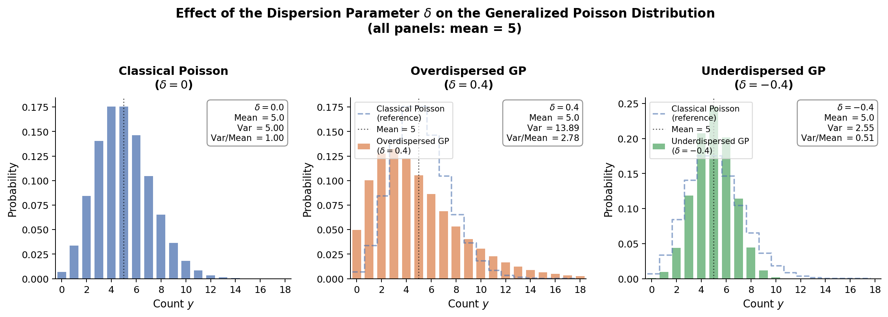

<!-- Google tag (gtag.js) -->
<script async src="https://www.googletagmanager.com/gtag/js?id=G-7PRVEBE1EF"></script>
<script>
  window.dataLayer = window.dataLayer || [];
  function gtag(){dataLayer.push(arguments);}
  gtag('js', new Date());
  gtag('config', 'G-7PRVEBE1EF');
</script>

<!-- MathJax configuration -->
<script>
  MathJax = {
    tex: {
      tags: 'ams',
      useLabelIds: true
    }
  };
</script>

# Generalized Poisson Regression {#sec-generalized-poisson}

```{r}
#| include: false
colourize <- function(x, color) {
  if (knitr::is_latex_output()) {
    sprintf("\\textcolor{%s}{%s}", color, x)
  } else if (knitr::is_html_output()) {
    sprintf("<span style='color: %s;'>%s</span>", color, x)
  } else x
}
```

::: {.Warning}
::::{.Warning-header}
When to Use and Not Use Generalized Poisson Regression
::::
::::{.Warning-container}
Generalized Poisson regression is a count-regression model for modelling **non-negative integer count outcomes** when the variability of the counts departs from what the Classical Poisson model allows. It is most appropriate when the response records how many times an event occurs for each observational unit and the counts are visibly **more or less variable** than their mean. Examples include the number of satellite males around a horseshoe crab nest, the number of workplace injury claims per employee, or the number of actively managed bus arrivals per hour at a transit stop.

Use Generalized Poisson regression when the following conditions are reasonable for the data and the modelling inquiry:

- The response variable is a **non-negative integer count**, as illustrated in @fig-generalized-poisson-regression.
- The scientific or data-science inquiry focuses on how the **expected count** changes with a set of regressors.
- The observations can be treated as **statistically independent**, or at least independent enough for the modelling purpose.
- The **expected count** is **positive** and can be connected to the regressors through the log link.
- The counts display **overdispersion** (variance exceeding the mean) **or underdispersion** (variance falling below the mean), making the equal mean–variance restriction of [Classical Poisson regression](#sec-classical-poisson) untenable.

Generalized Poisson regression should not be the default choice in the following situations:

- The response is **not a count**. Binary outcomes are usually better handled with [Binary Logistic regression](#sec-binary-logistic), proportions require their own modelling choices such as [Beta regression](#sec-beta), and continuous responses belong to other chapters of the cookbook (such as [Ordinary Least-squares](#sec-ols) or [Gamma](#sec-gamma) regressions).
- The counts are consistent with **equidispersion**, meaning their conditional variance is approximately equal to their conditional mean. In that case, the simpler [Classical Poisson regression](#sec-classical-poisson) is preferable, since the additional dispersion parameter is unnecessary.
- The overdispersion is driven by an **excess of zero counts** that a single count distribution cannot explain. In that case, [Zero-Inflated Poisson regression](#sec-zero-inflated-poisson) may be more appropriate.
- The observations exhibit **strong dependence or clustering** — for instance, repeated measurements on the same subjects or spatially correlated counts. In such cases, a generalized linear mixed model may be more appropriate because it can extend the generalized linear model framework with random effects for grouped or dependent observations; see, for example, @bolker2009 for a practical introduction to generalized linear mixed models in ecological and evolutionary applications.

In this chapter, we use Generalized Poisson regression as the cookbook's flexible count-regression model for data that are overdispersed **or** underdispersed. For counts that are only overdispersed, [Negative Binomial regression](#sec-negative-binomial) is another standard alternative; only the Generalized Poisson model handles both dispersion directions within a single distribution that nests Classical Poisson as a special case.
::::
:::

```{r setup-r, include=FALSE}
# Load required libraries
library(readr)
library(tibble)
library(tidyr)
library(dplyr)
library(magrittr)
library(ggplot2)
library(ggExtra)   # draw marginal histograms
library(gridExtra) # combine ggplot2 figures
library(broom)
library(knitr)
library(rsample) # canonical training/testing split
library(VGAM)    # Generalized Poisson fitting (overdispersed case)

library(reticulate)
py_config()

py_require("pandas")
py_require("numpy")
py_require("matplotlib")
py_require("statsmodels")
py_require("scipy")
py_require("plotnine")

pandas <- import("pandas")
numpy <- import("numpy")
matplotlib <- import("matplotlib")
statsmodels <- import("statsmodels")
scipy <- import("scipy")
plotnine <- import("plotnine")

options(htmlwidgets.TOJSON_ARGS = list(na = 'string'))

print_as_dt <- function(x){
  DT::datatable(x,
                rownames = FALSE,
                options = list(
                  dom = 'ltipr',
                  autoWidth = TRUE,
                  columnDefs = list(
                    list(className = 'dt-left', targets = "_all"),
                    list(width = '200px', targets = "_all")
                    )
                  )
                )
}

print_as_dt_all <- function(x){
  DT::datatable(
    x,
    rownames = FALSE,
    options = list(
      dom = 't',
      paging = FALSE,
      scrollX = TRUE,
      autoWidth = TRUE,
      columnDefs = list(
        list(className = 'dt-left', targets = "_all")
      )
    )
  )
}
```

```{python setup-py, include=FALSE}
import numpy as np
import pandas as pd
from plotnine import *
import statsmodels.api as sm
from statsmodels.formula.api import glm
from statsmodels.genmod.families import Poisson
from matplotlib import pyplot as plt
import scipy.stats as stats
from scipy.special import gammaln

def scrollable_table_html(data, **kwargs):
    kwargs.setdefault("index", False)
    kwargs.setdefault("border", 0)

    return (
        '<div class="table-responsive">'
        + data.to_html(
            **kwargs
        )
        + '</div>'
    )
```

::: {.LO}
::::{.LO-header}
Learning Objectives
::::
::::{.LO-container}
By the end of this chapter, you will be able to:

- Explain why Classical Poisson regression can fail when the **equidispersion** assumption is violated, in either direction.
- Determine when Generalized Poisson regression is an **appropriate modelling choice** relative to Classical Poisson, Negative Binomial, and Zero-Inflated Poisson alternatives.
- Frame **inferential** and **predictive inquiries** for a count-regression problem with overdispersed or underdispersed data using the **data science workflow**.
- Specify a Generalized Poisson regression model through its **random component**, its **systematic component**, and its **log link function**.
- Write and interpret the **Generalized Poisson probability mass function** and its **mean–variance relationship**, including the role of the dispersion parameter $\theta$.
- Explain how **maximum likelihood estimation** jointly estimates the regression coefficients and the dispersion parameter, and how the assumed variance structure drives model-based standard errors.
- Assess model adequacy with **observed-versus-fitted checks**, a **dispersion test**, a **zero-count check**, **residual deviance**, and **residual plots**, and formally test whether the dispersion parameter departs from zero.
- Interpret regression coefficients as **multiplicative changes in the expected count**, holding other regressors fixed, and interpret the estimated dispersion parameter through the implied variance-to-mean ratio.
- Evaluate **predictive performance** using held-out prediction metrics and a baseline comparison.
- Communicate Generalized Poisson regression results responsibly for both inferential and predictive inquiries.
::::
:::

## Introduction {#sec-generalized-poisson-introduction}

This chapter extends [Classical Poisson regression](#sec-classical-poisson) by introducing a more flexible count-regression model. Classical Poisson regression enforces **equidispersion**: the conditional mean and conditional variance of the count response must be equal. In practice, this assumption is frequently violated. When the variance *exceeds* the mean, the data are **overdispersed**; when the variance falls *below* the mean, they are **underdispersed**. Under overdispersion, Classical Poisson regression underestimates standard errors, inflating the risk of Type I error. Under underdispersion, it overestimates standard errors, making genuine associations harder to detect — and the model has no mechanism to represent underdispersion at all.

The Generalized Poisson (GP) distribution, introduced by @consul1973, relaxes this restriction by adding a single dispersion parameter $\theta$. When $\theta = 0$, the GP distribution reduces exactly to the Poisson distribution; when $\theta > 0$ it accommodates overdispersion; and when $\theta < 0$ it accommodates underdispersion. [Negative Binomial regression](#sec-negative-binomial) also addresses overdispersion, but only the GP model covers underdispersion as well, and because the Classical Poisson model is nested inside the GP family, the two models can be compared directly with a likelihood-ratio test.

Throughout this chapter, we revisit the horseshoe crab satellite counts from @sec-classical-poisson. In that chapter, the Classical Poisson goodness-of-fit checks signalled a problem with the crab data: the residual deviance was substantially larger than its degrees of freedom, and the mean–variance check showed clear overdispersion. Generalized Poisson regression is precisely the remedy this situation calls for, so the crab data give us a running case study with a concrete starting point — one fitted model whose adequacy failed, and one more flexible distribution that can absorb the extra variability. The opposite direction of failure, underdispersion, is harder to find in classic teaching datasets; we return to it in the practice exercises, where a second case study applies the complete workflow to hourly arrivals of the 99 B-Line bus at the UBC Bus Loop, counts that vary *less* than a Poisson process would allow.

@fig-generalized-poisson-regression situates Generalized Poisson regression within the regression techniques covered so far in this book: it is the count-regression model intended for count outcomes that are overdispersed **or** underdispersed.

::: {#fig-generalized-poisson-regression}
```{mermaid}
mindmap
  root((Regression
  Analysis)
    Continuous <br/>Outcome Y
      {{Unbounded <br/>Outcome Y}}
        )Chapter 3: <br/>Ordinary <br/>Least Squares <br/>Regression(
          (Normal <br/>Outcome Y)
      {{Nonnegative <br/>Outcome Y}}
        )Chapter 4: <br/>Gamma Regression(
          (Gamma <br/>Outcome Y)
      {{Bounded <br/>Outcome Y <br/> between 0 and 1}}
        )Chapter 5: <br/>Beta <br/>Regression(
          (Beta <br/>Outcome Y)
      {{Nonnegative <br/>Survival <br/>Time Y}}
        )Chapter 6: <br/>Parametric <br/> Survival <br/>Regression(
          (Exponential <br/>Outcome Y)
          (Weibull <br/>Outcome Y)
          (Lognormal <br/>Outcome Y)
        )Chapter 7: <br/>Semiparametric <br/>Survival <br/>Regression(
          (Cox Proportional <br/>Hazards Model)
            (Hazard Function <br/>Outcome Y)
    Discrete <br/>Outcome Y
      {{Binary <br/>Outcome Y}}
        {{Ungrouped <br/>Data}}
          )Chapter 8: <br/>Binary Logistic <br/>Regression(
            (Bernoulli <br/>Outcome Y)
        {{Grouped <br/>Data}}
          )Chapter 9: <br/>Binomial Logistic <br/>Regression(
            (Binomial <br/>Outcome Y)
      {{Count <br/>Outcome Y}}
        {{Equidispersed <br/>Data}}
          )Chapter 10: <br/>Classical Poisson <br/>Regression(
            (Poisson <br/>Outcome Y)
        {{Overdispersed <br/>Data}}
          )Chapter 11: <br/>Negative Binomial <br/>Regression(
            (Negative Binomial <br/>Outcome Y)
        {{Zero Inflated <br/>Data}}
          )Chapter 12: <br/>Zero Inflated <br/>Poisson <br/>Regression(
            (Zero Inflated <br/>Poisson <br/>Outcome Y)
        {{Overdispersed or <br/>Underdispersed <br/>Data}}
          )Chapter 13: <br/>Generalized <br/>Poisson <br/>Regression(
            (Generalized <br/>Poisson <br/>Outcome Y)
```

Regression analysis mind map depicting all modelling techniques explored so far in this book. Depending on the type of outcome $Y$, these techniques are split into two large zones: *discrete* and *continuous*.
:::

Some research questions you might explore using Generalized Poisson regression:

- How is the **expected number of satellite male crabs** around a female horseshoe crab nest associated with her shell width and colour, once the overdispersion in the counts is accounted for?
- How are **hourly bus arrival counts** associated with the day of the week and weather conditions when an actively managed schedule makes the counts more regular than a Poisson process would predict (developed in the practice exercises)?
- How is the **expected number of workplace injury claims per employee** associated with industry sector and firm size, when claim counts are far more variable than their mean?

### Generalized Poisson Regression Assumptions {#sec-generalized-poisson-assumptions}

The assumptions of Generalized Poisson regression parallel those of Classical Poisson regression, with one key modification:

- **Independence**: each count response $Y_i$ is independent of all the others, with its own positive expected count $\mu_i > 0$.
- **Log-linearity**: the log of the expected count is modelled as a linear combination of the regressors, $\log(\mu_i) = \beta_0 + \beta_1 x_{i,1} + \cdots + \beta_k x_{i,k}$.
- **Dispersion flexibility**: unlike the Classical Poisson model, the conditional variance need not equal the conditional mean. The GP model allows $\operatorname{Var}(Y_i) \neq \mathbb{E}(Y_i)$ through the relationship $\operatorname{Var}(Y_i) = \mu_i / (1 - \theta)^2$, where the dispersion parameter $\theta \in (-1, 1)$ controls the direction and magnitude of the departure from equidispersion.

### A Graphical Look {#sec-generalized-poisson-graphical-look}

Before developing the model formally, @fig-gp-graphical-look gives a visual preview of what the dispersion parameter $\theta$ does. Inspect the spread of each panel relative to the dashed Classical Poisson reference: the middle panel spreads probability mass further from the mean, while the right panel concentrates it more tightly.

::: {#fig-gp-graphical-look}


The effect of the dispersion parameter $\theta$ on the shape of the Generalized Poisson distribution (all panels: mean = 5). Left: Classical Poisson ($\theta = 0$, variance-to-mean ratio 1.00). Middle: overdispersed GP ($\theta = 0.4$, ratio 2.78), wider spread and heavier tails than the Poisson reference. Right: underdispersed GP ($\theta = -0.4$, ratio 0.51), counts cluster tightly around the mean with far less spread than the Poisson reference. The dashed line in the middle and right panels shows the Classical Poisson shape for comparison.
:::

### Documented Use Cases {#sec-generalized-poisson-use-cases}

Generalized Poisson regression and its close relatives are established tools for count data whose variability does not match the Poisson model. @tbl-generalized-poisson-use-cases summarizes several documented uses, from the distribution's methodological foundations to applied analyses. The side by side appearance of overdispersed and underdispersed applications is the point: a single model family covers both directions.

| Paper | Authors | Application area | Outcome variable | Substantive question | General method | Main modelling lesson |
|---|---|---|---|---|---|---|
| A Generalization of the Poisson Distribution [@consul1973] | P. C. Consul and G. C. Jain | Statistical theory | General integer counts | Can one two-parameter count distribution allow variance greater than, equal to, or smaller than the mean? | Derives the Generalized Poisson distribution as a generalization of the Poisson distribution | Introduces the dispersion parameter $\theta$, the source of the flexibility used throughout this chapter. |
| Generalized Poisson Distributions: Properties and Applications [@consul1989gp] | P. C. Consul | Statistical methodology | Count phenomena, including queueing and branching processes | What are the properties and applications of the GP family? | Systematic treatment of GP properties | Establishes the GP family as a defensible probability model, including the support truncation needed when $\theta < 0$. |
| Generalized Poisson Regression Model [@consul1992gpreg] | P. C. Consul and F. Famoye | Statistical methodology | Overdispersed and underdispersed count responses | How can regressors enter a GP mean while the dispersion parameter is estimated alongside them? | GP regression by maximum likelihood | The direct methodological basis of the model fitted in this chapter. |
| On the Generalized Poisson Regression Model with an Application to Accident Data [@famoye2004accidents] | F. Famoye, J. T. Wulu Jr., and K. P. Singh | Traffic and occupational safety | Number of accidents per subject | How are accident counts associated with demographic factors and driving habits? | GP regression compared with Classical Poisson regression | An applied overdispersion study in which the GP model fit accident counts better than the Poisson model. |
| A Flexible Regression Model for Count Data [@sellers2010flexible] | K. F. Sellers and G. Shmueli | Statistics and management science | Applied count responses, including underdispersed business counts | How should count regression handle data that are over- **or** underdispersed? | Conway–Maxwell–Poisson regression | Confirms that underdispersion arises in real data and motivates flexible count models such as the Generalized Poisson model used here. |

: Documented applied and methodological uses of Generalized Poisson regression and closely related flexible count models. {#tbl-generalized-poisson-use-cases .striped .hover}

As in @sec-classical-poisson, the remainder of the chapter follows the data science workflow: study design, data collection and wrangling, exploratory data analysis, data modelling, estimation, goodness of fit, results, and storytelling. We begin by returning to the horseshoe crab data and stating precisely what the analysis is meant to learn.

## Case Study: Horseshoe Crab Satellites {#sec-generalized-poisson-case-study}

The running case study in this chapter revisits the **horseshoe crab satellites** dataset introduced in @sec-classical-poisson. Each observational unit is one female horseshoe crab nest, and the response is the number of male **satellite** crabs residing around the nest. As before, the candidate regressors are observable characteristics of the female crab: her carapace width and weight, her colour category, and her spine condition.

Reusing the same dataset is deliberate. In @sec-classical-poisson, the extended Classical Poisson model for these data failed important goodness-of-fit checks: the residual deviance was substantially larger than its degrees of freedom, the Pearson dispersion estimate was well above one, and the observed zero counts exceeded what the fitted model expected. In other words, the crab counts are **overdispersed**, and the Chapter 10 conclusion pointed explicitly to more flexible count models — including the Generalized Poisson model of this chapter. Returning to the same data lets us ask a sharper question than "how does GP regression work?" It lets us ask: **does the extra dispersion parameter actually repair the adequacy failures of the Classical Poisson fit, and what changes in the inferential and predictive conclusions when it does?**

Because we already know the dataset well from @sec-classical-poisson, the case-study-specific introduction can be brief. The data remain secondary, observational data: no experiment was designed, no treatments were assigned, and no causal claims will be made. Associations between female crab characteristics and the expected number of satellite males will be described as associations, not effects.

## Study Design: Framing the Inferential and Predictive Inquiries {#sec-generalized-poisson-study-design}

Before fitting a Generalized Poisson regression model, we clarify what the model is supposed to help us learn. This is the **study design** stage of the data science workflow introduced in @sec-ds-workflow-study-design. At this stage, we are not yet choosing software functions or interpreting coefficients. Instead, we are defining the modelling purpose, the observational unit, the response variable, and the role of the regressors.

 via [*Pixabay*](https://pixabay.com/vectors/pixel-cells-pixel-action-bound-3704046/).](img/magnifying-glass-2.png){width="420"}

For the horseshoe crab case study, the study-design elements are summarized in @tbl-generalized-poisson-study-design-variables. This table fixes the basic modelling ingredients before we decide how the Generalized Poisson regression model will be used.

| **Role in the study design** | **Variable(s)** | **Description** |
|:---:|:---:|:---:|
| **Observational unit** | Female horseshoe crab | Each row corresponds to one female crab observed in the study. |
| **Response variable** | Number of satellite males | The count outcome: how many satellite males were observed near the female crab. |
| **Main regressors** | Body width, weight, colour category, spine condition | Observable characteristics of the female crab that may be associated with the expected number of satellite males. |

: Key elements of the horseshoe crab study design for the Generalized Poisson regression chapter. {#tbl-generalized-poisson-study-design-variables .striped .hover}

Note that a single dataset can support different kinds of modelling inquiries. Therefore, we will use the same count response to illustrate two related but distinct modelling purposes: an **inferential inquiry** and a **predictive inquiry**, as shown in @tbl-generalized-poisson-study-design-inquiries. This distinction is critical since the modelling workflow is not judged in exactly the same way for both purposes.

| **Inquiry type** | **Main question** | **Main modelling emphasis** | **What we will look for later in the chapter** |
|:---:|:---:|:---:|:---:|
| **Inferential inquiry** | How is the expected number of satellite males associated with female crab characteristics? | Coefficients, the dispersion parameter, uncertainty, hypothesis tests, confidence intervals, and interpretation. | Whether the estimated associations are meaningful, whether accounting for overdispersion changes the conclusions relative to Classical Poisson regression, and whether the model is adequate enough for its standard errors to be trustworthy. |
| **Predictive inquiry** | How well can the available regressors predict the expected number of satellite males for a female crab? | Predicted expected counts, test-set accuracy, and comparison against a simple baseline. | Whether the fitted Generalized Poisson model improves held-out predictive performance beyond a simple benchmark and beyond the Classical Poisson model. |

: Two modelling inquiries supported by the horseshoe crab satellites case study. {#tbl-generalized-poisson-study-design-inquiries .striped .hover}

The above inferential and predictive inquiries are connected but not interchangeable. Keeping them separate helps us decide which results belong in the inferential interpretation and which results belong in the prediction-accuracy discussion.

::: {.Heads-up}
:::: {.Heads-up-header}
Heads-up on inference versus prediction!
::::
:::: {.Heads-up-container}
For the inferential inquiry, the main object of interest is the relationship between the expected count and the regressors. We will pay attention to coefficient estimates, the estimated dispersion parameter, standard errors, confidence intervals, and hypothesis tests, together with the assumptions needed for the interpretation to be reasonable. Here, the model's variance assumption matters twice: it describes the data **and** it drives the model-based standard errors.

On the other hand, for the predictive inquiry, the main object of interest is how well the model predicts expected counts for observations not used to fit the model. We will therefore use a training/testing split, compute predicted expected counts on the testing set, compare prediction errors against a baseline model, and summarize prediction accuracy with metrics such as **mean absolute error (MAE)**, **root mean squared error (RMSE)**, and likelihood-based predictive scores.

Both inquiries require model checking. If the Generalized Poisson model fits the data poorly, then both the inferential interpretation and the predictive results become less useful.
::::
:::

### Inferential Inquiry {#sec-generalized-poisson-inferential-inquiry}

Specifically, the inferential inquiry asks — exactly as it did in @sec-classical-poisson:

> **How is the expected number of satellite males associated with female crab characteristics, holding other regressors fixed?**

The question is identical to Chapter 10 on purpose: we want to compare the two **model classes** on the same scientific footing. The question is about **association and interpretation**, not causation. The data are **observational**, and the case study does not establish a causal design. The inferential goal is to describe how the expected count of satellite males changes across observed female crab characteristics within a Generalized Poisson regression framework.

For this inquiry, the **results stage** will focus on coefficient estimates, the estimated dispersion parameter, uncertainty, and statistical interpretation. A central question is whether the conclusions from Chapter 10 — which relied on Poisson-based standard errors despite failed dispersion checks — survive once the variance assumption is relaxed.

### Predictive Inquiry {#sec-generalized-poisson-predictive-inquiry}

Now, the predictive inquiry asks:

> **How well can the available regressors be used to predict the expected number of satellite males for a female crab?**

This question is about **prediction accuracy**. The target of prediction in Generalized Poisson regression is the expected count, **not necessarily the exact observed count**. For a given female crab, the observed number of satellite males may differ from the model-predicted expected count because count outcomes are variable even when the model is well specified — and the Generalized Poisson model gives that variability an explicit, estimable size through its dispersion parameter.

For this inquiry, the **results stage** will focus on out-of-sample prediction. We will fit the model using a training set and evaluate prediction accuracy on a testing set. The testing-set predictions will be compared against a simple baseline that predicts the training-set mean count for every testing observation, and against the Classical Poisson fit using the same regressors. These comparisons are necessary because an accuracy metric is easier to interpret when we can ask whether the regression model does better than simple benchmarks.

## Data Collection and Wrangling {#sec-generalized-poisson-data-wrangling}

The data used in this chapter are **secondary observational data**. They were originally collected in the study by @brockmann1996 on satellite male groups in horseshoe crabs and later made available in a form commonly used in a textbook on categorical data and count regression [@agresti2013]. The version used here comes from [Agresti's public GitHub repository](https://github.com/alanagresti/categorical-data/blob/master/Crabs.dat) for categorical-data examples, exactly as in @sec-classical-poisson-data-wrangling, so that the two chapters analyse identical observations.

 via [*Pixabay*](https://pixabay.com/vectors/pixel-cells-evaluation-measure-up-3976303/).](img/measurement.png){width="450"}

According to the documentation for the teaching version of the dataset, each row corresponds to one female horseshoe crab [@agresti2013]. The variables record the female crab's colour, spine condition, carapace width, number of satellite males, and weight. The original data also include a binary indicator for whether at least one satellite male was present; our response variable is the **count** of satellite males, so the binary indicator is not the primary outcome.

Before doing EDA, we will complete a small amount of data wrangling (as shown in @fig-ds-workflow-data-collection-wrangling). The goal is not to create the training/testing split yet. As in the data science workflow from @sec-intro (more specifically in @sec-ds-workflow-eda), the data split belongs to the EDA stage because we first need to inspect the data structure and then decide how to separate observations for modelling and evaluation. In this section, we only load the data, rename variables, and prepare the categorical regressors so that they are easier to interpret later. The main variables used in the chapter are summarized in @tbl-generalized-poisson-wrangled-variables.

| **Variable after wrangling** | **Role** | **Description** |
|:---:|:---:|:---:|
| `satellites` | Response | Number of satellite males observed near the female crab. |
| `width_cm` | Regressor | Female crab carapace width, measured in centimetres. |
| `weight_kg` | Regressor | Female crab weight, measured in kilograms. |
| `color` | Regressor | Female crab colour category, treated as categorical. |
| `spine` | Regressor | Female crab spine condition, treated as categorical. |

: Main variables used after wrangling the horseshoe crab dataset. {#tbl-generalized-poisson-wrangled-variables .striped .hover}

The `R` and `Python` code below follow the same wrangling logic. First, the data are read from the public teaching data file associated with the categorical-data examples in @agresti2013. Second, the columns are assigned readable names. Third, the colour and spine variables are converted to categorical variables with descriptive labels. Finally, the dataset is restricted to the variables needed for this chapter. More specifically, we have the following:

- In `R`, via the packages part of [{tidyverse}](https://www.tidyverse.org), we read the raw data directly from Agresti's GitHub repository. The file already includes column names, so we let `read_table()` read the header. Then, we rename the columns needed for this chapter: `sat` becomes `satellites`, `width` becomes `width_cm`, and `weight` becomes `weight_kg`. The variables `color` and `spine` are stored as numeric codes in the raw file, so we convert them into categorical variables with descriptive labels.
- In `Python`, via [{pandas}](https://pypi.org/project/pandas/), we repeat the same wrangling steps. The file already includes column names, so `read_csv()` reads the header directly. Then, `rename()` gives the response and continuous regressors more explicit names. The `map()` calls replace the numeric colour and spine codes with descriptive labels, and the final selection keeps the working variables used in this chapter.

::: {.panel-tabset}

## **`R` Code**

``` {.r}
crabs_url <- paste0(
  "https://raw.githubusercontent.com/",
  "alanagresti/categorical-data/master/Crabs.dat"
)

crabs_raw <- read_table(crabs_url)

crabs <- crabs_raw |>
  transmute(
    satellites = sat,
    width_cm = width,
    weight_kg = weight,
    color = factor(
      color,
      levels = c(1, 2, 3, 4),
      labels = c(
        "Light",
        "Medium light",
        "Medium dark",
        "Dark"
      )
    ),
    spine = factor(
      spine,
      levels = c(1, 2, 3),
      labels = c(
        "Both good",
        "One worn or broken",
        "Both worn or broken"
      )
    )
  )
```

## **`Python` Code**

``` {.python}
crabs_url = (
    "https://raw.githubusercontent.com/"
    "alanagresti/categorical-data/master/Crabs.dat"
)

crabs_raw = pd.read_csv(
    crabs_url,
    sep=r"\s+"
)

color_labels = {
    1: "Light",
    2: "Medium light",
    3: "Medium dark",
    4: "Dark",
}

spine_labels = {
    1: "Both good",
    2: "One worn or broken",
    3: "Both worn or broken",
}

crabs = (
    crabs_raw
    .rename(
        columns={
            "sat": "satellites",
            "width": "width_cm",
            "weight": "weight_kg",
        }
    )
    .assign(
        color=lambda data_frame: data_frame["color"].map(color_labels),
        spine=lambda data_frame: data_frame["spine"].map(spine_labels),
    )
    [
        [
            "satellites",
            "width_cm",
            "weight_kg",
            "color",
            "spine",
        ]
    ]
)
```

:::

Both languages read the same raw file and apply the same recoding, so the two analyses start from identical observations. @tbl-generalized-poisson-crabs-data-r and @tbl-generalized-poisson-crabs-data-py display the wrangled dataset: the `R` tab shows the full dataset in a scrollable interactive table, while the `Python` tab shows the first ten rows.

::: {.panel-tabset}

## **`R` Output**

```{r}
#| label: tbl-generalized-poisson-crabs-data-r
#| tbl-cap: "Wrangled horseshoe crab data used in the Generalized Poisson regression analysis."
#| echo: false
#| message: false
crabs_url <- paste0(
  "https://raw.githubusercontent.com/",
  "alanagresti/categorical-data/master/Crabs.dat"
)
crabs_raw <- read_table(crabs_url, show_col_types = FALSE)
crabs <- crabs_raw |>
  transmute(
    satellites = sat,
    width_cm = width,
    weight_kg = weight,
    color = factor(color, levels = c(1, 2, 3, 4),
                   labels = c("Light", "Medium light", "Medium dark", "Dark")),
    spine = factor(spine, levels = c(1, 2, 3),
                   labels = c("Both good", "One worn or broken", "Both worn or broken"))
  )
crabs |>
  print_as_dt()
```

## **`Python` Output**

```{python}
#| echo: false
#| message: false
crabs_url = (
    "https://raw.githubusercontent.com/"
    "alanagresti/categorical-data/master/Crabs.dat"
)
crabs_raw = pd.read_csv(crabs_url, sep=r"\s+")
color_labels = {1: "Light", 2: "Medium light", 3: "Medium dark", 4: "Dark"}
spine_labels = {1: "Both good", 2: "One worn or broken", 3: "Both worn or broken"}
crabs = (
    crabs_raw
    .rename(columns={"sat": "satellites", "width": "width_cm", "weight": "weight_kg"})
    .assign(color=lambda data_frame: data_frame["color"].map(color_labels),
            spine=lambda data_frame: data_frame["spine"].map(spine_labels))
    [["satellites", "width_cm", "weight_kg", "color", "spine"]]
)
crabs_head_py_html = scrollable_table_html(crabs.head(10))
```

```{r}
#| echo: false
#| label: tbl-generalized-poisson-crabs-data-py
#| tbl-cap: "First ten rows of the wrangled horseshoe crab data (Python)."
#| message: false
#| results: asis
cat(
  "
",
  reticulate::py$crabs_head_py_html,
  "
",
  sep = ""
)
```

:::

Finally, @lst-generalized-poisson-data-checks-r and @lst-generalized-poisson-data-checks-py run the structural checks reported below: the dataset has 173 rows and 5 columns, there are no missing values, the response takes non-negative integer values from 0 to 15 with 62 zero counts, and the category counts show that `Light` (12 crabs) and `One worn or broken` (15 crabs) are small groups. The small `Light` category matters later: it is the reference category for `color`, so colour contrasts estimated against it will be comparatively imprecise. That is a reason for caution in interpretation, not a reason to delete observations.

::: {.panel-tabset}

## **`R`**

```{r}
#| echo: true
#| lst-label: lst-generalized-poisson-data-checks-r
#| lst-cap: "Code to check the structure of the wrangled horseshoe crab data."
#| message: false
# Dimensions and storage types
dim(crabs)
sapply(crabs, class)

# Missing values
sum(is.na(crabs))

# Category counts
table(crabs$color)
table(crabs$spine)

# Response range and zero counts
range(crabs$satellites)
sum(crabs$satellites == 0)
```

## **`Python`**

```{python}
#| echo: true
#| lst-label: lst-generalized-poisson-data-checks-py
#| lst-cap: "Code to check the structure of the wrangled horseshoe crab data."
#| message: false
# Dimensions and storage types
print(crabs.shape)
print(crabs.dtypes)

# Missing values
print("Missing values:", int(crabs.isna().sum().sum()))

# Category counts
print(crabs["color"].value_counts())
print(crabs["spine"].value_counts())

# Response range and zero counts
print("Range:", int(crabs["satellites"].min()), "to", int(crabs["satellites"].max()))
print("Zero counts:", int((crabs["satellites"] == 0).sum()))
```

:::

## Exploratory Data Analysis {#sec-generalized-poisson-eda}

With the data wrangled, we move to **exploratory data analysis** (as shown in @fig-ds-workflow-eda). The goal is to describe the data before modelling them: How are the satellite counts distributed? Is there descriptive evidence of overdispersion? Which regressors appear to be related to the response? Per the data science workflow, all EDA uses the **training data only**, so we first create the training/testing split.

We use the same canonical split as @sec-classical-poisson — a 50/50 simple random split with seed 123 — so that the training observations analysed in this chapter are exactly those analysed in the Classical Poisson chapter:

- @lst-generalized-poisson-data-splitting-r uses the [{rsample}](https://rsample.tidymodels.org/) package to split the wrangled `crabs` dataset into training and testing sets. The argument `prop = 0.5` requests that approximately half of the observations be assigned to the training set, with the rest assigned to the testing set. The sanity check prints the dimensions of both subsets and their observed proportion.
- In `Python`, we do not re-split the data. Per the book's cross-language convention, the `R`-generated split is the canonical one, and the next listing shows how the `Python` analysis imports it.

::: {.panel-tabset}

## **`R`**

```{r}
#| echo: true
#| lst-label: lst-generalized-poisson-data-splitting-r
#| lst-cap: "Code to randomly split the horseshoe crab data into training and testing sets."
#| message: false
#| warning: false
# Setting the seed for reproducible splitting
set.seed(123)

# Performing the 50/50 training/testing split
split <- initial_split(crabs, prop = 0.5)
training_data <- training(split)
testing_data <- testing(split)

# Sanity checks: dimensions and proportions
n_total <- nrow(crabs)
n_train <- nrow(training_data)
n_test  <- nrow(testing_data)

cat("Total observations:", n_total, "\n")
cat("Training observations:", n_train,
    "(", round(100 * n_train / n_total, 1), "%)\n")
cat("Testing observations:", n_test,
    "(", round(100 * n_test / n_total, 1), "%)\n")
```

:::

::: {.Tip}
:::: {.Tip-header}
Tip on the 50/50 split and more careful alternatives!
::::
:::: {.Tip-container}
This dataset contains only `r n_total` observations. A standard predictive modelling workflow often uses a larger training set, such as an 80/20 training/testing split. However, in this chapter we need to support two goals at the same time: an **inferential** inquiry and a **predictive** inquiry.

Using a 50/50 split is a compromise. It gives the training set enough observations for EDA, model fitting, and goodness-of-fit checking, while also leaving a testing set large enough to support both the final **predictive accuracy assessment** and the final **inferential refit**. This choice is not perfect. A larger training set would usually help estimation and diagnostics, while a larger testing set gives a more informative final assessment. With small datasets, we often have to choose between these inconveniences.

The 50/50 split used here is also a **simple random split**, which means it does not explicitly protect against imbalance across important variables. For example, if one female crab colour category or spine condition is rare, a simple random split could place too many of those crabs in one subset and too few in the other. That imbalance can affect both the inferential and predictive parts of the workflow.

A more careful split could stratify the data by an important categorical regressor, such as female crab colour, or by a coarser grouping of the response variable. Other strategies include repeated random splits, cross-validation, or bootstrap-based assessment. These approaches can reduce dependence on a single split and are widely used in predictive modelling and model validation; see @hastie2009, @kuhn2013, and @harrell2015 for broader discussions. The main chapter keeps a single 50/50 split so that the Generalized Poisson regression workflow remains transparent, and so that the results remain directly comparable with @sec-classical-poisson.
::::
:::

::: {.Heads-up}
:::: {.Heads-up-header}
Heads-up on keeping R and Python aligned after the split!
::::
:::: {.Heads-up-container}
Setting the same seed in `R` and `Python` does **not** guarantee the same observations in each subset: the two languages use different random-number generators and different splitting implementations. To keep genuine `R`/`Python` parity, we use the `R`-generated training and testing sets as a common reference. The listing below imports them into `Python` through the [{reticulate}](https://rstudio.github.io/reticulate/) package and restores the categorical data types and level ordering that the transfer would otherwise lose.
::::
:::

::: {.panel-tabset}

## **`Python`**

```{python}
#| echo: true
#| lst-label: lst-generalized-poisson-import-r-split-py
#| lst-cap: "Code to import the R-generated training and testing sets into Python."
#| message: false
# Importing R-generated training and testing sets via reticulate
training_data = r.training_data
testing_data = r.testing_data

# Ensuring categorical regressors are treated as categorical in Python
color_levels = ["Light", "Medium light", "Medium dark", "Dark"]
spine_levels = ["Both good", "One worn or broken", "Both worn or broken"]

training_data["color"] = pd.Categorical(
    training_data["color"], categories=color_levels, ordered=True
)
training_data["spine"] = pd.Categorical(
    training_data["spine"], categories=spine_levels, ordered=True
)
testing_data["color"] = pd.Categorical(
    testing_data["color"], categories=color_levels, ordered=True
)
testing_data["spine"] = pd.Categorical(
    testing_data["spine"], categories=spine_levels, ordered=True
)

# Sanity checks: sample sizes, and disjointness of the two splits
n_total_py = len(r.crabs)
print("Total observations:", n_total_py)
print("Training observations:", len(training_data))
print("Testing observations:", len(testing_data))
print(
    "Training + testing equals total:",
    len(training_data) + len(testing_data) == n_total_py,
)
```

:::

From this point until the **Results** section, everything — EDA plots, candidate model fitting, and all goodness-of-fit checks — uses `training_data` only. The testing set stays untouched until the final inferential refit and the final held-out predictive evaluation.

### Distribution of the Count Response {#sec-generalized-poisson-eda-response}

The first question is descriptive: how are the satellite counts distributed in the training data? @fig-generalized-poisson-eda-response-r and @fig-generalized-poisson-eda-response-py show the empirical distribution, and the accompanying tables report the training-set mean, variance, variance-to-mean ratio, and zero proportion.

::: {.panel-tabset}

## **`R`**

```{r}
#| echo: false
#| label: fig-generalized-poisson-eda-response-r
#| fig-cap: "Empirical distribution of satellite counts in the training data."
#| message: false
#| fig-width: 8
#| fig-height: 5
p_response <- ggplot(
  training_data,
  aes(x = factor(satellites))
) +
  geom_bar(fill = "steelblue4", color = "white") +
  labs(
    x = "Number of satellite males",
    y = "Number of female crabs"
  ) +
  theme_bw()
p_response
```

## **`Python`**

```{python}
#| echo: false
#| label: fig-generalized-poisson-eda-response-py
#| fig-cap: "Empirical distribution of satellite counts in the training data (Python)."
#| message: false
#| fig-width: 8
#| fig-height: 5
p_response_py = (
    ggplot(
        training_data.assign(
            satellites_factor=training_data["satellites"].astype("category")
        ),
        aes(x="satellites_factor"),
    )
    + geom_bar(fill="#36648B", color="white")
    + labs(x="Number of satellite males", y="Number of female crabs")
    + theme_bw()
)
p_response_py
```

:::

```{r}
#| echo: false
#| message: false
# Training-set response summaries used in prose and tables
resp_summ <- tibble(
  Quantity = c(
    "Number of female crabs",
    "Mean satellite count",
    "Variance of satellite counts",
    "Variance-to-mean ratio",
    "Zero counts",
    "Minimum",
    "Maximum"
  ),
  Value = c(
    nrow(training_data),
    round(mean(training_data$satellites), 3),
    round(var(training_data$satellites), 3),
    round(var(training_data$satellites) / mean(training_data$satellites), 3),
    sum(training_data$satellites == 0),
    min(training_data$satellites),
    max(training_data$satellites)
  )
)
resp_summ_py_html <- NULL
```

```{python}
#| echo: false
#| message: false
y_train = training_data["satellites"]
resp_summ_py = pd.DataFrame(
    {
        "Quantity": [
            "Number of female crabs",
            "Mean satellite count",
            "Variance of satellite counts",
            "Variance-to-mean ratio",
            "Zero counts",
            "Minimum",
            "Maximum",
        ],
        "Value": [
            len(y_train),
            round(y_train.mean(), 3),
            round(y_train.var(), 3),
            round(y_train.var() / y_train.mean(), 3),
            int((y_train == 0).sum()),
            int(y_train.min()),
            int(y_train.max()),
        ],
    }
)
resp_summ_py_html = scrollable_table_html(resp_summ_py)
```

::: {.panel-tabset}

## **`R` Output**

```{r}
#| echo: false
#| label: tbl-generalized-poisson-eda-response-r
#| tbl-cap: "Descriptive summaries of the satellite counts in the training data."
#| message: false
kable(resp_summ)
```

## **`Python` Output**

```{r}
#| echo: false
#| label: tbl-generalized-poisson-eda-response-py
#| tbl-cap: "Descriptive summaries of the satellite counts in the training data (Python)."
#| message: false
#| results: asis
cat(
  "
",
  reticulate::py$resp_summ_py_html,
  "
",
  sep = ""
)
```

:::

Three features stand out in the training data. First, the distribution is **right-skewed**, with many small counts and a few nests with many satellites. Second, `r sum(training_data$satellites == 0)` of the `r n_train` training crabs (about `r round(100 * sum(training_data$satellites == 0) / n_train)`%) have **zero satellites**, so the zero category is prominent. Third — and most important for this chapter — the sample variance (`r round(var(training_data$satellites), 2)`) is more than three times the sample mean (`r round(mean(training_data$satellites), 2)`), giving a variance-to-mean ratio of about `r round(var(training_data$satellites) / mean(training_data$satellites), 2)`.

::: {.Heads-up}
:::: {.Heads-up-header}
Heads-up on reading dispersion from raw summaries!
::::
:::: {.Heads-up-container}
The variance-to-mean ratio computed here is a **marginal** summary: it ignores the regressors completely. A ratio far from one is an early warning, not a verdict. Equidispersion is a **conditional** assumption about the distribution of $Y_i$ given the regressors included in the model. The training-stage dispersion diagnostics in @sec-generalized-poisson-gof are what actually check that assumption.

At the same time, a marginal ratio of `r round(var(training_data$satellites) / mean(training_data$satellites), 2)` is large enough that the Generalized Poisson model — explicitly designed for such departures — is the natural model to develop.
::::
:::

### Satellite Counts and Continuous Regressors {#sec-generalized-poisson-eda-continuous}

Next, is the response related to the two continuous regressors? Because counts are noisy, we follow the same device as @sec-classical-poisson: split each continuous regressor into intervals, compute the average satellite count per interval, and overlay those averages on the scatterplot. These binned averages are a **descriptive visual guide**, not the fitted regression model.

@fig-generalized-poisson-eda-width-r and @fig-generalized-poisson-eda-width-py show the relationship with `width_cm`; the pattern is an approximately monotone increase in the average satellite count as shell width grows.

::: {.panel-tabset}

## **`R`**

```{r}
#| echo: false
#| label: fig-generalized-poisson-eda-width-r
#| fig-cap: "Satellite counts versus female crab width (training data), with interval averages."
#| message: false
#| fig-width: 9
#| fig-height: 6
n_intervals <- 8
crabs_binned_width <- training_data |>
  mutate(width_bin = cut(width_cm, breaks = n_intervals)) |>
  group_by(width_bin) |>
  summarise(
    bin_centre = mean(width_cm),
    mean_sat = mean(satellites),
    n_obs = dplyr::n(),
    .groups = "drop"
  )
breaks_width <- seq(
  min(training_data$width_cm),
  max(training_data$width_cm),
  length.out = n_intervals + 1
)
p_width <- ggplot(training_data, aes(x = width_cm, y = satellites)) +
  geom_point(alpha = 0.6) +
  geom_vline(xintercept = breaks_width, linetype = "dashed", color = "gray50") +
  geom_point(
    data = crabs_binned_width,
    aes(x = bin_centre, y = mean_sat),
    color = "red", size = 2.5
  ) +
  geom_line(
    data = crabs_binned_width,
    aes(x = bin_centre, y = mean_sat),
    color = "red"
  ) +
  labs(
    x = "Carapace width (cm)",
    y = "Number of satellite males"
  ) +
  theme_bw()
p_width
```

## **`Python`**

```{python}
#| echo: false
#| label: fig-generalized-poisson-eda-width-py
#| fig-cap: "Satellite counts versus female crab width (training data), with interval averages (Python)."
#| message: false
#| fig-width: 9
#| fig-height: 6
n_intervals = 8
training_data["width_bin"] = pd.cut(training_data["width_cm"], bins=n_intervals)
binned_width_py = (
    training_data.groupby("width_bin", observed=False)
    .agg(
        bin_centre=("width_cm", "mean"),
        mean_sat=("satellites", "mean"),
        n_obs=("satellites", "size"),
    )
    .reset_index()
)
breaks_width_py = np.linspace(
    training_data["width_cm"].min(), training_data["width_cm"].max(), n_intervals + 1
)
p_width_py = (
    ggplot(training_data, aes(x="width_cm", y="satellites"))
    + geom_point(alpha=0.6)
    + geom_vline(xintercept=breaks_width_py, linetype="dashed", color="#808080")
    + geom_point(
        data=binned_width_py, mapping=aes(x="bin_centre", y="mean_sat"),
        color="red", size=2.5,
    )
    + geom_line(
        data=binned_width_py, mapping=aes(x="bin_centre", y="mean_sat"), color="red"
    )
    + labs(x="Carapace width (cm)", y="Number of satellite males")
    + theme_bw()
)
p_width_py
```

:::

@fig-generalized-poisson-eda-weight-r and @fig-generalized-poisson-eda-weight-py repeat the exercise for `weight_kg`. The binned averages again suggest an increasing relationship, although the heaviest bins contain very few crabs and should not be over-read.

::: {.panel-tabset}

## **`R`**

```{r}
#| echo: false
#| label: fig-generalized-poisson-eda-weight-r
#| fig-cap: "Satellite counts versus female crab weight (training data), with interval averages."
#| message: false
#| fig-width: 9
#| fig-height: 6
crabs_binned_weight <- training_data |>
  mutate(weight_bin = cut(weight_kg, breaks = n_intervals)) |>
  group_by(weight_bin) |>
  summarise(
    bin_centre = mean(weight_kg),
    mean_sat = mean(satellites),
    n_obs = dplyr::n(),
    .groups = "drop"
  )
breaks_weight <- seq(
  min(training_data$weight_kg),
  max(training_data$weight_kg),
  length.out = n_intervals + 1
)
p_weight <- ggplot(training_data, aes(x = weight_kg, y = satellites)) +
  geom_point(alpha = 0.6) +
  geom_vline(xintercept = breaks_weight, linetype = "dashed", color = "gray50") +
  geom_point(
    data = crabs_binned_weight,
    aes(x = bin_centre, y = mean_sat),
    color = "red", size = 2.5
  ) +
  geom_line(
    data = crabs_binned_weight,
    aes(x = bin_centre, y = mean_sat),
    color = "red"
  ) +
  labs(
    x = "Weight (kg)",
    y = "Number of satellite males"
  ) +
  theme_bw()
p_weight
```

## **`Python`**

```{python}
#| echo: false
#| label: fig-generalized-poisson-eda-weight-py
#| fig-cap: "Satellite counts versus female crab weight (training data), with interval averages (Python)."
#| message: false
#| fig-width: 9
#| fig-height: 6
training_data["weight_bin"] = pd.cut(training_data["weight_kg"], bins=n_intervals)
binned_weight_py = (
    training_data.groupby("weight_bin", observed=False)
    .agg(
        bin_centre=("weight_kg", "mean"),
        mean_sat=("satellites", "mean"),
        n_obs=("satellites", "size"),
    )
    .reset_index()
)
breaks_weight_py = np.linspace(
    training_data["weight_kg"].min(), training_data["weight_kg"].max(), n_intervals + 1
)
p_weight_py = (
    ggplot(training_data, aes(x="weight_kg", y="satellites"))
    + geom_point(alpha=0.6)
    + geom_vline(xintercept=breaks_weight_py, linetype="dashed", color="#808080")
    + geom_point(
        data=binned_weight_py, mapping=aes(x="bin_centre", y="mean_sat"),
        color="red", size=2.5,
    )
    + geom_line(
        data=binned_weight_py, mapping=aes(x="bin_centre", y="mean_sat"), color="red"
    )
    + labs(x="Weight (kg)", y="Number of satellite males")
    + theme_bw()
)
p_weight_py
```

:::

### Satellite Counts and Categorical Regressors {#sec-generalized-poisson-eda-categorical}

For the categorical regressors, @tbl-generalized-poisson-eda-categorical-r and @tbl-generalized-poisson-eda-categorical-py report group sizes, group means, and group variances of the satellite counts for each colour category and each spine condition in the training data. Two observations will matter later: the group means vary across colour categories in the expected direction (darker females attract fewer satellites), and within **every** group the sample variance remains well above the sample mean — descriptive evidence that the overdispersion is not explained away by any single regressor.

::: {.panel-tabset}

## **`R` Output**

```{r}
#| echo: false
#| label: tbl-generalized-poisson-eda-categorical-r
#| tbl-cap: "Training-set satellite counts by colour category and spine condition."
#| message: false
cat_summ_color <- training_data |>
  group_by(color) |>
  summarise(
    `Number of crabs` = dplyr::n(),
    `Mean` = round(mean(satellites), 2),
    `Variance` = round(var(satellites), 2),
    .groups = "drop"
  ) |>
  rename(Category = color)
cat_summ_spine <- training_data |>
  group_by(spine) |>
  summarise(
    `Number of crabs` = dplyr::n(),
    `Mean` = round(mean(satellites), 2),
    `Variance` = round(var(satellites), 2),
    .groups = "drop"
  ) |>
  rename(Category = spine)
kable(
  bind_rows(`Colour category` = cat_summ_color, `Spine condition` = cat_summ_spine, .id = "Regressor")
)
```

## **`Python` Output**

```{python}
#| echo: false
#| message: false
cat_summ_py = pd.concat(
    [
        training_data.groupby("color", observed=True)
        .agg(n=("satellites", "size"), mean=("satellites", "mean"), var=("satellites", "var"))
        .round(2)
        .assign(regressor="Colour category"),
        training_data.groupby("spine", observed=True)
        .agg(n=("satellites", "size"), mean=("satellites", "mean"), var=("satellites", "var"))
        .round(2)
        .assign(regressor="Spine condition"),
    ]
).reset_index(names="Category")
cat_summ_py = cat_summ_py.rename(
    columns={"n": "Number of crabs", "mean": "Mean", "var": "Variance", "regressor": "Regressor"}
)[["Regressor", "Category", "Number of crabs", "Mean", "Variance"]]
cat_summ_py_html = scrollable_table_html(cat_summ_py)
```

```{r}
#| echo: false
#| label: tbl-generalized-poisson-eda-categorical-py
#| tbl-cap: "Training-set satellite counts by colour category and spine condition (Python)."
#| message: false
#| results: asis
cat(
  "
",
  reticulate::py$cat_summ_py_html,
  "
",
  sep = ""
)
```

:::

@fig-generalized-poisson-eda-categorical-r and @fig-generalized-poisson-eda-categorical-py show the same groups visually, with the individual counts overlaid.

::: {.Heads-up}
:::: {.Heads-up-header}
Heads-up on jittered points in categorical plots!
::::
:::: {.Heads-up-container}
In these plots, individual training observations are drawn on top of the boxplots. Many crabs share the same satellite count, so identical points would otherwise overlap. We add a small **horizontal-only** jitter (`width = 0.15`, `height = 0`) so points fan out sideways within each category; the vertical coordinate — the actual satellite count — is never altered.
::::
:::

::: {.panel-tabset}

## **`R`**

```{r}
#| echo: false
#| label: fig-generalized-poisson-eda-categorical-r
#| fig-cap: "Satellite counts by colour category (left) and spine condition (right) in the training data; points are jittered horizontally only."
#| message: false
#| fig-width: 13
#| fig-height: 5.5
p_color <- ggplot(training_data, aes(x = color, y = satellites)) +
  geom_boxplot(outlier.shape = NA, fill = "steelblue3", alpha = 0.4) +
  geom_jitter(width = 0.15, height = 0, alpha = 0.6) +
  labs(x = "Female crab colour", y = "Number of satellite males") +
  theme_bw()
p_spine <- ggplot(training_data, aes(x = spine, y = satellites)) +
  geom_boxplot(outlier.shape = NA, fill = "steelblue3", alpha = 0.4) +
  geom_jitter(width = 0.15, height = 0, alpha = 0.6) +
  labs(x = "Female crab spine condition", y = "Number of satellite males") +
  theme_bw()
gridExtra::grid.arrange(p_color, p_spine, ncol = 2)
```

## **`Python`**

```{python}
#| echo: false
#| label: fig-generalized-poisson-eda-categorical-py
#| fig-cap: "Satellite counts by colour category (left) and spine condition (right) in the training data; points are jittered horizontally only (Python)."
#| message: false
#| fig-width: 13
#| fig-height: 5.5
np.random.seed(42)
jitter = np.random.uniform(-0.15, 0.15, len(training_data))
cat_plot_data = training_data.assign(
    color_cat=pd.Categorical(training_data["color"]).codes + 1,
    spine_cat=pd.Categorical(training_data["spine"]).codes + 1,
)
fig, axes = plt.subplots(1, 2, figsize=(13, 5.5))
for ax, code_col, levels, xlabel in [
    (axes[0], "color_cat", color_levels, "Female crab colour"),
    (axes[1], "spine_cat", spine_levels, "Female crab spine condition"),
]:
    groups = [
        training_data.loc[cat_plot_data[code_col] == i, "satellites"]
        for i in range(1, len(levels) + 1)
    ]
    ax.boxplot(groups, positions=range(1, len(levels) + 1))
    ax.scatter(
        cat_plot_data[code_col] + jitter,
        training_data["satellites"],
        alpha=0.6,
    )
    ax.set_xticks(range(1, len(levels) + 1), levels, rotation=20)
    ax.set_xlabel(xlabel)
    ax.set_ylabel("Number of satellite males")
plt.tight_layout()
plt.show()
```

:::

### Summary {#sec-generalized-poisson-eda-summary}

@tbl-generalized-poisson-eda-summary summarizes the exploratory findings and what they imply for the modelling stage.

| **Feature investigated** | **Descriptive evidence (training data)** | **Implication for modelling** | **Caution** |
|:---|:---|:---|:---|
| Response distribution | Right-skewed counts; 34 of 86 crabs have zero satellites; range 0 to 12. | A count model with a positive expected count is required; the log link is appropriate. | Marginal summaries ignore the regressors. |
| Mean–variance relationship | Variance-to-mean ratio of about 3.37; group variances exceed group means within every colour and spine group. | Equidispersion is implausible; a model with an explicit dispersion parameter, such as the Generalized Poisson, is motivated. | The formal checks happen in goodness of fit, on the fitted conditional model. |
| `width_cm` | Interval-average satellite counts increase with shell width. | Width is the natural first regressor for the simple model. | Binned averages are descriptive, not the fitted mean function. |
| `weight_kg` | Interval averages also increase, but the heaviest intervals contain very few crabs. | Weight is a candidate for the extended model. | Sparse high-weight intervals make the right-hand pattern imprecise. |
| `color`, `spine` | Group means differ modestly; `Light` has only 8 training crabs and `One worn or broken` only 7. | Colour and spine remain candidate regressors with explicit reference categories. | Small groups produce imprecise contrasts; no rebalancing is done. |

: EDA summary for the horseshoe crab training data. {#tbl-generalized-poisson-eda-summary .striped .hover}

The exploratory evidence points in one consistent direction: the training counts are strongly overdispersed, even within regressor-defined groups, while the expected count clearly varies with female crab size. The next section turns these descriptive observations into a formal probability model: the Generalized Poisson regression model.

## The Generalized Poisson Regression Model {#sec-generalized-poisson-data-modelling}

The EDA pointed to a specific problem: the training counts appear strongly overdispersed, while the expected count clearly varies with female crab size. We now build the formal probability model that can represent both features at once. Like every regression model in this book, the specification has three parts: a **random component** (the conditional distribution of the response), a **systematic component** (how the regressors enter), and a **link function** (how the two are connected). The first is the genuinely new piece; the second and third coincide with those of @sec-classical-poisson-glm.

### The Random Component {#sec-generalized-poisson-random-component}

For the $i$th observation ($i = 1, \ldots, n$), let $Y_i$ be the count response (for our case study, the number of satellite males) and let $x_{i,1}, \ldots, x_{i,k}$ be its regressors. Conditional on those regressors, we model

$$
Y_i \mid x_{i,1}, \ldots, x_{i,k} \sim \operatorname{GPO}(\lambda_i, \theta),
$${#eq-generalized-poisson-random-component}

where $\operatorname{GPO}(\lambda_i, \theta)$ denotes the **Generalized Poisson distribution** with parameters $\lambda_i > 0$ and $\theta \in (-1, 1)$.

::: {#Definition-generalized-poisson-distribution .definition}
:::: {.definition-header}
Definition of the Generalized Poisson distribution
::::

:::: {.definition-container}
A discrete random variable $Y$ follows a **Generalized Poisson distribution** with parameters $\lambda > 0$ and $\theta \in (-1, 1)$, written $Y \sim \operatorname{GPO}(\lambda, \theta)$, if its probability mass function (PMF) is

$$
p_Y(y; \lambda, \theta) \;=\; \frac{\lambda \, (\lambda + \theta y)^{y - 1} \, \exp\!\big(-(\lambda + \theta y)\big)}{y!},
\qquad y = 0, 1, 2, \ldots
$${#eq-generalized-poisson-pmf}

[@consul1973]. Here $\lambda$ is a rate-like parameter and $\theta$ is the **dispersion parameter**. When $\theta < 0$, the support is truncated so that $\lambda + \theta y$ stays positive; the truncation only bites at counts far in the upper tail for the parameter values we will encounter [@consul1989gp].

The mean and variance of $Y$ are

$$
\mathbb{E}(Y) = \frac{\lambda}{1 - \theta},
\qquad
\operatorname{Var}(Y) = \frac{\lambda}{(1 - \theta)^3}.
$$

So the ratio of variance to mean is

$$
\frac{\operatorname{Var}(Y)}{\mathbb{E}(Y)} = \frac{1}{(1 - \theta)^2}:
$$

equal to $1$ when $\theta = 0$ (which recovers the Poisson distribution), greater than $1$ when $\theta > 0$ (**overdispersion**), and smaller than $1$ when $\theta < 0$ (**underdispersion**). One useful special value for later diagnostics is the probability of a zero count, $p_Y(0; \lambda, \theta) = \exp(-\lambda)$.

The same parameterization appears in @sec-generalized-poisson-distribution in the distributional appendix.
::::
:::

Two properties of this random component drive everything that follows. First, the Poisson distribution is **nested** inside the GP family at $\theta = 0$, which will let us formally compare the two models. Second, $\theta$ converts directly into a variance multiplier: for example, $\theta = 0.5$ implies a variance $1 / (1 - 0.5)^2 = 4$ times the mean, while $\theta = -0.5$ implies a variance $0.44$ times the mean. We assume a single dispersion parameter $\theta$ shared by all observations, while each observation keeps its own $\lambda_i$.

### The Systematic Component {#sec-generalized-poisson-systematic-component}

As in @sec-classical-poisson-glm, the regressors enter through a **linear predictor**

$$
\eta_i = \beta_0 + \beta_1 x_{i,1} + \beta_2 x_{i,2} + \cdots + \beta_k x_{i,k}
       = \mathbf{x}_i^\top \boldsymbol{\beta},
$${#eq-generalized-poisson-systematic-component}

where $\mathbf{x}_i = (1, x_{i,1}, \ldots, x_{i,k})^\top$ collects the intercept and the $k$ regressors of observation $i$, and $\boldsymbol{\beta} = (\beta_0, \beta_1, \ldots, \beta_k)^\top$ is the coefficient vector. Linearity here means linearity **in the coefficients**; the expected count itself will not be a straight-line function of the regressors.

For the running case study we start with the same simple specification as @sec-classical-poisson: the female crab's shell width only. The extended specification — width, weight, colour, and spine condition — is deliberately the same as the extended model in @sec-classical-poisson-additional-regressors, so that any change in conclusions can be attributed to the random component rather than to a different set of regressors.

### The Log Link Function {#sec-generalized-poisson-log-link}

Writing $\mu_i = \mathbb{E}(Y_i \mid \mathbf{x}_i)$ for the conditional expected count, we connect the mean to the linear predictor with the same **log link** as Chapter 10:

$$
\log(\mu_i) = \eta_i
\qquad\Longleftrightarrow\qquad
\mu_i = \exp(\mathbf{x}_i^\top \boldsymbol{\beta}).
$${#eq-generalized-poisson-log-link}

The log link keeps the expected count positive for any value of the linear predictor and places the coefficients on the **log expected-count scale**; exponentiating a coefficient therefore gives a multiplicative change in the expected count, exactly as in Chapter 10.

Combining the link with the GP mean, $\mu_i = \lambda_i / (1 - \theta)$, gives the rate-like parameter that enters the PMF:

$$
\lambda_i = (1 - \theta)\,\mu_i = (1 - \theta)\exp(\mathbf{x}_i^\top \boldsymbol{\beta}).
$${#eq-generalized-poisson-lambda-mean}

The regression thus carries two sets of unknowns: the coefficient vector $\boldsymbol{\beta}$, which moves the expected count, and the scalar dispersion parameter $\theta \in (-1, 1)$, which governs how far the variance is from the mean.

::: {.Heads-up}
:::: {.Heads-up-header}
Heads-up: a GLM-like model that is not a Poisson GLM!
::::
:::: {.Heads-up-container}
Chapter 10's Poisson regression is a classical generalized linear model: its Poisson random component belongs to the one-parameter exponential family, and its coefficients can be estimated by Iteratively Reweighted Least Squares (IRLS). The Generalized Poisson model looks similar — same linear predictor, same log link — but its random component carries the second parameter $\theta$, which places it outside that special case. It is best understood as a **joint maximum likelihood** problem in $(\boldsymbol{\beta}, \theta)$: in `R` we will fit it with [{VGAM}](https://cran.r-project.org/package=VGAM)'s vector generalized linear model machinery (`vglm()` with a GP family), and in `Python` we will maximize the GP log-likelihood directly. The estimation section makes the likelihood — and where the standard errors come from — precise.
::::
:::

## Estimation {#sec-generalized-poisson-estimation}

The model of @sec-generalized-poisson-data-modelling has two sets of unknowns: the coefficient vector $\boldsymbol{\beta} = (\beta_0, \beta_1, \ldots, \beta_k)^\top$ and the dispersion parameter $\theta \in (-1, 1)$. We estimate them together by **maximum likelihood**, conditioning on the observed values of the regressors, and using the **training data** only.

Under conditional independence of the responses given the regressors, the log-likelihood follows directly from the GP probability mass function (@eq-generalized-poisson-pmf) with $\lambda_i = (1 - \theta)\exp(\mathbf{x}_i^\top \boldsymbol{\beta})$ (see @eq-generalized-poisson-lambda-mean):

$$
\ell(\boldsymbol{\beta}, \theta)
= \sum_{i=1}^{n} \Big[
\log \lambda_i
+ (y_i - 1)\log\big(\lambda_i + \theta\, y_i\big)
- \big(\lambda_i + \theta\, y_i\big)
- \log(y_i!)
\Big],
\qquad \lambda_i = (1 - \theta)\exp\big(\mathbf{x}_i^\top \boldsymbol{\beta}\big).
$${#eq-generalized-poisson-loglik}

Unlike ordinary least squares, and unlike the Poisson GLM of @sec-classical-poisson-glm whose coefficients admit an efficient iteratively reweighted least squares algorithm, this log-likelihood has no closed-form maximizer: the estimators $(\hat{\boldsymbol{\beta}}, \hat{\theta})$ are the numerical solution of the $(k + 2)$-dimensional score system. In practice, both of our toolchains maximize $\ell$ by iterative numerical optimization over $(\boldsymbol{\beta}, \theta)$ jointly.

Uncertainty quantification is standard likelihood machinery. The variance–covariance matrix of the estimates is approximated by the inverse of the information matrix evaluated at the maximum,

$$
\operatorname{Var}\big((\hat{\boldsymbol{\beta}}, \hat{\theta})\big)
\;\approx\;
\big[\mathcal{I}(\hat{\boldsymbol{\beta}}, \hat{\theta})\big]^{-1},
\qquad
\operatorname{SE}(\hat{\beta}_j) = \sqrt{\big[\mathcal{I}^{-1}\big]_{jj}},
$${#eq-generalized-poisson-se}

and a large-sample Wald 95% confidence interval for a coefficient is $\hat{\beta}_j \pm 1.96\,\operatorname{SE}(\hat{\beta}_j)$, with the same construction applying to $\theta$.

Two estimation subtleties are worth naming before the code.

::: {.Heads-up}
:::: {.Heads-up-header}
Heads-up on expected versus observed information!
::::
:::: {.Heads-up-container}
There are two ways to compute the information matrix in @eq-generalized-poisson-se: the **expected** (Fisher) information and the **observed** information (the negative Hessian of the log-likelihood at the maximum). Both are valid large-sample approximations, but they are not numerically identical in finite samples. `VGAM::vglm()` reports standard errors from the **expected** information, while the `Python` class below obtains them from the **observed** information returned by the numerical optimizer. Expect small differences between the two columns of output — both this chapter and the data agree that the substantive conclusions are unchanged.
::::
:::

::: {.Heads-up}
:::: {.Heads-up-header}
Heads-up on the Poisson-vs-GP comparison being regular!
::::
:::: {.Heads-up-container}
Because $\theta = 0$ lies **inside** the parameter space $(-1, 1)$ — not on its boundary — the Poisson model is nested in the GP model under ordinary regularity conditions. The classical $\chi^2_1$ asymptotics therefore apply to the likelihood-ratio test of $H_0: \theta = 0$ performed later in this chapter; no mixture-of-chi-squared correction is needed (contrast this with the zero-inflation probability boundary problem of @sec-zero-inflated-poisson).
::::
:::

### Fitting Machinery in R and Python {#sec-generalized-poisson-fitting-machinery}

- **`R`**: [{VGAM}](https://cran.r-project.org/package=VGAM) fits the model as a *vector generalized linear model* via `vglm()`. The call below (executed in the next section) uses the `genpoisson1()` family, which parameterizes the model through the mean $\mu_i$ with a log link and a **dispersion index** equal to $(1 - \theta)^2$ with a log-log link; the argument `zero = "dispind"` constrains the dispersion index to be a single scalar shared by all observations — exactly the constant-$\theta$ assumption of @sec-generalized-poisson-random-component. VGAM's summary table will show two intercept-labelled rows: `(Intercept):1` is $\hat{\beta}_0$ on the log-link scale, and `(Intercept):2` is the dispersion row on the log-log scale, which we convert back to $\hat{\theta} = 1 - \sqrt{\exp(-\exp(\hat{\eta}_2))}$.

```{.r}
library(VGAM)

gp_fit <- vglm(
  satellites ~ width_cm,
  family = genpoisson1(zero = "dispind"),
  data = training_data
)
coef(summary(gp_fit))
```

- **`Python`**: no mainstream `Python` package ships a Generalized Poisson regression, so we fit the log-likelihood directly with a [{statsmodels}](https://www.statsmodels.org/) `GenericLikelihoodModel`. One implementation detail deserves attention: the optimizer is unconstrained, while $\theta$ must stay in $(-1, 1)$ and $\lambda_i = (1 - \theta)\mu_i$ must stay positive. We therefore optimize over a real-valued working parameter $z \in \mathbb{R}$ and recover the dispersion parameter through the logistic map

$$
\theta = \frac{2}{1 + \exp(-z)} - 1 \in (-1, 1),
$${#eq-generalized-poisson-logistic-map}

which guarantees $\lambda_i > 0$ for any $(\boldsymbol{\beta}, z)$ the optimizer visits, and which — unlike the `VGAM` parameterization — allows $\theta < 0$. This is the form we will need for the underdispersed practice case in the exercises.

```{python}
#| echo: true
#| lst-label: lst-generalized-poisson-gp-class-py
#| lst-cap: "A GenericLikelihoodModel class for the Generalized Poisson regression with log link (consul1973). The logistic map on the last parameter keeps the dispersion parameter inside (-1, 1) and lambda_i positive."
#| message: false
#| warning: false
import warnings

from scipy.special import gammaln
from statsmodels.base.model import GenericLikelihoodModel


class GeneralizedPoisson(GenericLikelihoodModel):
    """Generalized Poisson regression with log link, per Consul and Jain (1973).

    Parameters are (beta, z), where the logistic map
    theta = 2 / (1 + exp(-z)) - 1 keeps theta in (-1, 1) so that
    lambda_i = (1 - theta) * exp(x_i' beta) stays positive.
    """

    def nloglikeobs(self, params):
        beta = params[:-1]
        z = params[-1]
        theta = 2.0 / (1.0 + np.exp(-z)) - 1.0
        eta = self.exog @ beta
        mu = np.exp(eta)
        lam = (1.0 - theta) * mu
        y = self.endog
        t = lam + theta * y
        if np.any(t <= 0):
            return np.inf
        ll = np.log(lam) + (y - 1.0) * np.log(t) - t - gammaln(y + 1.0)
        return -ll

    def fit_dispersion(self, **kwargs):
        """Fit by BFGS from a data-driven start (log-mean intercept, theta = 0)."""
        start_beta = np.zeros(self.exog.shape[1])
        start_beta[0] = np.log(self.endog.mean())
        start_params = np.concatenate([start_beta, [0.0]])
        # Suppress statsmodels bookkeeping warnings: the extra dispersion
        # parameter is intentional and accounted for by the class.
        with warnings.catch_warnings():
            warnings.simplefilter("ignore")
            res = self.fit(
                start_params=start_params, method="bfgs",
                disp=False, maxiter=1000, **kwargs,
            )
        return res
```

With the log-likelihood specified (@eq-generalized-poisson-loglik), the estimation problem is identical in spirit to every maximum likelihood fit in this book: supply the data, maximize, and read off estimates with their standard errors. The next section fits the simple model to the crab training data in both languages and checks that the two implementations agree.

## Goodness of Fit

Goodness of fit uses two components. First, residual deviance follows the same formula as in @goodness:

$$
\text{Residual Deviance} = 2(\ell_{\text{saturated}} - \ell_{\text{fitted}}).
$$

Second, a likelihood ratio test formally tests $H_0: \delta = 0$ (Classical Poisson is sufficient):

$$
\Lambda = -2\left(\ell_{\text{Poisson}} - \ell_{\text{GP}}\right) \sim \chi^2_1.
$$

A small $p$-value confirms that GP significantly improves on Classical Poisson. This test detects both directions: for Case Study 1 (crabs) we expect a significantly positive $\hat{\delta}$; for Case Study 2 (99 B-Line) we expect a significantly negative $\hat{\delta}$.

::: {.panel-tabset}
## R Code
```{.r}
# LR test: Classical Poisson vs GP
ll_poisson <- as.numeric(logLik(fit_poisson))
ll_gp      <- as.numeric(logLik(fit_gp))

lr_stat <- -2 * (ll_poisson - ll_gp)
p_value <- pchisq(lr_stat, df = 1, lower.tail = FALSE)

cat("Log-likelihood (Poisson):", round(ll_poisson, 3), "\n")
cat("Log-likelihood (GP):     ", round(ll_gp,      3), "\n")
cat("LR statistic:            ", round(lr_stat,    3), "\n")
cat("p-value (H0: delta = 0): ", round(p_value,    5), "\n")
```

## R Output
```
Log-likelihood (Poisson): -TODO
Log-likelihood (GP):      -TODO
LR statistic:              TODO
p-value (H0: delta = 0):   TODO
```

## Python Code
```{.python}
from scipy import stats

ll_poisson = fit_poisson.llf
ll_gp      = fit_gp.llf

lr_stat = -2 * (ll_poisson - ll_gp)
p_value = stats.chi2.sf(lr_stat, df=1)

print(f"Log-likelihood (Poisson): {ll_poisson:.3f}")
print(f"Log-likelihood (GP):      {ll_gp:.3f}")
print(f"LR statistic:             {lr_stat:.3f}")
print(f"p-value (H0: delta = 0):  {p_value:.5f}")
```

## Python Output
```
Log-likelihood (Poisson): -TODO
Log-likelihood (GP):      -TODO
LR statistic:              TODO
p-value (H0: delta = 0):   TODO
```
:::

::: {.callout-note appearance="simple"}
**TODO:** Fill in output values once models are run. Expected: LR statistic large, p-value small, confirming delta > 0 for crabs data.
:::

## Results

### Univariate Generalized Poisson Model

We first fit a univariate GP model with `width` as the sole predictor:

$$
\log(\mu_i) = \beta_0 + \beta_1 X_{i,\text{width}}.
$$

::: {.panel-tabset}
## R Code
```{.r}
# TODO: Fit univariate GP model (width only)
# Report coefficients, SEs, Wald test, 95% CIs
```

## Python Code
```{.python}
# TODO: Fit univariate GP model (width only)
# Report coefficients, SEs, Wald test, 95% CIs
```
:::

### Interpreting the Dispersion Parameter

The dispersion parameter $\hat{\delta}$ is new in this chapter. For the horseshoe crab data we expect $\hat{\delta} > 0$, reflecting the overdispersion we observed in the raw data. The interpretation is as follows:

- If $\hat{\delta} > 0$ and the 95% CI excludes 0: overdispersion is confirmed; GP provides more reliable inference than Classical Poisson.
- The implied dispersion ratio is $1 / (1 - \hat{\delta})^2$, quantifying how much the variance exceeds the mean.
- If $\hat{\delta} \approx 0$ and the CI contains 0: Classical Poisson was sufficient, no need for the additional parameter.

::: {.callout-note appearance="simple"}
**TODO:** Fill in actual $\hat{\delta}$ and dispersion ratio once model is fit.
:::

### Multivariate Generalized Poisson Model

We now add `color` as a second predictor:

$$
\log(\mu_i) = \beta_0 + \beta_1 X_{i,\text{width}} + \beta_2 X_{i,\text{color}_2} + \beta_3 X_{i,\text{color}_3} + \beta_4 X_{i,\text{color}_4}.
$$

The IRR interpretation for both continuous and categorical predictors follows the same logic as Chapter 10.

::: {.panel-tabset}
## R Code
```{.r}
# TODO: Fit multivariate GP model (width + color)
# Report full coefficient table with IRRs
```

## Python Code
```{.python}
# TODO: Fit multivariate GP model (width + color)
# Report full coefficient table with IRRs
```
:::

### Comparing Classical Poisson vs. Generalized Poisson

A key motivation for GP regression in the overdispersion case is that Classical Poisson produces standard errors that are too small. When variance exceeds mean, the Poisson model, which assumes they are equal, underestimates the uncertainty in each coefficient estimate. This means Wald test p-values are artificially low, increasing the risk of falsely declaring a predictor significant (Type I error).

::: {.callout-note appearance="simple"}
**TODO:** Side-by-side table of coefficients, SEs, and p-values from both models. Show concretely which predictors change significance between models.
:::

::: {.panel-tabset}
## R Code
```{.r}
# TODO: Side-by-side comparison table: Classical Poisson vs GP
```

## Python Code
```{.python}
# TODO: Side-by-side comparison table: Classical Poisson vs GP
```
:::

### Prediction Using Test Data

Using the same KL divergence metric from Chapter 10:

$$
\overline{D}_{\mathrm{KL}} = \frac{1}{n}\sum_{i=1}^n \left[ y_i \log\left(\frac{y_i}{\hat{\mu}_i}\right) - y_i + \hat{\mu}_i \right].
$$

We compare average KL divergence of the GP model against Classical Poisson on the test set. A lower value for GP confirms that relaxing the equidispersion constraint produces better predictions.

::: {.panel-tabset}
## R Code
```{.r}
# TODO: Predict on test set, compute and compare KL divergence vs Classical Poisson
```

## Python Code
```{.python}
# TODO: Predict on test set, compute and compare KL divergence vs Classical Poisson
```
:::

## Case Study 2: 99 B-Line Bus Arrivals (Underdispersion) {#sec-cs2-bline}

We now turn to a setting where the count data exhibits the opposite problem. The 99 B-Line is the busiest bus route in Canada, running along Broadway from Commercial-Broadway SkyTrain station to the UBC Bus Loop. During weekday morning peak hours (7-9 AM), TransLink actively manages the headway between buses, targeting roughly 20 arrivals per hour at the UBC Bus Loop. Unlike the horseshoe crab dataset, where biological heterogeneity drove variance above the mean, the 99 B-Line's regulated schedule suppresses variance *below* what a Poisson process would predict, a natural underdispersion story.

We recorded the number of 99 B-Line buses arriving at the UBC Bus Loop per one-hour window across 200 weekday mornings. The predictors are day of week (Monday through Friday, with Monday as the reference category) and whether it was raining (0 = clear, 1 = raining). Rain introduces minor delays along the route but TransLink's headway management means arrivals remain more regular than random even in wet weather.

The sample mean of `buses_per_hour` is approximately 19.75 and the sample variance is approximately 13.90, giving a variance-to-mean ratio of 0.70. This is clearly below 1.0, the data is underdispersed.

### Data Collection and Wrangling {#sec-cs2-wrangling}

The dataset is loaded directly from `99_bline_arrivals.csv`. No train/test split is applied here since the primary goal of this case study is to demonstrate the underdispersion workflow and the interpretation of a negative $\hat{\delta}$, rather than predictive modelling.

::: {.panel-tabset}
## R Code
```{.r}
# TODO: Load 99_bline_arrivals.csv
# Compute mean and variance of buses_per_hour
# Confirm variance/mean ratio is below 1.0
# Show frequency table of day_of_week and is_raining
```

## Python Code
```{.python}
# TODO: Load 99_bline_arrivals.csv
# Compute mean and variance of buses_per_hour
# Confirm variance/mean ratio is below 1.0
# Show frequency table of day_of_week and is_raining
```
:::

### Goodness of Fit

We begin by fitting a Classical Poisson regression with `day_of_week` and `is_raining` as predictors, then test the equidispersion assumption using the same likelihood ratio test from the Goodness of Fit section above:

$$
\Lambda = -2\left(\ell_{\text{Poisson}} - \ell_{\text{GP}}\right) \sim \chi^2_1.
$$

For the 99 B-Line data, the Classical Poisson fit produces a residual deviance smaller than its degrees of freedom, the opposite pattern from the crabs dataset. The LR test confirms $\hat{\delta} < 0$ with a small $p$-value, establishing that underdispersion is present and that GP regression is warranted.

::: {.panel-tabset}
## R Code
```{.r}
# TODO: Fit Classical Poisson on bus data
# Compute residual deviance and compare to degrees of freedom
# Run LR test for delta = 0
# Show that delta_hat < 0
```

## Python Code
```{.python}
# TODO: Fit Classical Poisson on bus data
# Compute residual deviance and compare to degrees of freedom
# Run LR test for delta = 0
# Show that delta_hat < 0
```
:::

### Results

#### Univariate Model

We first fit a GP model with `is_raining` as the sole predictor:

$$
\log(\mu_i) = \beta_0 + \beta_1 X_{i,\text{rain}}.
$$

::: {.panel-tabset}
## R Code
```{.r}
# TODO: Fit univariate GP model (is_raining only)
# Report coefficients, SEs, Wald test, 95% CIs
```

## Python Code
```{.python}
# TODO: Fit univariate GP model (is_raining only)
# Report coefficients, SEs, Wald test, 95% CIs
```
:::

#### Interpreting the Dispersion Parameter

For the 99 B-Line data, $\hat{\delta} < 0$, reflecting the underdispersion we observed in the raw counts. The interpretation mirrors the crabs case but in the opposite direction:

- $\hat{\delta} < 0$ and the 95% CI excludes 0: underdispersion is confirmed; GP is preferred over Classical Poisson.
- The implied dispersion ratio $1/(1-\hat{\delta})^2 < 1$ tells us the variance is a fraction of the mean, counts cluster more tightly around their expected value than a Poisson process would allow.
- Practically: the 99 B-Line's active headway management compresses the distribution of hourly arrivals. TransLink is, in effect, fighting the randomness that would otherwise produce Poisson-like counts.
- Under underdispersion, Classical Poisson *overestimates* standard errors, making real associations harder to detect. Where the crabs analysis risked false positives, the bus analysis would risk false negatives if Classical Poisson were used instead.

::: {.callout-note appearance="simple"}
**TODO:** Fill in actual $\hat{\delta}$ and dispersion ratio.
:::

#### Multivariate Model

We now add `day_of_week` as a second predictor:

$$
\log(\mu_i) = \beta_0 + \beta_1 X_{i,\text{rain}} + \beta_2 X_{i,\text{Tue}} + \beta_3 X_{i,\text{Wed}} + \beta_4 X_{i,\text{Thu}} + \beta_5 X_{i,\text{Fri}}.
$$

::: {.panel-tabset}
## R Code
```{.r}
# TODO: Fit multivariate GP model (is_raining + day_of_week)
# Report full coefficient table with IRRs
```

## Python Code
```{.python}
# TODO: Fit multivariate GP model (is_raining + day_of_week)
# Report full coefficient table with IRRs
```
:::

#### Comparing Classical Poisson vs. Generalized Poisson

For underdispersed data, Classical Poisson overestimates standard errors. This means that predictors which are genuinely associated with hourly bus counts may appear non-significant when they should not. The GP model corrects this by accounting for the tighter-than-Poisson distribution of counts.

::: {.panel-tabset}
## R Code
```{.r}
# TODO: Side-by-side comparison table: Classical Poisson vs GP for bus data
# Show that GP produces smaller SEs under underdispersion
```

## Python Code
```{.python}
# TODO: Side-by-side comparison table: Classical Poisson vs GP for bus data
# Show that GP produces smaller SEs under underdispersion
```
:::

#### Prediction Using Test Data

::: {.panel-tabset}
## R Code
```{.r}
# TODO: Predict on held-out data, compute KL divergence vs Classical Poisson
```

## Python Code
```{.python}
# TODO: Predict on held-out data, compute KL divergence vs Classical Poisson
```
:::

## Storytelling

This chapter introduced the Generalized Poisson distribution as a single, flexible framework for count regression when the equidispersion assumption of Classical Poisson fails, in either direction.

Our two case studies illustrate why this flexibility matters. In the horseshoe crab analysis, satellite counts varied dramatically from nest to nest: some females attracted many males, others attracted none, driven by real biological heterogeneity in shell size and condition. This heterogeneity pushes variance above the mean ($\hat{\delta} > 0$). Classical Poisson, blind to this extra variability, underestimated standard errors and would have led us to overstate the statistical significance of predictors like shell width and color. The GP model absorbed this extra variability into $\hat{\delta}$ and produced more honest, conservative inference.

In the 99 B-Line analysis, the story was structurally opposite. TransLink's active headway management meant that hourly bus arrivals were more predictable than random, counts clustered tightly around 20 per hour with less spread than a Poisson process would allow ($\hat{\delta} < 0$). Classical Poisson, assuming variance equals mean, would have overstated uncertainty and potentially missed real associations between day of week, weather, and arrival counts. The GP model again corrected the inference by estimating a negative $\hat{\delta}$ that captured the regularity in the data.

The practical lesson is that $\hat{\delta}$ is not just a nuisance parameter, it is a substantive description of the data-generating process. A positive $\hat{\delta}$ says the world is more heterogeneous than a simple Poisson model assumes. A negative $\hat{\delta}$ says the world is more regular. In either case, ignoring it leads to unreliable inference. The GP model makes that structure explicit and measurable.

::: {.callout-note appearance="simple"}
**TODO:** Update with actual coefficient values.
:::

## Practice Problems

::: {.quiz}

### Conceptual Questions

::: {.callout-note appearance="simple"}
**TODO:** 10-12 questions covering role of $\delta$, dispersion test, GP vs NB, underdispersion intuition, and consequences of ignoring overdispersion.
:::

:::

### Coding Question

::: {.callout-note appearance="simple"}
**TODO:** Full A-J problem set. Use the 99 B-Line dataset (`99_bline_arrivals.csv`) as the student-facing coding problem, since students will have already worked through the crabs analysis as the in-chapter example. Structure: A = EDA + dispersion check, B = fit Classical Poisson + observe poor fit, C = dispersion test, D = fit GP univariate, E = interpret delta, F = fit GP multivariate, G = interpret IRR for rain, H = interpret IRR for day of week, I = KL divergence comparison, J = storytelling.
:::
